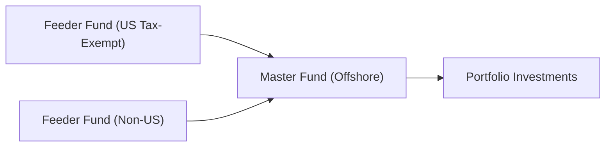

## Background and Rationale for Offshore Domiciles

Imagine a scenario where you’re managing a hedge fund, and you keep hearing about the Cayman Islands, Bermuda, or Luxembourg as prime locations for “tax efficiency.” You might think: does everyone just want a tropical vacation spot? Actually, offshore domiciles are popular because they offer flexible regulatory regimes, potential tax benefits, and structures that cater to different investor needs.

Hedge funds rely on these offshore centers to consolidate global investor capital in a friendly, stable, and cost-effective environment. While each offshore domicile has unique features, the underlying motive is often consistent: optimize tax efficiency for investors, ensure compliance with international standards like FATCA and OECD’s Common Reporting Standard (CRS), and manage administrative burdens.

## Common Offshore Domiciles for Hedge Funds

A few key jurisdictions pop up repeatedly in hedge fund circles:

• Cayman Islands: Well-known for its sophisticated legal framework and robust fund administration infrastructure. Many international hedge funds choose Cayman structures because they’re familiar to global investors and relatively straightforward to set up.

• Luxembourg: Part of the European Union, Luxembourg offers funds access to the EU market. It has specialized vehicles such as the SIF (Specialized Investment Fund) and RAIF (Reserved Alternative Investment Fund), known for flexibility and robust investor protection.

• Ireland: Ireland’s regulatory framework, particularly the Irish Collective Asset-Management Vehicle (ICAV), is quite appealing for US and European investors. Ireland maintains a wide network of tax treaties, which can reduce withholding taxes on income streams.

• Bermuda: Bermuda has a long history in insurance-linked securities and reinsurance. Some hedge funds opt for Bermuda for its established financial services sector, proximity to North American markets, and strong legal infrastructure.

Managers typically select a jurisdiction based on investor preferences, local tax treaties, regulatory requirements, and cost structures. But while offshore setups can help reduce double taxation or mitigate certain domestic tax rules, they come with ongoing compliance and potential scrutiny from authorities.

## Master-Feeder Structures

One of the most common vehicle setups in offshore hedge funds is the master-feeder structure. If you’ve seen those diagrams with lines going from multiple “feeder funds” into a “master fund,” that’s exactly it. Think about it as different on-ramps merging onto one freeway.

A typical arrangement goes like this:

- A tax-exempt feeder fund for, say, US pension plans or endowments.  
- A non-US feeder fund for international investors who might face different tax considerations.  
- Both feeder funds pool assets into a single master fund that holds the underlying portfolio investments.

Below is a simple Mermaid diagram to illustrate the concept:



In this structure, the master fund is often organized in a zero- or low-tax offshore location, such as the Cayman Islands. Each feeder’s investors receive the particular tax treatment suitable to their jurisdiction or tax-exempt status. Since all capital flows into the master entity, the actual portfolio management is centralized, reducing administrative headaches from splitting trades or using separate accounts for various investor groups.

## Tax Considerations and Key Regulatory Issues

### Withholding Taxes and UBTI

One of the biggest nightmares for tax-exempt investors (like pension funds and university endowments) is Unrelated Business Taxable Income (UBTI). If a tax-exempt entity invests directly in leveraged activities or certain income-generating deals, it might trigger unexpected tax liability, even though it’s generally exempt from federal income tax. By investing in an offshore master fund, these investors can often avoid receiving UBTI directly—though it’s not always guaranteed.

Meanwhile, offshore structures may (depending on treaty networks) reduce or eliminate certain withholding taxes on dividends, interest, or other investment returns. For example, Luxembourg’s wide network of double-taxation treaties can help mitigate withholding on cross-border investments. The same is true in countries like Ireland, which maintain an extensive network of bilateral tax treaties.

### Controlled Foreign Corporation Rules

Controlled Foreign Corporation (CFC) rules aim to prevent domestic taxpayers from shifting revenue offshore. In the United States, for instance, if US persons own more than 50% of voting power or value of a foreign corporation (looking at each investor’s stake), the entity can be labeled a CFC. This designation triggers additional reporting and possible immediate taxation of certain earnings. So, managers must carefully monitor investor composition—particularly US ownership percentages—to avoid detrimental tax outcomes.

### FATCA and CRS Compliance

Even though you’re offshore, the “long arm” of regulators can still reach in. The Foreign Account Tax Compliance Act (FATCA) requires foreign financial institutions (including offshore hedge funds) to identify and report information about US account holders. Funds that fail to comply risk a 30% withholding tax on certain US-sourced payments.

Similarly, the OECD’s Common Reporting Standard (CRS) compels participating jurisdictions to exchange financial account information automatically. If you’re a hedge fund manager, you have to ensure that your fund’s administrators request sufficient tax residency information from investors and provide it to the appropriate authorities. If done properly, you’ll avoid any potential legal or reputational blowback.

### Substance Requirements

In some popular offshore centers, there’s a push to prove “substance”—i.e., that you’re not just a “brass plate” operation with no real presence in the jurisdiction. Substance often means having actual local employees, office space, and core business activities in the domicile. If you don’t, you might lose tax residency benefits or face penalties. While this can add costs (e.g., hiring staff locally), it also shows that the fund is acting in good faith and not merely chasing a tax break with no real local footprint.

## Balancing Tax Benefits with Regulatory Scrutiny

Um, it might seem like the best idea is always to go for the lowest tax rate. But in reality, managers have to juggle:

• Investor Perception: Some investors will shy away if they perceive the offshore structure as risky or overly aggressive. They want transparency and robust governance.  
• Regulatory Oversight: Major tax benefits can come with regulatory “red flags” or heavy compliance obligations under FATCA, CRS, and the like.  
• Administrative Costs: Offshore domiciles can be costly to set up and maintain, with specialized legal counsel, local directors, and fund administrators.  

In my experience talking to managers, they usually weigh the cost of compliance against the expected tax savings for investors. If the math works, and there’s an operational advantage to an offshore master-feeder structure, they proceed—often with legal teams leading the charge.

## Role of Advisors and Fund Administrators

It’s common to see managers rely heavily on specialized counsel to navigate these complexities. Law firms and fund administrators provide guidance on:

• Selecting the appropriate domicile, based on investor universe, tax treaties, and local substance rules.  
• Drafting offering documents and partnership agreements that optimize tax treatment for different investor classes.  
• Setting up compliance procedures to meet reporting requirements in each pertinent jurisdiction.  

In certain cases, administrators also help managers monitor ownership ratios so the fund doesn’t inadvertently become a CFC for US tax purposes. In short, having a robust team of professionals is essential—you really want experts who live and breathe these rules daily.

## Practical Example

Let’s do a quick hypothetical. Suppose you’re setting up a global long/short equity hedge fund. You expect a mix of US tax-exempt entities (e.g., pension funds), non-US high-net-worth individuals, and maybe a few US taxable individuals. You might:

1. Form a Cayman master fund.  
2. Create two feeders: one Delaware LP for US investors (including tax-exempt and taxable), and one Cayman feeder for non-US investors.  
3. Ensure that the US tax-exempt investors come into the offshore feeder (or operate with a blocker entity) specifically designed to avoid UBTI from leveraged transactions.  
4. Engage a Cayman-based administrator to keep track of each investor’s holdings, produce statements, and gather FATCA/CRS data.  
5. File an annual US tax return for the master fund if it has any US source income that triggers reporting, and remain mindful of investor composition for CFC.  

This setup often achieves the desired separation of investor classes while placing the bulk of trading and portfolio management in a single entity.

## Minor Python Example

Occasionally, small analytics can help you see how a fund’s gains might be distributed among feeders. Here’s a quick snippet (nothing fancy) showing how you might model distribution of returns from the master fund to each feeder:

```python
import pandas as pd

# The master fund has total net gains of 1,000,000

feeder_allocations = {'FeederA': 0.60, 'FeederB': 0.40}
master_gains = 1000000

distribution = {}
for feeder, alloc in feeder_allocations.items():
    distribution[feeder] = alloc * master_gains

df = pd.DataFrame.from_dict(distribution, orient='index', columns=['Allocated Gains'])
print(df)
```

This snippet simply splits the total gains proportionally. In reality, there may be complex multi-tier waterfall structures, performance fees, and more. But the principle’s the same: each feeder gets its share of the master’s net returns.

## Best Practices and Common Pitfalls

• Do your homework on local regulations. Failing to establish “substance” or meet reporting deadlines could backfire big time.  
• Communicate with investors about your domicile and structure. Being transparent helps build trust and keeps you aligned with the CFA Institute Code of Ethics and Standards of Professional Conduct.  
• Be cautious of “just follow the crowd” thinking. Different domiciles suit different investor bases and strategies.  
• Monitor changes in tax laws. International tax norms shift regularly (e.g., updated OECD rules or local substance requirements).  

## Conclusion and Final Exam Tips

At the end of the day, tax-efficient offshore domiciles are a compelling choice for many hedge funds, but they’re not a quick fix. Managers must be prepared for ongoing compliance efforts and close scrutiny from regulators. In the CFA exam context, you might see scenario-based questions testing your knowledge of how to structure a hedge fund for different types of investors, or how CFC rules affect a portfolio’s distribution. You might be asked to weigh the regulatory pros and cons of a Cayman fund versus a Luxembourg RAIF, for example, or to recommend steps to ensure compliance with FATCA.

Key test-day tips:

• Understand the motivation behind using offshore structures: bridging the gap between different tax profiles among investor classes.  
• Know how master-feeder structures work and why.  
• Keep in mind CFC rules and how they might force immediate taxation for investors.  
• Be aware of major compliance frameworks like FATCA and CRS.  
• Incorporate any relevant ethical considerations (e.g., ensuring no hidden structures that breach professional standards).

A typical essay question might describe a hedge fund deciding between Ireland and Bermuda, then ask you to outline the tax, regulatory, and administrative trade-offs. Make sure you articulate the advantages and disadvantages clearly. Also, watch for details: are the investors mostly US-based, or from a variety of countries? Are they tax-exempt? These details set the stage for the right solution.

## References

• Herzfeld, Mindy. “International Taxation in a Nutshell.” West Academic.  
• OECD. “Tax transparency and exchange of information.” https://www.oecd.org/tax/  
• Morriss, Andrew P. “Offshore Financial Centers and Regulatory Competition.”  
• CFA Institute Code of Ethics and Standards of Professional Conduct. (For compliance considerations.)  

-----------------------------

## Test Your Knowledge: Tax-Efficient Offshore Domiciles Quiz



### Which of the following is a key reason hedge funds often choose Cayman Islands as an offshore domicile?

- [ ] Generous personal tax breaks for managers
- [x] A well-developed legal framework and recognized global acceptance
- [ ] Reduced operational costs for trading on major exchanges
- [ ] Strict limitations on foreign investment inflows

> **Explanation:** The Cayman Islands is highly favored for its sophisticated legal system, strong reputation among global investors, and flexible regulatory regime.

### In a master-feeder structure, which of the following accurately describes the function of feeder funds?

- [x] They accept capital from different investor categories and channel it to a common master fund
- [ ] They invest in multiple master funds to maximize diversification
- [ ] They function independently to hedge the master fund’s risks
- [ ] They are primarily used to handle fund administration tasks

> **Explanation:** Feeder funds are vehicles collecting capital from investors and then feeding it into the master fund, which handles the actual investment activities.

### Which of the following statements is most accurate regarding FATCA?

- [ ] It applies only to US-based hedge funds operating in the US
- [x] It requires foreign financial institutions to report certain information about US account holders
- [ ] It eliminates the need for KYC (Know Your Customer) procedures
- [ ] It primarily targets unrelated business taxable income (UBTI)

> **Explanation:** FATCA forces foreign financial institutions to disclose US investor information to the IRS, aiming to combat tax avoidance.

### Select the correct pairing of a potential issue with the relevant regulatory concept:

- [x] Risk of immediate taxation for US shareholders – Controlled Foreign Corporation (CFC) rules
- [ ] Ensuring staff in offshore jurisdiction – UBTI avoidance
- [ ] Reporting foreign investor data – Master-feeder structure
- [ ] Reducing overhead costs – Substance requirements

> **Explanation:** CFC rules can trigger immediate taxation for US shareholders if they exceed certain ownership thresholds in a foreign entity.

### In an offshore hedge fund, how can a tax-exempt US investor avoid generating UBTI?

- [x] Investing through an offshore blocker or feeder fund
- [ ] Subscribing to a regulated fund in their home state
- [x] Ensuring no direct leverage is employed in the strategy
- [ ] Opting out of all capital distributions

> **Explanation:** US tax-exempt investors generally invest in an offshore feeder or blocker entity to avoid receiving income that would otherwise be considered UBTI.

### What is a key advantage of a master-feeder structure for hedge fund managers?

- [x] Centralized portfolio management and reduced administrative duplication
- [ ] Full exemption from all global tax regimes
- [ ] Instant registration with every global regulator
- [ ] Automatic compliance with all AML/KYC procedures

> **Explanation:** By funneling multiple investor groups into one master fund, managers simplify the trading and management process rather than duplicating efforts.

### Which of the following best describes how offshore hedge funds typically handle FATCA and CRS obligations?

- [x] Appoint administrators or compliance officers to gather and report investor details
- [ ] Rely on a standard global exemption for hedge funds
- [x] Automatically apply a 30% withholding tax to all participants
- [ ] Prohibit any US or EU investors from participating

> **Explanation:** Offshore funds generally engage specialized administrators to fulfill complex FATCA and CRS disclosures, ensuring compliance and avoiding penalties.

### Which statement is true regarding “substance requirements” in certain offshore jurisdictions?

- [x] They require funds to maintain tangible local presence, including staff and physical offices  
- [ ] They only apply to jurisdictions in the European Union  
- [ ] They guarantee exemption from FATCA  
- [ ] They are optional guidelines without legal enforceability  

> **Explanation:** Substance requirements exist to prove genuine economic activity in the offshore location and are enforced in many popular domiciles.

### Select the statement that best summarizes the trade-off when opting for an offshore domicile:

- [x] Managers must weigh potential tax benefits against regulatory costs and scrutiny
- [ ] It guarantees zero tax liability for all investors, irrespective of origin
- [ ] The manager has unlimited personal liability protections
- [ ] Any domicile chosen is always recognized by all global investors

> **Explanation:** While offshore structures may offer tax advantages, they come with regulatory obligations, administrative expenses, and reputational considerations.

### True or False: Under US CFC rules, if US shareholders own more than 50% of an offshore fund, the fund may be deemed a Controlled Foreign Corporation?

- [x] True
- [ ] False

> **Explanation:** CFC rules apply when US shareholders collectively exceed 50% ownership of a foreign corporation, potentially triggering immediate taxation of certain income.


