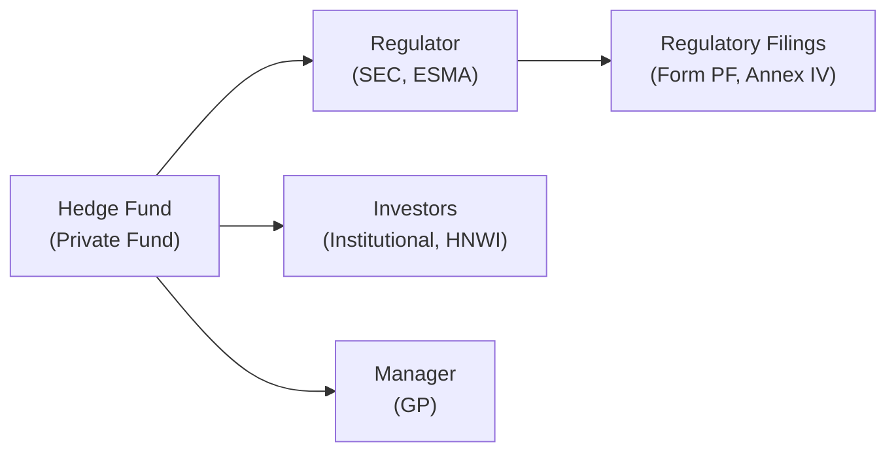

## Overview
Let’s be honest: reading regulatory filings and reports from hedge funds isn’t exactly light reading by the fireplace. But if you’re an investor or even a curious financial professional, these reports hold a treasure trove of insights about the fund’s strategy, risk profile, and operational environment. While it’s tempting to tune out the compliance minutiae, understanding these documents—like Form PF or Annex IV—can help you spot potential pitfalls long before they escalate into major losses.

One of my first experiences analyzing hedge fund regulatory filings came when I was asked to review a fund’s quarterly letter and cross-check it with its public disclosures. Let me tell you, it felt like deciphering a secret code. Each filing had different bits of data, sometimes contradictory, and required a detective-like approach to piece it all together. But once you get the hang of it, you’ll realize that these filings can reveal the fund’s approach to leverage, risk-taking, and investment style—data points that are incredibly valuable for making informed decisions.

## Key Regulatory Filings
Hedge funds in various jurisdictions must comply with different regulatory regimes. In the United States, the Securities and Exchange Commission (SEC) requires certain hedge funds to file Form PF if they meet specific size thresholds, while in the European Union, under the Alternative Investment Fund Managers Directive (AIFMD), firms must submit Annex IV reports. Both aim to provide regulators with a snapshot of the fund’s activities, risk exposures, and systemic risk implications.

### Form PF (Private Fund)
Form PF is the go-to regulatory filing for private fund advisers in the U.S. that are registered with the SEC. It discloses key information about:
• Gross and net assets under management  
• Leverage usage  
• Portfolio liquidity  
• Exposure to various asset classes  
• Counterparty risk profile  

Regulators use this data to monitor systemic risk. As an investor, reviewing the fund’s disclosures in Form PF can help you see if it’s consistent with the fund’s marketing materials and pitch deck. If the numbers don’t quite line up, that’s a red flag.

### Annex IV (AIFMD)
Annex IV is the European equivalent under the AIFMD (Alternative Investment Fund Managers Directive). It covers similar ground—risk measures, asset allocation, leverage, liquidity—but with a European flavor. Annex IV can be quite comprehensive, and if you’re reading through an Annex IV report for a private fund you’re interested in, you’ll often see details on:
• Fund strategy categorization  
• Instruments traded and collateral arrangements  
• Counterparty risk data  
• Liquidity profile and investor concentration  

Both Form PF and Annex IV feed into broader regulatory oversight, allowing authorities to gauge the potential for systemic risk, which is the risk that the failure of one major entity or disruption in the market might trigger a domino effect.

## Why These Filings Matter
Well, you wouldn’t buy a car without checking its service records, right? Similarly, you don’t want to invest in a hedge fund without understanding how it manages leverage, handles liquidity, and navigates regulatory obligations. Here are some reasons these filings are so crucial:

• They highlight potential red flags: Is the fund’s reported leverage unexpectedly high? Do they concentrate in illiquid assets that may hamper redemption requests?  
• They show systemic risk contributions: Regulators track whether any single fund’s downfall could cause market chaos.  
• They provide a baseline for comparison: Although comparing hedge funds can be rough, these filings at least offer standardized data points.  

## Analyzing Hedge Fund Filings
Reading a regulatory filing for the first time can feel daunting, but focusing on the right sections will make the task smoother:

• Leverage and Financing Arrangements: Check how the fund’s leverage is calculated and the sources of financing. Leverage can amplify returns but also magnify losses.  
• Concentration Profiles: If the fund has a high percentage of its portfolio in just a few assets or sectors, that’s a risk you want to understand right away.  
• Liquidity Provisions: Look for lock-up periods, redemption notice times, and gating provisions. These give clues about how quickly you can redeem and whether the fund is in a position to handle large withdrawal requests.  
• Counterparties: Large derivative exposures to a single counterparty might be worrisome. Seek clarity on whether or not the counterparties are considered top-tier and well-capitalized.  

## Challenges in Comparing Hedge Funds
Hedge fund regulatory filings don’t always present information uniformly. Different managers might categorize their strategies in slightly different ways. Some might break out their gross and net exposures in detail, while others provide only partial data—and do so under broad definitions. 

So, if you’re trying to compare Fund A’s “Long/Short Equity” exposure with Fund B’s “Equity-Oriented Strategy,” you might be effectively comparing apples to oranges. The classification methods, reporting frequency, and data granularity can vary drastically. A best practice is to dig into the sub-schedules of regulatory filings and investor letters, cross-referencing the data with the fund’s own marketing materials or newsletters.

## Investor Transparency Reports
Beyond the regulatory filings, hedge funds often supply monthly or quarterly letters, risk disclosures, and audited financial statements to investors. These might lack the deep granularity of regulatory documents, but they’re typically more user-friendly. Have I ever told you about a time I was swamped with a quarterly update that was 40 pages long? It gave me more narrative color on the portfolio managers’ strategic pivots, the types of trades they were putting on, and how they viewed macroeconomic risks. 

• Quarterly Letters: Offer updates on positioning, top winners and losers, and general macro views.  
• Audited Financial Statements: Let you confirm if the net asset value (NAV) is calculated fairly.  
• Risk Disclosures: Outline the major factors that could negatively affect the fund, such as market volatility or geopolitical events.  

In many ways, these are the “story” behind the numbers you’ll see in Form PF or Annex IV. Cross-referencing them helps you see if the fund is consistent in its messaging and also helps you gauge the manager’s competence and honesty.

## Hedge Fund Compliance with AML and KYC
An often-overlooked portion of hedge fund oversight concerns Anti-Money Laundering (AML) and Know-Your-Customer (KYC) regulations. Funds are required to verify the identities of their investors and ensure that no illicit money is flowing through their vehicles. 

For you as an investor, it can mean you’ll be asked to submit documentation proving your identity and source of funds. Yes, it can be a hassle. But in my opinion, it’s reassuring to see a robust KYC/AML framework. The last thing you want is a fund entangled in reputational or legal issues because it didn’t follow these procedures.

## Risk Disclosures to Investors
Risk disclosures spell out the possible ways you could lose money. Sometimes they feel repetitive and borderline alarmist—“the fund may lose all or substantially all of its capital”—but that also underscores how essential it is to read them carefully. These disclosures should align with what you see in regulatory documents.

If a fund heavily trades options, you’ll likely encounter references to implied volatility, gamma exposure, or tail risk. If the fund invests in emerging markets, you’ll see mention of political risk or currency controls. The best strategy is to use these disclosures as a road map to further investigate how the fund mitigates these risks in practice.

## Practical Flow of Information (Mermaid Diagram)
To visualize the relationships among fund managers, regulators, and investors, here’s a simple diagram:

• The hedge fund (A) interacts with regulators (B) via Form PF or Annex IV.  
• The same hedge fund interacts directly with investors (C), sharing monthly or quarterly letters, and with the internal management (D).  

## Tools and Approaches for Better Analysis
• Comparative Tables: Create side-by-side charts of net/gross exposures, liquidity terms, and risk metrics from the filings of multiple hedge funds.  
• Ratio Analysis: You can use data from audited reports (e.g., the ratio of net asset value to total liabilities) for a quick gauge of the fund’s current leverage.  
• Trend Watching: If you have multiple quarters of data, track whether liquidity profiles are shifting or if exposure to certain markets is growing dangerously concentrated.  

## Best Practices and Common Pitfalls
• Don’t rely solely on summary pages: The real meat is often in the notes or sub-schedules.  
• Cross-check with public commentary: If a manager brags on TV about minimal leverage but the filings show otherwise, that’s a discrepancy worth flagging.  
• Resist false comfort: Even thorough regulatory filings can mask real risks. They’re snapshots, not a comprehensive dynamic model.  
• Acknowledge time lags: Reports are typically released well after the reporting period ends, so the data might already be outdated.  

## Glossary
• **Form PF (Private Fund):** A disclosure form required by the SEC for large private fund advisers, detailing assets under management, strategies, and risk exposures.  
• **Annex IV (AIFMD):** Reporting template mandated by the EU’s Alternative Investment Fund Managers Directive, focusing on risk, leverage, and systemic impacts.  
• **Systemic Risk:** The possibility that the failure of a major market participant or a significant event could destabilize the entire financial system.  
• **AML (Anti-Money Laundering):** Regulatory measures designed to prevent the introduction of illicit funds into legitimate financial institutions.  
• **KYC (Know-Your-Customer):** Verifying the identity and investment source of all clients to ensure compliance and prevent fraud.  
• **AIFMD (Alternative Investment Fund Managers Directive):** EU rules that govern managers of alternative investment funds, including hedge funds and private equity.  
• **Risk Disclosure:** Investor-oriented statements highlighting how the fund could experience or cause financial losses.  
• **Regulatory Oversight:** Governmental or agency supervision intended to protect market integrity and ensure regulatory compliance.

## Conclusion and Exam Tips
Regulatory filings and transparency reports certainly aren’t the easiest weekend reading, but they’re vital for anyone serious about hedge fund investing or management. A robust analysis of Form PF or Annex IV—plus thorough scrutiny of quarterly letters, audited statements, and risk disclosures—can give you a window into a fund’s operations, strategy integrity, and risk posture. 

When preparing for the CFA exam, practice constructing scenario analyses using hypothetical hedge fund filings, paying extra attention to:
• Identifying discrepancies between stated strategy and reported risk exposures.  
• Recognizing how leverage metrics influence portfolio volatility.  
• Evaluating liquidity terms in the context of broader market stress scenarios.  

And, of course, keep an eye out for the dreaded time lag. Just because you see a certain position or hedge in the filing doesn’t mean it’s there today!

## References
• SEC Form PF Instructions: https://www.sec.gov/  
• ESMA guidelines on AIFMD Annex IV Reporting: https://www.esma.europa.eu/  
• “Understanding AIFMD” by PricewaterhouseCoopers  

These resources can help you clarify technical details, interpret complex sections, and understand region-specific nuances in hedge fund regulatory compliance.

## Test Your Knowledge of Hedge Fund Regulatory Filings



### In the United States, which form must certain hedge fund advisers file to report their leverage and portfolio risk indicators?
- [ ] Annex IV
- [ ] FINRA 10K
- [x] Form PF
- [ ] Form ADV Part 2

> **Explanation:** Form PF is the specific filing used in the U.S. for private fund advisers to disclose key risk factors, portfolio data, and various other fund details. Annex IV is its European counterpart under AIFMD.

### Which of the following is NOT typically disclosed in a hedge fund’s regulatory filing?
- [ ] Leverage levels
- [ ] Liquidity profile
- [ ] Counterparty exposures
- [x] Internal portfolio manager salaries in exact figures

> **Explanation:** Regulatory filings focus on risk, leverage, and systemic concerns rather than detailed compensation figures. Internal salary details are confidential and generally remain undisclosed to regulators in that level of detail.

### According to AIFMD, the Annex IV reporting requirement mainly aims to:
- [ ] Replace investor transparency reports
- [x] Monitor systemic risk and protect investors
- [ ] Increase taxes on hedge fund performance
- [ ] Limit the number of new hedge funds

> **Explanation:** Annex IV is designed to enhance supervisory oversight and reduce systemic risk in the European alternative investment market.

### What is the primary purpose of Anti-Money Laundering (AML) regulations in hedge fund operations?
- [x] Prevent illegal funds from entering legitimate capital markets
- [ ] Maximize portfolio returns
- [ ] Encourage higher trading volumes
- [ ] Restrict investor withdrawals during market turmoil

> **Explanation:** AML regulations focus on identifying and preventing illicit funds from flowing into the financial system, ensuring legitimate sources of investment capital.

### If a hedge fund invests heavily in illiquid assets but shortens investor redemption periods, which risk is most amplified?
- [ ] Duration risk
- [ ] Credit risk
- [x] Liquidity risk
- [ ] Mortality risk

> **Explanation:** Mismatch between illiquid assets and shorter redemption periods can strain the fund’s liquidity, potentially causing issues under stressed market conditions.

### Which factor makes it challenging to compare two hedge funds solely based on regulatory filings?
- [ ] They both file with the SEC
- [ ] They only invest in large-cap equities
- [ ] Both are subject to AML requirements
- [x] Different classification methods and varying levels of detail

> **Explanation:** Even though regulatory guidelines aim for standardization, hedge funds often use different strategies, definitions, and detail levels when filing, making direct comparisons difficult.

### A hedge fund’s quarterly letter states it uses “minimal leverage,” but Form PF reveals a high leverage ratio. How should an investor interpret this discrepancy?
- [x] Investigate further and question the manager’s reported strategy  
- [ ] Ignore it because quarterly letters are always speculative  
- [ ] Assume the regulator’s data is incorrect  
- [ ] Immediately redeem all shares in the fund  

> **Explanation:** A discrepancy between public commentary and regulatory filings warrants deeper inquiry into the fund’s leverage usage and how it aligns with stated strategies.

### Which of the following best describes KYC procedures in hedge funds?
- [ ] Disclosing total leverage to regulators
- [x] Verifying investor identities and preventing fraudulent activities
- [ ] Filing daily liquidity reports
- [ ] Proactively hedging currency risk

> **Explanation:** Know-Your-Customer (KYC) requires a fund to confirm investor identities and ensure no wrongdoing is associated with capital sources.

### Why might a hedge fund manager provide a more narrative-driven quarterly letter to investors alongside regulatory filings?
- [x] To offer strategic context, market outlook, and clarify investment basis
- [ ] To conceal high-risk positions from regulators
- [ ] To avoid compliance with AML rules
- [ ] To replace the need for audited financial statements

> **Explanation:** Investor letters usually present qualitative information—such as how the fund views evolving market conditions or why it’s pursuing a certain strategy—which complements the quantitative data in regulatory filings.

### True or False: Hedge fund regulatory filings are typically released to the public in real time, giving full insight into current positions.
- [x] True
- [ ] False

> **Explanation:** This statement is actually false. Regulatory filings often have a lag, so they do not provide a real-time snapshot of the fund’s positions and exposures.  


