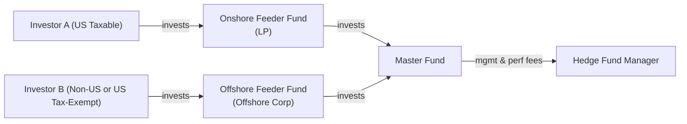

## Introduction

Ever talk to a friend who’s invested in a hedge fund and get lost in the jargon around “LP structures” or “lock-ups”? Don’t worry—it’s something many of us have experienced. Hedge funds can feel mysterious, but underneath the fancy words lie core legal and operational frameworks designed to manage risk, attract the right investors, and align those investors’ commitments with the fund manager’s investment approach.

In this section, we’ll explore the typical legal setups that hedge funds use, the role of lock-up periods that keep investors’ capital in the fund for a certain window of time, and what it really means to talk about liquidity (i.e., how quickly you can get your money out). We’ll also look at redemption frequencies, notice periods, “gates,” side pockets, and more. By the end, you should have a solid grasp of how hedge fund legal structures and liquidity terms intersect to serve both the fund manager and the investors.

## Common Legal Structures

Hedge funds often have multiple layers to serve different investor types and various regulatory needs. If you’re new to this, the way hedge funds structure themselves can be confusing—sort of like seeing a puzzle with pieces that seem to overlap. But if you break it down step by step, it gets clearer.

### Limited Partnerships (Onshore)

One of the most common onshore structures is a Limited Partnership (LP). In an LP, you typically have:
- A General Partner (GP), which is the hedge fund’s managing entity (and thus has unlimited liability in many jurisdictions).
- A bunch of Limited Partners (LPs), who are the investors putting their money in but have limited liability up to the capital they invest.

In the United States, for instance, many hedge funds are formed as Delaware LPs due to the state’s favorable corporate laws and well-defined legal precedents. The GP will manage the partnership on a day-to-day basis, while the LPs are mostly passive investors with rights and obligations laid out in the limited partnership agreement (LPA).  

### Offshore Corporations

For non-US investors or US tax-exempt entities such as pension plans, charities, or endowments, you’ll often see hedge funds established in offshore domiciles (like the Cayman Islands or the British Virgin Islands). These jurisdictions are chosen largely because:
- They’re tax-neutral places.
- They have a legal and regulatory environment familiar to global investors.
- They allow multiple share classes, which can be useful for customizing management fee and performance fee arrangements for different investor types.

Offshore funds are often organized as corporations rather than partnerships. That means instead of being “partners,” investors are often “shareholders.” This can simplify tax structuring, especially if you’re trying to accommodate investors who need to minimize certain “unrelated business taxable income” (UBTI) or want to sidestep complications associated with direct US tax filings.

### Master-Feeder Structures

If you’ve heard the phrase “master-feeder,” you’ve probably wondered what the big deal is. It’s a very common arrangement where:
1. You have one main “master fund” that makes all (or most of) the investments.  
2. You have one or more “feeder funds” that feed capital into the master.  
   - An onshore feeder for US taxable investors.  
   - An offshore feeder for non-US investors or US tax-exempt investors.  

This setup allows for administrative efficiency: the manager only trades in the master fund, while each feeder invests in the master on behalf of its specific investor base. It also keeps tax flows more streamlined across various investor types.

Here’s a quick look at a master-feeder structure to visualize it:

## Lock-Up Periods

Lock-up periods can feel slightly frustrating to investors at first, like being told: “You can’t withdraw your money yet.” But from a hedge fund’s perspective, lock-ups are critical. They mean that—for at least a certain time—investors’ capital is committed and cannot be redeemed. This helps the manager:
- Pursue longer-term strategies without worrying about short-term redemptions.  
- Maintain stability in capital to avoid forced sales of positions during market turbulence.  

### Rationale
Some hedge fund strategies—like distressed debt investing or certain event-driven approaches—take time to unfold. If you’re investing in a complex legal claim or undergoing a multi-year turnaround of a struggling company, you really don’t want to face monthly redemptions. Lock-ups let the manager breathe and focus on the actual trades.

### Typical Durations
Lock-ups vary widely:
- Some funds have no lock-up at all, or a very short one (3–6 months).  
- More illiquid strategies can impose a 1–3 year (or longer) lock-up.  

In practice, many funds will give new investors a soft or informal lock-up for the first year or so, especially if the investor got favorable terms or a discounted fee structure when joining.

## Redemption Frequencies and Notice Periods

A close cousin to the lock-up is the redemption frequency—how often can an investor redeem (e.g., monthly, quarterly, annually)? In addition, funds often require a “notice period,” which is the time in advance you must notify the manager if you want to get out. Typical notice periods can be 30, 60, or 90 days, although some require even longer.

### Why These Matter
- If you ever had a friend who tried to redeem from a hedge fund but was surprised they couldn’t get out for half a year, you’ve seen the real-life tension between daily liquidity and the nature of the assets.  
- Notice periods allow the portfolio manager to orderly liquidate positions (if needed) and manage cash flow.  
- Annual redemption frequencies give managers more runway, but might not be appealing to investors who prefer quicker access to their money.

With many hedge funds, there’s a trade-off: the more illiquid (and potentially higher-return) the strategy, the longer the possible lock-up or redemption restrictions that come along with it.

## Gates

“Gates” are provisions in the legal documents allowing the fund to limit the percentage of assets that can be redeemed during a given redemption period. For example, a gate might say the fund won’t allow redemptions of more than 20% of its net asset value (NAV) in one quarter.

### Rationale
- Prevent a “run on the bank” scenario: If all investors want out at once, the fund might be forced to dump assets at fire-sale prices, harming remaining investors.  
- Smooth out redemption flows: It ensures that no single group of redeeming investors can cause undue stress.  

### Investor Perspective
From an investor’s standpoint, gates can be both protective and restrictive. Protective, because you don’t want a mass exodus that kills the fund. Restrictive if you’re the one who wants your money out and the gate blocks you. So, if you see a gate provision, it’s worth understanding the triggers and how it’s calculated.

## Side Pockets

No, these aren’t literal pockets on someone’s slacks. A “side pocket” is a mechanism to segregate illiquid or hard-to-value assets from the main portfolio so that incoming and outgoing investors aren’t disadvantaged because of valuation uncertainties. Essentially, the manager sets aside those tricky assets into a separate “pocket,” and investors share in those side pocket investments on a pro rata basis, typically based on when the side pocket was created.

### Why Use Side Pockets?
- Protect new investors from paying fees on unrealized (and tricky to measure) gains or losses.  
- Shield redeeming investors from forced liquidation of illiquid chunks just to meet redemption requests.  
- Ensure that gains (or losses) from illiquid positions go to the investors who were in the fund at the time the side pocket was formed.

A side pocket can last for years if the underlying investments are locked in litigation, in complicated reorganizations, or need a major turnaround. This structure is common in funds that dabble in distressed credit, private deals, or other “lumpy” positions that don’t have a ready market price.

## Liquidity Alignment with Underlying Assets

In an ideal world, a fund’s liquidity terms (lock-ups, redemption frequencies, gating provisions) closely match the liquidity of its underlying portfolio. For example:
- A high-frequency trading strategy with extremely liquid exchange-traded instruments might offer monthly or even weekly redemptions.  
- A credit-oriented fund holding longer-dated, illiquid loan positions should have a longer lock-up.

When liquidity terms and assets become misaligned, it can lead to big problems. In 2008, many funds faced a wave of redemption requests they simply couldn’t meet—leading to panic, gating, or forced asset sales at depressed prices. So any good hedge fund manager tries to make sure redemption terms reflect the reality of their strategy’s turnover and liquidity.

## Domicile Considerations and Tax Treatment

You might wonder, “Why do managers pick the Cayman Islands or the British Virgin Islands so often?” Part of it is regulatory sophistication, part is tax neutrality, and part is investor familiarity. Offshore domiciles often:
- Don’t impose local taxes at the fund level.  
- Provide confidentiality around shareholder information.  
- Are recognized by service providers like auditors, lawyers, and administrators who have local expertise.  

However, these offshore setups still need to comply with the international standards of anti-money laundering (AML), “know your customer” (KYC) rules, and other global regulations.

For the onshore side—like a Delaware LP or a limited liability company (LLC) in the US—tax treatment is often chosen to be “pass-through,” so the fund itself doesn’t get taxed. Instead, each investor handles their own share of gains or losses.

## Key Fund Documentation

Darling, if there’s one place I’ve seen confusion and heartbreak, it’s in the fine print of fund documents. Before you or anyone invests in a hedge fund, it’s super important to read (and maybe even highlight) the following:

- Subscription Agreement  
  This is the contract you sign to join the fund. It details how much you’re investing, your representation of who you are (e.g., accredited investor status), and your agreement to abide by the fund’s rules.

- Offering Memorandum (OM)  
  Think of this as the fund’s “manual.” An OM (also called a private placement memorandum, or PPM) outlines the fund’s strategy, the manager’s background, the fees, the potential risks, and the liquidity terms—like the lock-up, redemption frequencies, gates, and side pockets. Any disclaimers or risk disclosures typically go here as well.

- Limited Partnership Agreement (LPA)  
  For onshore LP structures, this legal bucket cements the roles, responsibilities, and rights of the GP and LPs, including distribution waterfalls, manager compensation, and dispute resolution procedures.  

- Side Letter Agreements  
  Sometimes big or strategic investors might negotiate separate preferential terms for management fees or redemption schedules. This typically happens behind the scenes, but it’s worth knowing side letters can exist if you’re a major investor with bargaining power.

## Best Practices, Common Pitfalls, and Practical Examples

### Best Practices

• Align liquidity with strategy. If you need multi-year lock-ups to do your strategy well (e.g., deep distress, private deals), say that up front.  
• Maintain transparent communication with investors, especially around gating triggers or the creation of side pockets. Surprises can destroy investor trust.  
• Ensure that regulatory compliance is top-notch—reporting, audits, AML, etc.  

### Common Pitfalls

• Promising liquidity that outstrips what the underlying assets can deliver. That can lead to big trouble if the market tightens.  
• Overlooking the tax implications of an offshore entity for certain investor types. Everyone’s situation is different, so get that sorted.  
• Failing to read or sufficiently understand the partnership documents. I once had a colleague who assumed a monthly redemption, only to find out it was annual with a 90-day notice period—big difference.  

### Brief Real-World Anecdote

Years back, a close friend invested in a multi-strategy hedge fund that specialized in illiquid debt securities. At the time, they thought a quarterly redemption schedule was “just fine.” Then a year later, they needed to access their capital faster for a home purchase. That was a big wake-up call—turns out, the notice period plus the gating provision meant it took close to six months (!) to actually receive redemption proceeds. Moral of the story? Always plan for those “just in case” scenarios and know the liquidity constraints before signing up.

## Exam Tips and Takeaways

If you’re preparing for the CFA exam, especially at Level III (where it all comes together in portfolio management contexts), here are some pointers to keep in mind:

• Understand how lock-up periods, notice periods, and redemption frequencies protect a manager’s investment style and minimize forced selling.  
• Remember that gates and side pockets are not just random obstacles for investors but also protective mechanisms for the fund and for investor fairness.  
• Any question about aligning hedge fund liquidity to strategy: you’ll almost always emphasize how illiquid assets require longer lock-ups or less frequent redemption windows.  
• Pay attention to tax structures and investor types (onshore vs. offshore). The reason behind master-feeder structures often revolves around accommodating different tax profiles.  
• Try to recall conceptual definitions:  
  • Lock-Up Period: The timeframe during which investors cannot withdraw their capital.  
  • Gate: A limit on the amount of capital that can be redeemed during a given period.  
  • Side Pocket: A separate accounting for illiquid or hard-to-value assets.  
  • Limited Partnership (LP): A widely used legal structure where limited partners provide capital.  
  • Offshore Domicile: A location outside of the fund manager’s home country used for tax efficiency.  
  • Subscription Agreement: The contract detailing an investor’s commitment and terms.  
  • Offering Memorandum: The comprehensive disclosure document with strategy, risks, and governance.  
  • Notice Period: The required advance notice an investor must give to redeem.

## References

• Veale, Stuart R. (2014). Private Equity and Hedge Funds: Regulation and Compliance.  
• Spangler, Timothy (2020). The Law of Hedge Funds.  
• Cayman Finance: https://www.caymanfinance.gov.ky/  

> Additional reading on hedge fund structures and best practices can also be found through the Alternative Investment Management Association (AIMA) website, which has topical guides and regulatory updates.  

---

## Test Your Knowledge: Hedge Fund Legal Structures and Liquidity Quiz



### Which of the following best describes a lock-up period for hedge funds?

- [ ] A period in which the fund must deploy capital within 30 days of raising it.
- [x] A period during which investors cannot redeem their capital.
- [ ] A time interval in which the fund is required to report weekly performance.
- [ ] A pricing window for calculating the net asset value (NAV).

> **Explanation:** The lock-up period locks in investors’ capital for a specified duration, preventing redemptions and giving managers stability.

### Which statement accurately explains a “gate” provision in hedge funds?

- [x] It restricts the percentage of total fund assets that can be redeemed in a given period.
- [ ] It guarantees investors immediate liquidity regardless of market conditions.
- [ ] It eliminates all notice periods for redemptions.
- [ ] It refers to annual audits conducted by offshore regulators.

> **Explanation:** A gate is a mechanism to limit the fraction of the hedge fund’s total assets that can be withdrawn at one redemption date, preventing large-scale redemptions all at once.

### Which of the following is a primary reason hedge fund managers choose offshore domiciles?

- [x] Tax neutrality and flexible regulatory environments.
- [ ] Guaranteed higher returns for investors.
- [ ] Required by the CFA Institute Code of Ethics.
- [ ] Inability to accept accredited investors.

> **Explanation:** Offshore jurisdictions like the Cayman Islands are popular chiefly because they are tax-neutral and provide a recognized framework for global investors.

### In a master-feeder structure, what is the typical function of the feeder funds?

- [ ] They are used exclusively for the manager’s own personal investments.
- [x] They collect investments from various classes of investors and invest into the master fund.
- [ ] They provide daily liquidity to retail investors.
- [ ] They merge with other feeder funds to increase leverage.

> **Explanation:** Feeder funds aggregate investor capital—often categorized by tax status or domicile—and direct that capital to the master fund, which holds and trades the underlying investments.

### What is the main purpose of establishing a side pocket within a hedge fund?

- [ ] To allow for daily redemptions without affecting total NAV.
- [x] To segregate illiquid or hard-to-value assets so that redemptions don’t force liquidations of those positions.
- [ ] To increase manager performance fees.
- [ ] To bypass regulatory oversight on certain assets.

> **Explanation:** Side pockets separate illiquid or difficult-to-value assets from the main portfolio, ensuring that redemptions don’t unduly stress these positions and that the correct investor group bears any gains or losses.

### Which document most comprehensively describes a hedge fund’s strategy, risks, fees, and governance?

- [ ] The Limited Partnership Agreement
- [ ] The Subscription Agreement
- [x] The Offering Memorandum
- [ ] The Gate Provision

> **Explanation:** The Offering Memorandum (sometimes called a Private Placement Memorandum) details the fund’s entire program, including its strategy, fees, risks, redemption policies, and legal disclaimers.

### What is a common notice period for redemptions in hedge funds?

- [x] 30 to 90 days
- [ ] 12 to 18 months
- [ ] None—redemptions are always daily
- [ ] 7 days

> **Explanation:** Typical hedge fund redemption notice periods range roughly from 30 to 90 days, though some strategies may use longer notice requirements.

### Which best describes a “Limited Partnership” (LP) in the hedge fund context?

- [ ] A corporation where each investor has unlimited liability.
- [x] A structure consisting of a General Partner with unlimited liability and multiple Limited Partners with liability limited to their invested capital.
- [ ] An unregulated open-ended mutual fund.
- [ ] A fully state-owned fiduciary arrangement.

> **Explanation:** A classic onshore hedge fund structure is typically a Limited Partnership, with the fund manager as the GP and the investors as LPs.

### If a hedge fund invests in very illiquid credit products, what liquidity arrangement would be most appropriate?

- [x] A longer lock-up period and infrequent redemption windows like annual or semiannual.
- [ ] Daily redemptions without notice.
- [ ] Monthly redemptions with a 5-day notice period.
- [ ] Immediate redemption upon request, penalty-free.

> **Explanation:** Illiquid holdings need a liquidity setup that provides the manager adequate time to exit positions, hence a longer lock-up and less frequent redemption schedule.

### A “Subscription Agreement” in hedge funds is primarily used for:

- [x] Formalizing an investor’s commitment to join the hedge fund and outlining their investment terms.
- [ ] Setting the guidelines for how illiquid assets will be valued.
- [ ] Dictating the overall regulatory framework of hedge fund operations.
- [ ] Determining the maximum leverage allowed by the fund.

> **Explanation:** The subscription agreement is a contract that details the specific terms of an investor’s participation (like amount invested, representations, and agreements to abide by the fund’s rules).


