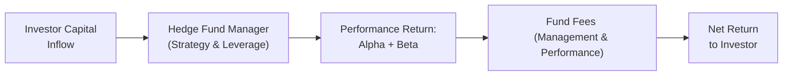

## Introduction

Some people think evaluating hedge fund performance is like trying to compare apples to oranges—except the oranges might be leveraged, the apples might be shorting the orchard, and the orchard itself might not even be publicly listed. In other words, it can be complicated! Hedge funds come in countless varieties of strategies, each with different risk profiles, leverage, and market exposures. So, if you’ve been scratching your head about how to figure out whether a manager truly has skill or if their success was just luck, you’re in the right place.

This section explores how to measure hedge fund performance, separate alpha from beta, compare managers against suitable benchmarks, and evaluate whether genuine skill actually exists. Along the way, we’ll highlight the tools used in the real world and how they get applied in practice, including how performance fees and lock-ups complicate the math. Let’s take the plunge.

## Key Challenges in Hedge Fund Performance Evaluation

Comparing hedge fund returns isn’t as straightforward as comparing large-cap equity managers who all sit under one benchmark (like the S&P 500). Hedge funds often pursue multiple asset classes, use derivatives or short-selling, and rely on absolute return benchmarks. Additionally, reporting standards can vary, and the lack of a single uniform benchmark can drive people nuts when they’re trying to get a definitive read on performance. Let’s highlight some major hurdles:

- Strategy Variation: Long/short equity, global macro, event-driven, and more. Each style has a different source of returns.  
- Use of Leverage: Borrowed capital magnifies both gains and losses, so raw returns alone may hide the real underlying risk.  
- Illiquid Assets: Some hedge funds invest in distressed debt or private placements, making valuations both irregular and subjective.  
- Lock-Ups and Redemption Terms: Smaller or more frequent redemptions can disrupt the fund’s strategy and skew performance data.  
- Survivorship Bias: Only the successful or ongoing funds appear in many databases, naturally inflating the average reported performance.  

## Benchmarks for Hedge Funds

When we talk about hedge fund benchmarks, we generally refer to three broad categories:

Absolute Return Benchmarks  
It’s common for managers to say they target an “absolute return” above a certain risk-free rate or short-term interest rate. For example, a manager could aim to beat a reference like 3-month Treasury bills plus 400 basis points (4%). This is often described as an Absolute Return Benchmark, aiming for positive performance regardless of market direction.

Peer Group Comparisons  
Comparing a manager to similar hedge funds can be helpful, but you have to be careful—even funds within the same “style” label can differ significantly in their implementation. A manager with a “long/short equity” approach might be 120% long and 80% short, while another might be 90% long and 20% short. So, peer groups are a decent reference point, but you shouldn’t rely on them exclusively.

Custom Benchmarks  
Some funds or large institutional investors create customized benchmarks to match a hedge fund’s strategy more precisely. For instance, if a fund invests heavily in merger arbitrage deals, a custom benchmark might blend event-driven indices, short-term Treasuries, and maybe a slice of equity beta. This approach can be more accurate but is also more complex to construct and maintain.

## Distinguishing Alpha from Beta

One of the biggest questions in hedge fund investing is: Are you paying for market exposure (beta) or genuine manager skill (alpha)? In practice, managers combine skill, factor exposures, and broad market movements to generate returns. Let’s visualize the flow of capital and returns:

Alpha is that elusive outperformance beyond a manager’s default market exposures, measured as the difference between actual returns and the “fair” return for the strategy’s risk factors. Beta is basically the portion of returns explained by broader market performance or factor exposures (e.g., momentum, value, carry).

## Common Performance Metrics and Ratios

When we say “risk-adjusted performance,” we’re typically referring to how much return is generated per unit of risk. Risk can come in many forms, but standard deviation and downside deviation are among the most common ways to measure it. Three ratios come up a lot:

Sharpe Ratio  
The Sharpe ratio uses standard deviation to measure risk. Formally,  
( Rᵢ - Rf ) / σᵢ  
where Rᵢ is the fund’s return, Rf is the risk-free rate, and σᵢ is the standard deviation of excess returns. The higher the Sharpe ratio, the better the fund did on a pure volatility-adjusted basis.

Sortino Ratio  
The Sortino ratio is a modified Sharpe ratio, using only downside risk (the standard deviation of negative returns). This means it doesn’t penalize the manager for upside volatility. Some hedge funds love to highlight this measure because it’s arguably more relevant if your primary concern is capital preservation.

Information Ratio  
The information ratio is about outperformance relative to a benchmark, scaled by the tracking error (the standard deviation of the difference between the fund’s returns and the benchmark’s returns):  
( Rᵢ - R_bench ) / σ(Active)  
If a hedge fund claims to have skill, you want to see how consistently it beats its target benchmark (whatever that might be) by analyzing the ratio of active return to active risk.

## Skill Persistence

It’s one thing to generate stellar returns now, but can your manager deliver consistent outperformance over time? Skill Persistence looks at whether a manager who performed well in the past can continue to outperform in the future. Persistence can be a sign of real skill—maybe a unique approach, specialized knowledge, or advanced data technology—rather than pure luck. However, high turnover in the hedge fund space, changing market conditions, and style drift can reduce skill persistence. This is where robust due diligence, ongoing monitoring, and knowledge of each manager’s strengths become crucial.

I still recall a hedge fund manager who once bragged about “absolute skill.” The next year, a big shift in interest rates hammered his leveraged bond portfolio. Ouch. Persistence isn't guaranteed just because you crushed it one year.

## Time-Weighted vs. Money-Weighted Returns

Hedge funds can have irregular cash flows: capital calls, partial redemptions, and so forth. So, it’s helpful to understand the differences between time-weighted and money-weighted returns:

Time-Weighted Returns  
These calculate the fund’s performance without considering the specific timing or magnitude of investor inflows and outflows. It’s basically how the fund would have performed if it had one unit of currency invested over the entire period.

Money-Weighted Returns  
Money-weighted returns (also called internal rate of return, IRR) factor in the actual cash flows—how much money was in the fund at different times. This is often more accurate from an investor’s point of view because it shows how the size and timing of inflows or outflows impacted your personal results.

Depending on the structure of the hedge fund, lock-up periods, and subscription/redemption patterns, one measure can be more relevant than the other. For operational or marketing documents, managers might prefer a time-weighted approach, but an investor might emphasize a money-weighted approach to see what actually happened to their individual contribution.

## The Impact of Fees and High-Water Marks

Hedge funds are known for their unique fee arrangements, most famously “2 and 20” (2% management fee and 20% performance fee). But you should pay close attention to:

Performance Fees  
These are incentive fees that the manager earns when the fund surpasses a performance hurdle. For instance, if the fund’s net asset value (NAV) grows from 100 to 115, while the hurdle is Treasury bills plus 5%, the manager may earn a share of the excess return.

High-Water Marks  
This ensures that performance fees only apply to new net gains. If the fund hits a peak NAV of 120 and then declines to 90, the manager won’t earn new incentive fees until the NAV crosses back above 120. This is meant to protect investors from paying fees repeatedly on the same performance.

It’s worth noting that fees can dramatically reduce net returns—especially if the fund has a strong performance year. So, you might see a monstrous gross return of 35%, but after the 2% management fee, 20% performance fee, and any other expenses, the investor’s net might be significantly lower.

## Evaluating Manager Tenure and Drawdowns

When analyzing performance, consider not only returns but also how the manager behaves in tough markets. Two key pieces:

Manager Tenure  
A portfolio manager who’s been around for a decade through multiple market cycles might have valuable insights into different environments (think 2008 crisis, COVID-19 meltdown, or any major economic shift). A short track record can look fantastic, but it’s often untested in a variety of conditions.

Drawdown Profile  
Drawdown refers to the decline from a peak to a subsequent trough. Focusing on the depth and duration of drawdowns can help you assess how the manager deals with rough weather. A 30% drawdown might be acceptable if the manager’s strategy is highly volatile or if the potential upside is massive. But for a low-vol strategy promising steady returns, that same drawdown may be a red flag. Understanding a fund’s drawdown profile helps you gauge the reliability of its risk management approach.

## Practical Example: A Quick Comparison

Imagine Hedge Fund A and Hedge Fund B. Over three years:

• Fund A posts annual returns of +6%, +20%, and +4%.  
• Fund B posts annual returns of +15%, +4%, and +11%.  

At first glance, you might say, “Fund B’s returns look smoother, but Fund A had a ‘home-run year’ with 20%.” Both had an average annual return of about 10%. But then you look at standard deviation (risk):

• Fund A’s total volatility was much higher, especially in that year with 20%. Let’s say its standard deviation was 12%.  
• Fund B’s standard deviation was just 5%.  

Fund A’s Sharpe ratio might end up being around (10% - 3%) / 12% = 0.58 (assuming a 3% risk-free rate), while Fund B’s Sharpe could be (10% - 3%) / 5% = 1.4. Fund B is much more efficient at generating returns per unit of volatility. Depending on your risk tolerance, Fund B might be the better choice—even though it never hit 20% in a single year.

## Case Study: Fee Impact on Returns

Let’s say a fund started at a NAV of 100. By year’s end, the fund’s gross return is +25%, for a gross NAV of 125. The manager charges a 2% management fee on the year’s starting NAV (2% of 100 = 2) plus a 20% performance fee on the 25% gain (that’s 20% of 25 = 5).

• Gross NAV: 125  
• Less management fee: -2 → 123  
• Less performance fee: -5 → 118  

So, an investor sees a net NAV of 118, implying a net return of +18% instead of +25%. You can see how fees significantly bite into returns.

## Monitoring and Ongoing Due Diligence

Even after you invest in a hedge fund, the process doesn’t stop. You’ll want to keep tabs on:

• Performance relative to peers, custom benchmarks, or absolute return targets  
• Consistency in style (avoid style drift that might make theoretical benchmarks irrelevant)  
• Updated drawdown data and volatility metrics  
• Potential changes in the manager’s investment team—key departures can change skill dynamics  
• Changes in fee structures or redemption terms  

This ongoing due diligence helps confirm if the manager’s performance is still in line with your expectations.

## Best Practices and Exam Preparation Tips

For the CFA exam, be ready to show how to apply each ratio or measure in an item set or constructed response format. You might see a question about analyzing hypothetical manager returns—do you know how to compute a Sharpe ratio, interpret an Information ratio, or handle the time-weighted vs. money-weighted calculation? The exam loves scenario-based prompts. Here’s how to prepare:

• Know Your Formulas: Practice computing Sharpe, Sortino, and Information ratios quickly and accurately.  
• Factor in Fees: Be aware that performance fees can drastically alter net returns.  
• Summarize Key Insights: If asked to interpret or compare performance, highlight risk-adjusted returns, the effect of fees, manager tenure, and drawdowns.  
• Watch for Pitfalls: Survivorship bias might show up in a question about average hedge fund returns. Show you can spot the problem and articulate its impact.  
• Time Management on Exam Day: If you see a multi-part question about performance measurement, outline your approach. Compute carefully, then interpret.  
• Stay Consistent with the CFA Standards: Always maintain the highest ethical standards, disclosing limitations of your benchmark or ratio.  

## References

• “Hedge Fund Analysis” by Frank Travers  
• “Measuring and Managing Performance in Financial Institutions” by Michael Porter  
• CFA Institute’s Performance and Risk Measurement resources  

## Test Your Knowledge: Evaluating Hedge Fund Performance, Skill, and Benchmarking



### A hedge fund manager claims to beat the market regardless of economic conditions. Which type of benchmark is most appropriate for evaluating performance?

- [ ] Peer group average of hedge funds
- [x] Absolute return benchmark
- [ ] S&P 500 composite index
- [ ] Rolling 3-year historical volatility

> **Explanation:** An absolute return benchmark (e.g., risk-free rate plus a spread) is typically used by hedge funds that aim to deliver positive returns in all market environments.

### Which risk measure does the Sortino ratio specifically focus on?

- [ ] Beta
- [ ] Total standard deviation
- [ ] Tracking error
- [x] Downside risk

> **Explanation:** The Sortino ratio uses downside deviation (i.e., volatility of negative returns) rather than total volatility, making it more sensitive to downside risk.

### When a hedge fund manager is paid a performance-based fee only after the fund surpasses its previous peak NAV, this fee structure feature is known as:

- [x] High-water mark
- [ ] Catch-up provision
- [ ] Fulcrum fee
- [ ] Equalization credit

> **Explanation:** A high-water mark ensures that investors are not charged performance fees on the same returns more than once; the fund must exceed its previous high to earn new incentive fees.

### If a hedge fund is more concerned about the timing and amount of actual cash flows from investors, which performance measure is more relevant?

- [x] Money-weighted (IRR)
- [ ] Time-weighted
- [ ] Information ratio
- [ ] Sharpe ratio

> **Explanation:** Money-weighted returns (or IRR) incorporate the magnitude and timing of investor cash flows, which is vital for funds with irregular subscriptions and redemptions.

### When analyzing a hedge fund’s performance versus a specified benchmark, the active return is 2% higher than the benchmark, and the active risk (tracking error) is 1%. What is the fund's Information ratio?

- [x] 2.0
- [ ] 0.5
- [ ] 1.5
- [ ] 3.0

> **Explanation:** The Information ratio is active return divided by active risk. With 2% active return and 1% active risk, the ratio is 2.0.

### Skill persistence in hedge funds refers to:

- [x] The likelihood that a manager’s outperformance continues over future periods.
- [ ] The fund’s skill in short-selling securities.
- [ ] The insurance against downside volatility.
- [ ] The probability of not charging performance fees.

> **Explanation:** Skill persistence examines whether a hedge fund manager’s outperformance in past periods is likely to continue, indicating genuine skill rather than luck.

### A key downside of using peer group comparisons for hedge funds is:

- [x] Significant differences within the same strategy classification
- [ ] Universal standard for performance measurement
- [ ] Avoidance of survivorship bias
- [ ] Perfect alignment with the average mutual fund returns

> **Explanation:** Even within a single hedge fund strategy, there can be big variations (like different leverage, holdings, or risk exposures), so peer group comparisons can be misleading.

### In evaluating a hedge fund’s track record, which phenomenon can lead to overstated average returns in data?

- [x] Survivorship bias
- [ ] Compounding effect
- [ ] Secondary offering
- [ ] Diversification effect

> **Explanation:** Survivorship bias occurs when failed or defunct funds drop out of databases, artificially boosting the reported performance of the remaining funds.

### Which of the following best describes a drawdown profile?

- [x] The magnitude and duration of losses from peak to trough
- [ ] The difference between gross and net returns
- [ ] The annual standard deviation of returns
- [ ] The minimum subscription period for new investors

> **Explanation:** A drawdown profile focuses on how deep and how long the fund’s losses extend during a particular period, helping gauge risk and recovery speed.

### True or False: A higher Sharpe ratio always guarantees better performance in real-world investing for hedge funds.

- [x] True
- [ ] False

> **Explanation:** Actually, this is a bit of a trick. A higher Sharpe ratio indicates better risk-adjusted returns based on volatility, but it does not guarantee "better performance" for every investor’s specific goals. However, in a typical CFA exam context, a higher Sharpe ratio is generally viewed as a more efficient risk-adjusted return.


