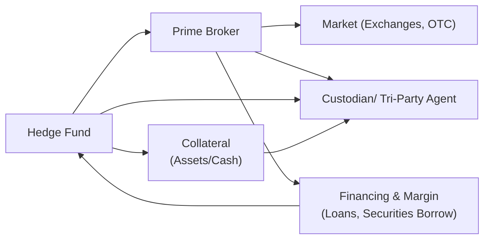

## Introduction

So, imagine you're running a hedge fund—perhaps a dynamic, go-getter fund that’s trading across multiple asset classes. Eventually, you realize that you need a broad array of services: trade execution, financing, custody, securities lending, and more. But trying to cobble all of these together from different providers can be, well, a logistical maze. Enter prime brokers. These are specialized intermediaries—often large securities firms or banks—that bundle a variety of essential services tailored to hedge funds’ needs. 

Prime brokerage is crucial not just because it simplifies the operational burden but also because it enables hedge funds to manipulate leverage more effectively, short-sell more conveniently, and handle large trade volumes seamlessly. Yet there’s a hidden flip side: if you rely on a single prime broker for all your needs and that broker stumbles (or, in a worst-case scenario, disappears), your hedge fund’s day-to-day operations can come to a sudden halt. Think of the 2008 Lehman Brothers collapse as an infamous example. This section will walk you through the mechanics of prime brokerage, underscore the importance of mitigating counterparty risk, and show you why diversification across different prime brokers can quite literally save the day.

## Understanding the Role of Prime Brokers

Prime brokerage is both broad and flexible—it’s not one-size-fits-all. It’s helpful to see prime brokerage services as a menu from which hedge funds pick and choose. Let’s break down a few of the fundamental services offered:

### Leverage and Margin Financing

Often the first thing that comes to mind is leverage. Hedge funds might desire more exposure to a specific strategy than their capital alone allows. Prime brokers help facilitate this by extending credit lines and offering margin financing. That means the prime broker effectively lends the hedge fund the means to purchase more securities than its cash balance might cover. 

But with borrowed money comes an interest charge. And let’s remember that prime brokers aren’t philanthropic organizations—they earn revenue from the spreads and fees. If you’ve ever found yourself with a margin call, it’s usually the prime broker’s polite (or not-so-polite) nudge saying, “Um, your collateral cushion is shrinking, please top it up.” Hedge funds, especially those running leveraged trades or short positions, monitor these calls meticulously.

### Securities Lending and Short-Selling

You know how hedge funds often short-sell? In a short sale, you borrow a security (often an equity) and then sell it, hoping to buy it back later at a lower price. Well, prime brokers typically provide this securities-lending facility. They locate and lend the shares, and the hedge fund pays a fee in return. The prime broker, in turn, might rely on its own inventory or source from other market participants—sometimes re-pledging collateral (rehypothecation) in the process.

### Trade Clearing, Settlement, and Custody

Picture the daily headache of clearing and settling every trade with multiple counterparties around the globe. Prime brokers simplify this. They stand in the middle, effecting seamless settlement so that the hedge fund can focus on strategy and portfolio management. Most prime brokers also provide custody services, acting as a caretaker of the fund’s assets. This means the bulk of your positions, from stocks to bonds, from structured products to derivatives, are generally held by the prime broker on your behalf.

### Operational and Administrative Support

In addition to financial services, prime brokers also provide crucial operational support. Activities such as recordkeeping, daily and monthly performance reporting, risk analytics, and compliance solutions often come under the prime brokerage umbrella. This can be especially helpful for smaller hedge funds that lack internal resources or technology to manage all of these tasks effectively. 

## Why Diversifying Prime Brokers Is Critical

Concentration risk in prime brokerage relationships is real. If you rely on a single prime broker and that firm is suddenly engulfed in crises (liquidity freeze, reputational meltdown, or even bankruptcy), your hedge fund could be frozen out of key services. This can disrupt your trading, cause you to lose access to your collateral, or, in dire scenarios, even force your fund into liquidation.

It’s a prudent approach to work with multiple prime brokers or to place some assets with a separate custodian. Sure, it can be expensive and add complexity to operations, but it significantly reduces the risk of your entire portfolio being tied up if your prime broker struggles. 

## Counterparty Risk: The Heart of the Matter

At the end of the day, prime brokerage relationships are about trust—that the broker will hold your assets correctly, process your trades accurately, and extend credit responsibly. Counterparty risk is the possibility that your prime broker (or any counterparty, for that matter) can’t fulfill their obligations. That’s why hedge funds carefully evaluate the prime broker’s balance sheet, credit rating, and internal risk management frameworks. 

But let’s be honest: some traders occasionally assume that large global banks will never fail. Past events (Lehman Brothers, anyone?) prove the opposite. Ensuring your prime broker has sufficient capital buffers and is in compliance with evolving regulatory standards—like certain BASEL III capital and liquidity requirements—matters just as much as picking the right trades in your portfolio.

## The Lehman Brothers Collapse: A Cautionary Tale

Sometimes, “lessons learned” are best illustrated by real events. The collapse of Lehman Brothers in 2008 caused widespread chaos. Several hedge funds that had prime brokerage arrangements with Lehman saw their assets effectively locked up, at least temporarily. Funds had to scramble to re-book trades with new prime brokers, find alternative financing lines, and figure out where certain collateral ended up after the dust settled.

Yes, the meltdown was complicated by a broader financial crisis, but it’s still a stark reminder that prime broking is intertwined with the prime broker’s own financial well-being. When your prime broker fails, your assets can become entangled in lengthy liquidation and legal proceeding wrinkles—even if you have some protective structures in place. That’s precisely why the industry has since moved toward more robust collateral management solutions, tri-party arrangements, and elaborate due diligence processes.

## Evaluating Credit Risk

Hedge funds perform stringent evaluations of prime brokers’ credit standing and risk management track records. This includes analyzing:

• Capital Adequacy: Are they stable and highly capitalized?  
• Regulatory Compliance: Do they meet or surpass the required capital and liquidity benchmarks (think Basel III or other local equivalents)?  
• Risk Management Controls: Does the broker have robust operational, legal, and credit risk policies?  
• Historical Resilience: Have they weathered past crises relatively unscathed?

On top of that, hedge funds may keep track of proxy metrics like credit default swap (CDS) spreads on the prime broker’s debt. Spikes in a prime broker’s CDS can serve as an early-warning sign of deteriorating credit quality. Some hedge funds also run internal stress tests to see how their prime broker exposures would fare under extreme but plausible market conditions.

## Tri-Party Agreements and Collateral Management

One structural mechanism increasingly used is a tri-party agreement, which typically involves the hedge fund, the prime broker, and a third-party custodian or clearing agent. The idea is that any collateral posted by the hedge fund is held or managed by the third party rather than being directly under the prime broker’s dominion. This arrangement can limit the prime broker’s ability to rehypothecate or misappropriate the fund’s assets, and it ensures a more transparent line of sight into the collateral. 

Collateral management is basically a system for verifying, transferring, and safeguarding collateral. If you owe additional margin to your prime broker, that broker wants to ensure that the collateral is top-notch (like high-quality bonds or cash) and that the “haircut” (the discount applied to the collateral’s market value) is appropriate in volatile times. The tri-party structure fosters confidence that assets remain safe and are ring-fenced from the prime broker’s own corporate assets.

## Fee Structures and Incentives

Prime brokers derive revenue from various channels:  
• Financing Fees: These are typically tied to the notional amount of margin financing provided to the hedge fund.  
• Securities Lending Fees: Based on the volume and difficulty of locating securities for short-selling.  
• Transaction Fees: Generally a small per-trade fee for clearing and execution.  

In some cases, your prime broker may structure certain incentives (e.g., discounted securities-lending fees) if you channel a higher volume of trades or maintain a certain level of net assets under the broker’s custody. Conversely, heavy usage of financing or short positioning can lead to bigger fees. Understanding these fees is essential if you want to keep costs manageable. Over time, the negotiation of such fees can become quite a strategic affair. Hedge funds that generate consistent trading volume can command favorable terms, but be mindful: with certain deals come potential limitations—for instance, your broker might require you to maintain a minimum balance or to route trades exclusively through them.

## Regulatory Impact on Prime Brokerage

Post-financial crisis reforms ramped up capital requirements for banks through frameworks like Basel III. In simple terms, banks providing prime brokerage services now need to hold more capital, especially when they lend to hedge funds in ways that might be seen as riskier. That can reduce the banks’ appetite for lending, or it might push them to pass along higher costs to hedge fund clients. 

Additionally, many regulatory bodies have set forth stricter disclosure rules and mandatory clearing for certain derivatives trades, which also influences how prime brokers structure their offerings—especially in the sphere of over-the-counter (OTC) derivatives. If a prime broker’s cost of capital rises due to these regulations, they often increase margin requirements or raise financing spreads for hedge funds.

## Visualizing the Prime Brokerage Ecosystem

Below is a simple Mermaid diagram illustrating the flow of assets, collateral, and shared relationships in a prime brokerage arrangement when a hedge fund executes trades.



As you can see, the prime broker is the central node connecting the hedge fund to broader markets, providing financing, and interfacing with third-party custodians for collateral security.

## A Quick Anecdote

When I was first exposed to hedge funds (many moons ago), I remember overhearing a fund manager say something like, “Our prime broker is basically our best friend until the day we need a margin call waived.” That line stuck with me because it highlights the delicate dynamic: your prime broker is central to your operations, but their interests don’t always align 100% with yours. You might want to push your leverage to the max, they might apply stricter haircuts. A healthy, transparent relationship with multiple prime brokers is sometimes the difference between weathering a liquidity storm and drowning in it.

## Best Practices and Common Pitfalls

• Conduct Thorough Due Diligence: Evaluate not just the broker’s credit rating or capital but also its operational efficiency, historical track record, and back-office capabilities.  
• Diversify Prime Broker Relationships: Minimizing single-counterparty exposure is often worth the overhead cost.  
• Negotiate Transparent Fee Structures: Clarify all cost components—financing spreads, transaction fees, securities-lending charges.  
• Understand the Fine Print on Rehypothecation: If the broker can use your collateral for its own funding, ask about the implications in a default scenario.  
• Keep Contingency Plans: If your prime broker is under stress, can you easily switch collateral or move positions to another broker or clearing platform?

## Real-World Example: Responding to a Margin Call

Imagine a hedge fund that noticed heavy volatility in an emerging market currency position. The position’s mark-to-market losses start eroding the initial margin posted with the prime broker. The prime broker may react by issuing a margin call:

1. The hedge fund receives a prompt: “Please post additional collateral or unwind positions.”  
2. The firm has, say, T+1 (one day) to comply. If it fails, the prime broker might force close the position.  
3. Because margin calls can come in waves (especially during times of market turbulence), funds that are unprepared or that lack immediate liquid collateral can get hammered.

This entire process underscores the significance of prudent risk management—and a robust relationship with your prime broker. You don’t want that phone call to be a complete shock.

## Simple KaTeX Formula for Haircut

If you’re curious about how the prime broker might calculate the lending value (LV) of some collateral (like a corporate bond), you might see a formula such as:


\text{LV} = \text{MV} \times (1 - \text{haircut})


Here,  
• MV = Market Value of the underlying collateral,  
• haircut = The discount set by the prime broker (e.g., 20%), reflecting the risk/volatility of the asset.

So if the bond is worth \$1,000,000 and the haircut is 20%, the lending value is \$800,000. That’s how much financing the prime broker might be willing to extend against that bond.

## Python Snippet for a Simple Haircut Simulation

Below is a short Python example that randomly simulates how the required haircut might change with market volatility:

```python
import numpy as np

vol = np.linspace(0.05, 0.30, 6)  # from 5% to 30%

def calculate_haircut(vol):
    # A hypothetical function that sets haircut 
    # as 2 times volatility, with a minimum of 10%.
    return max(0.10, 2 * vol)

for v in vol:
    hc = calculate_haircut(v)
    print(f"Volatility: {v:.2%}, Haircut: {hc:.2%}")
```

While simplistic, it illustrates how prime brokers might scale haircuts according to perceived market or asset risk (often with more sophisticated models, of course).

## Glossary

• **Prime Brokerage**: A bundle of services offered by a large bank or securities firm to hedge funds, including financing, custody, trade clearing, and securities lending.  
• **Counterparty Risk**: The risk that the party on the other side of a trade or agreement (e.g., prime broker) won’t fulfill their contractual obligations.  
• **Collateral Management**: The process of verifying and securing assets to mitigate credit risk, typically imposing haircuts on the posted collateral.  
• **Concentration Risk**: The financial peril arising from having too much exposure to a single counterparty or group.  
• **Haircut**: The percentage deduction from the market value of collateral to safeguard the lender in case the collateral’s value falls.  
• **Rehypothecation**: The prime broker’s practice of using a client’s pledged collateral for its own funding or other deals.  
• **Margin Call**: A broker’s demand for additional funds or securities when the margin cushion falls below a certain threshold.  
• **Tri-Party Agreement**: A contractual arrangement involving three entities—often the hedge fund, prime broker, and a neutral custodian—to protect collateral and mitigate counterparty risk.

## Concluding Thoughts

Prime brokerage is a bedrock for many hedge funds, enabling them to pursue sophisticated strategies. But prime brokers themselves come with an entire field of potential pitfalls. Maintaining multiple prime brokerage relationships, performing robust credit due diligence, and employing protective structures like tri-party agreements can reduce the risk of catastrophic losses. In the wake of high-profile collapses and heightened regulatory scrutiny, prime brokerage still thrives, but hedge fund managers need to remain vigilant about who’s holding their money—and how stable that institution really is.

## Final Exam Tips

• On the CFA® exam, especially for Level I or Level II, you may be asked to define or explain how prime brokerage services work; for Level III, you might see scenario-based questions testing your ability to evaluate and mitigate counterparty risk.  
• Be prepared to outline the operational and credit complexities introduced by margin financing and rehypothecation. A typical essay question might ask you to discuss how a margin call could lead to a forced unwinding of positions and subsequent losses for a hedge fund.  
• Expect item sets or constructed-response questions involving tri-party agreements, explaining how they reduce counterparty risk.  
• If you see a question referencing new capital regulations (e.g., Basel III or local equivalents), connect how higher capital costs might limit prime brokers’ willingness to extend leverage or cause them to charge higher fees.  

## References

• Fieldhouse, Stuart. “Prime Brokerage and the Role of Custodians in Hedge Funds.”  
• FINRA guidelines on broker-dealers: https://www.finra.org/  
• L’habitant, François-Serge. “Handbook of Hedge Funds.”  

## Prime Brokerage and Counterparty Risk Mastery Quiz



### Which service is typically NOT included in a standard prime brokerage relationship?

- [ ] Securities lending
- [ ] Trade clearing and settlement
- [ ] Custody services
- [x] Fiduciary management of the hedge fund’s investor relations

> **Explanation:** Prime brokers commonly provide securities lending, trade clearing, settlement, and custody services but do not usually handle the hedge fund’s investor relations in a fiduciary capacity.

### What is one key reason a hedge fund might choose to have multiple prime brokerage relationships?

- [ ] To reduce management fees on the fund
- [x] To diversify exposure and mitigate concentration risk
- [ ] To comply with mandatory exchange rules for short selling
- [ ] To simplify legal paperwork by using more service providers

> **Explanation:** By using multiple prime brokers, the hedge fund diversifies its exposure, reducing the risk of reliance on a single counterparty that could face financial difficulty.

### In the event of a major prime broker’s bankruptcy, which scenario below can impact a hedge fund most severely?

- [ ] The fund’s internal compliance processes might be suspended
- [ ] The fund’s custodian immediately cancels the tri-party agreement
- [ ] Cash balances are transferred to another bank automatically
- [x] The hedge fund’s assets and collateral may become locked up or frozen in complex legal proceedings

> **Explanation:** A prime broker’s insolvency often leads to the fund’s collateral and assets being locked into potentially lengthy legal or bankruptcy proceedings, restricting normal operations.

### Counterparty risk in the context of prime brokerage refers to:

- [ ] The risk of losing money if the underlying trade is unprofitable
- [x] The risk that the prime broker might fail to meet its contractual obligations
- [ ] The risk that other hedge funds copy your investment strategy
- [ ] The risk that derivatives expire worthless

> **Explanation:** Counterparty risk is the risk that the other party (the prime broker) may default or be unable to fulfill its commitments in a transaction or service agreement.

### Which of the following best describes the main function of a tri-party agreement among a hedge fund, prime broker, and custodian?

- [ ] It dictates the fund’s performance fees
- [ ] It eliminates any possibility of a margin call
- [x] It ensures collateral is held by an independent entity and not fully under the prime broker’s control
- [ ] It allows the prime broker to automatically invest the hedge fund’s assets in index funds

> **Explanation:** Tri-party agreements commonly define how collateral is managed and safeguarded by an independent custodian, reducing the risk that the prime broker can misuse or rehypothecate collateral beyond certain limits.

### How might Basel III capital requirements influence a prime broker’s operations?

- [x] They might require the prime broker to set aside more capital, potentially limiting the amount of leverage offered to hedge funds
- [ ] They reduce the interest rate the prime broker charges on margin
- [ ] They allow the prime broker to accept lower-quality collateral
- [ ] They have no effect on hedge fund leverage

> **Explanation:** Tighter capital requirements induced by Basel III standards can restrict a prime broker’s risk-taking capacity, often resulting in higher financing costs or limited leverage availability.

### What is rehypothecation in the context of prime brokerage?

- [ ] A new type of prime brokerage software
- [x] The prime broker’s use of a client’s pledged collateral for its own funding or trading activities
- [ ] A hedge fund’s practice of pledging the same collateral to multiple brokers simultaneously
- [ ] A short-selling arrangement between two hedge funds

> **Explanation:** Rehypothecation occurs when the prime broker uses the collateral a client pledged (e.g., securities) to secure its own financing or other transactions.

### In a standard margin financing arrangement, which factor often directly drives the “haircut” applied to collateral?

- [ ] The prime broker’s annual profits
- [ ] The number of trades executed daily by the hedge fund
- [ ] The hedge fund’s track record over the past year
- [x] The perceived risk or volatility of the collateral asset

> **Explanation:** A haircut is a risk-management mechanism. Riskier or more volatile assets get larger haircuts, reducing their lending value in a margin arrangement.

### Which of the following is a major pitfall if a hedge fund relies exclusively on a single prime broker?

- [ ] Lower interest rates on leveraged positions
- [ ] Enhanced ability to negotiate high-volume trades
- [x] Exposure to a high concentration risk if the prime broker defaults
- [ ] Simpler negotiations and contract terms in the event of a dispute

> **Explanation:** Relying on only one prime broker concentrates the counterparty risk with that broker, creating a potentially critical vulnerability if the broker faces financial troubles.

### True or False: A prime broker can issue a margin call when the market value of the underlying collateral falls significantly, even if no actual realized losses have been taken on the position.

- [x] True
- [ ] False

> **Explanation:** Margin calls are triggered by a drop in the collateral’s market value, regardless of whether the hedge fund closes the position and realizes a loss. The broker is simply ensuring they maintain adequate coverage.


