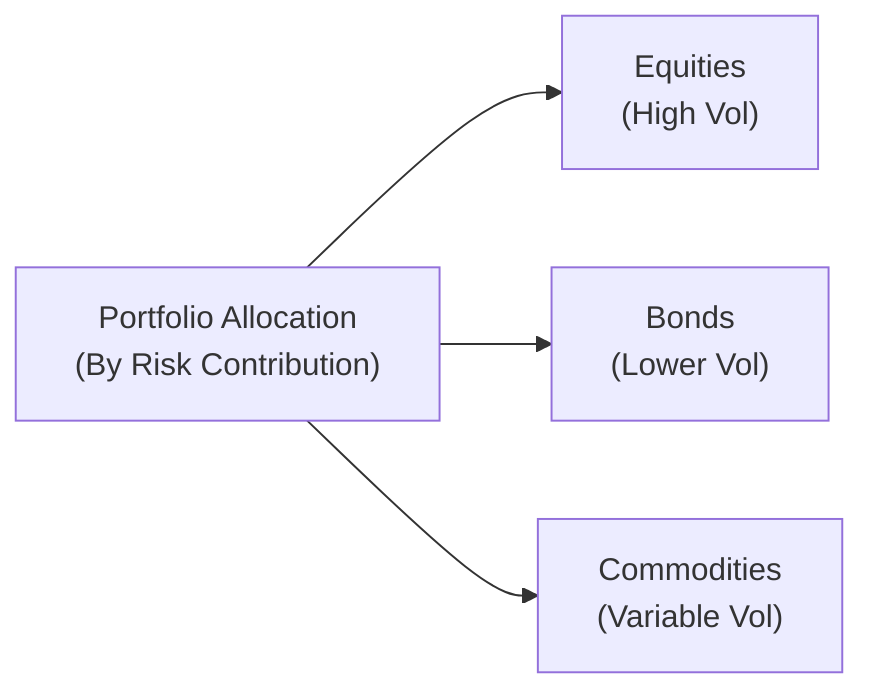
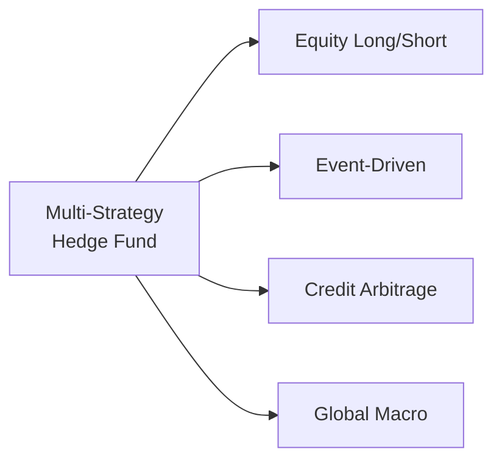

## Foundations of Risk Parity

Risk parity is one of those topics that can sound fancy at first, but the idea is actually pretty straightforward once you peel away the jargon. Essentially, when you use a conventional approach (say, a 60/40 split between equities and bonds), you’re really giving the higher-volatility asset—usually equities—most of the “risk cake.” Even if you put the same amount of money into each asset, the higher volatility inherent in stocks means they end up dominating the overall risk of the portfolio. That’s where risk parity comes in, aiming to allocate capital so that each asset (or asset class) contributes equally to the portfolio’s overall risk.

Rather than distributing capital strictly by nominal weights—all while letting volatility roam free—risk parity funds choose allocations based on each asset’s contribution to overall portfolio variance. In other words, if you’ve got a hankering for 10 different asset classes, you might ask yourself: “How can I make sure none of them overshadows the others in terms of risk contribution?”

### Mathematical Representation of Risk Parity

Let’s imagine we have a portfolio consisting of n assets. Let w_i be the weight of asset i, and let Σ be the covariance matrix of returns. The portfolio’s standard deviation, σ_p, is:

$$
\sigma_p = \sqrt{w^T \Sigma \, w}
$$

The contribution of each asset i to the portfolio’s total risk is given by:

$$
RC_i = w_i \times \frac{\partial \sigma_p}{\partial w_i}
$$

A risk-parity approach tries to equalize each RC_i, effectively making sure no single asset is hogging the risk. In reality, perfect equality might be challenging—some strategies aim for partial risk parity or factor-based parity—but the core idea remains: spread risk out more evenly to reduce unfortunate drawdowns that come from having all your eggs in a single basket.

### Why It Matters

In a typical environment, stocks have higher volatility than bonds. If you merely put the same dollar amount into both, you might end up with something like 90% of the risk coming from equities and just 10% from bonds. Risk parity says, “That’s not ideal.” So, it seeks to narrow that gap by either leveraging lower-volatility assets or sufficiently reducing exposure to higher-volatility assets. Ideally, the end result is a more balanced, less stomach-churning volatility profile.

Sometimes I reflect on my own portfolio (composed mainly of equities in my early days) and realize how unnerving it was to watch it drop like a stone during turbulent markets. Risk parity tries to mitigate that roller-coaster effect. Of course, no strategy is foolproof, but it tends to offer a more stable risk profile over the long haul.

## Adapting Risk Parity for Hedge Funds

Hedge funds, with their broad toolkits (short sales, derivatives, leverage, you name it), take risk parity to another level. In practical terms, they might use futures or swaps to express a desired asset exposure without committing the full nominal capital. This structure can:

• Enhance capital efficiency (you don’t tie up as much cash).  
• Fine-tune exposures more precisely based on real-time market conditions.  
• Simplify implementation of leverage—particularly because futures and swaps can be leveraged more easily than physical cash positions alone.

A hedge fund attempting a risk-parity style strategy also has to consider cross-asset correlation. Sometimes correlations between asset classes shift dramatically in times of stress—meaning your “low-correlation” bond allocations might morph into something unrecognizable if the markets go into meltdown mode. This is where continuous monitoring and agile portfolio rebalancing come in.

### Leverage and Risk Parity

Leverage is not exactly a four-letter word in hedge fund land, but it can be misused if not approached with caution. With risk parity, you often use leverage on lower-volatility asset classes (like bonds) to match the risk contributed by higher-volatility assets (like equities). The result is that each asset effectively “pulls its own weight” in terms of risk.

A common approach is volatility targeting, where the total portfolio aims for a consistent level of volatility over time, say 10%. If volatility creeps higher than 10%, the fund de-levers slightly. If volatility drops below that, the fund might add more leverage or shift exposures to reach the 10% target. This approach can turn a typical asset mix into something that’s more stable—but it does introduce margin or financing costs and the possibility of catastrophic losses should a severe market dislocation occur.

Below is a simple conceptual diagram of a risk parity-style portfolio allocation by risk contribution, showing how each component is carefully balanced:

## Key Elements of Multi-Strategy Hedge Funds

Multi-strategy hedge funds, as the name implies, combine various trading strategies under one umbrella. This might include event-driven, equity long/short, credit arbitrage, global macro, quantitative, and more. Each “sub-strategy” is typically managed by a specialized team, sometimes operating semi-autonomously, while the central risk management group and portfolio management staff oversee the big picture.

A typical multi-strategy fund might look something like this:

### Why Go Multi-Strategy?

When done well, a multi-strategy platform can deliver a smoother return path—less heartburn, so to speak—because ideally, each sub-strategy is uncorrelated with the others. This diversification can mitigate the risk of one strategy blowing up and dragging the entire fund down with it.

Some funds also scale up or down individual sub-strategies depending on market conditions. If the credit market is hot, for instance, the portfolio manager might allocate more capital to the credit arbitrage team. Conversely, if volatility is picking up, maybe the equity long/short group gets more resources because there’s more alpha to capture in that environment. This dynamic capital allocation is usually guided by a combination of fundamental research, quantitative modeling, and old-fashioned risk management oversight.

## Operational Considerations

You might think combining multiple strategies under one roof is a no-brainer, but it’s actually operationally complex:

• Specialized Teams: Each sub-strategy often requires unique skill sets, technology, and possibly prime brokerage relationships.  
• Modular Trading Desks: The fund might have a separate trading desk for each sub-strategy, each with specific risk limits and profit targets.  
• Centralized Risk Management: A robust risk management platform aggregates real-time positions across all teams. This ensures the entire fund stays within its risk budget.  
• Resource Allocation: The fund’s leadership has to decide how much capital each sub-strategy receives, how leverage is employed, and how liquidity is managed.  

It’s kind of like running a small city with different neighborhoods—each with its own vibe, but they all rely on shared infrastructure and must abide by common rules. If one neighborhood experiences a major disruption, the mayor (i.e., the fund’s CIO or risk committee) might reallocate resources to maintain the overall city’s stability.

## Performance Attribution

Measuring the contribution of each sub-strategy in a multi-strategy fund is as much an art as it is a science. After all, strategies typically interact in subtle ways. For instance:

• If the equity team hedges some market exposure through an options trade that the macro team also uses, it might be tough to disentangle the separate “alpha” streams.  
• Funds might use cross-asset hedges or offsetting positions, making it less obvious who is contributing what.  

A common practice is to isolate each sub-strategy’s P&L within its designated capital and track that over time. But central funding costs, overhead, and risk overlay trades can muddy the waters. Some multi-strategy funds have internal “transfer pricing” models to track how much margin each sub-strategy uses and how that factors into overall returns.

From an investor’s perspective, it’s important to ask the fund manager how sub-strategy performance is reported and whether the manager can provide a breakdown of P&L. If you can’t parse out who’s delivering alpha, it might be time to dig deeper or look elsewhere.

## Trade-Offs and Best Practices

One reason many investors flock to multi-strategy funds is the promise of smoother returns and less dramatic drawdowns. By placing multiple sub-strategies under one roof, funds can dynamically rebalance capital to chase new opportunities. However, this arrangement is heavily dependent on effective leadership and a culture that incentivizes collaborative risk management rather than cutthroat internal competition.

• **Upside**: Potential for stable returns, flexible capital allocation, and cross-strategy insights.  
• **Downside**: If risk controls falter, or if the head manager fails to reallocate swiftly, the entire structure can suffer.  

Risk parity logic might also be baked into a multi-strategy fund’s asset allocation. Instead of letting a single strategy overshadow the rest, the fund can adjust capital so that each sub-strategy has a relatively balanced risk budget. When used appropriately, this approach can produce a diversified return stream with less correlation to any single market factor.

## Conclusion

Risk parity and multi-strategy investing go hand in hand in the sense that they both target diversification—one by balancing asset-class risk, the other by combining a variety of trading styles. In a hedge fund context, risk parity typically involves leveraging certain segments or using derivatives to keep the portfolio in sync with a specified risk budget. Meanwhile, multi-strategy platforms bring different skill sets together to mitigate the risk that one style will fall out of favor.

But remember, no strategy is a silver bullet. Both risk parity and multi-strategy setups require a robust governance framework, sophisticated risk management systems, and a leadership team able to navigate shifting market currents. When done well, they can create flexible, adaptive portfolios ready to take on the market’s ups and downs—sometimes with less drama along the way.

## Final Exam Tips

• Be comfortable with the math of risk parity: Understand how the partial derivatives of portfolio volatility translate to each asset’s risk contribution.  
• Highlight practical challenges: In real life, correlations can spike during crises, meaning a risk parity portfolio might not always deliver the stability you’d expect from its backtests.  
• Multi-strategy intricacies: Expect to explain how sub-strategy allocations are determined, how risk is monitored, and how performance is attributed.  
• Think about scenario-based prompts: For the exam, you might be asked to recommend adjustments to a multi-strategy fund given changing market conditions (e.g., a sudden spike in volatility).  
• Don’t forget the “why”: The exam loves “justify your answer” questions. Whenever you propose a solution, connect it to risk mitigation and total portfolio objectives.

## Glossary

• **Risk Parity**: An investment approach in which capital is allocated based on the risk contributions of each asset class, rather than nominal value.  
• **Volatility Targeting**: Adjusting allocations or leverage to maintain a specific portfolio volatility level.  
• **Leverage Overlay**: Using borrowed funds or derivatives to modify a portfolio’s exposure and risk profile.  
• **Sub-Strategy**: A distinct trading approach (e.g., event-driven, equity long/short) managed within a multi-strategy hedge fund.  
• **Cross-Asset Allocation**: Allocating capital across multiple asset classes (e.g., equities, fixed income, commodities, currencies).  
• **Performance Attribution**: The process of determining how much each position, or each sub-strategy, contributes to overall portfolio performance.  
• **Risk Budgeting**: Setting the total acceptable level of risk for the portfolio or for each sub-strategy, and allocating capital accordingly.  
• **Diversification**: Spreading capital across various instruments or strategies to help reduce total risk.

## References

• Qian, Edward. “Risk Parity Fundamentals.” (Recommended foundational text exploring the science behind risk parity.)  
• L’habitant, François-Serge. “Hedge Funds: Quantitative Insights” (Particularly the chapters on multi-strategy investing, which offer valuable frameworks.)  
• Articles on Risk Parity from the CFA Institute (www.cfainstitute.org).  
• Risk.net resources on risk parity and multi-strategy hedge fund structures (www.risk.net).  

## Mastering Risk Parity and Multi-Strategy Concepts: Test Your Knowledge



### Which of the following best captures the essence of a risk parity approach?

- [x] Allocating capital so that each asset contributes a similar amount of risk to the overall portfolio.
- [ ] Allocating the same amount of capital to each asset regardless of volatility.
- [ ] Using margin to lever up all asset classes to the same nominal exposures.
- [ ] Concentrating the majority of risk in high-volatility assets to maximize returns.

> **Explanation:** Risk parity focuses on balancing the risk contribution of portfolio components rather than their nominal capital weight.

### What is a common approach to controlling total portfolio volatility in a risk parity hedge fund?

- [x] Implementing a volatility target and adjusting leverage based on market conditions.
- [ ] Scattering allocations evenly across all available securities without adjustments.
- [ ] Relying solely on fundamental analysis to pick stocks and bonds.
- [ ] Setting a permanent, unchanging level of leverage.

> **Explanation:** Many hedge funds use volatility targeting, where they increase or decrease leverage to keep overall volatility near a chosen threshold.

### In a multi-strategy hedge fund, which function is most responsible for tracking real-time positions and ensuring each sub-strategy adheres to risk limits?

- [ ] The event-driven desk.
- [ ] The macro analysis team.
- [x] The centralized risk management group.
- [ ] The individual prime broker.

> **Explanation:** A dedicated risk management group typically monitors each sub-strategy, aggregates positions, and enforces risk constraints across the entire fund.

### Which of the following is a primary challenge when performing performance attribution in a multi-strategy hedge fund?

- [ ] Each strategy’s performance is independent of the others.
- [ ] Sub-strategies never share common hedges.
- [ ] There are no overhead costs in multi-strategy structures.
- [x] Overlapping hedges and shared overhead complicate identifying the contribution of each strategy.

> **Explanation:** Multi-strategy funds often share or offset positions (and overhead costs), making it more difficult to isolate and measure each sub-strategy’s returns.

### In a risk parity strategy, which asset class is typically leveraged upward to achieve equal risk contribution?

- [ ] High-volatility assets, like small-cap equities.
- [x] Low-volatility assets, such as certain government bonds.
- [ ] Always commodities.
- [ ] Short-term money market instruments exclusively.

> **Explanation:** Low-volatility asset classes (e.g., government bonds) often need leverage to match the risk contribution of higher-volatility classes like equities.

### A key advantage of a multi-strategy hedge fund is:

- [x] Potentially smoother returns from diversification across multiple trading approaches.
- [ ] Limited ability to reallocate capital.
- [ ] Guarantees of no losses.
- [ ] Full transparency into each sub-strategy’s daily P&L.

> **Explanation:** The main appeal is diversified exposure across different strategies, potentially smoothing the aggregate return profile.

### In a hedge fund context, what is a sub-strategy?

- [x] A distinct trading approach under the umbrella of a larger multi-strategy fund.
- [ ] A regulatory filing requirement for all hedge funds.
- [x] A piece of software used for order execution.
- [ ] A mandatory investment vehicle designated by the SEC.

> **Explanation:** A sub-strategy is a unique trading style (like event-driven or credit arbitrage) within a larger multi-strategy structure.

### Which best describes risk budgeting within a multi-strategy fund?

- [ ] Setting the same leverage for all sub-strategies.
- [ ] Completely ignoring correlations between sub-strategies.
- [ ] Limiting the total nominal exposure to each sub-strategy.
- [x] Determining acceptable risk levels and allocating resources so that each sub-strategy stays within its limit.

> **Explanation:** Risk budgeting ensures that each sub-strategy operates within predefined risk parameters, contributing appropriately to the total fund risk.

### What happens if correlations between asset classes or sub-strategies spike during a market crisis?

- [ ] Risk parity portfolios become more stable.
- [r] Traditional diversification benefits might erode, reducing the effectiveness of risk-spreading.
- [ ] Multi-strategy funds automatically profit from volatility.
- [ ] The hedge fund is legally required to cease trading.

> **Explanation:** When correlations jump unexpectedly, the diversification benefits on which risk parity or multi-strategy funds rely might decline, increasing overall portfolio risk.

### True or False: A risk parity strategy guarantees complete protection from market downturns by equalizing risk contributions.

- [x] True
- [ ] False

> **Explanation:** This is actually a tricky statement—it’s trying to lure you. Risk parity does not guarantee full protection from market downturns; it attempts to mitigate the concentration of risk, not eliminate risk altogether.


