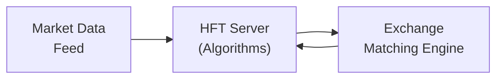

## Introduction

You ever find yourself watching a live market feed and thinking, “How on earth do prices seem to jump around in a split second?” Well, market microstructure and high-frequency trading (HFT) may hold the key. A few years ago, I was chatting with a buddy of mine who worked at a high-frequency trading firm—an office that looked more like a tech start-up than a traditional Wall Street shop. Computers everywhere. People with backgrounds in math, physics, coding. Honestly, I felt more like I’d stepped into a VR gaming lounge. And that’s because modern trading in hedge funds is increasingly about advanced technology, rapid-fire order execution, and capturing fractions of a cent in fleeting market opportunities.

We’re going to take a deep dive into how market microstructure—i.e., the mechanics of how trading actually gets done—underpins many of the strategies employed by high-frequency traders. Then we’ll explore the capital, technology, and regulatory frameworks hedge funds need to succeed in these fast-paced environments. While it might sound intimidating, by breaking it down into manageable sections, we can see that behind all the acronyms and algorithms lie some core principles of liquidity, price discovery, and, well, good old supply and demand.

## Market Microstructure: A Quick Overview

Market microstructure is the study of how the design and rules of trading venues affect the price formation process, liquidity, and transaction costs. It’s not just about fancy models—it’s about understanding the nuts and bolts of where, how, and why trades get executed in a particular way.

### Price Formation and Order Execution

At its heart, price formation reflects the continuous negotiation between buyers and sellers. Large institutional players, such as hedge funds researching advanced strategies (see Section 6.6 on Risk Parity Strategies for examples of multi-strategy approaches), pay close attention to minute details in the mechanics of order execution:

• Limit Orders vs. Market Orders: A limit order specifies a price, while a market order trades immediately at the best available price.  
• Order Matching Engines: Exchanges operate sophisticated systems to match incoming buy and sell orders.  
• Transaction Costs: Includes the bid-ask spread, commissions, and market impact (sometimes subtle but can loom large for big trades).

This interplay among order types, exchange rules, and matching processes shapes how quickly trades are completed and at what prices. Hedge funds might find an inefficiency in how orders are routed across different exchanges or in the fleeting gaps in bid-ask spreads.

### The Role of Market Makers

Market makers (sometimes also algorithmic trading firms) stand ready to buy or sell a given security at publicly quoted bid and ask prices. They perform an essential function, offering liquidity and depth to the market. Because market makers continually post quotes, they help keep spreads tighter and markets more stable. But in HFT-dominated markets, the line between a traditional “market maker” and “liquidity aggregator” can become blurred—as many firms now act in a dual capacity of providing (and occasionally depleting) liquidity.

Market microstructure analysis helps hedge funds decide how to submit their orders and how to measure execution quality. For instance, in Chapter 2 (Alternative Investment Performance and Returns), we talk about performance measurement. Implementation shortfall (how much performance you lose from the time you decide to buy or sell until you’ve finished executing) is directly tied to microstructure efficiency.

## High-Frequency Trading

So, you might be asking, “But how does any of this tie into those nanosecond trades everyone’s talking about?” That’s where high-frequency trading comes in.

High-frequency trading (HFT) is an automated strategy where a large number of trades are executed—often in milliseconds or microseconds. This stands in stark contrast to other algorithmic approaches, like systematic macro or some managed futures strategies (described in Section 6.2 on Legal Structures, Lock-Ups, and Liquidity), which may hold positions for days, weeks, or even months. HFT players, on the other hand, might be in and out of trades so fast that, well, many folks never even see it on a standard market feed.

### Basic Mechanics of HFT

HFT strategies generally seek to exploit ephemeral price dislocations or glean tiny profits from capturing the bid-ask spread under extremely tight time frames. Some basic mechanics include:

• Order Flow Prediction: HFT algorithms may attempt to infer the short-term direction of prices from the real-time flow of incoming orders.  
• Market Making on Speed: Traditional market making on steroids—constantly adjusting quotes on multiple venues to capture small price differences.  
• Statistical Arbitrage: Using rapid execution to arbitrage cross-exchange inefficiencies or correlated assets.  
• Ultra-Short Holding Periods: Positions might last mere seconds or even microseconds, aiming for quick turnover.

Hedge funds that specialize in HFT typically rely on partial or complete automation. Think dozens of trading computers spitting out thousands of orders per second, each designed to fish for fractional mispricings that might vanish almost instantly.

### Technology Requirements

Honestly, if you walk onto the floor of an HFT shop, you might mistake it for a computer hardware lab or a research hub from a sci-fi flick. The technology demands are huge:

1. Co-Location: Placing servers physically close to the exchange’s data center to reduce data transmission distance (and thus latency).  
2. Ultra-Low Latency Data Feeds: Having the fastest possible market data feed, often direct from the exchange’s matching engine, so you can react before others do.  
3. Algorithmic Order Routing: Complex software that decides which venue to send an order to—based on real-time signals of liquidity, spreads, or fleeting price anomalies.  
4. High-Performance Hardware: Specialized processors, field-programmable gate arrays (FPGAs), or GPUs to handle calculations at lightning speed.

HFT is about shaving off microseconds from the entire trading loop: from receiving a price tick to sending your order back to the exchange.

Below is a simple diagram (in Mermaid.js format) illustrating the typical flow of an HFT architecture:



This loop runs continuously, with minimal latency, to exploit even the tiniest tick changes.

### Risk Controls and Compliance

Given the speed, volume, and automation inherent to HFT, robust risk management is critical:

• Real-Time Risk Checks: Monitoring overall exposures, especially when thousands of trades occur in seconds.  
• Kill-Switch Protocol: A single command that immediately stops all trading activity if the system goes haywire.  
• Thorough Backtesting: Using historical market data to verify that your HFT algorithms don’t blow up under certain conditions (like sudden flash crashes).  
• Regulatory Transparency: Many regulators require algorithmic traders to prove they have controls in place to prevent manipulative practices.

For details on broader risk management tools and best practices, see Chapter 8: “Professional Skills and Best Practices” and especially Section 8.2 on Risk Management Tools and Techniques.

## Regulatory and Ethical Implications

HFT has sparked debate over whether it truly adds liquidity or simply front-runs slower participants. Regulators worry about the potential for:

• Market Manipulation: Strategies that might send out false signals or manipulate prices before reversing course in microseconds.  
• Front-Running: Using faster data feeds to jump ahead of large institutional orders, effectively trading “in front” of big block trades.  
• Flash Crashes: The “feedback loop” effect where many HFT strategies act simultaneously, potentially causing drastic price spikes or falls.

In many jurisdictions, HFT firms must register as broker-dealers or meet similar regulatory thresholds, ensuring they have robust compliance in place. In the United States, for instance, the Securities and Exchange Commission (SEC) discusses HFT in the context of market stability and fairness. You can find more info on the SEC’s approach here: [SEC resources on HFT](https://www.sec.gov/).

Ethically, the CFA Institute’s Code of Ethics and Standards of Professional Conduct also applies to HFT practitioners. Firms and individuals must prioritize integrity, transparency, and fair dealing—even in a high-speed environment (see Chapter 1.8 Ethical and Professional Conduct in Alternatives).

## Competition and Diminishing Arbitrage Returns

A friend of mine once jokingly said, “In HFT, it’s like the Wild West—but with lasers.” As more participants achieve near-equal speeds, advantages from latency arbitrage shrink and the margins get wafer-thin. Some notable trends:

• Hardware Arms Race: Everyone invests heavily in faster connections or even microwave transmissions (versus fiber optic lines) to shave off microseconds between Chicago and New York exchange hubs.  
• Increased Data Analytics: With so many participants, more sophisticated machine learning or advanced computing is needed to uncover the next big micro-inefficiency.  
• Regulatory Pushback: Efforts to slow down trading (like speed bumps or frequent batch auctions) can hamper pure speed-based edge, pushing HFT firms to adapt or lose out.

In short, the golden era of easy HFT profits might be past. But specialized strategies still find pockets of opportunity, often pivoting to novel markets—like cryptoasset exchanges or alternative trading systems (ATS), also known as “dark pools” (see Chapter 7.13 for more on digital asset market microstructure).

## HFT vs. Other Algorithmic Approaches

HFT is a subset of algorithmic trading, but it isn’t the only show in town. Systematic macro strategies or Commodity Trading Advisors (CTAs) described in earlier sections (see Chapter 6.1 for Hedge Fund Strategies Overview) often have a more medium-term horizon, focusing on capturing broader trends rather than the fleeting opportunities of HFT. The difference lies in:

• Time Frames: HFT = microseconds to seconds; systematic macro = days to months.  
• Volume: HFT trades massive volumes—thousands or millions of trades—whereas systematic macro might trade fewer, larger positions.  
• Transaction Focus: HFT thrives on capturing micro spreads; systematic strategies rely on big directional or factor-based moves.

This intense focus on speed makes operational effectiveness and data infrastructure absolutely critical for HFT, whereas fundamental research and factor analysis might weigh more heavily in other algorithmic forms.

## Practical Example of a Simplified HFT Approach (Python Snippet)

Below is a trivial example (in Python-like pseudocode) illustrating how one could structure an HFT strategy that tries to capture small market inefficiencies across two exchanges. This is vastly simplified. But it might give a tiny glimpse of how real-time trading logic can be framed:

```python
import time

class MockHFTStrategy:
    def __init__(self, exchangeA, exchangeB):
        self.exchangeA = exchangeA
        self.exchangeB = exchangeB

    def run(self):
        while True:
            # Get real-time best bid/ask from both exchanges
            bidA, askA = self.exchangeA.get_best_quote()
            bidB, askB = self.exchangeB.get_best_quote()

            # If there's a price mismatch (arbitrage opportunity)
            if bidA > askB:
                # Buy from Exchange B, Sell on Exchange A
                self.exchangeB.buy(askB)
                self.exchangeA.sell(bidA)
            elif bidB > askA:
                # Buy from Exchange A, Sell on Exchange B
                self.exchangeA.buy(askA)
                self.exchangeB.sell(bidB)

            # Sleep for a few milliseconds to simulate minimal waiting
            time.sleep(0.001)

# and the logic is far more sophisticated including partial fills, queue optimization, etc.
```

In reality, you’d have advanced latency-optimized code, direct data feeds, and robust kill-switch protocols. But the gist remains: monitor real-time quotes, identify ephemeral mispricings, and rapidly execute offsetting trades. That’s the bread and butter of many HFT strategies.

## Best Practices, Pitfalls, and Strategies to Overcome Them

• Best Practice #1: Real-Time System Monitoring – Always keep a watchful eye on your system. Interactive dashboards with real-time PnL, risk exposure, and open orders are essential in HFT.  
• Best Practice #2: Overengineering is Good – In normal businesses, you might want to keep things lean. But with HFT, having backups and fail-safes is crucial because mistakes happen in milliseconds.  
• Pitfall #1: Latency Overconfidence – Even a minor delay in processing can lead to missed trades or negative Gaps. Always retest.  
• Pitfall #2: Liquidity Glitches – The market might look liquid, but if everyone’s using the same strategy, markets can dry up instantly, causing slippage.  
• Strategy to Overcome Pitfalls – Stress test the system with historically volatile sessions (e.g., announcements, flash crashes) and maintain contingency capital to weather sudden losses.

## Cross-References and Further Reading

• For an overview of hedge fund strategies and styles, refer to Section 6.1: Overview of Hedge Fund Strategies and Styles.  
• For operational due diligence on hedge fund managers, check out Section 6.3: Operational Due Diligence and Manager Selection.  
• For risk management tools and best practices, see Chapter 8: Professional Skills and Best Practices.  
• For more details on performance measurement complexities, refer to Chapter 2: Alternative Investment Performance and Returns.  

## References

• Durbin, Michael. “All About High-Frequency Trading.” McGraw-Hill Education.  
• Patterson, Scott. “Dark Pools: The Rise of AI Trading Machines.” Crown Business.  
• [Securities and Exchange Commission HFT resources](https://www.sec.gov/)  
• For deeper coverage of microstructure theory, see O’Hara, Maureen. “Market Microstructure Theory.”  

## Takeaways for the Exam

1. Know Your Definitions: Market microstructure influences transaction costs, liquidity, and price formation. Understand the difference between limit orders, market orders, and how order matching engines work.  
2. Focus on HFT Mechanics: Grasp that HFT relies on speed, co-location, and advanced algorithms to capture small price differentials in short time frames.  
3. Recognize Regulatory Oversight: Be prepared to discuss fairness, potential market manipulation, and the importance of robust risk controls.  
4. Understand the Technology Arms Race: Familiarize yourself with latency, co-location, and real-time data to appreciate the challenges of staying competitive.  
5. Link to Other Strategies: Distinguish short time frame HFT from broader algorithmic strategies, such as systematic macro. Keep in mind how other chapters on risk management, operational due diligence, and professional ethics tie in.

Remember, the CFA Program might test you on both the conceptual framework (market microstructure) and the practical implications (risk, compliance, and performance impact) of HFT strategies.

## Test Your Knowledge: Market Microstructure and HFT Mastery



### Which of the following best describes market microstructure?

- [ ] A focus on low-latency trading systems only.
- [ ] The study of government monetary policy’s influence on asset prices.
- [x] The study of processes and outcomes of exchanging assets under explicit trading rules.
- [ ] A subset of derivatives trading that relies on margin calls.

> **Explanation:** Market microstructure examines how trading mechanisms, exchange rules, and processes affect asset price formation and liquidity.

### In high-frequency trading, co-location primarily serves to:

- [ ] Provide a safer environment for traders in natural disasters.
- [ ] Minimize operational costs by sharing resources.
- [x] Reduce latency by placing servers near an exchange’s data center.
- [ ] Eliminate regulatory scrutiny for foreign investors.

> **Explanation:** Co-location places trading servers physically close to an exchange’s data center, thereby reducing transmission delays and increasing the speed of order execution.

### A "kill-switch protocol" in an HFT context is designed to:

- [x] Immediately halt trading if systems malfunction.
- [ ] Increase the speed of order matching to optimize profits.
- [ ] Manage partial fills in a high-liquidity environment.
- [ ] Permit regulators to review trading records post-execution.

> **Explanation:** The kill-switch protocol is a failsafe mechanism that shuts down trading activities instantly if algorithms go awry or if certain error thresholds are exceeded.

### Which feature most reliably distinguishes HFT from other algorithmic trading strategies?

- [ ] Use of fundamental research in stock selection.
- [ ] Emphasis on multi-day holding periods.
- [x] Extremely short trade holding periods and ultra-high trade volume.
- [ ] Reliance on discretionary trades by portfolio managers.

> **Explanation:** HFT typically involves exceedingly short holding periods (seconds or microseconds) and very high frequencies of trades, differentiating it from other algorithmic strategies with longer time horizons.

### A regulatory concern surrounding HFT is often:

- [ ] Excessive correlation with longer-term macro strategies.
- [ ] Patent infringement on proprietary trading software.
- [ ] Restricted technology exports to certain countries.
- [x] Potential market manipulation or front-running of slower orders.

> **Explanation:** Regulators worry that HFT firms might use their speed advantage to exploit or front-run other market participants or otherwise manipulate the market.

### Which of the following is most directly related to latency in HFT?

- [x] The delay between receiving market quotes and executing an order.
- [ ] The interval between corporate earnings releases.
- [ ] The average daily volume of a specific equity.
- [ ] The annual management fee for a hedge fund.

> **Explanation:** Latency is the time delay between when new data arrives and when a system can respond, a critical element in HFT strategies.

### A robust backtesting process in HFT should:

- [ ] Substitute live market trades with simulated trades to save money indefinitely.
- [x] Use historical data to evaluate how an HFT algorithm would have performed.
- [ ] Guarantee future profitability under all market conditions.
- [ ] Exclude transaction costs to simplify results.

> **Explanation:** Backtesting uses historical data to assess how well a trading algorithm might have performed, although it doesn’t guarantee future success.

### A distinguishing feature of an HFT architecture is:

- [ ] Full reliance on manual order entry to avoid errors.
- [ ] Avoidance of real-time risk management systems.
- [ ] High-latency connections to secure global data feeds.
- [x] Real-time monitoring and immediate adjustments to changing market conditions.

> **Explanation:** HFT environments often include real-time systems that allow trades and risk exposures to be monitored and adjusted within microseconds.

### Which factor most notably contributes to diminishing returns in HFT strategies?

- [ ] Declining connectivity between major exchanges.
- [ ] Reduced regulation and oversight across markets.
- [x] Widespread adoption of similar speed-based technology.
- [ ] Decreased reliance on computerized trading systems.

> **Explanation:** As more market participants adopt similarly fast systems, the unique advantage of speed diminishes, often compressing potential profits.

### True or False: “Market makers in HFT always hold their positions for days to profit from large directional moves.”

- [x] True
- [ ] False

> **Explanation:** Actually, this should be False if taken literally. However, note that some market makers in HFT environments often hold very short-term positions. If the statement is that HFT market makers “always” hold positions for days, it’s incorrect. They typically hold positions for extremely brief periods.  


