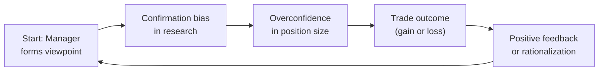
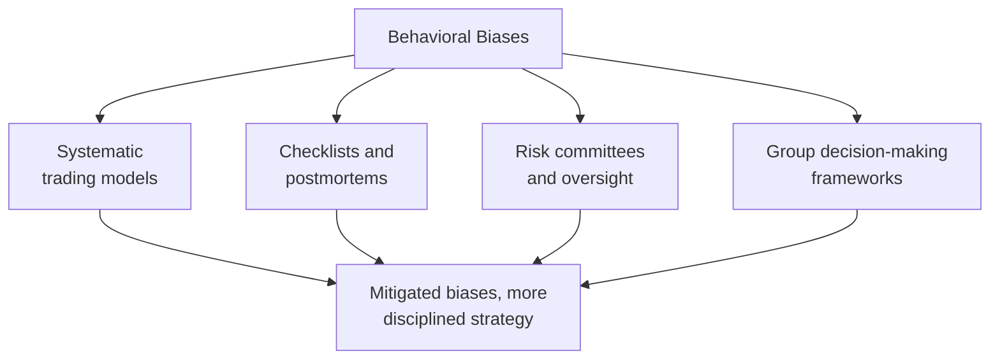

## Introduction

So, let’s say you’re chatting with a hedge fund manager over coffee, and he proudly explains how he just “knew” a certain stock would skyrocket—or that he “had a feeling” interest rates would hold steady despite all signs pointing otherwise. Can you see the subtle overconfidence or the possible anchoring in that statement? These glimpses of human psychology pop up everywhere in hedge fund management, even for the most quantitatively sophisticated managers. After all, hedge funds may revolve around dynamic strategies, advanced analytics, and complex financial instruments, but behind those screens are people. And people—myself included—are subject to behavioral biases no matter how many spreadsheets we’ve built.

In this section, we’ll dive into the most common behavioral biases in hedge fund management and how they shape trading decisions, risk management, and portfolio performance. We’ll talk about ways to mitigate these pitfalls—like implementing systematic processes or checklists—and how, ironically, some fund structures and fee arrangements can actually amplify the biases we try so hard to avoid. We’ll also discuss the interplay of ego, track record, and overconfidence. Finally, we’ll highlight how continuous learning and performance reviews can help managers see patterns in their own behavior.

## Behavioral Finance in Hedge Fund Settings

Behavioral finance is the field that blends psychology, economics, and finance to explain why investors often violate the assumptions of perfect rationality. You might have already heard of “emotional trading,” but that phrase barely skims the surface of how biases can creep into investment analysis, risk decisions, or even operational calls like whether to hire more analysts or allocate resources differently.

For hedge funds, which frequently pursue specialized or high-stakes strategies, behavioral biases can surface in myriad ways. Fund managers who believe they can identify an undervalued security might double down due to confirmation bias if early signals support their thesis (even if contradictory evidence later emerges). And well, it all gets complicated if an entire team starts patting each other on the back for the same viewpoint—enter groupthink. These biases aren’t just academic curiosities; they have real consequences in the form of suboptimal trades, skewed risk profiles, and short-lived careers.

## Common Behavioral Biases in Hedge Fund Management

### Overconfidence Bias

Overconfidence bias is the tendency to overestimate our own abilities or the quality of our information. Hedge fund managers, who often have a track record of strong returns, might mistakenly believe that they can time the market flawlessly or identify “can’t-miss” trades. And let’s be honest, sometimes you see a big win, and you start feeling like you’ve got a golden touch. It’s human. But in a hedge fund context, overconfidence can lead to outsized bets, insufficient diversification, and ignoring crucial risk signals.

From my experience, one cautionary tale involved a highly successful manager who specialized in distressed debt. After a string of profitable trades, he assumed he could identify any diamond in the rough. One day he bought heavily into short-dated bonds of a struggling retail chain without fully accounting for macro shifts in consumer behavior. The position eventually turned sour, and the fund took a hit that overshadowed the manager’s previous streak. Trust me—no manager is infallible.

### Anchoring

Anchoring refers to relying too heavily on an initial reference point or piece of information. In hedge funds, this can happen if a manager sees a particular price as “fair value” for a stock based on outdated analysis or a single piece of data. When new evidence contradicts that price, they struggle to adjust their perspectives quickly. It’s as if the original anchor is pulling them back.

For instance, imagine a portfolio manager initially values a small-cap technology stock at USD 50 per share, based on historical earnings. If updated forecasts and sector comparisons suggest that the fair value is closer to USD 35, the manager could still be fixated on his or her original USD 50 anchor, leading to a reluctance to sell and accept a loss. The “anchor” can also be a previously successful trade in a related sector, a singular stock price as of quarter-end, or even the valuation a friend casually mentioned at a cocktail party. 

### Confirmation Bias

Confirmation bias is everyone’s best friend—and biggest challenge—in investing. We hone in on information that reaffirms our existing views while discounting anything that suggests we might be wrong. Although hedge funds often pride themselves on having robust due diligence, managers are just as susceptible to ignoring conflicting data that would challenge a core thesis. In practice, this can cause them to hold onto losing positions under the banner of “the market will come around,” or to accumulate more shares on the dip, ignoring fundamental red flags—like deteriorating product pipelines or regulatory scrutiny.

### Herd Instinct

We’ve all heard about the classic “herd behavior”: following the crowd because taking a different path feels risky. Hedge funds, ironically, can demonstrate this phenomenon too. Even though hedge funds strive to be contrarian, performance metrics, and peer comparisons often push managers to chase popular trades. If everyone is piling into a momentum stock or shorting a particular credit instrument, it can feel safer to join the pack—at least in the short term.

Herd instinct can also spring from groupthink within a fund’s own research team. Everyone becomes overly agreeable with a star portfolio manager, which stifles debate. This can lead to missed opportunities to challenge flawed assumptions until it’s too late.

## How These Biases Disrupt Investment Decisions and Portfolio Outcomes

Behavioral biases don’t just affect one or two trades; they can shape an entire portfolio’s risk/return profile. When multiple biases overlap—say overconfidence meets confirmation bias—it’s even more dangerous. A manager might double down on a losing position, ignoring signs that the fundamentals have changed. Or a team that anchored on a high target price might under-hedge or skip prudent risk management steps.

Moreover, the presence of performance fees—a hallmark of the hedge fund industry—can exacerbate risk-taking. Managers on a high-water-mark or performance-fee incentive might push for bigger gambles to surpass previous return thresholds. This environment can trigger behaviors like “swinging for the fences,” especially if the manager’s compensation relies heavily on a big year-end gain.

## The Role of Ego, Track Record, and High-Stakes Environments

One of the paradoxes in hedge funds is that a proven track record can fuel overconfidence. Managers with a history of strong performances may become less receptive to feedback. Their self-image is tied to being the “one who’s always right.” I recall a small incident at a fund I worked with: the lead manager had posted a 50% return year-on-year for three years, garnering major media attention. The next year, the market environment shifted drastically, but he was slow to accept that his bread-and-butter strategy no longer worked in the new volatility regime. Losses piled up before adjustments were made.

The high-pressure environment— think live media coverage, investor calls, big payouts, potential star status—amplifies these biases. You know, if people are praising you for your results at an annual investor conference, you start believing your instincts are near-perfect. Even if you’re usually good at controlling your ego, the stakes can push you into riskier territory.

## Strategies to Mitigate Behavioral Biases

If we’ve learned anything, it’s this: no matter how data-driven a hedge fund is, no single manager or strategy is immune to psychological pitfalls. So let’s explore a range of strategies designed to keep biases in check:

Systematic Processes and Models  
• One approach to limiting the effects of biases is to rely on systematic or algorithmic trading models for certain positions. Using quantitative signals can reduce some subjectivity. However, remember that models can encode the biases of their creators if not tested rigorously.

Rigorous Checklists  
• A big step is the “checklist approach,” popularized in the medical world and increasingly in finance. Creating a standardized list of questions before any major investment ensures all relevant factors get considered—macro conditions, management quality, sensitivity to interest rates, potential catalysts, risk exposures, etc. It sounds mundane, but checklists force you to physically check each box rather than rely on your gut, which can be swayed by biases.

Group Decision-Making Frameworks  
• Structured debate sessions and “devil’s advocate” roles can help reduce confirmation bias and groupthink. In a hedge fund, you might designate a team member to argue the opposite side of any investment thesis, forcing the group to thoroughly address every weakness. The key is fostering a culture where questioning is seen as beneficial, not as a personal attack.

Ongoing Risk Committees  
• Many hedge funds set up risk committees with the power to veto or demand changes to a portfolio’s exposures. If a manager is anchored on an outdated valuation, the committee—armed with fresh data—can push for a swift de-risking. This institutional counterweight can help keep a check on overconfident managers.

Periodic Postmortems and Performance Reviews  
• After any material gain or loss, it’s vital to conduct a postmortem. Dive into not just the market data that influenced the trade but also the decision-making process. Did you overlook negative data points? Were you influenced by anchoring? Did the team fall into groupthink? Documenting these reflections helps identify recurring patterns of bias.

## Mermaid Diagram: Behavioral Bias Feedback Loop

Below is a simple Mermaid diagram illustrating how a biased decision can reinforce future biases if unchecked:

Managers start with a viewpoint (A), then gather confirming information (B), which leads them to be overconfident in position sizing (C). Next, the trade’s outcome (D) can still be rationalized to preserve ego (E), ultimately feeding back into the manager’s initial outlook (A).

## How Performance Fees and High-Stakes Environments Exacerbate Biases

One might argue that a performance fee structure aligns manager and investor interests. However, it can also push managers to adopt “go big or go home” approaches, especially when a fund is below its high-water mark. The desire to keep or attract capital might also lead managers to confirm their biases about a trade’s upside while downplaying the downside.

Herding can get worse in a bull market with peer pressure intensifying around popular tech strategies, for example. The manager doesn’t want to be left behind. And if a manager is near psychological or contractual performance thresholds, anchoring on a “target return” number can elevate risk-taking. This phenomenon is sometimes called “goal posting,” where managers fixate on a certain performance outcome.

## Ego Risk and Manager Track Record

Call it “ego risk,” call it “pride.” Either way, it can severely reduce a manager’s ability to pivot when markets change. Experienced managers might proclaim, “We’ve seen cycles, we know how to handle them,” and discount any new complexities. Or novices might try to match the success of star managers by mimicking their trades. In both cases, there’s a certain bravado that can overshadow objective analysis.

That said, a manager’s track record isn’t meaningless—strong, consistent performance is indeed a testament to skill. But the challenge is to remain open to changing conditions and respectful of new data. Overconfidence emerges when a track record becomes a manager’s identity so firmly that they dismiss signals contradicting their established narrative.

## Mitigation in Practice: A Case Study

Imagine a multi-strategy hedge fund specialized in convertible arbitrage, distressed debt, and global macro. The CIO decides to build a process to minimize behavioral biases. First, each strategy sub-team completes a standardized checklist for every position above a certain size. Next, weekly cross-team roundtables happen, where a rotating “devil’s advocate” must challenge the biggest trades. If a sub-team can’t justify its position, risk limits automatically get reduced.

When the fund invests in distressed bonds of an emerging-market oil producer, the sub-team might be confident about a short-term price pop after restructuring announcements. But the “devil’s advocate” highlights uncertain political conditions, a recent currency crisis, and potential supply chain disruptions. This triggers more robust analysis, leading to a partial hedge with credit default swaps. Over the next quarter, oil prices plummet, but the hedge spares the fund from massive losses. The manager later credits the mandatory debate for preventing a deeper drawdown.

## Additional Methods and Tools

• **Data Visualization Dashboards**: Tools that compare actual outcomes, forecast ranges, and highlight discrepancies between projected returns and actual results. This can help managers see where they might be overestimating (overconfidence), or ignoring red flags (confirmation bias).  
• **External Audits of Trades**: Engaging external reviewers or consultants to examine large or unusual trades. They can provide independent assessments, free of in-house biases.  
• **Behavioral Coaches**: Some hedge funds even employ coaches who observe team dynamics, track language usage in meetings (“we are certain,” “no chance it goes down,” etc.), and point out systematic errors.

## Another Mermaid Diagram: Approaches to Mitigate Bias

## Importance of Continuous Learning

If we’ve hammered home one theme, it’s that biases never fully go away. Hedge fund managers must keep learning—from books, peer groups, post-trade analysis, and plain old humility. Performance reviews that focus specifically on decision-making processes, rather than only P&L, will highlight whether biases are creeping back in. Building a track record of reflection is as vital as building a track record of returns.

## Best Practices and Common Pitfalls

Best Practices:
• Establish a culture that rewards questioning and healthy dissent.  
• Create formal decision-making structures with checklists, second opinions, and risk committees.  
• Encourage reflection and feedback loops through postmortems.  
• Use performance metrics that consider risk-adjusted returns rather than just absolute returns.  
• Embrace ongoing investor communication, which can help managers stay accountable.

Pitfalls:
• Using the same anchor repeatedly without updating it with new data.  
• Bypassing critical reviews if the manager or team is running hot.  
• Overlooking hidden correlations or underestimating tail risks because “we haven't seen them in a while.”  
• Becoming complacent after a strong track record.

## References for Further Deep Dives

Behavioral finance, particularly in hedge fund management, is a vast subject. For more detailed insights and actionable advice, consider these resources:

• “Thinking, Fast and Slow” by Daniel Kahneman — offers foundational understanding of cognitive biases and system-based thinking.  
• “Beyond Greed and Fear” by Hersh Shefrin — focuses on how behavioral finance principles apply directly to money managers.  
• CFA Institute’s Behavioral Finance Resources — includes articles, webinars, and case studies focused on practical applications in portfolio management:  
  https://www.cfainstitute.org/research  
• “The Checklist Manifesto” by Atul Gawande — while intended for the medical field, the principles of checklists to reduce errors directly translate to investment processes.

-----

## Test Your Knowledge: Behavioral Biases in Hedge Fund Management



### Which of the following best describes “anchoring” in hedge fund management decisions?

- [ ] Overestimating the probability of extremely rare events  
- [x] Relying too heavily on the initial reference point for valuations  
- [ ] Seeking out only the information that confirms an existing thesis  
- [ ] Following the crowd to avoid missing out on popular trades  

> **Explanation:** Anchoring is the tendency to latch onto an initial piece of information (or price) too strongly, impacting later decisions even when new data suggests a shift in fair value.

### A hedge fund manager has had two consecutive years of double-digit outperformance and believes they can pick undervalued tech stocks better than any competitor. Which bias are they likely exhibiting?

- [ ] Herd instinct  
- [ ] Anchoring  
- [ ] Confirmation bias  
- [x] Overconfidence bias  

> **Explanation:** Overconfidence bias is evident when managers overestimate their skill or predictive accuracy after notable success.

### Groupthink can be especially dangerous in hedge funds because:

- [ ] It enhances the quality of independent analysis  
- [x] Team members may refrain from challenging the dominant opinion  
- [ ] It ensures balanced risk-taking across all positions  
- [ ] It avoids anchoring by encouraging more creative thinking  

> **Explanation:** Groupthink leads to everyone accepting a central viewpoint without scrutiny, which can cause significant blind spots in investment decisions.

### Which of the following risk management techniques directly addresses confirmation bias?

- [x] Assigning a devil’s advocate to argue against a trade thesis  
- [ ] Implementing a high-water-mark performance fee structure  
- [ ] Focusing on macro trends rather than single-stock analysis  
- [ ] Investing in large, well-known companies only  

> **Explanation:** A devil’s advocate approach challenges the investment thesis critically, which helps counteract the human tendency to ignore evidence that conflicts with one’s existing view.

### Performance fees may exacerbate certain biases because:

- [x] Managers might take excessive risk to surpass previous return thresholds  
- [ ] They reduce the possibility of ego-driven decisions  
- [ ] They provide no link between performance and compensation  
- [ ] They automatically eliminate confirmation bias  

> **Explanation:** Performance fees can cause managers to swing for the fences, potentially intensifying overconfidence, confirmation bias, or risk-taking beyond prudent levels.

### The “checklist approach” helps hedge fund managers:

- [ ] Eliminate all cognitive biases entirely  
- [ ] Guarantee positive returns under any market condition  
- [x] Systematically review critical factors before making a decision  
- [ ] Avoid using any form of fundamental or technical analysis  

> **Explanation:** Checklists ensure that managers methodically address all vital points (e.g., risk factors, fundamental metrics) and don’t rely solely on emotion or incomplete information.

### A hedge fund manager refuses to sell a position despite severe underperformance, insisting the stock “must rebound.” This scenario best illustrates:

- [ ] Herd instinct  
- [ ] Groupthink  
- [x] Confirmation bias  
- [ ] Anchoring  

> **Explanation:** The manager is holding onto a losing position by focusing on confirming evidence (e.g., promising news articles, supportive analysts) and ignoring contradictory signs, which is a classic manifestation of confirmation bias.

### Which of the following is an excellent way to minimize the negative impacts of groupthink in investment committees?

- [ ] Only invite the most experienced manager to committee meetings  
- [ ] Keep discussions focused on top-performing trades only  
- [x] Designate different team members to challenge assumptions publicly  
- [ ] Dismiss any analyst who questions the lead manager’s opinion  

> **Explanation:** Encouraging debate and dissent—through formal roles opposing dominant viewpoints—is crucial in addressing groupthink.

### Ego risk in hedge fund management is often tied to:

- [ ] The manager’s familiarity with hedging instruments  
- [ ] The number of administrators and service providers the fund employs  
- [ ] Exclusively large short positions  
- [x] A manager’s personal self-image being linked to consistent winning strategies  

> **Explanation:** When a manager’s sense of self-worth or public image is heavily staked on a track record of success, they may overlook or rationalize new risks rather than adapt.

### True or False: Systematic or algorithmic trading models are entirely free from behavioral biases.

- [x] True  
- [ ] False  

> **Explanation:** Trick question. While systematic models can lessen the direct impact of human emotion (thus they are somewhat freer from biases), they are not perfectly free from biases if the underlying assumptions or data inputs are rooted in flawed human judgments.  



-----

**Final Exam Tips:**
• Familiarize yourself with various behavioral biases and be ready to identify them in scenario-based situations.  
• Watch for cues such as “stubbornly holding onto a losing position” (confirmation bias) or “everyone rushing into the same trade” (herd instinct) in constructed-response prompts.  
• Use process-based frameworks to demonstrate how to mitigate these biases in multi-part item sets.  
• Remember that exam questions may require knowledge of how biases affect risk-taking, portfolio outcomes, and performance evaluation.  

**References:**
• Daniel Kahneman, “Thinking, Fast and Slow”  
• Hersh Shefrin, “Beyond Greed and Fear”  
• CFA Institute’s Behavioral Finance Resources:  
  https://www.cfainstitute.org/research  

Behavioral biases might be part of human nature, but knowing them intimately is a crucial advantage in consistently disciplined hedge fund management. Keep these pointers handy and strive for objectivity as you navigate the complex world of alternative investments. Good luck in your studies—and remember to question yourself just as much as the markets!
