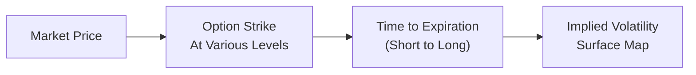

## Introduction
Volatility and tail-risk management are big deals in hedge fund investing. Ever hear a friend complain about losing a bundle when markets went haywire? That’s precisely why tail-risk strategies matter. Tail risk refers to those rare (but painful!) extreme moves that just don’t fit neatly into our standard distribution assumptions. In this section, we’ll walk through why tail risk exists and how hedge funds manage it, covering everything from out-of-the-money puts to fancy variance swaps. We’ll also peek at volatility arbitrage—an approach that capitalizes on differences between implied and realized volatilities—and highlight “tail-risk funds” dedicated to protecting against market meltdowns. Throughout, we’ll keep an eye on the trade-offs, costs, and practical considerations every investor should weigh when dealing with tail-risk hedges.

## Understanding Tail Risk
Tail risk describes potential outcomes that lie far out on the distribution curve—often in the “tails”—where the most severe market losses happen. Traditional financial models often assume a normal (Gaussian) distribution, but real market returns sometimes exhibit “fat tails,” implying a higher-than-expected probability of dramatic events. Although these events appear seldom, their damage can be massive.

Tail risk is especially relevant for hedge funds pursuing strategies with leverage or complex positions. Even if a fund has an impeccable track record, a single tail event (such as a market crash, credit crisis, or unexpected geopolitical shock) can rapidly erode capital. Hence, many hedge fund managers integrate advanced hedging tools or specialized strategies to mitigate these low-probability, high-impact episodes.

## Key Tools for Tail-Risk Hedging
Many of the tools that hedge funds use to manage tail risk revolve around derivative instruments. While each tool comes with its own unique payoff structure, cost profile, and complexity, they all share a common goal: to reduce the impact of extreme losses in the broader portfolio.

### Out-of-the-Money Put Options
Out-of-the-money (OTM) put options are a straightforward choice for tail-risk hedging. Because they have a strike price below the current market price of the underlying asset, they tend to be cheaper than at-the-money puts. However, they offer strong downside protection if the market crashes through that lower strike level.

You might think of OTM puts like an insurance policy. You pay a premium for coverage, hoping you’ll never actually need it. But if the market takes a deep dive—say, dropping 20% to 25%—that cheap put option can surge in value, offsetting your losses.

### Variance Swaps
A variance swap is another popular instrument for hedge funds looking to hedge (or speculate on) volatility. It allows you to trade future realized variance (roughly, volatility squared) against implied variance. If you’re worried about an explosion in volatility during crises, holding a long variance swap position can deliver a payoff when volatility rises above the implied variance priced at inception.

The basic payoff of a variance swap can be approximated by:


\text{Payoff} = (\sigma_{\mathrm{realized}}^2 - K_{\mathrm{var}})\times \text{Notional}


where:
• \\(\sigma_{\mathrm{realized}}^2\\) = realized variance over the life of the swap  
• \\(K_{\mathrm{var}}\\) = quoted variance strike at initiation  
• Notional = the monetary multiplier for each point of variance difference  

Buying a variance swap helps hedge a rapid spike in volatility. However, if realized variance stays below the implied strike, the swap ends up costing you in premium terms—similar to how an unused insurance policy “goes to waste.”

## Volatility Arbitrage Strategies
Volatility arbitrage is about profiting from the difference between implied volatility (the market’s expectation) and realized volatility (what actually occurs). The simplest example might be:

• A hedge fund sells expensive implied volatility (e.g., writes options) if it thinks the underlying’s future movement will be quieter than the option market predicts.  
• Conversely, the fund buys options if it believes future realized volatility will exceed implied volatility.  

One personal story I recall from an old colleague (he specialized in volatility trading) goes like this: he was so convinced that a tech company’s stock would be incredibly volatile during an earnings season. Meanwhile, the market’s implied volatility for those options was surprisingly low. So he snagged call and put options (a straddle) at what he felt was a bargain. When the actual earnings release caused a wild swing, realized volatility soared, and the trade turned a hefty profit.

Volatility arbitrage can act as a tail-risk strategy if the portfolio is positioned to profit from sudden volatility spikes. Yet, it’s not always purely protective—some volatility-arb strategies might actually lose money if implied volatility underestimates negative tail events. Implementation details matter a lot.

## Specialization: Tail-Risk Funds
Tail-risk funds exclusively focus on hedging or profiting from global crises, often via systematic tail-risk hedges. Their entire portfolio is structured to either break even or generate small losses when markets are stable, in return for a large payoff when a meltdown hits. These funds:

• Typically hold large positions in OTM market index puts, credit default swaps, or other instruments that experience outsized gains during crises.  
• Are known for their negative carry—an ongoing cost that can drag performance in calm markets.  
• Potentially serve as an uncorrelated source of return when the world “goes to pieces,” thus benefiting an overall multi-asset portfolio mix.  

Because tail-risk funds can be pretty expensive to run (and to invest in), some hedge fund-of-funds or institutional portfolios allocate only a modest percentage to these strategies. The idea is that any big payoff from the tail-risk fund might backstop losses in the rest of the portfolio.

## Implied Volatility Surfaces and Complex Derivatives
When hedge funds dabble in advanced derivative structures—say, exotic option spreads or barrier options—they pay close attention to the implied volatility surface. The surface is essentially a three-dimensional graph showing implied volatilities across different strikes and maturities:

• The “moneyness” axis (strike relative to spot price).  
• Time to expiration axis (short to long maturity).  
• Implied volatility (the vertical dimension).  

If the volatility surface suggests that deep OTM puts are underpriced relative to their actual tail-risk coverage, a hedge fund might buy those puts as a long-tail protection strategy. Alternatively, the fund might identify that certain across-strike spreads, or put-call parity relationships, are out of alignment with historical patterns, creating an arbitrage. Understanding how the surface shifts over time is crucial for building robust crisis-hedging solutions.

Above is a simplified flow illustrating how the different parameters feed into constructing an implied volatility surface. Although real-world surfaces can look more dramatic, this serves as a reminder that 3D shape analysis is part science, part art.

## Diversification of Hedging Strategies
One of the biggest challenges with tail-risk hedging is correlation breakdown. In normal markets, you might see some diversification benefit, with certain asset classes offsetting negative moves in others. But in severe market crises, correlations can spike toward 1.0—and you lose much of the protective advantage from typical diversification alone.

That’s why sophisticated hedge funds often employ cross-asset hedging. Rather than just layering equity puts, they might also buy puts on commodity indexes, purchase currency options, or even hold volatility instruments on international bonds. By mixing strategies across geographies and asset classes, the fund has a better chance of capturing at least one hedge that will be in the money when the market meltdown arrives.

## The Cost of Carry vs. Protective Benefits
All these hedging approaches are not free. If the crisis never arrives, you lose the hedging premium (the so-called negative carry). This can accumulate over time. So funds typically weigh:

• The “cost of carry” or ongoing cost to maintain hedges.  
• The potential protective payoff in the event of a tail event.  
• Opportunity cost of capital that might be used elsewhere.  

In some cases, hedge funds mitigate these costs by implementing lower-cost collars (buy OTM put, sell OTM call) or by partially financing put premiums through covered calls. The trade-off: you might forego some upside if the market rallies, but you reduce net out-of-pocket cost for tail protection. Balancing how much basis risk you can handle (i.e., the mismatch between the hedge payout and actual portfolio losses) is always part of the puzzle.

## Best Practices for Tail-Risk Management
• Conduct scenario analysis and stress testing. Consider historical crises (like 2008 or the pandemic meltdown) and hypothetical worst-case scenarios.  
• Monitor implied vs. realized volatility consistently. Don’t treat your volatility assumptions as static.  
• Estimate correlation in normal times vs. crisis times to anticipate potential breakdowns.  
• Size hedges appropriately. Too little coverage might be ineffective; too much can drag your returns.  
• Rebalance hedges. An OTM put, for example, can drift in and out of the money as markets fluctuate.

## Common Pitfalls
• Overreliance on a single hedge instrument. Markets shift, implied vol changes, and single-instrument reliance can fail.  
• Incorrect implied volatility assumptions. If realized volatility is consistently lower, you might waste a lot of premium.  
• Neglecting liquidity. In major sell-offs, some derivatives markets can seize up, preventing cost-effective rebalancing.  
• Psychological bias. Some investors prematurely remove protective hedges right before they’re most needed.  

## Concluding Remarks
Volatility and tail-risk management strategies sit at the core of hedge fund risk oversight. While these strategies protect against severe drawdowns, they also come with nontrivial costs. At the end of the day, you want to strike a balance between prudent hedging and overpaying for insurance that might never be used. A well-considered plan for tail-risk hedging—one that leverages OTM options, variance swaps, or cross-asset plays—can add resilience to a portfolio and help you sleep a bit better during tumultuous times.

## Exam Tips
• Practice calculating option payoffs under various scenarios, especially for OTM puts.  
• Understand the payoff structure of variance swaps and how they differ from volatility swaps.  
• Be prepared to discuss linkages between implied volatility surfaces and exotic option strategies.  
• Anticipate how correlation breakdown might affect standard asset allocation.  
• Know the difference between short volatility strategies (where the fund benefits from stable markets) and tail-risk-hedged strategies.  
• Tail-hedging is cost-intensive—explain how different instruments address cost-of-carry issues.

## References
• Hull, J.C. (2017). Options, Futures, and Other Derivatives.  
• Taleb, N.N. (2012). Antifragile: Things That Gain from Disorder.  
• Risk.net Articles on Volatility and Tail-Risk Hedging:  
  (https://www.risk.net/)  

## Tail-Risk and Volatility Management Strategies Quiz



### Which statement best describes tail risk? 
- [ ] It is the likelihood of average returns in normal market conditions. 
- [x] It is the risk of rare events causing significant portfolio losses outside the normal distribution.  
- [ ] It is the incremental risk of buying at-the-money options.  
- [ ] It is the process by which volatility trading delivers guaranteed profits.  

> **Explanation:** Tail risk measures the possibility of extreme and infrequent outcomes that can lead to very large losses, often outside a standard bell-curve expectation.

### What is the primary reason hedge funds buy out-of-the-money put options for tail-risk protection? 
- [ ] They have unlimited upside potential in any market condition.  
- [ ] They are entirely costless to maintain.  
- [x] They provide downside protection at a lower premium than at-the-money puts.  
- [ ] They guarantee positive returns in all market environments.  

> **Explanation:** Buying OTM puts is typically cheaper than at-the-money puts while still offering substantial downside coverage if markets plunge below the strike price.

### Which of the following best characterizes variance swaps in a tail-risk context? 
- [ ] A simplified approach to currency hedging.  
- [x] A derivative that pays based on the difference between realized and implied variance.  
- [ ] An instrument used only to speculate on rising interest rates.  
- [ ] A guarantee against changes in correlation.  

> **Explanation:** Variance swaps allow you to hedge or speculate on volatility (variance), paying off if realized variance is higher or lower than the pre-agreed strike.

### Why might a tail-risk fund exhibit negative carry in calm markets? 
- [ ] It is typically short volatility.  
- [ ] It relies heavily on cyclical equity strategies.  
- [x] It incurs ongoing costs for protection that may not pay off if no crisis occurs.  
- [ ] It only invests in highly liquid government bonds.  

> **Explanation:** Tail-risk funds spend on hedges (e.g., OTM puts, CDS) that lose value if markets remain stable, resulting in a drag on returns.

### What does the “implied volatility surface” provide for traders? 
- [x] A three-dimensional map of implied vol across strikes and maturities.  
- [ ] A single figure representing the market’s overall volatility.  
- [x] Insight into mispricing or arbitrage across different option strikes.  
- [ ] A direct correlation measure for cross-asset hedging.  

> **Explanation:** The implied volatility surface displays implied volatility across multiple strikes and maturities. Traders use it to identify potential mispricings for arbitrage or hedging strategies.

### Why is cross-asset hedging important in tail-risk management? 
- [ ] It ensures all investments will make money in a crisis.  
- [x] It helps mitigate correlation breakdown when multiple assets fall together.  
- [ ] It permanently lowers cost of carry to zero.  
- [ ] It moves tail risk from one asset class to another.  

> **Explanation:** In a severe crisis, correlations can converge to 1.0. Tail-risk hedges that span multiple asset classes, geographies, and instruments can help reduce overall portfolio exposure to such correlated moves.

### Which best defines a volatility arbitrage strategy? 
- [ ] A guaranteed profit machine relying on fixed correlation.  
- [x] A strategy exploiting discrepancies between implied and realized volatility.  
- [x] A tactic involving options that can be delta-hedged to isolate volatility exposure.  
- [ ] A purely fundamental, long-only equity approach.  

> **Explanation:** Volatility arbitrage aims to profit from differences between implied volatility (option pricing) and realized volatility (actual price movement), often using options with delta-neutral hedges.

### Which outcome is a likely scenario if realized volatility is lower than implied volatility for a long volatility position? 
- [x] The hedging positions may lose value because the actual volatility was lower.  
- [ ] The hedging positions will always earn a positive return.  
- [ ] This scenario never occurs—realized volatility always matches implied volatility.  
- [ ] The hedging positions only lose value if correlation also drops.  

> **Explanation:** If realized volatility remains below the implied volatility embedded in the premiums, long volatility positions such as calls or puts purchased at higher implied vol levels may lose money.

### In the context of tail-risk hedging, what is a key drawback of relying on options tied to only one equity market? 
- [ ] It minimizes correlation exposure.  
- [ ] It guarantees maximum coverage in every market meltdown.  
- [x] It may fail if correlations converge and other asset classes move similarly.  
- [ ] It eliminates all negative carry costs.  

> **Explanation:** In a crisis, many assets can suddenly move in tandem. If hedges focus solely on one market, correlated sell-offs in other markets are left unprotected.

### Tail-risk hedging generally: 
- [x] Reduces potential downside but entails a cost of carry.  
- [ ] Eliminates all risk in a diversified portfolio.  
- [ ] Increases the Sharpe ratio without any additional cost.  
- [ ] Is only feasible for very large hedge funds.  

> **Explanation:** Tail-risk hedges often involve premiums or opportunity costs. While valuable in a crisis, they do not eliminate risk entirely and come with a cost that must be carefully managed.


