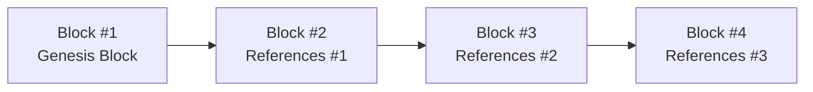

## Setting the Scene

One of my first encounters with blockchain technology involved a friend excitedly telling me how he had just “mined” some cryptocurrency. At the time, I just nodded politely, secretly wondering why on earth people would “mine” something that wasn’t glittering gold or iron ore, and how that could possibly be relevant to professional investing. Eventually, I discovered that this “mining” was tied to a network of computers agreeing on which transactions to recognize—an entire ecosystem built on trustless collaboration, or so it claimed. Ever since, I’ve been fascinated by how this technology might reshape financial markets, offer new ways of storing and transferring value, and, importantly, create alternative investment opportunities.

Below, we break down the essential characteristics of blockchain technology and broader distributed ledger technology (DLT). While this discussion touches on many new concepts, we’ll keep things slightly informal and manageable, with references to earlier Chapters and how blockchain intersects with other alternative investments. You’ll also see that a lot of the hype around blockchains is well-grounded in truly innovative features—like immutability and transparency—but that crucial obstacles remain, such as scalability and regulatory uncertainty.

## Understanding the Basics of DLT

When we say “blockchain,” we typically mean a specific type of distributed ledger that structures data into consecutive blocks, each referencing the one before it. A distributed ledger, on the other hand, is any shared database updated by a network of participants (or nodes) rather than a single, central authority. The point is to synchronize the data so that each participant holds and validates the same copy of the ledger.

What’s the big deal with ditching a central authority? Traditional finance often hinges on a single point of trust—think of banks or clearinghouses that settle transactions. Distrust or mismanagement at these nodes can cause disruptions, from system outages to security breaches. With distributed ledgers, multiple independent participants confirm transactions, enhancing transparency and resilience. If one node fails or acts maliciously, the remaining nodes can continue maintaining a validated ledger.

## Components of a Blockchain

The fundamental elements of a blockchain can be visualized as a chain of data blocks. Each block contains a set of transactions (e.g., payments, asset transfers, or any recorded event) and a reference—often a cryptographic hash—to the block that preceded it. Here’s a simplified flowchart:

These references create a chronological linkage, making it extremely difficult for anyone to alter historical data because you’d effectively have to re-mine or re-validate every subsequent block to hide your tampering.

### Immutability and Transparency

Immutability means once transactions are finalized and appended to the chain, you can’t just go back and rewrite them. This is due to the cryptographic hashing that ties each new block to the previous one. In an investment context, immutability can bring trust to certain processes—say, in post-trade settlement. You know that once a trade is confirmed, neither party can unilaterally alter the record.

Transparency is another big draw. In many public blockchains, all transaction data is visible to anyone who cares to look. While wallet addresses might be pseudonymous, the ability to track transactions from one account to another can be a major boon for compliance checks and for verifying real on-chain activity. This contrasts with typical centralized databases, where you often need special permissions just to see transaction histories.

## Consensus Mechanisms

Blockchains need a method to ensure the network reaches agreement on which proposed transactions form valid blocks. This is where consensus mechanisms come in.

### Proof of Work (PoW)

In a Proof of Work system (like Bitcoin’s), specialized “miners” solve cryptographic puzzles—requiring real computational power—and the first miner who finds a solution gets rewarded. PoW’s disadvantage is the enormous electricity usage, which raises sustainability concerns and can slow transaction throughput. The security, however, is robust because an attacker would need more computational power than the rest of the network combined to tamper with the ledger.

### Proof of Stake (PoS)

Proof of Stake picks validators based on how many tokens they’ve “staked,” often locking them up for a certain period. If you validate malicious transactions, you can lose some or all of your stake. In theory, this method saves energy, speeds up processing times, and aligns validators’ interests with the network’s well-being. Many newer blockchains—and even some older ones undergoing upgrades—favor PoS over PoW to reduce environmental impact and potentially increase transaction capacity.

Other mechanisms like Delegated Proof of Stake (DPoS) or Practical Byzantine Fault Tolerance (PBFT) variants exist. Each approach balances speed, decentralization, and security differently. For an investor, the consensus mechanism can influence the overall resilience of the network. A highly decentralized network with many nodes can be more resistant to manipulations, whereas smaller or less distributed networks might be more vulnerable.

## Trustless Transactions and the Absence of a Single Authority

The term “trustless” may sound a bit dramatic. It doesn’t imply you don’t trust anyone but rather that trust is distributed among many participants. No single party can unilaterally alter the ledger or block transactions. That’s kind of how the entire system remains secure and resilient. It’s somewhat similar to how in a well-structured partnership, decisions require broad consensus—nobody can just decide on their own. So if, for instance, a hedge fund is employing a blockchain-based settlement process, they’re potentially reducing their reliance on a single clearing firm. People often mention this as a major plus for risk management. When there’s no single point of failure, the risk of big catastrophic collapses is generally lower.

## Major Attributes of Blockchains

Blockchains boast a few headline characteristics:

• Immutability: Historical data can’t be changed without redoing the subsequent chain of blocks—an almost impossible task on a large public network.  
• Transparency: Transaction data is visible to network participants, which can boost accountability.  
• Security: Tampering is deterred because it requires a massive amount of resources or a majority stake in the network’s consensus mechanism.  
• Resilience: The ledger is distributed across many nodes, so if one node fails, the network continues to function.

These features attract industries beyond finance. For example, supply chain tracking is a popular use case: each time a product changes hands, you can log that on-chain, creating an auditable history that the entire network can agree upon.

## The Scalability Challenge and Layer-2 Solutions

But let’s be honest: blockchains aren’t just magical solutions with zero trade-offs. The most obvious problem is scalability—how many transactions per second can a network reliably handle without exorbitant fees or slow settlements? Public blockchains like Bitcoin and Ethereum historically faced bottlenecks as usage soared.

### Sharding

Sharding is one approach to this. The network is subdivided into multiple “shards,” each processing its own subset of transactions in parallel. You can think of it like dividing a large classroom into smaller study groups so that everyone can accomplish more in total. May sound straightforward, but it introduces complexity in how these shards communicate and maintain consensus.

### Layer-2 Networks

Layer-2 solutions sit on top of an existing blockchain (the “Layer-1”) and handle transactions off-chain before finalizing them in bulk on the main chain. Lightning Network for Bitcoin is a prime example, enabling faster micro-transactions by only occasionally communicating with the main blockchain. Similarly, Ethereum has numerous Layer-2 systems, known as “rollups,” that bundle up many transactions and post them to Ethereum as a single compressed record. The synergy of these layers can open up a future where blockchains facilitate near-instant, cheap transactions without sacrificing security—big news for those looking to integrate blockchains into real-time finance or even global payments.

## Assessing Blockchain Applications

If you’re evaluating a blockchain-based solution, here are a few issues to parse:

• Network Size and Node Distribution: A small network might be more prone to collusion or a so-called “51% attack.”  
• Governance: How are updates to the protocol decided? Is there a formal decision-making structure that might centralize power in practice?  
• Development Community: Does the project have robust developer support, or is it a ghost town? Without active development, long-term viability is questionable.  
• Security Track Record: Has the blockchain suffered successful attacks or major bugs?  
• Transaction Fees: High fees can throttle adoption. If the solution is for microtransactions, it’s worth checking if sky-high fees are likely during times of network congestion.

## Link to Alternative Investments

It might feel like we’re diving deep into the tech weeds, but blockchain-based assets—like cryptocurrencies and tokenized securities—serve as alternative investments in many portfolios nowadays. Understanding the underlying architecture is crucial if you’re evaluating whether to add a certain token or blockchain project to your alternative asset mix.

And let’s not forget real estate tokenization, which ties nicely into the Real Estate chapters of this volume. Imagine you hold fractional tokens that represent partial ownership of a commercial property. The blockchain keeps a record of each token holder, enabling peer-to-peer transfer of these real estate “shares” without requiring a centralized entity to track ownership.

## Tying It Back to the CFA Curriculum

While earlier chapters in this text discussed the fundamentals, risk-return characteristics, and operational complexities of alternative investments, blockchain technology can impact each of these areas. In Chapter 1 (Foundations of Alternative Investments), you learned about how alternative assets often rely on specialized structures and minimal correlation with traditional markets. Blockchain-based assets sometimes reflect these same features. Yet, they come with an added layer of technology risk, regulatory ambiguity, and unique liquidity considerations.

From a performance measurement perspective (see Chapter 2), blockchains’ continuous price feed offers data that might or might not be fully transparent. On the one hand, you can see every on-chain transaction. On the other, if the market itself for certain tokens is illiquid or manipulated, your risk measures can be skewed. For a portfolio manager, that calls for an extra dash of caution when including digital assets in your overall allocation.

## Practical Examples and Case Studies

• A Private Equity Fund Using a Permissioned Blockchain: Imagine a private equity group that invests in small local businesses. Instead of normal, manual record-keeping, they store shares and transaction data on a permissioned blockchain. This can enhance transparency among the limited partners (LPs) while reducing the administrative overhead.  
• Tokenized Mining Allocation: Consider a hedge fund that invests in energy-intensive proof-of-work mining. They might issue tokens granting fractional claims on the mining firm’s profits. The underlying ledger ensures that all token holders see exactly how much was mined and how the proceeds are allocated.  
• Mortgage-Backed Tokens: Real estate fund managers might structure mortgage-backed securities as tokens; each token has partial claim to the interest and principal repayments. Because everything’s on-chain, you could theoretically track your slice of the yield in real time.  

In each instance, the presence of blockchain technology aims to reduce overhead, increase transparency, and potentially expand the investor base by allowing fractional ownership or more fluid trading.

## Potential Risks and Considerations

Even as we celebrate the security virtues of a well-distributed ledger, it’s prudent to remember possible pitfalls:

• Regulatory Overhang: We’ll see more about this in subsequent sections (particularly Chapter 7.3), but legal definitions of tokens and blockchains vary widely across jurisdictions.  
• Governance Wars: Many public blockchains have faced contentious hard forks (where a blockchain splits into two), leading to fractured communities and value disputes.  
• Maintenance Costs: Running a blockchain network can be costly—either in electricity (PoW) or in the complexities of node operation (PoS).  
• Centralized Nodes: Some blockchains are “decentralized” in name only, with a handful of entities effectively controlling consensus.

Moreover, consider the consumer-protection aspect. If you lose your private key, you may be out of luck. The “no central authority” advantage can also be a disadvantage for less tech-savvy users—there’s nobody to call to restore your credentials if you misplace them.

## Tips for the CFA Exam

Often, exam questions will test your understanding of how blockchain technology differs from centralized systems in terms of security, immutability, and potential use cases for investors. You might see item sets asking you to identify which scenario “best fits the decentralized ledger model” or how certain consensus mechanisms influence transaction finality. In essay questions, be prepared to discuss both the upsides (e.g., transparency, resilience) and the trade-offs (e.g., high energy usage for PoW, scaling complexities, or liquidity issues). Approach these scenario-based prompts by:

• Clearly defining the relevant concept (e.g., “Proof of Work is a consensus protocol that relies on computational puzzles…”).  
• Identifying the potential advantages for an investment fund adopting that technology.  
• Addressing any relevant regulatory or risk concerns.  

Time management is crucial: you don’t want to spend too long explaining the backstory of cryptographic functions. Focus on how those mechanics translate to real-world advantages or disadvantages for an investor or a firm.

## Conclusion and Observations

Blockchain technology and distributed ledgers hold immense promise—from revolutionizing supply chains to powering new forms of alternative investments (like tokenized real estate or digital hedge funds). Yet, the technology still faces growing pains, especially around scalability, regulation, and user education. It’s a field still very much in flux. For aspiring financial professionals and current CFA candidates, a working knowledge of how these ledgers operate is becoming just as essential as understanding bond duration or equity valuation methods.

Being able to factor in the unique risk profiles, performance metrics, and operational considerations of blockchain-driven investment products is key. The overall direction is fairly clear: as these technologies mature, so does their potential to reshape what we traditionally view as “alternative” investments and perhaps eventually just “investments.”

---

## References and Further Reading

• Daniel Drescher, “Blockchain Basics.”  
• Imran Bashir, “Mastering Blockchain” (Packt Publishing).  
• Satoshi Nakamoto, “Bitcoin: A Peer-to-Peer Electronic Cash System.” Available at: https://bitcoin.org/bitcoin.pdf  
• CFA Institute Standards of Practice Handbook.  
• For extended background on blockchain governance, see resources like the Ethereum Improvement Proposals (EIPs) or on-chain governance frameworks for projects such as Tezos, Polkadot, and Cardano.  

---

## Mastering Blockchain Technology and Distributed Ledgers: Practice Questions



### Which characteristic of blockchain ensures that once a transaction is recorded, it is nearly impossible to alter it without detection?

- [x] Immutability
- [ ] Scalability
- [ ] Liquidity
- [ ] Roll-up efficiency

> **Explanation:** Immutability arises from the cryptographic linking of blocks. Attempting to change one block often necessitates redoing the entire chain of subsequent blocks, making tampering highly impractical.

### In a Proof of Work blockchain, what resource is primarily expended by miners when competing to validate blocks?

- [ ] Tokens staked as collateral
- [x] Computational (electricity) power
- [ ] Network bandwidth
- [ ] Database storage

> **Explanation:** Proof of Work requires miners to solve cryptographic puzzles that demand significant computational and hence electrical power. This requirement provides security against malicious actors but is often criticized for its energy intensity.

### What is the primary purpose of a consensus mechanism in a blockchain network?

- [ ] To speed up transaction verification using off-chain systems
- [x] To ensure all nodes agree on the validity and order of transactions
- [ ] To incinerate tokens and reduce supply
- [ ] To allow for zero regulatory oversight

> **Explanation:** The consensus mechanism ensures nodes reach a consistent view of the ledger, preventing double-spending and fraudulent transactions by requiring network-wide agreement.

### How does a Layer-2 solution, such as the Lightning Network on Bitcoin, generally aim to improve the blockchain?

- [ ] By removing the need for a consensus mechanism on the main chain
- [x] By enabling faster and cheaper off-chain transactions that are later settled on the main chain
- [ ] By replacing PoW mining with PoS staking
- [ ] By creating an entirely separate blockchain that never communicates with the main chain

> **Explanation:** Layer-2 solutions bundle or process transactions off-chain, reducing congestion and fees on the main chain while ultimately relying on the main chain’s security for settlement.

### Which of the following best describes sharding in the blockchain context?

- [ ] Regularly scattering blocks across different networks to promote decentralization
- [x] Dividing the network into smaller partitions, each capable of handling a subset of transactions
- [ ] Burning a portion of transaction fees in each block
- [ ] Switching between PoW and PoS blocks for error correction

> **Explanation:** Sharding breaks a large blockchain into multiple “shards,” allowing parallel transaction processing to increase total throughput.

### From a portfolio manager’s perspective, which factor is a key consideration when evaluating a new blockchain platform for potential investment?

- [x] Development community engagement and network updates
- [ ] The physical location of all mining rigs
- [ ] The price of gold at time of promoter’s launch
- [ ] The average height of the validator operators

> **Explanation:** A vibrant and active developer community typically indicates strong support, ongoing improvements, and enhanced long-term viability. This adds to the reliability of the protocol.

### One major drawback of highly decentralized Proof of Work networks (like Bitcoin) is:

- [ ] Immutability
- [ ] High security
- [x] Energy consumption
- [ ] Transparency

> **Explanation:** Proof of Work consumes significant computing power and electricity, which is a salient criticism of this approach.

### When might a public, permissionless blockchain be less appropriate for certain types of alternative investments?

- [x] When privacy and confidentiality of transaction data are paramount
- [ ] When many competing miners are desired
- [ ] When verifying the network’s ledger is of low priority
- [ ] When the network has no need for a consensus mechanism

> **Explanation:** Public, permissionless blockchains make transaction data widely visible. Sensitive deals or confidential transactions may require permissioned or private blockchains with specialized access controls.

### A “51% attack” refers to:

- [x] A situation where a single entity controls the majority of a network’s mining or staking power
- [ ] An off-chain solution that processes more than half the transactions
- [ ] Any glitch causing blocks to appear half-filled
- [ ] A stablecoin losing more than half its backing

> **Explanation:** If an entity has more than 50% of the hashing or staking power, it can theoretically rewrite transactions, perform double-spends, or exclude new transactions, compromising network integrity.

### True or False: A consensus mechanism such as PoS (Proof of Stake) replaces the need for distributed validation by allowing a central authority to select block producers.

- [ ] True
- [x] False

> **Explanation:** In PoS, validation is still distributed among many participants who have staked tokens. It is not centralized—rather, block creation rights are algorithmically assigned based on stake.


