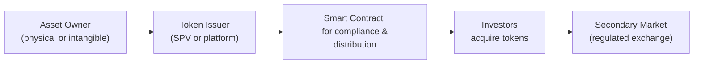

## Introduction
If you've ever thought, “Hey, I wish I could own just a tiny piece of a Picasso painting—like a share of it!” then asset-backed tokens are probably the closest thing to a dream come true. They're basically digital representations of real-world assets (could be fine art, real estate, gold bars, or even a stake in a private company), all wrapped neatly in a cryptographic token on a blockchain. No more fumbling with paper certificates, or at least that’s the idea.

In a nutshell, asset-backed tokens and digital securities take traditional assets and place them on a distributed ledger, granting holders certain rights—like ownership claims, income streams, or even governance. And I'm telling you, as exciting as it all sounds, it’s also a minefield of regulations, operational complexities, and technology challenges. So let’s dig in, piece by piece, to figure out how these tokenized structures can transform the way we invest, diversify, and manage risk in our portfolios.

## Key Concepts
### What are Asset-Backed Tokens?
An asset-backed token is a cryptographic token that derives its value from an underlying asset. This might be a single commodity (like gold), a whole property, or even multiple assets pooled together. The central point is that each token should—ideally—be redeemed or exchanged for the asset it’s tied to, or at least it should confer some claim on that asset. 

From a valuation perspective, imagine you have an asset \\( A \\) with a fair market value of \\( V \\). If you decide to tokenize \\( A \\) into \\( n \\) tokens, then a single token’s “theoretical” price, ignoring issuance fees or investor sentiment, is:


\text{Token Price}(t) = \frac{\text{Fair Value of Underlying}(t)}{\text{Total Tokens in Circulation}}.


So if your asset is a \$1,000,000 building and you have 100,000 tokens outstanding, each token might trade at around \$10, at least in some frictionless, ideal market scenario.

### Digital Securities (Security Tokens)
When the token grants specific ownership or profit-sharing rights, or it falls under securities laws, it’s often referred to as a “security token.” Essentially, a security token is a digital embodiment of an investment contract. Whether we’re talking about equity tokens that represent fractional shares in a company, or debt tokens providing an interest stream, you’ve got to comply with the local regulators—like the SEC in the United States or the FCA in the UK.

Smart contracts can automate a bunch of these compliance tasks. Instead of shuffling physical documents around, the blockchain can restrict which addresses can hold the token (to satisfy investor accreditation rules), automatically issue periodic dividend payouts in stablecoins, and handle “whitelisting” or “blacklisting” addresses. That’s a big part of why everyone (myself included) got excited about these tokens in the first place—it’s like having a corporate transfer agent built into the code.

### Fractional Ownership and Accessibility
One of the most powerful ideas behind asset-backed tokens is fractional ownership. Often, you and I might not have the funds to go buy a \$1,000,000 building, but we can buy a handful of tokens representing partial ownership in it. This concept of fractionalization lowers the barrier to entry, allowing smaller investors to access previously unattainable markets. If you combine that with a global, internet-based platform, you start to see how tokenization could theoretically drive liquidity and bring new participants into the market.

Think about farmland: Some farmland tokens let you own a slice of agricultural real estate—and sometimes even share in the revenue from the crops produced. Before tokenization, such ownership was usually out of reach for most individuals because of massive capital requirements and the complexity of farmland management. It’s that accessibility factor that’s so compelling.

## Process and Implementation
### How the Tokenization Process Works
The tokenization of an asset often begins when a sponsor (also called an issuer) sets up a special purpose vehicle (SPV) or legal entity—this is to ensure that the real-world asset is ring-fenced from other liabilities. The sponsor then mints digital tokens on a blockchain network (it might be Ethereum or a private permissioned ledger, depending on regulatory constraints). Each token has a documented claim or legal right to the underlying asset.

Below is a simple flowchart illustrating this workflow:

At each step, compliance checks are integrated. Smart contracts can be coded to verify an investor’s accredited status (per standard regulations like Reg D in the U.S.) or automatically enforce lockup periods, preventing transfers until certain conditions are met.

### Custody, Verification, and Security
A legitimate backup for asset-backed tokens must exist in the real world. That means robust verification procedures to confirm that the token indeed corresponds to an actual asset. Custodians, appraisers, trustees, or specialized verifiers often fill this role. 

For physical assets (like precious metals), custodians store the asset in a secure vault. For intangible assets (like equity in a private firm), corporate documents or legal frameworks govern how asset ownership is recognized. The blockchain track-record is only as strong as the off-chain verification. If that data’s corrupt or the documents aren’t enforceable, the tokens might be worthless—no matter how clever the smart contract is.

In some setups, hybrid models combine traditional centralized records (e.g., a standard corporate share ledger) with blockchain-based tokens, ensuring that both old-school regulators and new-school tech folks remain happy. This can appease big financial institutions that want the benefits of tokenization (like faster settlement and global distribution) without discarding the established legal structures.

## Regulatory and Compliance Aspects
### Navigating Securities Laws
Digital securities are subject to existing securities legislation. If you’re developing one in the U.S., for instance, you might rely on exemptions like Regulation D (Reg D) for private offerings or Regulation A+ for mini public offerings. The token’s status, whether it needs to be restricted to accredited investors, how long it must remain locked up—these details are critical for structuring a compliant offering.

Moreover, when these tokens trade on secondary markets, each trade must also comply with transfer restrictions, especially if we’re dealing with foreign investors or cross-border transactions. The code in the smart contract helps, but it isn’t a silver bullet—platforms still need to gather identity documentation (KYC/AML checks) so they can enforce security regulations.

### Investor Accreditation and Disclosure
Security tokens typically require that each buyer is an accredited or qualified investor (depending on the jurisdiction). Platforms accomplish this by verifying an investor’s status (via documentation of assets, income, or professional experience). When we say “accredited investor,” the definition itself might vary from one country to another, but the spirit is the same: protect less sophisticated participants from high-risk or complex investments.

Disclosure requirements also apply. Potential investors need to receive the same kind of information they would expect in a traditional securities offering: financial statements, risk disclosures, offering memoranda, and details on how the tokens function. Smart contract code might even incorporate disclaimers and risk warnings that appear on a user’s screen before they proceed with a purchase.

## Challenges, Risks, and Liquidity
### Liquidity Riddles
While the promise of real-time settlement with fewer intermediaries is exciting, true liquidity depends on having enough buyers and sellers. A tokenized property might sound awesome, but if the market is so niche that nobody’s trading, your “liquid” token is effectively stuck. 

Regulated secondary markets are crucial. Many security token exchanges have launched, but adoption can be slow. They need approvals from financial authorities, robust trading infrastructure, and a steady audience of active investors. Some tokens trade only among private clubs of accredited investors where liquidity can be sporadic.

### Fraud, Hype, and Over-Promises
Like everything in the crypto world, asset-backed tokens have seen their share of questionable projects—where the claimed underlying assets either don’t exist or are massively overvalued. It’s why independent verification and frequent asset audits are vital. If you’re buying tokens that supposedly give you ownership of prime commercial real estate, you want to know that building actually exists—and that the ownership documents are legally bulletproof.  

And, well, it’s not uncommon for hype to outpace the actual technology or business model. Shiny marketing brochures might emphasize fractional ownership and “guaranteed returns,” but the story can unravel if the sponsor lacks experience. Always read the disclaimers. Always ask for external appraisals. And always wonder if something’s too good to be true.

### Counterparty and Operational Risks
Blockchain technology itself might be reliable, but there are still real-world risk factors. For instance, what if the custodian (the firm physically holding the gold bars) fails or commits fraud? Or what if the issuer’s SPV runs into solvency issues? Smart contracts cannot magically fix a real-world meltdown. 

Moreover, operational failures can occur if a platform’s user interface is poorly designed, or if KYC/AML processes break, or if code updates (hard forks) cause confusion around token ownership. Proper governance and planning are key to mitigating these pitfalls.

## Practical Examples and Use Cases
### Real Estate Tokenization
Real estate is a prime candidate for tokenization. Companies have started launching fractional real estate investments where you can buy tokens that correspond to a share of a property’s ownership. This approach can open up famously illiquid markets and give investors exposure to rental yields or property appreciation without the usual burden of large down payments.

You’ll typically see a structure like this: An SPV holds the property title, issues tokens on a permissioned blockchain, and each token confers the right to a fraction of the future cash flows and capital gains. If everything goes well, owners receive token-based dividends from rental income. When the property sells, you redeem your tokens for a share of the proceeds.

### Commodity-Backed Tokens
Got gold? Then you can issue “gold-backed” tokens that purportedly link each token to, say, 1 gram of physical gold stored in a vault. Investors hold tokens as a store of value or for speculation. They might even redeem them for actual gold bars (minus shipping and handling). The benefit is faster settlement and portability, but again, you rely heavily on the custodian for physical storage and insurance.

### Tokenized Funds
Rather than buy shares in a mutual fund or ETF, some investors are looking at tokenized funds. These funds operate similarly to standard vehicles, except that investor interests are represented by digital tokens. The tokens might automatically distribute profits (or capital calls in the case of private equity structures) via smart contracts. 

In theory, tokenizing a fund might reduce administrative overhead by automating everything from compliance to performance fee calculations. Investors can also gain partial exposure if the token is subdivided. However, robust platforms remain few, and regulators are still trying to figure out the best approach to overseeing tokenized funds.

## Real-World Implementation Anecdote
A colleague of mine once tried participating in a tokenized real estate deal in Japan. They thought, “Why not add a little slice of East Asia to my portfolio?” So they bought tokens representing a fraction of an apartment building in Tokyo. The entire process, from KYC checks to finalizing the purchase, took about a week—far simpler than the typical property closing. The kicker: the monthly rental income distributions arrived as stablecoins automatically deposited into my colleague’s crypto wallet. Neat, right? But the synergy didn’t come without hiccups. One quarter, there was confusion about deducting local property taxes—leading to some frustrated messages on the investor forum. Eventually, the sponsor provided details, but it underscored that even when you’re dealing with fancy new digital infrastructure, old-school taxes and property management issues remain very real.

## Best Practices for Investors and Issuers
- Thorough Due Diligence: Verify the custodian arrangements, read (or have a professional read) the offering memorandum, and confirm the asset’s legitimacy.  
- Legal Counsel: Stay within the bounds of your jurisdiction’s securities laws. Don’t rely solely on “code-is-law” mantras.  
- Tech-Savvy Approach: Evaluate the blockchain platform and the security audits of the smart contract code.  
- Ongoing Compliance: Remember that once tokens are issued, the issuer must maintain compliance with any ongoing disclosure or investor reporting requirements.  

## Conclusion and Future Outlook
Asset-backed tokens and digital securities hold the potential to reshape markets—making them more inclusive, liquid, and efficient. At the same time, investors and issuers must carefully navigate the tricky terrain of regulatory compliance, custodial responsibilities, and technology hurdles. It’s sort of a balancing act: embrace the transparency and automation of blockchain, but keep one foot firmly planted in established legal frameworks.

From an exam perspective, be sure you fully understand how tokenization might impact liquidity and portfolio allocations. Also note key risk factors like regulatory uncertainty and the reliance on custodians or underlying sponsors. You’ll want to articulate how these instruments differ from other alternative investments (like hedge funds, real estate partnerships, or private equity), and highlight the relevance of fractional ownership, compliance automation, and potential liquidity benefits in your answers.

It’s possible that in a few years, what we call “digital securities” will just be “securities,” much the way e-commerce eventually just became “commerce.” Until then, keep an eye on how real-world adoption of asset-backed tokens evolves—and be ready to adapt your strategies accordingly.

## References
- U.S. Securities and Exchange Commission (SEC). (n.d.). Official Website. Retrieved from https://www.sec.gov/
- Tokeny. (n.d.). “Security Tokens and Stablecoins: Quick Start Guide.”  
- CFA Institute. (n.d.). CFA Institute Code of Ethics and Standards of Professional Conduct.  
- Various global financial authorities (FCA, MAS, ESMA) for guidelines on digital securities.

---

## Quiz on Asset-Backed Tokens and Digital Securities



### Which of the following best describes an asset-backed token?

- [ ] A digital token used only for governance in decentralized autonomous organizations  
- [x] A token representing a real-world asset, such as real estate or gold, on a blockchain  
- [ ] A token exclusively tied to algorithmic stablecoin reserves  
- [ ] A legacy security that does not require blockchain-based verification  

> **Explanation:** Asset-backed tokens derive their value from real-world assets. Governance tokens or stablecoins may involve different structures and purposes.

### In fractional ownership using asset-backed tokens, what is one key benefit for smaller investors?

- [ ] Unlimited leverage without regulatory oversight  
- [ ] Guaranteed returns on investments  
- [x] Accessible exposure to high-value assets with a relatively small capital outlay  
- [ ] Exemption from all standard securities regulations  

> **Explanation:** Fractional ownership allows investors to buy smaller slices of high-value assets. This opens opportunities previously available only to those with large capital.

### Why are security tokens subject to traditional securities regulations?

- [ ] Because they are guaranteed to only appreciate in value  
- [x] Because they generally confer ownership or profit-sharing rights, making them an investment contract  
- [ ] Because all tokens are always securities by default  
- [ ] Because the blockchain automatically classifies them under U.S. Fed regulations  

> **Explanation:** Security tokens meet traditional definitions of securities, granting ownership or revenue rights, and thus fall under existing regulations.

### Which function can a smart contract help automate in a digital securities offering?

- [ ] Selling unregistered securities to non-accredited investors  
- [ ] Permanently eliminating all transaction fees for investors  
- [x] Enforcing investor eligibility (accreditation) and distributing funds like dividends  
- [ ] Circumventing any KYC or AML checks  

> **Explanation:** Smart contracts can be programmed to execute compliance rules and automate tasks, such as paying dividends, while maintaining regulatory restrictions around investor eligibility.

### One major risk associated with commodity-backed tokens (e.g., gold-backed tokens) is:

- [ ] Excessive trading liquidity  
- [ ] Zero dependence on physical holdings  
- [x] Reliance on custodians or vaults to store and verify the actual commodity  
- [ ] Automatic redemption without regulatory approval  

> **Explanation:** Commodity-backed tokens require custodians to hold and verify the underlying physical commodity, exposing investors to potential counterparty or storage fraud risks.

### What is the primary reason that liquidity can be limited for asset-backed tokens?

- [ ] All established financial institutions have fully adopted these tokens already  
- [ ] T+3 settlement periods create friction in token transactions  
- [x] Thin participation in regulated secondary markets reduces active buyers and sellers  
- [ ] They are necessarily pegged to government-issued bonds  

> **Explanation:** Even if tokenization is efficient, a robust secondary market must exist for genuine liquidity—low participation leads to fewer trading opportunities.

### Which best describes a hybrid approach to tokenization?

- [ ] A system that requires no real-world documentation or validation  
- [ ] Direct issuance of tokens without any regulatory oversight  
- [ ] Replacing all existing legal frameworks with purely digital ones  
- [x] Partial reliance on traditional records (e.g., corporate ledgers) combined with blockchain-based tokens  

> **Explanation:** Many real-world cases use a hybrid model, maintaining certain traditional records while employing blockchain tokens for efficiency and compliance automation.

### In the context of real estate tokenization, what do tokens typically represent?

- [x] Fractional entitlement to the property’s ownership and income streams  
- [ ] Token holders automatically receive legal residency in the property’s country  
- [ ] A form of debt claim with no equity stake  
- [ ] An unregulated gambling license  

> **Explanation:** Real estate tokens generally grant fractional ownership of the property, often including rights to rental income and capital gains.

### What is a tokenized fund?

- [ ] An unregulated fund that only invests in meme cryptocurrencies  
- [ ] A central bank-issued stablecoin  
- [ ] A reinsurance vehicle licensed by an international insurer  
- [x] An investment vehicle whose participant shares are represented by blockchain-based tokens  

> **Explanation:** Tokenized funds operate similarly to traditional mutual funds or private equity funds, but ownership stakes are represented by digital tokens.

### True or False: Digital securities completely eliminate the need for legal contracts and traditional regulators.

- [ ] False  
- [x] True  

> **Explanation:** This might look like a trick question, but it’s “True” that this statement is false. Digital securities do NOT eliminate legal contracts or regulators. You still need formal agreements, compliance, and oversight.


