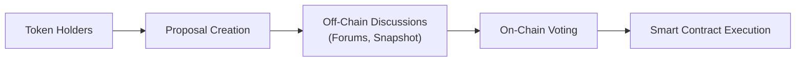

## Introduction
Governance tokens and Decentralized Autonomous Organizations (DAOs) are two primary pillars in the world of digital assets, driving community-led decision-making within blockchain protocols. If you’ve never ventured into these waters before, don’t worry—I remember when I found myself a little confused about whether I was suddenly making big “boardroom-level” calls just by owning a few governance tokens. It’s honestly quite exciting (and sometimes a bit nerve-racking) to see how a token in your digital wallet can grant you voting rights that shape the evolution of entire ecosystems. 

From a CFA perspective, governance tokens and DAOs tie closely to modern corporate governance principles, risk management, and stakeholder alignment—albeit in a radically decentralized format. This section explores the fundamentals of these tokens, the intricacies of DAOs, and how these concepts are applied in real-world scenarios, along with potential risks and ethical considerations relevant to investment professionals.

## Conceptual Overview
Blockchains introduced a trustless way to exchange value, but it quickly became evident that communities craved more than just peer-to-peer transactions. They wanted ways to make decisions together—no central authority required. Enter governance tokens: digital assets that provide holders with voting power over protocol updates, funding allocations, or even fee structures. These tokens effectively replace the centralized C-suite with a global community of participants.

At an even higher level, DAOs aim to automate and codify much of the typical organizational structure—replacing hierarchical management with a transparent system of proposals and votes. Anyone who holds the governance token can shape outcomes. This can include determining strategic directions, setting operational budgets, or even selecting third-party service providers.

## Governance Token Mechanics
Governance tokens differ from utility tokens or payment tokens in that their central raison d’être is to give a voice to those who own them. In principle, each token corresponds to one “vote,” but the voting mechanism can be more nuanced than a simple one-token-one-vote. Some protocols implement multipliers or consider token lock-up periods to assign greater or lesser weight to certain holders. 

In formula form, you might see something like:


\text{Voting Power} = \sum_{i=1}^{n} \left( \text{Token Holdings}_i \times \text{Voting Multiplier}_i \right)


Where:
• Token Holdingsᵢ = Number of governance tokens held by participant i.  
• Voting Multiplierᵢ = Additional weight assigned based on lock-up duration or historical contributions.  

While that looks tidy in theory, even the best on-chain voting process can experience low turnout (voter apathy) and potential centralization if the majority of tokens reside with a small group of whales (large holders).

## Decentralized Autonomous Organizations
When governance tokens come together around a shared objective—like funding open-source initiatives or maintaining a DeFi platform—we refer to that community as a Decentralized Autonomous Organization (DAO). “Autonomous” captures the notion that smart contracts automatically enforce rules and execute proposals once voting thresholds are met, removing reliance on a single executive team.

In many DAOs, there is a blending of on-chain and off-chain processes:
- On-chain voting: Actual proposals and their outcomes get immutably recorded on the blockchain. Once a proposal passes, smart contracts can automatically move funds or enact protocol upgrades.  
- Off-chain voting: Discussions happen on forums like Discourse or community calls. There might be “snapshot” votes using off-chain tools to gauge sentiment before proceeding on-chain.

### The DAO Life Cycle
Some DAOs are short-lived, established for a single purpose (e.g., an NFT fractionalized ownership group). Others evolve into long-term structures resembling decentralized corporations. They can manage treasuries worth millions (or billions) of dollars in crypto assets, fund research and development, and distribute yields to token holders.

## Key Governance Considerations
### Voter Apathy
One of the biggest obstacles to effective decentralized governance is plain old human nature. People either don’t have the time or don’t feel the urgency to vote. In extreme cases, a handful of active, wealthy token holders end up controlling decisions. This phenomenon is often addressed by:
- Requiring minimum quorum thresholds.  
- Using delegation systems, where users can assign votes to representatives.  
- Incentivizing voting participation through token rewards.

### Governance Centralization
Ironically, a DAO can become more centralized than a traditional corporation if most tokens are concentrated in a few wallets. Analysts and portfolio managers need to investigate token distribution patterns and watch out for red flags like founder or venture capital overconcentration.

### Legal Uncertainty
From a regulatory standpoint, DAOs exist in an awkward gray zone. Different jurisdictions are testing solutions—like Wyoming’s DAO LLC law in the United States—but there’s still a long way to go before we have consistent global frameworks. For CFA exam-related questions, expect analysis around the legal complexities of cross-border operations, potential liability for token holders, and the regulatory classification of governance tokens (particularly regarding securities laws).

## Token Distribution
Distribution is key. Some DAOs try to ensure wide distribution via “airdrops” to early users, or by awarding tokens for specific contributions to the ecosystem. Others reward liquidity providers in yield farming strategies with governance tokens. This structure can significantly impact the DAO’s decision-making dynamics. 

In a typical scenario:
- Early Stage: Founders and initial investors hold large stakes.  
- Growth Stage: Community members earn tokens by providing liquidity or completing tasks.  
- Mature Stage: Tokens become widely dispersed, hopefully encouraging democratic governance.

## Risk Management and Portfolio Integration
From a portfolio management perspective, governance tokens and DAOs present unique opportunities—to gain exposure to decentralized ecosystems—and unique risks:
- **Volatility**: Governance tokens can experience dramatic price swings.  
- **Regulatory Risk**: Ongoing crackdowns or evolving legislation can quickly alter investment viability.  
- **Liquidity Risk**: Many governance tokens trade on decentralized exchanges with limited depth, especially outside of mainstream protocols.  
- **Operational Risk**: If a DAO’s smart contract is exploited or if proposals are poorly managed, the project can lose funds, damaging token value.

For exam purposes, it’s helpful to remember that governance tokens often behave more like equity in a startup than a stable, yield-oriented investment. Risk management techniques—like position sizing, setting stop-loss orders, or using derivatives—can help mitigate downside but must be carefully sized according to the investor’s strategy and risk tolerance.

## Real-World Examples
### Decentralized Venture Funds
DAOs like The LAO or MetaCartel Ventures pool assets from token holders to invest in blockchain startups. Token holders collectively vote on which projects merit an investment, often using specialized legal wrappers to comply with certain regulations. 

### Open-Source Protocol Funding
Protocols such as Ethereum Name Service (ENS) or Gitcoin utilize governance tokens to direct the flow of grants to open-source contributors. In these cases, the community is literally funding developers who expand the ecosystem.

### Community-Driven Platforms
Platforms like Decentraland let their token holders vote on what virtual infrastructure or experiences the protocol should support. This fosters a sense of ownership and direct influence on the platform’s next evolution.

## Visualizing a DAO Governance Process



In this diagram:
• Token holders take the initial step by creating proposals.  
• Some off-chain deliberation follows on community forums (B → C).  
• Ultimately, a formal on-chain vote occurs (C → D).  
• If the vote passes, smart contracts automatically carry out the decision (D → E).  

## A Quick Python Example
You might be curious how investors can track or interact with a DAO’s on-chain data. Below is a simple (though quite minimal) Python snippet showing a hypothetical approach. It uses a fictional “DAO Governance” contract address, demonstrating how to read the total number of proposals from a smart contract.

```python
from web3 import Web3

infura_url = "https://mainnet.infura.io/v3/YOUR_PROJECT_ID"
web3 = Web3(Web3.HTTPProvider(infura_url))

dao_contract_address = "0xABCDEF0123456789ABCDEF0123456789ABCDEF01"
dao_contract_abi = '[{"constant":true,"inputs":[],"name":"proposalCount","outputs":[{"name":"","type":"uint256"}], ... }]'

dao_contract = web3.eth.contract(address=dao_contract_address, abi=dao_contract_abi)
proposal_count = dao_contract.functions.proposalCount().call()

print(f"Total proposals: {proposal_count}")
```

Of course, this is just a toy example. Real interactions often involve reading the details of each proposal, tracking voting outcomes, analyzing token distribution, or even participating programmatically in votes.

## Potential Exam Pitfalls and Key Takeaways
- **Overlooking Token Concentration**: If you fail to account for how a few large holders could sway governance votes, you might incorrectly treat the DAO as truly decentralized.  
- **Ignoring Legal Frameworks**: Many candidates forget that DAOs might trigger unregistered securities issues, or they might fail to comply with corporate governance laws.  
- **Conflicts of Interest and Ethics**: As a CFA charterholder, you should ensure disclosures around your personal holdings in governance tokens. The spirit of the CFA Institute Code of Ethics and Standards of Professional Conduct applies just as much in decentralized domains as in traditional finance.  
- **Inadequate Risk Assessment**: Don’t assume stable returns from governance tokens. They can be extremely volatile and carry nuanced operational and compliance risks.

To succeed on the exam, be ready to evaluate a DAO’s governance structures, discuss how on-chain/off-chain voting works, and identify potential pitfalls in token concentration. You may also be asked to integrate these insights into broader asset allocation or risk management frameworks.

## Conclusion
Governance tokens and DAOs represent a paradigm shift in how individuals collaborate, vote on proposals, and share in the economic rewards of a protocol. They’re also a cautionary tale for anyone who blindly assumes “decentralized” means “perfectly fair and democratic.” As with all investments, thorough due diligence is essential—including an understanding of token economics, voter participation, regulatory uncertainties, and potential conflicts of interest. 

At the CFA Level III (and beyond), keep these factors in mind: how governance tokens integrate into a diversified portfolio, how they might correlate with other asset classes, and the ways regulatory frameworks could impact their viability. With the right analysis, governance tokens and DAOs can be a fascinating addition to an alternative investment strategy.

## References
- Aragon Project: https://aragon.org/  
- Snapshot Governance Tool Docs: https://docs.snapshot.org/  
- Wyoming DAO Legislation (Informational): https://wyoleg.gov/  
- The LAO: https://www.thelao.io/  
- Gitcoin: https://gitcoin.co/  

Remember, each protocol is unique—so if you’re navigating the DAO sphere, explore the technical documentation, community forums, and track how decisions actually get executed. It’s an exhilarating realm, and informed analysis will help you tailor strategies that align with the CFA Charter’s ethical and professional standards.

## Governance Tokens and DAOs: 10 Exam-Style Questions



### Which of the following best describes a core function of governance tokens?

- [ ] They are stable digital assets designed to reduce volatility.  
- [ ] They act exclusively as tokenized securities under all regulatory frameworks.  
- [x] They grant holders the right to participate in proposals and voting.  
- [ ] They automatically generate passive income without user interaction.  

> **Explanation:** Governance tokens fundamentally enable holders to shape protocol decisions through voting and proposals, rather than guaranteeing price stability or automatically generating income.

### In the context of a DAO, what is the primary advantage of on-chain voting?

- [x] Offers transparent, tamper-proof proposal outcomes.  
- [ ] Encourages centralized decision-making by a small group of managers.  
- [ ] Eliminates the need to record any transactions on the blockchain.  
- [ ] Restricts the flow of funds even after a proposal is approved.  

> **Explanation:** On-chain voting leverages blockchain technology, ensuring all records are immutable and transparent. This stands in contrast to off-chain forums, which might be more subjective or less provable.

### One major risk associated with DAOs is “token holder apathy.” Which scenario best illustrates this?

- [ ] All token holders vote on every proposal presented.  
- [ ] Token holders over-participate, leading to rapid decision-making.  
- [x] Few token holders actually cast votes, allowing large holders to dominate proposals.  
- [ ] Regulators strictly limit the creation of any new governance tokens.  

> **Explanation:** Token holder apathy refers to low participation rates, which can allow large token holders (sometimes referred to as “whales”) to singlehandedly determine outcomes.

### Why should investors be cautious if the majority of governance tokens are concentrated among a small group?

- [ ] It decreases the likelihood of corporate taxes applying.  
- [x] It undermines decentralization and could centralize voting power.  
- [ ] It guarantees higher voter turnout and more robust governance processes.  
- [ ] It simplifies compliance requirements for the entire DAO.  

> **Explanation:** When a small group holds a large portion of the tokens, that group can dominate all voting processes, reducing the system’s intended decentralization.

### When analyzing DAOs, which factor is most relevant to a CFA charterholder under the Code of Ethics and Standards of Professional Conduct?

- [x] Conflicts of interest and fair disclosure regarding personal token holdings.  
- [ ] Monitoring the historical real estate market performance in the DAO’s country of origin.  
- [ ] Ensuring that no individual invests more than 10% of their personal net worth.  
- [ ] Verifying that all members hold standardized professional certifications.  

> **Explanation:** Under the CFA Institute Code and Standards, disclosing personal interests (e.g., large token holdings) is essential to maintaining objectivity and avoiding conflicts of interest.

### A newly formed DAO requires a minimum of 40% of total tokens in voting to validate a proposal. This requirement is known as:

- [ ] Governance synergy.  
- [ ] Off-chain threshold.  
- [ ] Voting bonus ratio.  
- [x] Quorum.  

> **Explanation:** The quorum defines the minimum participation needed in a vote so that decisions reflect a sufficiently representative sample of all token holders.

### Which statement accurately captures the legal risk surrounding DAOs?

- [x] DAOs currently occupy a gray area in many jurisdictions with inconsistent legal frameworks.  
- [ ] Every jurisdiction recognizes DAOs as fully legal corporations with uniform standards.  
- [ ] DAOs face no known legal challenges or uncertainties.  
- [ ] Only European regulatory bodies view DAO governance tokens as illegal securities.  

> **Explanation:** DAOs face evolving and varied legal treatment across the globe. Some jurisdictions like Wyoming have frameworks, but broader uncertainty remains.

### A DAO structure often uses a blend of on-chain and off-chain voting. Off-chain voting:

- [x] Occurs on forums or platforms like Snapshot to gauge sentiment before final on-chain votes.  
- [ ] Happens only in person at centralized shareholder meetings.  
- [ ] Is not permissible under any circumstances for decentralized protocols.  
- [ ] Automatically executes the proposal without blockchain transaction.  

> **Explanation:** Off-chain voting typically serves as a discussion or “temperature check” among participants. It’s a precursor to formal, binding on-chain votes.

### Which factor is most likely to increase the risk of governance centralization in a DAO?

- [x] Venture capital firms acquiring a large portion of the governance tokens.  
- [ ] High levels of community forum engagement across many stakeholders.  
- [ ] Distribution of tokens through free airdrops to smaller users.  
- [ ] Locking tokens for a specific period to prevent immediate resale.  

> **Explanation:** When a small group, such as a venture capital firm, holds a large share of tokens, it can significantly sway or dominate governance proposals.

### True or false: A DAO’s reliance on token-based voting effectively guarantees perfect democracy and transparency.

- [ ] True  
- [x] False  

> **Explanation:** While token-based voting can enhance transparency, issues like token holder apathy, whale concentration, and off-chain governance dynamics can compromise the system’s democratic ideals.


