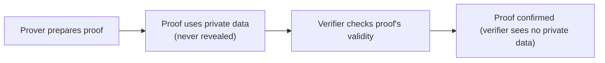
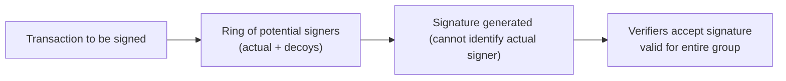

## Introduction

Cryptography is at the heart of digital asset security, and it shapes how we transact, store value, and protect our identities in blockchain-based systems. Without robust cryptographic safeguards, the entire space of decentralized finance (DeFi) and digital assets could collapse under risks like data interception, malicious attacks, or privacy breaches. But with the wave of advanced techniques such as elliptic curve cryptography, zero-knowledge proofs, ring signatures, and stealth addresses, users now have more tools than ever to protect their on-chain activity. And you know what? It can be a bit overwhelming when you first realize how many layers of cryptography are happening behind the scenes. I still recall my initial fascination—and truthfully, a bit of intimidation—when I tried to wrap my head around zero-knowledge proofs. It felt like pure wizardry.

This reading explores advanced cryptographic methods and the unique world of privacy tokens. We’ll talk about how these techniques work, why they’re relevant to the growing digital asset landscape, and what sorts of challenges or controversies they trigger in regulatory and compliance realms. Ultimately, advanced cryptography underpins both the promise and the ambiguities of privacy-focused digital assets, making them a hot topic for regulators, investors, and developers alike.

## Elliptic Curve Cryptography (ECC)

Elliptic Curve Cryptography (ECC) has become something of a gold standard for securing transactions in blockchain networks—most famously, Bitcoin. ECC allows for shorter key lengths compared to more traditional systems like RSA, yet still achieves strong levels of security. Concretely, smaller keys can reduce computational overhead, making ECC particularly attractive in resource-constrained environments (think mobile devices or IoT sensors). 

At its core, ECC leverages the algebraic structure of elliptic curves over finite fields. If you compare “classic” cryptographic schemes to a big locked safe, ECC is like a smaller but equally sturdy safe that’s easier to carry around. Mathematically:

Using an elliptic curve E defined by an equation such as  
(1)  y^2 = x^3 + ax + b  (mod p),  

a private key is essentially a randomly chosen number d, and the corresponding public key is a point on the curve Q = d × G, where G is a generator point on E. Because of something called the “discrete logarithm problem,” it’s extremely difficult (effectively impossible for large enough p) to derive d from Q. That’s why we can publish Q openly as the public key.

Here’s a quick minimal Python snippet demonstrating the generation of ECC keys (using a popular library, just to illustrate the concept):

```python
import secrets
from ecdsa import SigningKey, SECP256k1

private_key = SigningKey.generate(curve=SECP256k1)
print("Private key:", private_key.to_string().hex())

public_key = private_key.get_verifying_key()
print("Public key:", public_key.to_string("uncompressed").hex())
```

In practice, this is done under the hood by nearly all major cryptocurrencies. If you’re analyzing or auditing private key generation events, you should keep an eye on how randomness is generated—weak randomness is a giant red flag in cryptography.

## Zero-Knowledge Proofs (ZKPs)

You might be wondering: how do I prove I know something without revealing what it is? That’s the fundamental question behind zero-knowledge proofs (ZKPs). Initially, understanding ZKPs can feel like a mental puzzle, almost like a party trick. But ZKPs are actually quite powerful—enabling blockchains to validate transactions or knowledge claims without exposing the underlying data. 

### The Magic of ZK-SNARKs

One popular form of ZKPs is called a zk-SNARK (Zero-Knowledge Succinct Non-Interactive Argument of Knowledge). A zk-SNARK system allows a “prover” to demonstrate knowledge of, say, a transaction input or a password, while revealing nothing about that input to a “verifier.” All of this happens non-interactively, which means you don’t need multiple rounds of communication. This succinctness and efficiency are key reasons zk-SNARKs have captured the imagination of crypto developers and even mainstream businesses.

Below is a simplistic mermaid diagram illustrating how a zero-knowledge validation might flow. Note how no sensitive data is ever exposed:



For example, in the Zcash protocol, zk-SNARKs help hide the sender, recipient, and amount fields in a transaction. That’s powerful, but it can also be controversial in regulatory circles, especially if authorities suspect that criminals are exploiting that privacy. 

## Homomorphic Encryption

Homomorphic encryption might just be next-level cryptography—it lets you perform calculations on encrypted data without decrypting it first. So, if you’ve got sensitive financial data stored or in transit, and you want to run certain analytics, you don’t necessarily need to unencrypt that data in order to get your results. 

While fully homomorphic encryption can be resource-intensive and still somewhat in the research or pilot phase, partial (or somewhat) homomorphic encryption is already in limited production. In digital asset contexts, homomorphic encryption can facilitate things like confidential portfolio rebalancing or verifying trades without revealing sensitive details about the portfolio. For instance, a large custodian might want to show a prospective client that they’re meeting certain risk metrics without revealing details about all individual asset holdings.

## Privacy Tokens: Ring Signatures, Stealth Addresses, and Beyond

Privacy coins (sometimes called anonymity-enhanced cryptocurrencies, or AECs) like Monero and Zcash combine advanced cryptographic tools to obscure transaction details (sender identity, recipient identity, or amounts) from prying eyes. 

### Ring Signatures

A ring signature is a nifty way to conceal which member of a group signs a transaction. Imagine a group of possible signers. One of them actually signs a message, but you can’t tell who in that group did it—this is similar to wearing matching uniforms so no single individual stands out. Monero employs ring signatures to mix a sender’s input with several decoy inputs, thus hiding who initiated the transaction.

Let’s illustrate ring signatures in a mermaid diagram:



And let’s be honest, ring signatures can be both exciting for folks who love privacy—like me—and maybe nerve-wracking for regulators. After all, if you can’t pinpoint the signer, how do you enforce AML policies?

### Stealth Addresses

Another hallmark of privacy coins is stealth addresses, which generate a one-time address for each transaction. If you’re the intended recipient, you can still prove you own that address, but outside observers have no clue which specific address belongs to you. 

For instance, suppose you want to receive funds from multiple payers without exposing that all those funds go to the same wallet. Stealth addresses let you break the “watch trail.” Perfect if you love anonymity or if you’re just protecting your competitor-sensitive business transactions, but it’s also a headache for authorities who rely on chain analysis to track illicit activity.

## Regulatory and Compliance Challenges

The advanced privacy features offered by coins like Monero, Zcash, and (in some configurations) Ethereum-based zk-rollups can be a double-edged sword:

- **Legitimate Use-Cases:** Corporate confidentiality, personal privacy, protecting trade secrets, or simply not wanting the world to see all your financial flows.  
- **Illicit Concerns:** Money laundering, terrorism financing, tax evasion, or hiding large-scale fraud.  

Financial regulators worldwide are grappling with how to handle these assets. Some jurisdictions have banned privacy coins outright—citing the inability to identify parties to a transaction—as a major risk to Anti-Money Laundering (AML) frameworks. Others permit usage but enforce strict disclosure obligations on exchanges offering these tokens for trading.

As an analyst or portfolio manager following these assets, keep an eye on evolving global AML directives, the Financial Action Task Force (FATF) guidance, and local licensing requirements. As soon as a major jurisdiction decides to clamp down on privacy coins, liquidity can dry up (or shift to less regulated venues), potentially harming valuations significantly.

## Balancing Privacy, Compliance, and Convenience

It’s no secret that privacy is in tension with transparency, and advanced cryptography sits squarely in the middle of that. From a financial markets perspective, we want robust privacy solutions that protect data, while maintaining enough transparency to mitigate widespread abuses and systemic risks. 

There’s a parallel scenario in permissioned blockchains, often explored by enterprises. They might want the efficiency and auditability of a blockchain but also the capacity to keep deals or transaction details hidden from outside participants. Tools like zero-knowledge proofs and homomorphic encryption can let members verify certain states (say, a required capital ratio) without revealing complete internal data (like all accounts or trades).

Anyway, you can see how it can get tricky: too much privacy, and you risk fueling illegitimate uses. Too little, and you might hamper adoption for legitimate commercial and personal needs. Striking the right balance will remain a dynamic challenge for regulators, developers, and global financial institutions.

## Practical Applications and Real-World Anecdotes

I once spoke with a supply chain manager at a mid-sized company that tested a permissioned blockchain. They wanted to keep track of shipments, finances, and logistics data, but also keep certain sensitive details hidden—like supplier pricing. They used a zero-knowledge approach so other parties could verify the shipping steps without each seeing exact cost breakdowns. The manager joked, “I never thought I’d become a mini-expert on cryptography, but here I am.” This underscores how advanced privacy features have quietly slid into use cases beyond pure currency transactions.

On the public blockchain side, a friend of mine used a privacy coin wallet for receiving consulting payments from overseas. She was concerned about exposing how much she was getting paid to random anonymous third parties scanning the network. A ring signature approach gave her some solace, although it did introduce some complexity when she tried to convert her coins to fiat at a mainstream exchange. That’s the current reality: privacy can help you, but it often comes with friction in the broader financial ecosystem.

## Observing Trends and Looking Ahead

• **Rise of Layer-2 Privacy:** We might see more zero-knowledge-based solutions at layer-2 on Ethereum or other blockchains. These solutions aim to preserve mainnet security while enabling stronger transaction privacy off-chain.  
• **Integration of Privacy in DeFi Protocols:** As decentralized exchanges (DEXs) or lending protocols incorporate trustless privacy layers, AML compliance frameworks will have to adapt or risk losing track of transactions.  
• **Regulatory Bifurcation:** Some countries might fully embrace privacy coins with robust “on-off ramp” compliance checks. Others may black-list them, creating a geographic patchwork that influences liquidity, usage, and investment viability.  

## Final Exam Tips and Key Takeaways

• Familiarize yourself with the underlying mechanisms of privacy tokens (ring signatures, stealth addresses, zk-SNARKs). Not only does it deepen your understanding of the technology, but it also highlights the unique risks and regulatory stances you might see on the exam or in real-world portfolio decisions.  
• Stay updated on laws and guidelines (e.g., AML, KYC) affecting privacy tokens. A shift in regulation can heavily impact market demand and liquidity.  
• Consider how advanced cryptography might apply in non-public contexts—like enterprise or government usage of a permissioned blockchain. The same concepts appear in different forms.  
• Understand that zero-knowledge proofs and homomorphic encryption have broad implications across finance, data security, and compliance. You might see them crop up in unexpected corners of the industry.

## References

• Vitalik Buterin, “Zero-Knowledge Proofs and the Blockchain,” Ethereum Blog  
• Bruce Schneier, “Applied Cryptography” (Wiley)  

## Test Your Knowledge: Advanced Cryptography and Privacy Tokens Quiz



### Which best describes elliptic curve cryptography (ECC)?

- [ ] It relies on extremely long keys to provide security.  
- [ ] It is always slower than RSA and thus rarely used.  
- [x] It provides robust security with shorter keys due to the discrete logarithm problem on elliptic curves.  
- [ ] It uses prime factorization of integers to generate a public key.  

> **Explanation:** ECC uses the discrete logarithm problem on elliptic curves, allowing it to achieve comparable security with shorter key lengths.  

### What is the primary function of a zk-SNARK?

- [ ] To encrypt a transaction such that only the receiver can see it.  
- [ ] To ensure that block headers contain valid signatures.  
- [x] To prove knowledge of certain information without revealing the information itself.  
- [ ] To enforce time-lock constraints on a transaction.  

> **Explanation:** Zero-knowledge proofs like zk-SNARKs let a prover demonstrate knowledge without exposing the underlying data or requiring multiple communication rounds.  

### Which cryptographic technique hides a transaction’s origin in a group of potential signers?

- [ ] Stealth addresses  
- [ ] Homomorphic encryption  
- [x] Ring signatures  
- [ ] Public-private key pairs  

> **Explanation:** Ring signatures anonymize the actual signer among several decoy signers, making it difficult to discern who initiated the transaction.  

### Which statement is most accurate regarding stealth addresses?

- [x] They are one-time addresses that help preserve recipient privacy.  
- [ ] They replace public keys with ring signatures.  
- [ ] They are used exclusively for regulatory reporting.  
- [ ] They require advanced homomorphic encryption to function.  

> **Explanation:** Stealth addresses generate a unique address for each transaction, preserving the anonymity of the recipient.  

### Where does homomorphic encryption show strong potential in finance?

- [x] Performing calculations on encrypted data without needing decryption.  
- [x] Allowing portfolio analytics without exposing all holdings.  
- [ ] Revealing the identity of transaction participants.  
- [ ] Automatically validating block producers.  

> **Explanation:** Homomorphic encryption ensures data confidentiality while still enabling calculations—ideal for privacy-preserving analytics and portfolio management.  

### How do regulators typically view privacy coins?

- [ ] They are unanimously accepted across all jurisdictions.  
- [ ] They are seen as less concerning than stablecoins.  
- [x] Some jurisdictions ban them due to AML and KYC concerns.  
- [ ] Regulators make no distinction between privacy coins and other digital assets.  

> **Explanation:** Privacy coins are often under heightened scrutiny due to money laundering fears, leading some nations to restrict or ban them.  

### Why might an enterprise adopt a permissioned blockchain with zero-knowledge proofs?

- [ ] To encourage public nodes to maintain anonymity.  
- [ ] To enforce ring signatures at every transaction.  
- [x] To keep sensitive transactional data hidden while allowing selective verification.  
- [ ] To avoid using cryptography altogether.  

> **Explanation:** Permissioned blockchains often use privacy-enhancing cryptographic features, like ZKPs, to keep specific data hidden from unauthorized participants.  

### What is one key advantage of ECC over older cryptographic methods like RSA?

- [ ] ECC is guaranteed to be quantum-resistant.  
- [x] ECC achieves comparable security with smaller key sizes, reducing computational requirements.  
- [ ] ECC can only be used for user authentication, not encryption.  
- [ ] ECC is less secure but faster.  

> **Explanation:** ECC offers strong security with smaller keys, making it more efficient than legacy methods like RSA at equivalent security levels.  

### Which scenario best illustrates a proper use of ring signatures?

- [x] Anonymous group signing where any member of the group could have produced the signature.  
- [ ] Encrypting a large dataset for offline storage.  
- [ ] Generating a one-time stealth address for an incoming transaction.  
- [ ] Creating a homomorphic ciphertext of an entire blockchain.  

> **Explanation:** Ring signatures involve a group of possible signers, making it unclear which one actually acted, thus offering anonymity to the real signer.  

### True or False: Zero-knowledge proofs allow someone to verify a statement without learning any additional information beyond the statement’s validity.

- [x] True  
- [ ] False  

> **Explanation:** By definition, zero-knowledge proofs confirm the validity of a claim without exposing extra details about it—hence “zero knowledge.”  


