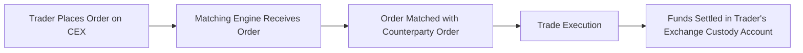
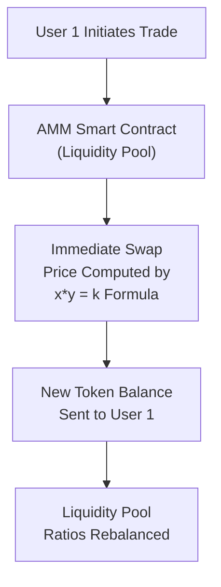

## Overview and Key Concepts

Market microstructure in digital exchanges focuses on how trades are arranged, matched, and executed in the cryptocurrency and tokenized asset realm. If you’ve ever wondered why the same digital asset might have a slightly different price from one exchange to another, or how giant whales (large holders of crypto) influence markets with a single click, then you’re already asking the kinds of questions that market microstructure tries to answer. 

Many of us still remember that first moment we deposited crypto on an exchange—maybe you had that fluttering feeling: “Am I doing this right? Is my order going to get filled? Is someone going to manipulate my trade?” These concerns are super common, which is why learning how digital markets operate behind the scenes can be so empowering. Let’s walk through the major components:

• Centralized Exchanges (CEXs): Operated by a central authority, typically custodian-based.  
• Decentralized Exchanges (DEXs): Rely on smart contracts and user-managed funds.  
• Automated Market Maker (AMM) Protocols: Provide liquidity through pools rather than order books.  
• Market Manipulation Risks: Wash trading, spoofing, and other forms of manipulation.  

By the end, you’ll understand why price discovery, liquidity, slippage, and impermanent loss matter for your trading and investment decisions—and how they might show up on the CFA exam.

---

## Structure and Participants

### Centralized Exchanges (CEXs)

Centralized exchanges offer the kind of familiar trading experience you might see in traditional equity markets: an order book (with bids and asks) and a matching engine that pairs buy and sell orders. Users deposit crypto (or fiat currency) into custodial accounts maintained by the exchange. 

• Order Book Model: This is a list of buy and sell orders ranked by price level.  
• Custodial Funds: The exchange holds your assets in their wallets. You typically need to trust the exchange to safeguard deposits.  
• Advanced Order Types: Stop-loss, limit orders, margin trading, etc.  

A typical trade flow on a CEX might look like this:



One of the reasons CEXs remain popular is their liquidity. Because they aggregate a lot of users, trades can happen quickly with minimal slippage—particularly for heavily traded pairs like BTC/USD or ETH/USD.

Still, there’s a central point of control. Yes, this centralization can help identify and prevent fraudulent activities, but ironically it also opens the door for internal issues—sometimes data leaks or front-running by unscrupulous insiders if the exchange isn’t well regulated. Meanwhile, the user cedes custody of their assets, at least temporarily, which might not be ideal from a “not your keys, not your coins” perspective.

### Decentralized Exchanges (DEXs)

DEXs run on peer-to-peer protocols without a central authority. They rely on smart contracts—pieces of code that automatically execute trades if certain conditions are met. While some DEXs still use order books, most employ an Automated Market Maker (AMM) approach (e.g., Uniswap, Curve, Balancer). 

• Non-Custodial: You keep your crypto in your own wallet, and trades execute between your wallet and a liquidity pool (or another participant’s wallet).  
• Blockchain Dependence: Trades settle on-chain, so speed and fees depend on the underlying blockchain.  
• Global Access: As long as you have an internet connection and a compatible wallet, you can potentially trade.  

DEXs and AMMs can be revolutionary, but they introduce unique concepts:  

1. Liquidity Pools (LPs): Users deposit token pairs (e.g., ETH and USDC) into a pool. In return, they earn fees when trades occur.  
2. Pricing Algorithms: Many AMMs use a constant product formula, such as:

   
   x \times y = k 
   

   Here, \\( x \\) and \\( y \\) are the quantities of the two tokens in the pool, and \\( k \\) is a fixed constant. When a user trades one token for another, the ratio changes and adjusts the price automatically.  

3. Risks like Slippage and Impermanent Loss: Quick changes in the ratio of tokens in a pool, or large trades relative to pool size, can lead to price slippage. Liquidity providers can see an impermanent loss—effectively a short-term reduction in realized value of their staked tokens if the ratio shifts dramatically.

---

## Liquidity and Price Discovery

Liquidity describes how quickly and efficiently a market can absorb large orders without a significant impact on price. In mainstream equities, a heavily traded stock like Apple might have millions of shares changing hands every day—leading to tight bid-ask spreads. In digital asset markets, liquidity may vary widely and can be fragmented across many exchanges. 

• CEX Liquidity: Often consolidated, since many participants trust large platforms for access to major trading pairs.  
• DEX Liquidity: Spread across multiple liquidity pools. Users can switch pools freely, which can cause shifting price quotes.  

Effective price discovery in digital markets is also influenced by global 24/7 trading, meaning there’s no real “closing bell.” This might be great for convenience, but it also can lead to unpredictably high volatility on weekends or holidays, times when traditional markets are closed.

**Cross-Exchange Arbitrage:** Suppose one exchange lists BTC at USD 50,000 while another at USD 50,200. Arbitrageurs will quickly buy cheaper BTC on one exchange and sell at the higher price on the other, pocketing a near risk-free profit until the prices converge. This process aligns prices across venues, enhancing overall market efficiency. But the friction points—like withdrawal limits, transaction fees, or slow blockchain confirmations—can cause short-lived price dislocations.

---

## Key Order Types and Execution Logic

### Order Types

• **Market Order**: You buy or sell immediately at the best available price. May cause slippage if the order size is large.  
• **Limit Order**: You choose a price. Execution occurs only if the market reaches that price.  
• **Stop-Loss Order**: You set a price below the current market to automatically sell if it drops that far, helping mitigate losses.  
• **Stop-Limit**: A hybrid where once the stop is triggered, a limit order is placed instead of a market order.  
• **Take-Profit Order**: The reverse of stop-loss, used to lock in gains at a certain threshold.  

### Execution Logic: Matching Engines and AMMs

On CEXs, the matching engine continuously pairs incoming orders from the order book. On DEXs using an AMM, your trade is executed directly against a smart contract–controlled liquidity pool. This difference can be visualized:



No human intermediary is required; everything is executed by the protocol’s set of rules.

---

## High-Frequency and Algorithmic Trading

You don’t have to be a data scientist to know that algorithms and bots are increasingly shaping digital asset markets. High-frequency trading (HFT) is prevalent on CEXs that offer robust APIs and minimal latencies. Algorithmic traders might exploit:

- **Cross-Exchange Arbitrage**: Tiny price misalignments across different CEXs.  
- **Statistical Arbitrage**: Patterns in historical prices or correlations between tokens.  
- **Front-Running**: Attempting to execute a trade just before a large known trade influences the price. (In a decentralized context, this can happen when a miner or validator sees a transaction in the mempool and places a transaction with higher gas fees to be mined first.)

It’s not all sunshine and profit, though. Networks might congest, leading to transaction delays. If you’re front-running on Ethereum but the network is jammed, your fancy strategy might backfire if your transaction ends up getting processed after the big trade. Another common pitfall is building strategies on inaccurate or incomplete market data—especially from unregulated or suspicious data feeds.

---

## Market Manipulation and Regulatory Issues

### Forms of Manipulation

• **Wash Trading**: Buying and selling the same asset to artificially inflate volume or mislead investors.  
• **Spoofing**: Placing large orders with the intent to cancel them before execution, creating a false sense of supply or demand.  

On lesser-known tokens, it’s possible for a small group of manipulative traders to create illusions of high volume, luring in unsuspecting investors. In other words, you think a token is super liquid, but in reality, it’s just a few bots trading back and forth.

### Regulatory Context

Regulators worldwide are scrambling to keep up. Many jurisdictions have begun applying anti-manipulation regulations from traditional securities to crypto. But enforcement can be tricky in a decentralized environment—no single entity controls the entire system, and participants may operate outside a conventional regulatory perimeter. 

**Spotlight on DEXs**: Some decentralized protocols might not meet the typical definition of an “exchange” under certain laws. However, if a project is seen to be distributing tokens that behave like securities, regulators might classify them accordingly. For a CFA Level I candidate, just keep in mind that regulatory boundaries in digital assets remain a moving target, and it’s wise to factor location and compliance considerations into any investment or trading strategy.

---

## Risk Management: Slippage and Impermanent Loss

### Slippage

Slippage occurs when there’s a difference between the price you expect and the price at which your order actually executes. This is common on DEXs if the liquidity pool is comparatively small or the trade size is large. Even in CEXs, you can get slippage in highly volatile conditions.

To manage slippage, you could:  
• Execute smaller trades gradually.  
• Use limit orders.  
• Check the average trade size in the order book or pool depth.  

### Impermanent Loss

If you provide liquidity in a DEX’s AMM pool, imagine depositing an equal value of ETH and USDC. If ETH’s price jumps sharply, arbitrageurs will buy ETH from your pool (because it’s priced lower than the external market) and leave more USDC behind. At withdrawal, you could end up with fewer ETH (the asset that appreciated) and more USDC. That difference is called "impermanent loss." It can be partially or fully offset by fees, especially in high-volume pools. But it’s definitely a consideration for would-be liquidity providers.

---

## Illustrative Case Study

Let’s take a quick scenario to see these concepts in action. I once placed a sizable limit order to buy a small altcoin on a mid-tier exchange. Because the order book was thin, I split one big order into smaller chunks to avoid excessive slippage. As soon as I placed the orders, a couple of large sell orders appeared—perhaps an algorithm was monitoring order book depth—but oddly they pulled out a few seconds later (a potential spoofing attempt?). In the end, I got partially filled at a favorable price, but the rest of the order hung indefinitely. 

Lessons learned:  
• Always watch liquidity across multiple exchanges if you’re dealing with altcoins.  
• Keep an eye out for suspicious large orders that vanish.  
• Sometimes the best route is to spread your trades over time or different platforms.

---

## Practical Python Snippet (Example)

Below is a simple (very simplified!) Python code illustration for detecting price differences between two exchanges’ order books. It’s not something you’d run in production, but it captures the gist of how an arbitrage algorithm might look:

```python
import requests
import time

def get_price_from_exchange_a():
    # Suppose we get best bid and best ask from a hypothetical API
    data = requests.get("https://api.exchangeA.com/orderbook/BTCUSD").json()
    best_ask = data["asks"][0]["price"]  
    best_bid = data["bids"][0]["price"]
    return best_bid, best_ask

def get_price_from_exchange_b():
    # Another hypothetical endpoint
    data = requests.get("https://api.exchangeB.com/orderbook/BTCUSD").json()
    best_ask = data["asks"][0]["price"]
    best_bid = data["bids"][0]["price"]
    return best_bid, best_ask

while True:
    bid_a, ask_a = get_price_from_exchange_a()
    bid_b, ask_b = get_price_from_exchange_b()
    
    # Check potential cross-exchange arbitrage
    if bid_a - ask_b > 10:  # $10 difference as a threshold
        print(f"Buy on Exchange B at {ask_b} and Sell on Exchange A at {bid_a}")
    elif bid_b - ask_a > 10:
        print(f"Buy on Exchange A at {ask_a} and Sell on Exchange B at {bid_b}")
    
    time.sleep(1)
```

This snippet checks for a $10 difference between the best bid on one exchange and the best ask on another, then theoretically flags an arbitrage opportunity. Real production algorithms would consider fees, latency, partial fills, and how quickly an order can be executed before the market moves.

---

## Managing Operational Risks

High volatility and 24/7 trading can be exhilarating, but it also means around-the-clock risk management and monitoring are essential. Common pitfalls:  

• **Connectivity Issues**: A dropped internet connection or overloaded API can lead to big losses if you’re market making.  
• **Exchange Hacks**: For CEXs, custodial wallets are prime targets for hackers.  
• **Smart Contract Vulnerabilities**: For DEXs, a bug in the protocol’s code could be exploited, causing permanent loss.  
• **Regional Regulations**: A platform might be licensed in one country but operate in many others. Sudden regulatory shifts can halt trading or freeze assets.  

---

## Exam Tip: Integrating Market Microstructure in the CFA Curriculum

On the CFA exam, especially as you progress to advanced levels, you might see scenario-based questions about digital asset trading. A typical question might ask how a portfolio manager should execute a large trade on a DEX when liquidity is limited or how to hedge the risk of impermanent loss in a DeFi liquidity pool. You might have to demonstrate your understanding of order book depth, slippage, or how to choose an exchange under uncertain regulatory conditions. 

It might sound tricky, but as you build conceptual clarity, it all becomes more intuitive—kind of like you’ve suddenly got x-ray specs for understanding the moving parts of crypto markets. 

---

## Conclusion

Market microstructure in digital exchanges reveals a complex web of participants, protocols, and potential pitfalls. While centralized venues borrow heavily from traditional finance playbooks, decentralized venues push boundaries with AMM protocols and smart contracts. It’s essential for any aspiring investment professional (and definitely for any CFA candidate) to understand these structural nuances. They can shape price discovery, liquidity, and execution costs—and, ultimately, drive portfolio returns in the increasingly influential world of digital assets.

Learning about slippage, impermanent loss, or wash trading might seem overwhelming at first (trust me, it did for me too!). But the payoff is a more grounded approach to trading and investing. Whether you’re building your next valuation model or setting up a liquidity providing strategy, a grasp of market microstructure is your secret weapon.

---

## References and Further Reading

- Coin Metrics (https://coinmetrics.io/) – Industry research on crypto market structure and analytics.  
- “Crypto Market Microstructure” – Various articles on Medium, arXiv, and academic journals.  
- Uniswap Whitepaper (https://uniswap.org/) – For deeper insights into AMM algorithms.  
- Balancer Protocol Documentation (https://docs.balancer.fi/) – Advanced multi-token pools and dynamic fees.  
- The CFA Institute Code of Ethics and Standards of Professional Conduct – Guidance on avoiding manipulative practices and ensuring market integrity.

---

## Test Your Knowledge: Market Microstructure in Digital Exchanges



### Which of the following best describes impermanent loss in an Automated Market Maker (AMM)?

- [ ] A permanent decline in the value of staked tokens resulting from holding low-liquidity assets in a decentralized exchange.  
- [x] A temporary reduction in the dollar value of pooled tokens due to volatility and changes in the pool’s token ratio.  
- [ ] The final realized drawdown when a liquidity provider removes assets from a centralized exchange.  
- [ ] Losses incurred by traders who execute slow transactions on a congested blockchain.  

> **Explanation:** Impermanent loss is the temporary loss of capital experienced by liquidity providers in AMM pools when one token’s price changes relative to the other. It can be recouped if market conditions normalize, although fees earned may offset some or all of the effect.

### A trader places a large market buy order on a relatively illiquid altcoin in a centralized exchange. Which risk is most prominent?

- [x] Slippage  
- [ ] Impermanent loss  
- [ ] Wash trading  
- [ ] Spoofing  

> **Explanation:** Large market orders on thin order books can push prices up and lead to the execution of later parts of the trade at increasingly higher ask prices, creating slippage.

### In the context of DEXs, which of the following best characterizes the main function of liquidity pools?

- [ ] They match individual buy and sell orders without a central intermediary.  
- [x] They store token reserves so trades can be executed algorithmically within an AMM model.  
- [ ] They prevent arbitrage opportunities by standardizing prices across exchanges.  
- [ ] They are private capital pools accessible only to institutional investors.  

> **Explanation:** Liquidity pools hold locked token pairs, allowing trades to execute against these reserves via algorithmic pricing rather than a traditional order book.

### A user notices on a lesser-known exchange the trading volume of a new token is suddenly skyrocketing with identical buy and sell orders. This might be an example of:

- [x] Wash trading  
- [ ] Slippage  
- [ ] Market fragmentation  
- [ ] Impermanent loss  

> **Explanation:** Wash trading involves creating fake or misleading trading volume by simultaneously placing offsetting buy and sell orders, artificially boosting perceived volume.

### What is one potential benefit of a decentralized exchange for users who value control over their assets?

- [x] Users retain custody of their private keys, reducing risk of exchange-held funds being hacked.  
- [x] DEXs are typically heavily regulated, protecting users from price volatility.  
- [ ] DEXs always guarantee better liquidity for minor token pairs.  
- [ ] DEXs automatically reimburse impermanent losses.  

> **Explanation:** DEXs allow users to trade directly from their wallets, meaning no centralized entity holds the funds. This significantly mitigates custodial risk. However, regulation, liquidity, and impermanent losses remain separate issues dictated by market conditions.

### Which best describes spoofing?

- [x] Placing an order with the intention of canceling it before execution to mislead other traders.  
- [ ] Executing very fast trades on multiple exchanges to earn minute price differences.  
- [ ] Selling tokens at a lower price than the current bid.  
- [ ] Creation of liquidity pools with artificially high interest rates.  

> **Explanation:** Spoofing is a manipulative technique where large orders are displayed to pump or dump price sentiment but are pulled before they can be filled.

### In an AMM-based DEX using the constant-product (x * y = k) formula, which of the following occurs if a large quantity of one token is purchased?

- [x] The ratio of the tokens changes, increasing the price of the purchased token and decreasing the price of the other.  
- [x] The ratio of the tokens remains the same, but users pay higher transaction fees.  
- [ ] The token prices remain fixed, leading to no slippage for the buyer.  
- [ ] Liquidity providers are automatically shielded from any impermanent loss.  

> **Explanation:** The constant-product formula adjusts the relative prices of tokens in the pool when a trade is made, causing the purchased token to become more expensive in proportion to the other.

### Why do cryptocurrency exchanges often have longer trading hours or no downtime compared to traditional stock markets?

- [x] Cryptocurrencies trade on global decentralized networks 24/7, eliminating the need for a centralized closing time.  
- [ ] Regulators prohibit digital assets from ceasing trading.  
- [ ] Crypto assets have significantly lower volatility and therefore can remain open.  
- [ ] Market data can’t be streamed to multiple geographic locations simultaneously in traditional markets.  

> **Explanation:** Digital asset markets operate continuously on global platforms. There is no single “closing bell,” so trading is essentially around the clock.

### A cryptocurrency exchange that holds user funds and enforces Know Your Customer (KYC) rules is best described as:

- [ ] A decentralized exchange (DEX) using automated market makers.  
- [x] A centralized exchange (CEX) with custodial wallets.  
- [ ] A pure peer-to-peer escrow system with no listing requirements.  
- [ ] An unauthorized aggregator of user transactions.  

> **Explanation:** A CEX typically maintains custody of user funds, facilitates compliance with local KYC regulations, and matches buy/sell orders via a central matching engine.

### True or False: Impermanent loss only materializes as an actual loss when the liquidity provider withdraws their tokens and the token price ratio has changed relative to other markets.

- [x] True  
- [ ] False  

> **Explanation:** Impermanent loss is temporary if prices revert back. If the provider withdraws after a permanent shift in the token ratio, the loss can become “realized.”


