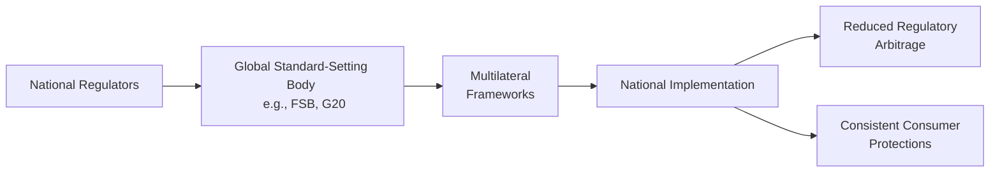

## The Emergence of a Fragmented Regulatory Landscape

It may sound obvious, but digital assets (cryptocurrencies, tokenized securities, stablecoins, and more) operate on a global scale, transcending traditional borders. As a result, regulators worldwide are scrambling to figure out how to classify these assets, protect consumers, and mitigate systemic risks. Different countries interpret them in ways that sometimes diverge quite drastically: some see them as commodities; others call them securities; still others treat them like property for tax purposes. I remember chatting with a friend in Canada who was baffled by the idea that her cryptocurrency might be labeled a security in one province and something else in another—yikes!

This regulatory fragmentation creates confusion for market participants. Companies operating internationally have to juggle different sets of restrictions, taxation rules, disclosure requirements, and licensing obligations. In some quirky cases, you can run into a scenario where one nation requires full Anti-Money Laundering (AML) checks on all transactions above a few hundred dollars, while a neighboring country sets a threshold in the thousands—leading to possible regulatory arbitrage. That basically means players might choose to operate in the country with the “friendlier” or more lenient laws.

## The Push Toward Global Harmonization

Fortunately, there’s a global movement afoot to harmonize regulations so that digital asset markets can develop sustainably. Global bodies such as the Financial Stability Board (FSB) and the G20 are spearheading discussions to create frameworks that ensure consistent investor protections, reduce the risk of financial crimes, and minimize opportunities for regulatory loopholes. I find it akin to trying to get everyone to agree on the rules of a new game—it takes time, negotiation, and, sometimes, a few heated debates.

### Key Harmonization Goals

• AML and Know Your Customer (KYC) Standards: Aligning AML guidelines across countries to ensure criminals don’t exploit weaker jurisdictions. Central banks and policymakers are working on frameworks that improve data sharing and require uniform KYC procedures.  
• Licensing Requirements for Service Providers: Exchanges, wallet providers, and custodians often face drastically different regulations from region to region. Harmonization lays out consistent standards for operational and cybersecurity protocols.  
• Disclosure Rules: Investors want clarity on the risks they’re taking on. International standard-setters aim to unify disclosure requirements for token issuers, stablecoin operators, and digital asset fund managers.  
• Systemic Risk Monitoring: Particularly around global stablecoins, where a sudden crisis of confidence could reverberate across borders. Regulators are discussing ways to track large stablecoin projects and impose relevant capital or liquidity requirements, just as they do with banks.  

## International Collaboration Efforts

There are many organizations, committees, and working groups chipping away at the puzzle of digital asset regulation. Let’s look at some of the most influential ones:

• Financial Stability Board (FSB): This body monitors the resiliency of the global financial system and recommends regulatory improvements (for instance, they frequently publish guidelines on stablecoins and cross-border payments).  
• G20: A group of 19 countries plus the European Union. The G20 endorses or recommends policy solutions to its members—some of which result in national legislation or broader directives.  
• Bank for International Settlements (BIS): Though not specifically mandated to regulate crypto assets, the BIS fosters discussion among central banks around the stability and technological implications of digital assets and currencies.  
• International Organization of Securities Commissions (IOSCO): Coordinates across securities regulators to develop consistent standards.  
• International Monetary Fund (IMF): Advises countries on monetary policy, which increasingly intersects with stablecoins and central bank digital currencies (CBDCs).

One interesting anecdote: I once attended a cross-border fintech conference where an official from a smaller European nation revealed that it was purely by referencing FSB guidelines that their parliament decided to update their digital asset laws. That’s a neat example of how these bodies’ recommendations trickle down into real regulations.

## Why Harmonization Is So Tricky

Harmonizing regulations is sort of like getting a large extended family to agree on one vacation spot. Sure, we all want to hang out together, but everyone brings different preferences, risk appetites, and constraints. Some jurisdictions prioritize investor protection, some worry more about capital formation, and others see digital assets as an engine for job growth or greater financial inclusion.

### Fear of Missing Out vs. Fear of Overregulation

Officials don’t want to stifle innovation, but at the same time, they’re tasked with protecting consumers and ensuring systemic stability. This tension can slow down the adoption of consistent standards. Meanwhile, smaller nations or emerging markets may intentionally adopt favorable crypto laws to attract investment and talent, potentially creating pockets of regulatory arbitrage. But if major powers adopt stricter rules, cross-border operations become complicated.

### Fragmented Definitions and Tax Overlaps

It’s not just about licensing and AML rules. Taxes cause headaches, too. For instance, if a token is classified as property in one country, capital gains might be treated differently than if another country classifies it as a security with dividend-like income. We shouldn’t underestimate the complexity here. In many cross-border scenarios, investors face double taxation and must hire teams of accountants to stay compliant.

### Rapid Pace of Innovation

Remember that the technology behind digital assets evolves quickly—new consensus mechanisms, new token standards, new decentralized finance (DeFi) protocols. Regulatory frameworks often struggle to keep pace with the constant stream of disruptions. For example, stablecoins once seemed futuristic, but now central banks are worried about them overshadowing fiat currencies. By the time any new regulation is hammered out, half a dozen new stablecoin variants might have already launched.

## Collaborative Frameworks in Development

Despite the challenges, there are promising trends:

• Joint Declarations: In some regions, central banks and securities commissions issue joint statements clarifying the classification of digital assets, AML expectations, and reporting standards.  
• Supranational Meetings: The G20 regularly hosts sessions on how to unify digital asset regulations, culminating in communiqués that encourage members to align their policies.  
• Multilateral Agreements: Countries might enter into treaties that allow them to recognize another nation’s digital asset licenses, streamlining cross-border business.  
• Public-Private Partnerships: Collaboration with industry participants fosters practical guidelines that can actually be implemented.  
• Mechanisms for Cross-Border Dispute Resolution: Considering digital assets can be transacted instantly anywhere in the world, legal frameworks may develop to handle disputes across jurisdictions more rapidly.

## Case Study: Stablecoins and Global Systemic Risk

A classic illustration is stablecoin regulation. Stablecoins are designed to maintain a peg (most often to the U.S. dollar), but if they grow large enough to be a payment medium used globally, they could threaten monetary sovereignty or cause massive runs if confidence falters. That’s why the G20, FSB, and other bodies have singled out stablecoins for special scrutiny.

Imagine a scenario: a major stablecoin starts to lose its peg, and user redemptions surge. If the stablecoin sponsor can’t meet redemptions or has to fire-sell assets, that can trigger a contagion that ripples through multiple financial markets—imperiling not just the digital asset world, but also broader credit markets. So regulators look for consistent liquidity requirements, redemption rights, and disclosure rules about reserves backing stablecoins. Without a global approach, users might flee to jurisdictions with lax regulations or bigger “guarantees,” elevating instability overall.

## Benefits of a Unified Regulatory Environment

If harmonization succeeds—and I’m cautiously optimistic—consumers get clear protections, market participants experience predictable legal environments, and capital can flow freely across borders without undue friction. For institutional investors, more clarity might spur them to embrace digital assets in a bigger way, bringing added liquidity and maturity to the market. Meanwhile, it might also weed out bad actors who can no longer hop from one lightly regulated corner of the world to another.

## Diagrams: Cross-Border Regulatory Collaboration

Below is a simple Mermaid.js diagram that shows how different stakeholders interact in global regulatory coordination. It’s simplified, but you’ll get the gist:

In this flow:

• National regulators collaborate with global bodies.  
• These bodies publish frameworks, which are then implemented back at the national level.  
• The outcome—ideally—is reduced regulatory arbitrage and consistent rules for consumers.

## Potential Future Outlook

In a decade, it’s entirely possible that we’ll see something akin to the Basel Accords for crypto assets, stablecoins, and digital asset service providers. The Basel Accords standardized how banks manage capital and risk; similarly, we might see global standards for AML, capital reserves, or cybersecurity within the digital asset ecosystem.

What could derail this? Political disagreements, major technology changes that outpace negotiations, or even a large-scale market crash that leads to hurried, unilateral actions. But in my view, the momentum is here. Regulators, industry participants, and consumer advocates have realized that digital assets aren’t going away. The best path forward is to cooperate on consistent rules that protect investors and bolster market integrity without throttling innovation.

## Practical Insights and Best Practices

• Monitor Policy Statements: Keep an eye on FSB updates, G20 communiqués, and your local regulator’s bulletins. Policy statements give you early warnings on upcoming rules.  
• Evaluate Geopolitical Factors: Shifts in trade relations or macroeconomic policies can affect how quickly or enthusiastically a country adopts global standards.  
• Plan for Stress Scenarios: If you’re working at a fund or exchange, run scenario analyses for changes to stablecoin regulations, capital requirements, or cross-border licensing norms.  
• Engage in Dialogue: If you’re an industry stakeholder, participate in public consultations. Regulators often welcome input because they may not be as tech-savvy.  
• Assess Reputational Risks: Proactively show compliance, even if local regulations are lax. Being known as a ‘good actor’ can pay off (trust me, you don’t want to be the one singled out in the press).  

## Glossary of Terms

• Financial Stability Board (FSB): An international body that monitors and makes recommendations about the global financial system.  
• Regulatory Arbitrage: Exploiting differences in regulations among jurisdictions to gain competitive advantage.  
• Harmonization: The process of standardizing rules and guidelines across different regions or jurisdictions.  
• Cross-Border Transactions: Financial exchanges involving parties in different countries or legal regions.  
• Systemic Risk: The risk that a disruption at a firm, financial sector, or market level triggers serious instability in the entire financial system.  
• Multilateral Framework: Any agreement or set of rules established by three or more countries or organizations for policymaking or coordination.  
• Consumer Confidence: The trust that individuals place in the stability and fairness of financial markets, crucial for widespread adoption of digital assets.  
• G20: A group of 19 countries plus the EU. They address major global economic challenges, including policy coordination on digital assets.  

## References for Further Study

• Financial Stability Board: Stay updated with FSB publications and reports on crypto-asset regulation at:  
  https://www.fsb.org/  
• G20 Official Statements: Summaries and communiqués that often address digital assets and stablecoins.  
• Bank for International Settlements (BIS): Publications on CBDCs and payment systems.  
• IMF and World Bank Papers: Discussions on crypto risk, financial inclusion, and potential regulatory frameworks.  
• IOSCO Guidelines: Securities regulation in relation to token offerings and more.  

If you want more background on how all these pieces intertwine, I’d recommend diving deeper into official guidance from the BIS and International Finance bodies, plus relevant academic works on the cross-border payment systems. Stay tuned, because the story of global regulatory coordination for digital assets is far from over—and it’s bound to shape the future of the entire financial ecosystem.

## Exam Tips and Final Thoughts

For your CFA exam, be prepared to discuss the intricacies of cross-border regulatory frameworks, especially regarding stablecoins, AML, and licensing. Exam questions might test your ability to apply policy guidelines to a scenario or interpret how a shift in one jurisdiction’s rules could influence risk management in a multi-asset portfolio. Also, keep in mind that the synergy between technology and policy is a hot topic in the investment world, so understanding this interplay can give you an extra edge—both on the exam and in real-life practice.

It’s a challenging but exciting time. So keep your eyes on official bulletins, stay nimble, and appreciate the global mosaic we’re all part of. In my opinion, it’s all about finding the right balance between innovation and caution. Good luck!

---

## Test Your Knowledge: Global Coordination in Digital Assets



### Which global body is most notably focused on monitoring and making recommendations about world financial stability, including digital assets?

- [x] Financial Stability Board (FSB)
- [ ] World Bank
- [ ] International Bar Association
- [ ] Interpol

> **Explanation:** The Financial Stability Board (FSB) is specifically tasked with overseeing global financial stability, monitoring risks, and providing regulatory recommendations, including those on digital assets.

### Which factor primarily complicates the global harmonization of digital asset regulations?

- [ ] The technology behind digital assets is already standardized.
- [x] Different nations classify digital assets in varying ways.
- [ ] There is universal agreement that all digital assets are commodities.
- [ ] No international organizations exist to coordinate regulatory efforts.

> **Explanation:** Countries differ on whether digital assets are securities, commodities, or property. This variation makes harmonization an uphill task.

### What is the main purpose of uniform Anti-Money Laundering (AML) standards in digital asset regulation?

- [ ] To allow untraceable transactions worldwide.
- [x] To prevent criminals from exploiting weaker jurisdictions.
- [ ] To encourage regulatory arbitrage.
- [ ] To facilitate excessive disclosures for market participants only.

> **Explanation:** Harmonized AML standards help ensure criminals cannot escape oversight by shifting transactions to jurisdictions with looser rules.

### Systemic risk is best described as:

- [ ] Risk specific to an individual company only.
- [ ] The risk that investors will lose money in a single asset.
- [x] The risk of collapse of an entire financial system or market.
- [ ] The risk that regulators overcharge licensing fees.

> **Explanation:** Systemic risk materializes when failures in one part of the financial system threaten the stability of the entire system, which could occur if large stablecoins fail.

### Which statement about the G20’s role in digital asset regulation is correct?

- [x] The G20 promotes policy coordination and has addressed stablecoins.
- [ ] The G20 is exclusively focused on climate change policies.
- [ ] The G20 has no interest in regulating cryptocurrencies.
- [ ] The G20 solely regulates banks and ignores digital asset providers.

> **Explanation:** The G20 has participated in shaping policy recommendations and discussions around digital assets, especially stablecoins, to foster global consistency.

### An example of regulatory arbitrage would be:

- [x] Establishing a crypto exchange in a jurisdiction with minimal oversight while serving clients in stricter jurisdictions.
- [ ] Abiding by all AML rules set by a single regulator.
- [ ] Conducting thorough investor protection training.
- [ ] Using advanced cybersecurity measures to protect customer funds.

> **Explanation:** Regulatory arbitrage occurs when companies move operations to jurisdictions with more lenient regulations to gain competitive advantages.

### How might multilateral frameworks help digital asset regulation?

- [x] By creating treaties that unify standards and reduce compliance burdens across borders.
- [x] By setting consistent AML, licensing, and disclosure rules internationally.
- [ ] By eliminating all forms of local authority.
- [ ] By ensuring that stablecoins are always pegged to gold.

> **Explanation:** Multilateral frameworks involve multiple countries collaborating on consistent standards, thereby reducing friction and confusion in cross-border transactions.

### Which of the following is a direct benefit of a globally harmonized regulatory environment for digital assets?

- [x] Increased consumer confidence and clearer investor protections.
- [ ] Guaranteed investment returns on all digital assets.
- [ ] Guaranteed immunity from legal action.
- [ ] No need for cross-border transactions ever again.

> **Explanation:** A harmonized framework clarifies rules, fosters investor trust, and reduces consumer uncertainty—thereby potentially increasing market participation.

### When a regulator aligns their national rules with guidance from international bodies such as the FSB, the outcome is:

- [x] Reduced regulatory arbitrage and more consistent application of rules.
- [ ] Complete elimination of all cybersecurity risks.
- [ ] The immediate collapse of local digital asset markets.
- [ ] More complicated cross-border compliance processes.

> **Explanation:** Implementing global guidance at the national level makes regulations more predictable across countries and avoids large disparities that encourage arbitrage.

### True or False: The pace of innovation in digital assets can sometimes outstrip the speed of regulatory development.

- [x] True
- [ ] False

> **Explanation:** The digital asset space evolves rapidly with novel technologies emerging frequently, challenging regulators to keep up and adapt their frameworks.


