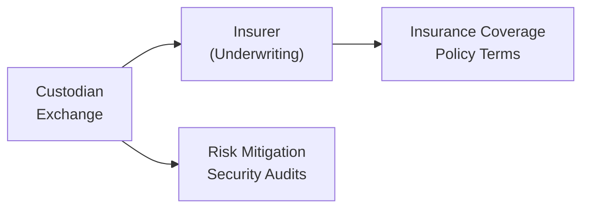

## Overview

Digital assets present an exciting frontier in finance, but, let’s be honest, they can also be pretty scary—especially when it comes to securing your investments and learning how to mitigate the risks of hacking, theft, or operational failures. We’ve all heard stories about crypto investors losing access to their funds because they mistakenly tossed a USB hardware wallet or fell victim to phishing. It’s natural to feel a little uneasy about safety in such a new environment. That’s where digital asset insurance steps in.

Unlike the well-established world of property or health insurance, digital asset insurance is something like a teenager: brimming with possibility yet still finding its footing. And as with any adolescent market, the underwriting is tricky, the premiums can be high, and the policies might have all sorts of exclusions that make you sigh, “Seriously?”

In this section, we’ll walk through the ins and outs of digital asset insurance—what it covers, why you might need it, and how to assess the myriad options out there. We’ll also discuss the strategies that custodians, exchanges, and even individual investors are using to address the unique risks of digital assets. By the end, you’ll have a powerful toolkit for evaluating coverage options, spotting pitfalls, and ensuring your digital asset risk management plan is strong enough to handle this evolving marketplace.

## The Insurance Landscape for Digital Assets

Digital assets, primarily cryptocurrencies and tokenized securities, have seen a meteoric rise in popularity. Along with that rise, there’s an attendant surge in sophisticated cyberattacks and operational mistakes—from exchange hacks and social-engineering fraud to improper private key management. While large institutions might bear these risks through robust internal controls, smaller investors and mid-sized businesses often find themselves vulnerable to financially catastrophic losses.

Traditionally, you dial up your insurance broker for a “standard” policy—covering theft, property damage, business interruption—and off you go. But with digital assets:

• The underlying technology (blockchain, smart contracts) is relatively new.  
• Historical loss data is limited, making it tough for insurers to gauge claims probability.  
• There’s an inherent cross-border nature, meaning each jurisdiction may have unique regulations—or no real regulations at all.

Thus, insurers are more cautious, and coverage terms vary widely. You might see policies that cover a certain type of hot wallet but exclude coverage for certain altcoins or decentralized finance (DeFi) protocols. The upshot is that the market is still a bit of a Wild West, which can make underwriting both complicated and potentially expensive.

## Key Coverage Options

Though the digital assets insurance landscape remains in flux, there are a few core coverage options that have started to gain traction:

### Hot Wallet Coverage

Hot wallets store crypto assets online, making them more susceptible to hacking attempts and malware. Insurance for hot wallets is often the most expensive piece of coverage because the risk of breach is significantly higher. Insurers usually want to see strict operational procedures:
• Multi-factor authentication (MFA)  
• Robust key management policies  
• Comprehensive logging and monitoring of transactions  

One approach is partial coverage—maybe an insurer only covers losses up to a certain limit, or only if the wallet employs certain specified proprietary security solutions. Because hot wallets are more dynamic environments with constant transactions, insurers will likely require frequent security audits.

### Cold Storage Coverage

Cold storage is when digital assets are offline, typically in hardware wallets or air-gapped systems. From an insurer’s standpoint, cold storage is more secure and less susceptible to external hacks—hence coverage can be cheaper than hot wallet coverage (though still not exactly dirt cheap). Policies here often mandate:
• A well-defined security protocol for transferring assets in and out of cold storage  
• Restricted physical access controls  
• Redundant, geographically dispersed backups  

Despite the lower risk compared to hot wallets, coverage might include strict conditions excluding coverage if private keys are moved online improperly or if certain key-handling protocols are not rigorously followed.

### Business Interruption Insurance

Business interruption (BI) coverage in the digital asset realm is aimed at protecting exchanges, staking providers, or custodians from operational downtime due to cyberattacks, DDoS (Distributed Denial of Service) attempts, or other technology disruptions. Picture a scenario: a major global exchange suffers a multi-day outage, losing transaction fees and hurting brand reputation. A properly structured BI policy may soften that blow. Then again, the insurer will want robust proof of cybersecurity controls, a tested incident response plan, and a history of compliance with best practices.

### Errors and Omissions (E&O) Coverage

When custodians or asset managers handle multiple client transactions daily, operational mistakes are bound to happen. E&O insurance helps cover liabilities arising from professional oversights, erroneous crypto transfers, or mismanagement. For example, if a custodian mistakenly sends a client’s assets to the wrong wallet (which can be irreversible in blockchain transactions), E&O can mitigate the resulting financial losses—provided the policy’s terms cover that specific scenario. However, many E&O policies incorporate a variety of exclusions, so reading the fine print is essential.

## Underwriting Challenges and High Premiums

The reason you might have seen jaw-dropping premium quotes for digital asset insurance is that underwriters lack the kind of robust historical data they have for mainstream products like car or homeowner’s insurance. The entire digital asset insurance market is fewer than 15 years old, give or take. Underwriters rely on specialized actuarial models and technical audits, but the truth is, data on crypto hacks, frequency of operational errors, and average severity of losses is still sparse.

Moreover, the technology environment changes constantly. Yesterday’s secure multi-signature approach might be tomorrow’s vulnerability if an undiscovered exploit surfaces. As a result, insurers can charge high premiums to address the unpredictability, or they might narrowly tailor coverage so that it only applies to well-defined incidents under specific circumstances.

## Robust Security Audits and Compliance Requirements

A standard refrain you’ll hear from insurers is, “We have to see your audits.” Indeed, for an insurer to be comfortable issuing a policy, they must ensure that your organization’s risk management is top-notch. These audits typically include:

• Thorough penetration testing  
• Review of your custody procedures (especially for cold storage transitions)  
• Analysis of your transaction monitoring and know your customer (KYC) or anti-money laundering (AML) processes  
• Assessment of overall IT infrastructure, including firewalls, intrusion detection systems, and offline backups  

Meeting these stringent requirements can be time-consuming and expensive. You might have to hire third-party cybersecurity experts to produce a report that aligns with insurer expectations. But for large players in the crypto space, the reputational benefit of having a recognized insurer is often well worth the effort and cost.

## Self-Insurance and Mutual Models

Some exchanges, worried about limited coverage or high premiums, opt to self-insure. They’ll keep a dedicated fund—like a rainy-day wallet—equivalent to a percentage of user deposits. If a hack or theft occurs, they use these reserves to reimburse customers. This approach has a few perks:

• No ongoing premium expenses  
• Greater control over claims process  

But it’s not without drawbacks. If the exchange is smaller or the event is catastrophic, a self-insurance fund could be quickly depleted, leaving users in the lurch. Additionally, self-insured funds can create moral hazards: if an exchange is not fully transparent about the size and management of the fund, users might face hidden risks.

Another variant is mutual insurance. A group of participants pools resources into a single coverage pot. Should one member suffer a covered loss, the fund pays out. This can be more affordable than having separate policies, but lined with the complexity of collectively managed risk, plus the risk that multiple members might be hit by correlated cyber events, draining the entire pool.

## Non-Standardized Policies and Claims Processes

Because digital asset insurance doesn’t have a universal set of best practices or standardized coverage forms, you can almost think of every policy as custom-made. This means:

• Wording can vary significantly from one insurer’s policy to another.  
• Certain incidents—like phishing, social engineering, or errors by the policyholder—may be excluded.  
• Some policies tie coverage to specific tokens or blockchains, leaving you uncovered if you hold something that’s outside the scope.  

Reading the finer details and verifying claims procedures in advance is critical, especially for institutional investors. If you’re doing your due diligence on behalf of a pension fund or an endowment, you need to ensure that the coverage’s exclusions and limitations don’t basically gut the policy’s ability to pay meaningful claims.

## Risk Assessment and Key Considerations for Analysts

When you or your firm is evaluating digital asset insurance as part of a broader risk management strategy, here are some guiding questions:

• What’s the credit rating or financial strength of the insurer? Will they be able to pay out if a large-scale event, like a systemic exchange hack, occurs?  
• Does the policy specifically name the digital assets covered? Are you out of luck if you pivot to other tokens?  
• How does the insurer handle dispute resolution if a claim is partially or fully denied?  
• Can coverage be expanded as your business or portfolio grows?  
• Do you have the personnel and internal processes required to meet ongoing audit and compliance obligations set by the insurer?

On top of these, you should also factor in the intangible benefits. Having recognized insurance coverage boosts the trust of clients, counterparties, and regulators. It shows you’re committed to best practices and that you’re not cutting corners on security or risk management.

## Practical Example: A Hypothetical Exchange Hack

Imagine you’re analyzing a mid-sized crypto exchange. They store 80% of their assets in cold storage, 20% in hot wallets for client withdrawals. They have a digital asset insurance policy that caps hot wallet coverage at $20 million. Premium is set at 2% of the total coverage annually, or $400k per year. One day, a sophisticated hack drains $15 million worth of BTC from the hot wallet. The exchange immediately files a claim.

In the claims process, the insurer checks:

1. Did the exchange maintain protocol-specified minimum security standards (e.g., multi-signature, strong firewall, frequent password rotation)?  
2. Was the stolen BTC part of the covered assets and stored in a designated wallet?  
3. Did the exchange itself inadvertently cause the hack (gross negligence or disregard for policy obligations)?

If all requirements are met, the insurer pays out $15 million—minus any policy deductible. The exchange effectively survives a disastrous event that, without insurance, could have ended its operations and destroyed client trust.

## Visualizing the Insurance Process

Below is a simple diagram demonstrating the relationships among the custodian or exchange, the insurer, and the operational security measures that feed into an underwritten policy.

1. The custodian or exchange arranges security audits (D).  
2. The insurer underwrites the policy (B) based on audit findings.  
3. Final coverage and policy terms are established (C).  

## Glossary

• Hot Wallet Coverage: Insurance for assets stored in an online or semi-online environment, where keys are accessible via the internet, thus especially vulnerable to hacking attempts.  
• Cold Storage Coverage: Insurance for offline, hardware-based or otherwise air-gapped asset storage, generally considered lower risk.  
• Errors and Omissions (E&O) Insurance: Protects against losses from professional mistakes, negligence, or oversights.  
• Underwriting: The process of evaluating risks, defining policy terms, and setting premiums for insurance coverage.  
• Policy Exclusions: Specific incidents or conditions for which the insurance will not pay claims.  
• Cyber Risk: The financial or operational risk associated with cyberattacks, data breaches, or system failures caused by digital vulnerabilities.  
• Self-Insurance: A strategy where an entity reserves its own funds to cover potential losses instead of purchasing insurance from a third party.  
• Mutual Insurance: A group-based approach in which members pool resources to share coverage collectively.

## Best Practices, Pitfalls, and Strategies

• Take Risk Inventory: Start by mapping out where and how your digital assets are stored—on exchanges, in custody solutions, or in hardware wallets—and evaluate which ones have the highest threat profile.  
• Demand Transparency: Insist on clarity from insurers: exactly which risks are covered? Which are excluded?  
• Negotiate Coverage Limits: If you maintain a large portion of assets in hot wallets for liquidity, you’ll want to ensure the coverage limit actually aligns with your exposure.  
• Evaluate Insurer Credibility: Check credit ratings, talk to references, and look at their track record of paying out claims.  
• Revisit Policies Frequently: With new tokens, new chain protocols, and evolving best practices, you might need annual or even semi-annual updates to insurance coverage.  
• Combine Insurance with Operational Controls: Even a robust insurance policy won’t fully substitute for strong risk management. Security measures reduce the chance of a catastrophic claim—and might qualify you for lower premiums.  

## Further References

• Lloyd’s of London Guidance on Cryptocurrency Insurance:  
  https://www.lloyds.com/  

• Specialized Crypto Insurance Providers:  
  – Evertas: https://www.evertas.com/  
  – Curv (now part of PayPal): https://www.curv.co/  

These sources offer more detailed insights into underwriting standards, real case studies of crypto hacks, and frameworks for best practices. For updated or jurisdiction-specific regulations, consult your local financial regulators or accredited legal experts.

## Concluding Thoughts and Study Tips

Digital asset insurance is still developing, and early adopters should be prepared for the learning curve. Underwriting can be expensive, coverage might come with a laundry list of exclusions, and analyzing the insurer’s creditworthiness can feel like diving into an obscure research project. Yet the strategic advantage of having coverage—both in terms of investor confidence and actual risk protection—often makes it worthwhile.

For exam preparation, keep in mind:

• Understanding the broad categories of coverage (hot vs. cold wallet, E&O, etc.)  
• Recognizing that the digital asset environment is unique, with greater exposure to cyber risk and changing tech standards  
• Being ready to explain how operational best practices can reduce premiums and improve underwriting prospects  
• Identifying the benefits and drawbacks of self-insurance and mutual insurance models  

If you can articulate these points clearly and apply them to scenario-based questions, you’ll ace both your practical investing decisions and your exam performance.

-----

## Test Your Knowledge: Digital Asset Insurance and Coverage Options



### Which of the following factors primarily contributes to high premiums in digital asset insurance?

- [ ] Abundance of historical loss data
- [x] Limited actuarial data and fast-evolving security threats
- [ ] Government-mandated insurance minimums
- [ ] Low underwriting costs

> **Explanation:** Because digital asset insurance is relatively new and cyber threats change rapidly, there is limited data for insurers to accurately price risk, forcing them to charge higher premiums to offset unpredictability.

### Which type of coverage specifically protects a financial institution from legal liability resulting from professional mistakes in managing digital assets?

- [ ] Hot wallet coverage
- [ ] Business interruption coverage
- [ ] Cyber liability coverage
- [x] Errors and Omissions (E&O) insurance

> **Explanation:** E&O insurance addresses professional errors, oversights, or negligence that lead to financial loss for clients, which is distinct from purely technical/cyber risks or operational failures.

### In self-insurance for digital assets, what is the primary risk if a catastrophic theft or hack occurs?

- [x] Depletion of reserved funds and insufficient capital to reimburse losses
- [ ] Lower internal security standards
- [ ] Overinsuring clients unnecessarily
- [ ] Excessive reliance on external reinsurers

> **Explanation:** Self-insurance relies on the company’s own reserves. If the loss event is large or simultaneous with other disasters, those reserves might quickly run dry, leaving the company unable to cover investor claims.

### A custodial service is most likely to purchase Errors and Omissions coverage to protect against which scenario?

- [ ] Falling cryptocurrency prices
- [ ] Physical theft of hardware wallets due to a break-in
- [ ] Server downtime and interruptions
- [x] Misrouting client assets due to the custodian’s internal error

> **Explanation:** E&O coverage is specifically designed to handle claims arising from professional mistakes or negligence, such as sending digital assets to the wrong wallet.

### Which statement is true regarding cold storage coverage for digital assets?

- [ ] It is generally as expensive as hot wallet coverage.
- [x] It is often less expensive than hot wallet coverage due to a lower risk profile.
- [ ] It excludes coverage for any offline key storage.
- [ ] It typically only covers tokens that are staked.

> **Explanation:** Because cold storage is considered more secure—being offline and less accessible to external hackers—insurers typically charge lower premiums, assuming other standard protocols are met.

### Mutual insurance among crypto exchanges involves:

- [ ] A single insurance provider covering multiple parties with no shared funding.
- [x] A group of exchanges pooling resources to cover members’ losses.
- [ ] Government oversight for all digital asset liability.
- [ ] Zero risk-sharing among participants.

> **Explanation:** Mutual insurance means participants fund communal reserves to protect each other; if one member faces a covered loss, the pool compensates them, thereby sharing the risk across all members.

### Which of the following best describes the rationale behind insurers requiring security audits before providing coverage?

- [ ] To discourage exchanges from seeking insurance
- [ ] To reduce competition among insurers
- [x] To ensure the insured party adheres to robust cybersecurity practices
- [ ] To eliminate the possibility of coverage exclusions

> **Explanation:** Insurers perform audits to verify that the custody or exchange platform meets minimum security standards, which helps reduce the likelihood or severity of a claim.

### One reason digital asset insurance claims can be denied is:

- [x] Failure to comply with specified wallet security requirements
- [ ] The insurer found the policyholder too proactive in security measures
- [ ] The claim emerged from a recognized hack that the policy always covers
- [ ] Underwriters never pay any crypto-related claims

> **Explanation:** Most policies have specific security requirements or conditions (e.g., multi-signature usage), and failing to maintain these can nullify coverage and result in a denied claim.

### Business interruption coverage related to digital assets may compensate for:

- [ ] Fluctuations in cryptocurrency prices
- [ ] Legal fees involved in an E&O lawsuit
- [ ] Losses stemming from hacking of hot wallets
- [x] Operational downtime and lost revenue due to cyberattacks or infrastructural failure

> **Explanation:** Business interruption coverage generally addresses operational or infrastructure events (like exchange downtime), not direct losses from theft or hacking.

### True or False: Digital asset insurance policies often vary widely because there is no standardized coverage form or universal underwriting guideline.

- [x] True
- [ ] False

> **Explanation:** The digital asset insurance market is still evolving, with different insurers issuing bespoke policies. This lack of standardization leads to inconsistent coverage limits, exclusions, and premiums.


