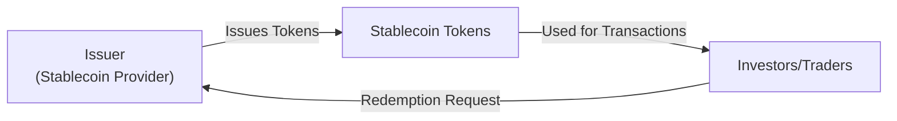

## Overview
Cryptocurrencies, stablecoins, and tokenization are changing the way we think about money, investments, and ownership rights. Whether you’ve been in finance for decades or you’re hearing about digital assets for the first time, it can feel a little daunting. Seriously—take it from someone who once spent half a day trying to send ten digital coins to a friend and realized I’d missed a wallet address digit. We learn by doing, right?

Regardless of any beginner slip-ups, the broader trends are clear: global investors are adding cryptocurrency exposure to their portfolios, stablecoins are emerging as new forms of liquidity, and tokenization is slicing real-world assets into digital shares. Let’s explore how all these pieces fit together and how they relate to investment decision-making, risk management, and professional standards.

## Cryptocurrencies: Fundamentals and Use Cases
Cryptocurrencies are digital or virtual currencies that use cryptographic techniques to secure transactions. Bitcoin, introduced in 2009, was the pioneer. Ethereum followed with smart contract capabilities, making possible a wide range of applications—like decentralized finance (DeFi) and non-fungible tokens (NFTs).

Unlike traditional currencies governed by central banks, cryptocurrencies operate on decentralized networks (blockchains). Think of a blockchain as a public ledger maintained by nodes (computers) all around the world. The upshot is that no single entity controls the entire network—transactions and balances are tracked in a distributed fashion.

Historically, cryptocurrencies are known for price volatility. Some soared thousands of percent in a single year, only to tumble the next. For portfolio managers, this volatility can be a double-edged sword: it offers both high-risk speculation and the possibility of diversifying returns due to low correlations with traditional asset classes (though correlation patterns can shift during market stress).

Some real-world applications include:
• Remittances: People in countries with unstable banking infrastructures can send and receive value more efficiently.  
• Alternative Store of Value: In regions with high inflation or weak governance, cryptocurrencies can function as a hedge.  
• Smart Contracts: Ethereum-based programs can automate tasks like supply-chain tracking, insurance payouts, and more.

But let’s be candid: the technology is still evolving, and regulatory frameworks vary globally. Analysts must evaluate these assets’ fundamentals—network usage, developer activity, adoption metrics—while also respecting compliance with local laws, tax codes, and ethical guidelines.

## The Emergence and Role of Stablecoins
Now, about stablecoins. One of the biggest critiques of cryptocurrencies is the wild price swings. So, the industry introduced stablecoins—digital assets pegged to stable reference assets like fiat currencies (USD, EUR), precious metals, or sometimes a basket of assets. The goal is simple: combine the convenience of cryptocurrency with the price stability typical of traditional currency.

Collateralization Models:
• Fiat-Backed Stablecoins: Typically hold a 1:1 reserve of the pegged currency. Popular examples include USDT (Tether) and USDC (USD Coin). These promise redeemability for real USD at a nearly 1:1 ratio. However, you’ve got to trust that the issuer actually maintains sufficient reserves.  
• Crypto-Backed Stablecoins: Use on-chain cryptocurrency collateral instead of fiat. They’re often overcollateralized to offset the volatility of the backing assets. DAI (issued by MakerDAO) is an example: if the crypto collateral falls in value, you might need to deposit more.  
• Algorithmic Stablecoins: Rely on algorithmic mechanisms that expand or contract the token supply to maintain a price target (often $1). This method can be riskier—market confidence in the peg can fluctuate, and some algorithmic designs have experienced abrupt failures.

Stablecoins can function as a medium for everyday transactions, bridging the gap between crypto markets and traditional financial systems. But they also introduce new risks: counterparty risk, liquidity risk if redemption claims spike suddenly, and operational risk if the smart contract code is flawed.

Below is a simplified diagram illustrating how a fiat-backed stablecoin might integrate with different market participants:

## Tokenization
Tokenization is the process of converting a real asset—like real estate, stocks, or even art—into digital tokens on a blockchain. Each token typically represents a fraction of ownership or participation in that asset. This approach can lower barriers to entry for investors, providing fractional ownership at lower capital outlays. 

For instance, imagine a luxury hotel valued at $10 million. Previously, you’d probably need to fork over at least six or seven figures to become a part owner. Through tokenization, the hotel’s ownership can be represented by 100,000 tokens, each worth $100. Investors can buy and trade these tokens on specialized digital asset platforms.

Practical Benefits:
• Liquidity: Typically illiquid assets can become tradable on a secondary market.  
• Accessibility: More investors can participate, expanding the potential investor base.  
• Transparency: The blockchain ledger can show ownership distribution and transaction history.

Here’s a high-level diagram:

## Utility vs. Security Tokens
Utility tokens grant holders access to products or services within a specific blockchain platform or ecosystem. Think of a token that you use to pay for computation on a decentralized data storage network. The more the network grows, the more demand for that token’s utility.

Security tokens, on the other hand, typically represent an investment contract. They might entitle the holder to a share of profits, interest payments, or partial ownership of a venture. Because they behave like securities, they often fall under specific regulatory guidelines, such as securities laws. 

Analysts evaluating these tokens should look at:
• Cash Flow Rights (if any)  
• Corporate Governance Rights (voting or board representation)  
• Legal and Regulatory Compliance (are they abiding by securities registration requirements?)  
• Token Economics (token supply schedule, lock-ups, potential dilution)

Sometimes, it’s tricky deciding if a token is a utility token or security token. In many jurisdictions, the “Howey Test” (in the U.S.) or equivalent frameworks around the globe can come into play. The classification can significantly impact how the token is issued, traded, and taxed.

## Risk and Regulatory Considerations
Digital assets exist in a patchwork of regulations. Some regions encourage innovation, while others impose strict bans. Key considerations for investment professionals include anti-money-laundering (AML) and know-your-customer (KYC) rules, as well as compliance with local securities laws. 

Here are some challenges:
• Counterparty Risk: Even if a smart contract is decentralized, real-world business operations (stablecoin reserves, for instance) involve trust in an entity.  
• Cybersecurity Risks: Wallet hacks and exchange failures are (unfortunately) real.  
• Regulatory Uncertainty: Classifications vary widely, so cross-border operations can be complex.  
• Liquidity Concerns: Niche tokens might trade on only a few small exchanges. Liquidating large positions can be difficult and could cause price slippage.

From the ethical perspective and the CFA Institute Code of Ethics and Standards of Professional Conduct, professionals must navigate the lack of uniform disclosure standards. Maintaining integrity in the face of high-volatility assets and ensuring accurate communications to clients are paramount responsibilities.

## Practical Examples and Real-World Cases
• Large Institutions Adopting Crypto: Many global asset managers now offer Bitcoin or Ether exposure through funds and exchange-traded products, bridging the gap between traditional and crypto markets.  
• Market Turmoil in Algorithmic Stablecoins: We’ve seen stablecoins lose their peg due to coding flaws or sudden market shocks, highlighting how trust can evaporate quickly. One public example was the collapse of certain algorithmic stablecoins that overextended themselves with insufficient collateral.  
• Tokenized Real Estate Projects: Some digital platforms offer fractional ownership of high-value commercial properties. Investors can earn rental income distributed via smart contract. Although it’s slick, there are compliance steps—like verifying accredited investor status or meeting local regulations.  

Well, it’s not all sunshine and rainbows. Tokenized assets remain subject to the same fundamental economic realities as their real-world counterparts. If the actual property is vacant or losing tenants, the fractional tokens can drop in value just as a traditional real estate fund would.

## Conclusion and Exam Tips
Investors eager to explore digital assets should start by examining the underlying protocols, the reputation and transparency of issuers, and the regulatory environment in their home jurisdiction. Whether it’s analyzing the smart contracts behind tokenization or assessing stablecoin reserve audits, thorough due diligence is non-negotiable.

For exam purposes, focus on:
• Differentiating between utility and security tokens.  
• Understanding stablecoin collateralization models and their inherent risks.  
• Recognizing the drivers of volatility and how correlation patterns can change suddenly in crypto markets.  
• Being mindful of regulatory frameworks and professional ethics when recommending or analyzing digital assets.  

It may sound like a lot, but I promise it’s worth it. As the world becomes more digital, ignoring these assets can feel like ignoring email in the 1990s—it’s probably something you’ll want to know.

### Quick Final Tips for the Exam
- Familiarize yourself with how stablecoins maintain their peg and the potential pitfalls.  
- Compare theoretical vs. actual use cases: Real adoption matters more for valuations than hype.  
- Convey the volatility and risk factors to clients clearly, in line with ethical and professional standards.  
- Remember that tokenization can transform illiquid assets, but fundamental valuation principles never go out of style: do your due diligence on the underlying asset.

## References
• Lewis, Antony. “The Basics of Bitcoins and Blockchains.” Mango Publishing, latest edition.  
• IOSCO Reports on Stablecoins: https://www.iosco.org/  
• CFA Institute. “Code of Ethics and Standards of Professional Conduct.” Available at https://www.cfainstitute.org  

## Test Your Knowledge: Cryptocurrencies, Stablecoins, and Tokenization



### Which statement best describes a defining characteristic of cryptocurrencies like Bitcoin?
- [ ] They are always pegged to a fiat currency.
- [ ] They rely on a single, centralized ledger for transaction verification.
- [x] They utilize decentralized networks and cryptographic techniques.
- [ ] They are insured by government agencies in all major economies.

> **Explanation:** Cryptocurrencies such as Bitcoin use decentralized networks (blockchains) and cryptography to secure transactions and maintain integrity, rather than relying on centralized authorities.

### Which of the following is a key risk associated with fiat-backed stablecoins?
- [x] Counterparty risk relating to the reserves held by the issuer
- [ ] Risk of immediate liquidation by any global regulator
- [ ] Total immunity to price fluctuations
- [ ] Guaranteed returns above market interest rates

> **Explanation:** Fiat-backed stablecoins face counterparty risk, as investors must trust that the issuer holds adequate reserves to redeem the tokens at par value.

### Which token type generally represents equity or debt claims and is most likely regulated as a security?
- [ ] Utility token
- [ ] Algorithmic token
- [x] Security token
- [ ] Stablecoin token

> **Explanation:** Security tokens represent legal or economic rights akin to traditional securities (e.g., equities, bonds) and often require compliance with securities laws.

### Which factor usually differentiates an algorithmic stablecoin from a fiat-backed stablecoin?
- [x] Supply adjustments based on algorithms rather than physical reserves
- [ ] Fixed exchange rate enforced by governments
- [ ] Higher guarantee of maintaining the peg
- [ ] Immutable legal contracts with major banks

> **Explanation:** Algorithmic stablecoins rely on smart contracts and supply adjustments to maintain their peg, rather than holding fiat currency reserves.

### Which best explains why tokenization can enhance liquidity for otherwise illiquid assets?
- [x] It allows for fractional ownership and digital exchange of tokens
- [ ] It automatically guarantees buyer demand for any asset
- [x] More participants can invest in smaller increments
- [ ] It removes regulatory oversight entirely

> **Explanation:** By converting large indivisible assets into smaller digital tokens, tokenization broadens the investor base and facilitates trading smaller fractional units.

### What is a primary benefit of stablecoins for cryptocurrency traders?
- [x] They offer a relatively stable unit of account to move in and out of crypto positions
- [ ] They always yield higher returns than money market funds
- [ ] They are guaranteed by every major central bank
- [ ] They cannot ever lose value

> **Explanation:** Stablecoins allow traders to quickly shift from volatile crypto assets to a more price-stable asset (the stablecoin) without leaving blockchain-based trading platforms.

### Which of the following is true regarding utility tokens?
- [x] They grant access to a platform's goods or services
- [ ] They are always pegged to the U.S. dollar
- [x] They may not necessarily offer any ownership or profit rights
- [ ] They represent debt obligations of the issuer

> **Explanation:** Utility tokens typically grant holders the right to use specific services or products; they rarely confer equity or profit participation.

### What is a common regulatory challenge for tokenization platforms?
- [x] Determining whether tokenized assets qualify as securities
- [ ] Avoiding the use of blockchain technology
- [ ] Gaining free insurance from central banks
- [ ] Restricting investor access through KYC procedures

> **Explanation:** One major challenge involves clarifying whether digitized ownership interests meet the legal definition of a security, triggering compliance requirements.

### Why might a sudden surge in redemption requests pose a serious threat to certain stablecoins?
- [x] The issuer may not have enough reserves completely liquid and immediately accessible
- [ ] Algorithmic stablecoins never face redemption requests
- [ ] The peg becomes enforced through permanent bailouts
- [ ] Regulators seize all the stablecoins in circulation

> **Explanation:** If a stablecoin issuer lacks sufficient liquid reserves to meet redemption demands, the peg could break, causing the stablecoin to trade below its intended value.

### A stablecoin’s strengths include:
- [x] True
- [ ] False

> **Explanation:** Stablecoins can reduce volatility relative to other cryptocurrencies, providing a more stable medium of exchange within digital ecosystems.


