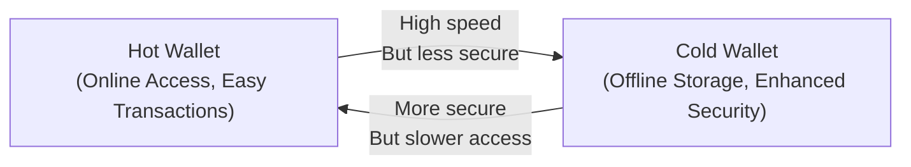

## Introduction

Ever accidentally locked yourself out of a social media account and had to jump through hoops to prove your identity? Well, owning digital assets can sometimes feel like that—only the stakes are much higher, and the regulatory landscape is a lot more complex. In this section, we’ll unpack the ever-evolving rules governing digital assets and explore the wide variety of custody solutions. After all, nobody wants to invest in a promising cryptocurrency or tokenized security only to wind up entangled in non-compliance or lose funds because of sloppy safekeeping.

## Global Regulatory Landscape

Digital assets can represent different things: securities, commodities, currencies, or something else entirely, depending on where you reside. In some regions, stablecoins might be regulated as electronic money, whereas in others, they might be considered unregistered securities. Perhaps you’ve heard stories of crypto exchanges relocating their headquarters every so often, chasing friendlier regulations. That’s regulatory arbitrage in action. The challenge here is that each jurisdiction tends to define and classify digital assets differently—and these definitions have far-reaching implications for trading, taxation, anti-money laundering (AML), and know-your-customer (KYC) requirements.

### Key Themes in Regulation

• Investor Protection: Regulators worldwide—like the SEC in the United States or the FCA in the UK—seek to protect retail investors from fraudulent initial coin offerings (ICOs), questionable token sales, and shady platform operators.  
• AML and CTF: Government bodies and global organizations such as the Financial Action Task Force (FATF) enforce rules that require crypto exchanges and other intermediaries to verify user identities, track suspicious transactions, and share information when necessary.  
• Disclosure Requirements: Issuers of crypto tokens that resemble securities must often provide detailed disclosures, akin to those required for traditional initial public offerings (IPOs).  
• Cross-Border Complexities: One way or another, digital assets tend to flow freely across borders, making it super tricky to comply with every local regulation. That means fund managers must stay current with new rules in multiple jurisdictions.

Feel a bit dizzy already? You’re not alone. This regulatory patchwork can be exhausting and somewhat intimidating. However, as we’ll see, understanding where your liability lies—and how to secure your assets—is absolutely vital.

## Defining Digital Assets Across Jurisdictions

It can be eye-opening to see how the same cryptocurrency might be tagged “property” in one country, “currency” in a second, and “security” in a third. No wonder consistent global compliance is so challenging.

• United States:  
  – Securities and Exchange Commission (SEC) focuses on tokens that fall under the Howey Test, treating “investment contracts” as securities.  
  – Commodities Futures Trading Commission (CFTC) maintains oversight over digital assets deemed as commodities, like Bitcoin in certain contexts.  
  – FinCEN imposes AML and KYC requirements on money service businesses, which often includes crypto exchanges.  

• European Union:  
  – The Markets in Crypto-Assets (MiCA) regulation aims to create a unified approach for member states, specifying licensing, disclosure, and capital requirements for digital asset service providers.  
  – Some stablecoins might be classified as e-money, requiring e-money licenses.  

• Asia-Pacific:  
  – Jurisdictions like Singapore and Hong Kong have partial “sandbox” frameworks, allowing growth while controlling risk.  
  – Other markets have taken a more prohibitive approach, restricting crypto-related activities due to concerns about fraud and capital flight.  

• Emerging Markets:  
  – Regulatory clarity varies significantly. Some countries promote crypto and blockchain to attract foreign investment, whereas others impose strict limits—sometimes banning cryptocurrency trading outright.

## Custody Solutions for Digital Assets

Alright, so you’ve acquired some digital assets. The next question: Where do you park them safely? Generally speaking, you can keep your assets in a wallet you control yourself (self-custody) or trust a professional custodian. Each route has pros and cons, and choosing the correct approach depends on the level of security you need, how often you plan to trade, and the regulatory environment you operate in.

### Self-Custody

Self-custody (or non-custodial storage) means you hold the private keys yourself: no bank, broker, or exchange stands between you and your assets. Think of it like keeping physical gold in your personal safe instead of storing it in a bank vault. This approach is popular among crypto enthusiasts who champion the “not your keys, not your coins” mantra.

• Hot Wallets:  
  – Connected to the internet and typically used for frequent transactions.  
  – Very convenient—think of your everyday checking account.  
  – Higher risk of cyberattacks and hacking attempts.  

• Cold Storage:  
  – Offline devices like USB hardware wallets, paper wallets, or specialized secure hardware modules (HSMs).  
  – Reduced cyber risk but less convenient for rapid trading.  
  – Ideal for long-term holding, sometimes called “hodling.”

### Third-Party and Institutional Custodians

Now, if you don’t want to be solely responsible for your private keys, you can hand the job to specialized custodians—like crypto exchanges that offer custody services—or regulated financial institutions that are branching out into digital assets. Institutional-grade custody services often have:

• Segregated accounts to separate client assets from the custodian’s own funds.  
• Robust insurance policies to shield against hacking or theft.  
• Best-in-class security infrastructure, including advanced authentication, multi-signature wallets, and well-monitored cold storage solutions.  

Granted, you’re relying on someone else’s security systems and operational procedures, so you’ll want to do some homework. That means operational due diligence, such as verifying regulatory compliance, analyzing their track record of security, and confirming they have the right level of insurance coverage.

## Spotlight on Cold Storage vs. Hot Storage

We can visualize storage solutions using a simple flow diagram that highlights the trade-offs between convenience and security:

The big question: Do you need immediate access to your assets, or is the priority rock-solid protection against hacking? You could split your holdings into two buckets (a hot wallet for day-to-day transactions, plus a cold wallet for long-term storage).

## Insurance Coverage for Digital Assets

The phrase “my crypto got hacked” can send shivers down anyone’s spine. Fortunately, specialized insurance for digital assets is gradually becoming more commonplace. Policies vary widely:

• Natural Disasters or Extreme Events: Some policies cover situations where assets might be lost because of catastrophic server failure or data-center damage.  
• Hacking and Cyber Theft: Coverage for online or hot wallets if an exchange or custodian is compromised.  
• Social Engineering Attacks: More advanced policies protect against deceptive tactics where criminals exploit human error.  

Key considerations include coverage limits, any sub-limits for hot vs. cold storage, and the insurer’s credit rating. Also ask: Are they regulated, and do they have enough underwriting capacity for large positions?

## Compliance Considerations for Managers

When you’re a portfolio manager or financial analyst dealing with digital assets on behalf of clients, you can’t just wing it. You need a compliance framework aligned with the regulations of every region you operate in.

• AML/KYC Programs:  
  – Collect and verify client data to prevent fraud or ties to criminal activity.  
  – Set transaction thresholds that trigger additional documentation or scrutiny.  

• Record-Keeping and Reporting:  
  – Monitor portfolio transactions, maintain an audit trail, and be prepared to share with regulators if requested.  
  – Some countries require real-time reporting of suspicious transactions.  

• Investor Suitability:  
  – Evaluate whether digital assets fit within a client’s risk tolerance, investment horizon, and liquidity needs.  
  – Disclose risks thoroughly and ensure the client comprehends them.  

• Cross-Border Operations:  
  – If your fund invests in multiple jurisdictions, consult legal experts on specific local requirements.  
  – Factor in currency controls, capital restrictions, and potential trade compliance issues.

## Real-World Example: Stablecoin Classification

Imagine a scenario where your firm invests in a global stablecoin that’s pegged to the U.S. dollar. You might find:

1. In your home country, the stablecoin isn’t recognized as a security, so the local securities regulator doesn’t impose direct rules on it.  
2. In a neighboring country, that stablecoin is classified as a form of e-money, requiring an e-money license, monthly transaction caps, and stringent AML checks.  
3. Meanwhile, in a third territory, the stablecoin may be wholly unregulated; your firm still must abide by internal policies or risk reputational fallout.

What do you do? Often, large fund managers create subsidiaries or special-purpose vehicles (SPVs) to comply with country-specific requirements. This can get complicated fast, especially if you’re simultaneously dealing with a half-dozen regulatory regimes. But it underscores the importance of doing your homework and setting up robust compliance guidelines.

## Best Practices and Common Pitfalls

• Keep Up with Evolving Laws: Digital asset laws can change in a blink. Assign someone on your team to track regulatory updates from bodies like the FATF, SEC, and other relevant authorities.  
• Perform Thorough Operational Due Diligence: Before handing assets to any custodian, vet their security infrastructure, insurance coverage, and track record.  
• Diversify Custody Approaches: Don’t store all your crypto eggs in one wallet. A mix of hot and cold storage solutions might offer a balance of accessibility and security.  
• Understand Tax Implications: Depending on your region, capital gains on cryptocurrency trades or staking rewards may require special reporting.  
• Avoid Complacency: Even if a system has never been hacked, new vulnerabilities can appear. Ongoing audits and stress tests can help you stay a step ahead of the bad guys.  

## Case Study: Multi-Signature Custody Dilemma

A small hedge fund, “VisionDigi Alternatives,” specialized in digital asset strategies. They used a multi-signature wallet for extra security—requiring three out of five private keys to authorize a transaction. One of their partners moved overseas to a jurisdiction with different internet censorship policies (and occasionally cut off secure access). Suddenly, routine rebalancing became a headache. The fund had to revise their approach, storing at least one key in a safe deposit box stateside and ensuring backup signatures could be triggered if an authorized user lost connectivity. This story reminds us to design custody solutions around not just technology, but also human workflows and potential cross-border constraints.

## Practical Exam Tips

• When tackling exam questions related to digital asset regulation, look for key phrases such as “AML compliance,” “Regulatory arbitrage,” or “Cross-border solutions” to identify the correct framework.  
• For questions about custody, pay close attention to which scenario demands immediate liquidity (often implying hot storage) vs. long-term holding (cold storage).  
• If a question references stablecoins or tokenized securities, consider the classification rules under major jurisdictions and how those might differ.  
• Watch out for pitfalls in multi-step item sets where you must apply cohesive logic across different aspects—like evaluating the security of custody solutions, determining regulatory compliance, and calculating potential capital gains or losses.

## References and Further Reading

• Burniske, C., & Tatar, J. (2017). Cryptoassets: The Innovative Investor’s Guide to Bitcoin and Beyond.  
• Financial Action Task Force (FATF) Guidelines:  
  https://www.fatf-gafi.org/  
• Chapter 7.1, “Blockchain Technology and Distributed Ledgers,” in this volume for foundational concepts.  
• Chapter 8.2, “Risk Management Tools and Techniques,” for how to integrate digital asset risk controls into broader portfolios.

---

## Test Your Knowledge of Regulatory Developments and Custody Solutions



### Which of the following best describes regulatory arbitrage in the digital asset space?

- [ ] Investing in risk-free arbitrage opportunities between two crypto exchanges.
- [x] Exploiting different regulatory definitions or rules between jurisdictions.
- [ ] Using multi-sign wallets to reduce hacking risks.
- [ ] Avoiding any form of AML or KYC compliance through offshore structures.

> **Explanation:** Regulatory arbitrage happens when companies or investors move to jurisdictions offering more favorable or less restrictive regulations for digital assets.

### Which global entity sets standards for Anti-Money Laundering (AML) and Counter-Terrorism Financing (CTF) measures?

- [ ] The Office of Foreign Assets Control (OFAC)
- [ ] The European Central Bank (ECB)
- [x] The Financial Action Task Force (FATF)
- [ ] The Commodity Futures Trading Commission (CFTC)

> **Explanation:** The FATF is an intergovernmental body that establishes global standards for AML and CTF. OFAC, ECB, and CFTC have their roles, but FATF specifically focuses on AML/CTF guidelines.

### When using a cold wallet for custodial services, which of the following is most accurate?

- [ ] Cold wallets are always connected to the internet, facilitating quick transactions.
- [ ] They are less secure than a hot wallet but easier to use.
- [x] They are stored offline, reducing exposure to hacking.
- [ ] They eliminate the need for private keys entirely.

> **Explanation:** Cold wallets remain offline, which significantly lowers hacking risks compared to hot wallets. However, they still rely on private keys and can be less convenient for frequent trading.

### A digital asset that qualifies as a security in one jurisdiction but not in another highlights:

- [x] The patchwork nature of global crypto regulations.
- [ ] That all digital assets must adhere to U.S. SEC guidelines.
- [ ] A universal standard for stablecoin issuance.
- [ ] Global consensus on token classification.

> **Explanation:** The legal classification of a digital asset can vary widely among countries. This lack of harmonization leads to jurisdictional inconsistencies.

### Which is a key advantage for institutional-grade custody providers in the digital asset market?

- [x] They often carry insurance coverage against hacking and theft.
- [ ] They only use hot wallets, ensuring instant access to all assets.
- [x] They may offer segregated accounts and robust security protocols.
- [ ] They are typically unregulated, reducing administrative requirements.

> **Explanation:** Institutional custodians commonly provide insurance and sophisticated security solutions, such as segregated cold storage. They are typically regulated because they handle client funds.

### Which statement about stablecoins is true in a cross-border regulatory context?

- [x] Some jurisdictions classify stablecoins as e-money, requiring specific licenses.
- [ ] Stablecoins are universally recognized as securities everywhere.
- [ ] Stablecoins are illegal in all European Union countries.
- [ ] Global regulations treat stablecoins identically to fiat currencies.

> **Explanation:** Certain regulators equate stablecoins to e-money, mandating related licensing requirements. Regulation overall remains fragmented.

### A firm that fails to implement robust AML and KYC procedures when dealing with digital assets risks:

- [x] Regulatory fines and potential loss of operating licenses.
- [ ] Access to more investors, as it reduces onboarding time.
- [x] Criminal exposure if laundering or terrorist financing is traced to clients.
- [ ] Exemption from cross-border regulatory oversight.

> **Explanation:** Regulators can impose penalties—or even revoke licenses—if AML and KYC protocols are inadequate. Moreover, ignoring AML/KYC can lead to serious legal ramifications.

### A significant drawback of storing the majority of a fund’s digital assets in a hot wallet is:

- [x] Increased vulnerability to hacking due to constant internet connectivity.
- [ ] Complete elimination of the need for private keys.
- [ ] Reduced liquidity and delayed transaction times.
- [ ] Inherent isolation from global regulatory requirements.

> **Explanation:** Hot wallets are continuously exposed to online threats. While they provide quick access for trades, they carry a higher cyber-risk profile than offline cold storage.

### One common best practice for digital asset custody is to:

- [x] Diversify which wallets and custodial providers are used.
- [ ] Store assets solely with one exchange for convenience.
- [ ] Encourage clients to avoid any form of insurance to save on costs.
- [ ] Skip ongoing audits of the custody solutions once they’re set up.

> **Explanation:** Spreading digital assets across different wallet types or custodial services can help mitigate risk. Ongoing audits also ensure that the technologies and procedures remain secure and up to date.

### When classifying a digital token for regulatory purposes, it is:

- [x] True that different jurisdictions may classify the token differently.
- [ ] False that any token can be considered a currency in any part of the world.

> **Explanation:** Regulatory bodies worldwide apply different standards, so a token might be deemed a security in one place and a currency or commodity in another.


