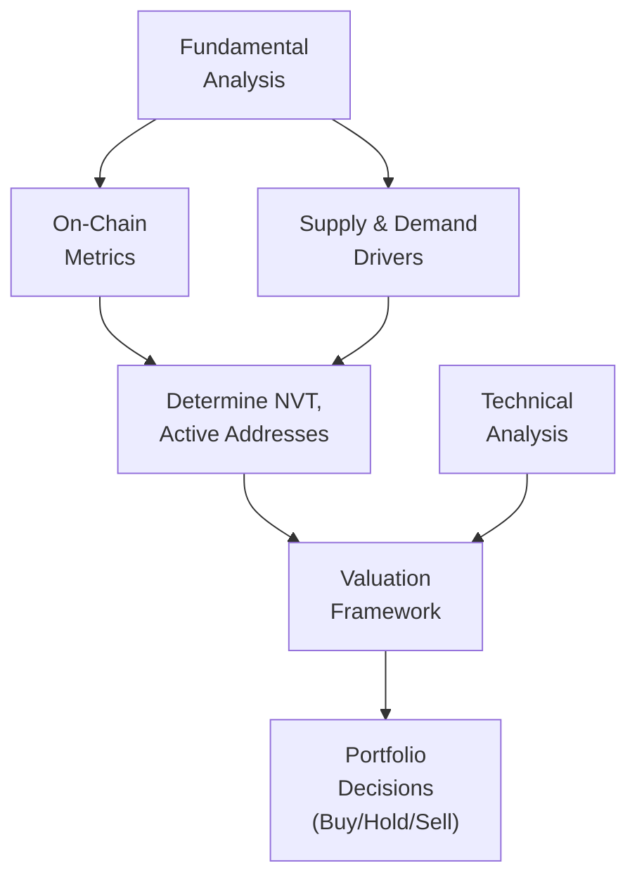
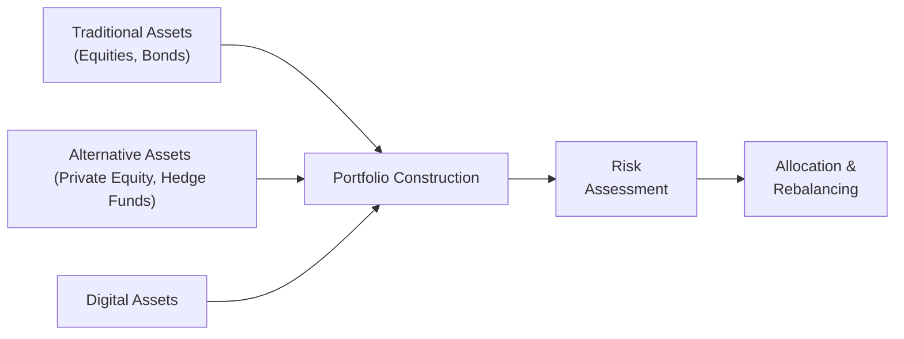

## Introduction

Digital assets—particularly cryptocurrencies—are, quite honestly, unlike anything we’ve seen in more traditional financial markets. I remember chatting with a friend a few years ago who told me, “Hey, I just bought a digital token that allows you to earn interest by staking it on the protocol!” I was intrigued and, well, slightly baffled. What were the metrics for determining fair value? How do we figure out if we’re overpaying or whether it’s just hype?

This section dives into the core valuation frameworks for digital assets and explains how they can be applied within a broader portfolio. We’ll cover fundamental valuation approaches (like on-chain activity metrics and supply-demand dynamics), technical analysis tricks (those fancy charts you see on crypto forums), and the various ways digital assets might fit into a well-balanced portfolio.

## Key Valuation Approaches

### Fundamental Analysis

Traditional fundamental analysts often look at metrics such as earnings, cash flow, and competitive positioning. But for digital assets—where many don't generate classical cash flows—alternative data analysis is essential.

• Supply Constraints: Many cryptocurrencies have a fixed or predictable supply schedule (e.g., Bitcoin). If supply is capped and demand grows, we might see upward price pressure.  
• Adoption Rates and Network Activity: The more robust the network (measured by daily active addresses, transaction counts, or developer activity), the more likely the asset’s usage and perceived value will increase.  
• Protocol Utility: For platforms like Ethereum or other smart contract blockchains, we examine the utility of the native token (e.g., used for paying transaction fees, staking, governance, or other functionalities).  
• Competition and Network Effects: A protocol with broad user and developer support can establish strong network effects. Once an ecosystem is developed, it’s hard for new entrants to topple.

One of the more popular on-chain metrics is NVT (Network Value to Transactions), which relates a cryptocurrency’s market capitalization (sometimes called “network value”) to its daily transactional volume:


\text{NVT Ratio} = \frac{\text{Market Capitalization}}{\text{Daily On-Chain Transaction Volume}}


If the ratio is high, it could suggest that the asset’s price is outpacing the transactional value that’s actually moving across the network—maybe a sign of froth; if it’s relatively low, the coin might be undervalued relative to its real usage.

### Technical Analysis

Digital asset markets remain heavily influenced by retail investors, so short-term price swings can be dramatic. Because of this, many participants rely on technical analysis (TA) to guide their trading decisions:

• Chart Patterns: Support and resistance levels, triangles, and Fibonacci retracements are common.  
• Momentum Indicators: Tools like the Relative Strength Index (RSI) or Moving Average Convergence Divergence (MACD) help identify possible trend shifts.  
• High Volatility Tactics: Given the rapid price movements, traders apply quick momentum strategies or watch for short-term breakouts.

While technical analysis can feel, well, a bit mystical at times, it has gained traction among digital asset traders. For medium to longer-term investors (like institutional asset managers), TA might be used to optimize entry and exit points rather than to drive overarching investment theses.

## Diagram: A Simple Digital Asset Valuation Overview

Below is a Mermaid diagram summarizing different inputs to digital asset valuation:

## Portfolio Applications

### Diversification Benefits

One of the big draws of digital assets is their **potential** diversification benefit. Historically, digital assets have shown moderate correlations with equities, though these correlations can spike in times of market stress. If an asset’s returns are uncorrelated (or less correlated) with the rest of your portfolio, it can potentially reduce overall portfolio volatility—although, ironically, the digital asset itself can be super-volatile.

### Inflation Hedge

Some argue that limited-supply cryptocurrencies (like Bitcoin) might serve as an inflation hedge (kind of like digital gold). Although the data suite is not as extensive as with classic inflation hedges—like real estate or commodities—anecdotal evidence suggests that capital sometimes flows into such tokens when inflation fears rise.

### Speculative Growth

Let’s be straightforward: a lot of folks buy digital assets because the potential upside can be enormous—“moonshots,” as some crypto enthusiasts say. Of course, that goes hand in hand with extreme volatility and risk. Institutions or high-net-worth individuals might allocate a small percentage of their total portfolio to digital assets to capture that upside potential without jeopardizing their entire capital base.

### Correlation Dynamics

Correlations can shift dramatically:

• In “risk-on” market phases, digital assets can rally alongside equities.  
• In a macro liquidity crisis, correlations may converge—leading to abrupt selloffs in both traditional and digital asset markets.  
• Over longer horizons, correlation patterns are less stable. Some periods show a correlation near zero, while others show close interplay with equity moves.

Because these relationships shape how portfolio risk accumulates, it’s essential to keep tabs on correlation measures over time. This knowledge helps in rebalancing decisions or in deciding whether to hold or trim digital asset allocations when correlation drifts too high.

### Managing Volatility and Liquidity

• **Volatility**: With intraday swings of 5–10% fairly common, position sizing and robust risk management are crucial. Some institutions use more advanced volatility-targeting strategies or might hedge partial exposures using futures or options.  
• **Liquidity**: Some large-cap digital assets (like Bitcoin or Ethereum) are relatively liquid, whereas smaller-cap coins can face big spreads or frequent order book imbalances. If you’re trading large size, you might need OTC (over-the-counter) brokers or request block trades from specialized desks.

## Example: Small Institutional Allocation

Imagine a small pension fund that aims to enhance overall returns with a modest, let’s say 2%, allocation to digital assets (mostly Bitcoin and Ethereum). Portfolio managers do the following:

1. Fundamental Screening: They note that these two assets have historically had a lower correlation with equities and a proven track record (well, in crypto terms) of liquidity.  
2. Technical Analysis: They consider the market’s 200-day moving average to gauge a more favorable entry point.  
3. Ongoing Monitoring: They watch on-chain transaction volumes and the NVT ratio to ensure the market doesn’t appear overheated.

This approach, while by no means risk-free, can potentially boost the portfolio’s risk-adjusted returns if digital assets continue to perform differently than equities or bonds. However, the managers remain mindful of the possibility that correlations may spike and that dramatic drawdowns could happen quickly.

## Common Pitfalls and Best Practices

• **Pitfall:** Overreliance on a single metric (like NVT) to make buy/sell decisions.  
• **Best Practice:** Combine multiple on-chain measures (like active addresses, developer commits, staking participation) and fundamental signals (regulatory changes, major partnerships) for a holistic view.

• **Pitfall:** Using too much leverage in highly volatile markets.  
• **Best Practice:** If leverage is employed, define strict stop-loss levels and monitor margin requirements. Because digital asset prices can move fast overnight, risk controls must be robust.

• **Pitfall:** Neglecting regulatory uncertainty.  
• **Best Practice:** Watch evolving rules around exchanges, stablecoins, and token offerings. Periodic regulatory clampdowns have historically caused precipitous drops in asset prices.

• **Pitfall:** Lack of well-defined exit strategy.  
• **Best Practice:** Decide in advance how you will exit if the market turns. That might include trailing stop-loss orders, rebalancing triggers, or simply a time-based exit if your investment thesis doesn’t pan out within a specified horizon.

## Additional Diagram: Integrating Digital Assets in a Portfolio

## Conclusion

Valuing digital assets demands creativity and flexibility. Traditional methods—like fundamental analysis—get a new twist via metrics such as on-chain transaction volume, supply constraints, developer activity, and ratio analyses (like the NVT ratio). Meanwhile, technical analysis can help time trades, especially in the volatile, retail-driven crypto markets. From a portfolio perspective, small allocations to “blue-chip” digital currencies might offer diversification benefits and a shot at enhanced returns, but they also come with unique risks like regulatory uncertainty, high volatility, and the possibility of market manipulation.

So, if you’re venturing into digital assets—whether as a short-term trader or a long-term investor—it’s best to combine these valuation frameworks, keep your eyes on correlation shifts, and adopt disciplined risk management. Perhaps the greatest lesson is: never invest more than you can afford to ride through extreme swings, because “to the moon” might be the dream, but “back to Earth” can happen just as fast.

## References

• “Cryptoassets Valuation” series on CoinDesk Research:  
  https://www.coindesk.com/research/

• “Handbook of Digital Currency” edited by David Lee Kuo Chuen

• CFA Institute, “Alternative Investments” (for general alternative asset frameworks)

• Various real-time aggregator services for on-chain metrics (e.g., Glassnode, Coinmetrics)

------------------------------------------------------------------------------------------

## Test Your Knowledge: Digital Asset Valuation and Portfolio Strategies



### Which metric compares a cryptocurrency’s market capitalization to its daily transaction volume?

- [ ] Financial Leverage Ratio
- [x] NVT (Network Value to Transactions)
- [ ] Earnings per Token
- [ ] Price-to-Book Ratio

> **Explanation:** NVT is the ratio of market cap to daily on-chain transaction volume, used to assess a network’s valuation relative to its actual usage.

### When correlations between digital assets and equities increase during market stress, what is the main implication for a portfolio?

- [ ] Digital assets continue to act as a perfect hedge.
- [x] Diversification benefits might diminish.
- [ ] Risk is automatically reduced.
- [ ] Portfolio returns become entirely uncorrelated.

> **Explanation:** If correlations spike, the diversification benefit that digital assets may have previously provided diminishes, increasing overall portfolio risk.

### Why do some investors view cryptocurrencies with fixed supply (e.g., Bitcoin) as an inflation hedge?

- [x] Because their supply cannot be expanded arbitrarily.
- [ ] Because they have intrinsic value from dividend yields.
- [ ] Because central banks set their supply each year.
- [ ] Because they are regulated like commodities.

> **Explanation:** A fixed or formula-based supply phenomenon suggests that as demand increases while supply remains limited, the asset could potentially serve as an inflation hedge.

### If a technical analyst is checking the 200-day moving average, which of the following is most likely the purpose?

- [ ] To calculate the intrinsic value of the cryptocurrency.
- [x] To identify the long-term trend or entry/exit points.
- [ ] To determine the NVT ratio.
- [ ] To measure real on-chain activity.

> **Explanation:** Moving averages help identify price trends, support/resistance zones, and potential buy or sell signals, especially over a longer timeframe.

### A portfolio manager wants to limit the impact of digital asset volatility. Which strategy is most appropriate?

- [x] Small allocation, strict position sizing.
- [ ] Use only short-selling strategies.
- [ ] Invest 100% in a single small-cap crypto.
- [ ] Rely purely on highly leveraged futures trading.

> **Explanation:** Keeping the digital asset allocation small and using disciplined position sizing can help contain volatility risk.

### What does the term “on-chain activity” typically refer to?

- [ ] The amount of capital raised by private equity funds.
- [ ] Website traffic for blockchain research portals.
- [x] Actual transactions recorded on the blockchain.
- [ ] The usage of off-exchange trading data.

> **Explanation:** On-chain activity indicates transactions that are validated and written into blocks on the blockchain, making it publicly visible and trackable.

### Which of the following is a key difference compared to valuing traditional stocks?

- [x] Digital assets often do not have easily discernible cash flows.
- [ ] The supply of digital assets is unlimited.
- [ ] Technical analysis is not applicable to digital assets.
- [ ] Fundamental analysis does not exist for digital assets.

> **Explanation:** Unlike traditional stocks, many digital assets generate no direct cash flows (like dividends), so alternative metrics (like NVT, active addresses) are used.

### During extreme market downturns, which risk factor is most likely to amplify price drops in digital assets?

- [x] Liquidity drying up and spread widening.
- [ ] Sudden spike in coupon rates.
- [ ] Decrease in short-selling activity.
- [ ] Improved correlation with government bonds.

> **Explanation:** Fast-moving markets can see liquidity vanish and spreads widen, forcing deeper selloffs at unfavorable prices.

### Which of the following best describes the role of ratio analyses (e.g., NVT) in valuing digital assets?

- [ ] They predict exact future prices.
- [x] They provide a sense of whether market cap aligns with usage.
- [ ] They replace all fundamental and technical research.
- [ ] They are used only for stablecoins.

> **Explanation:** Ratio analyses like NVT help gauge if a network’s value is reasonable given how much transaction activity is actually taking place.

### True or False: Institutional investors typically make large (50%+) allocations to digital assets because of their low correlation with traditional assets.

- [ ] True
- [x] False

> **Explanation:** Institutional investors typically allocate a small percentage (e.g., 1–5%) to digital assets, given extreme volatility, regulatory uncertainty, and other risk factors.


