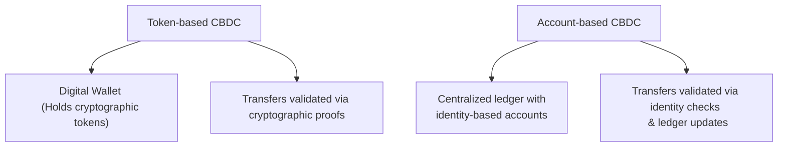
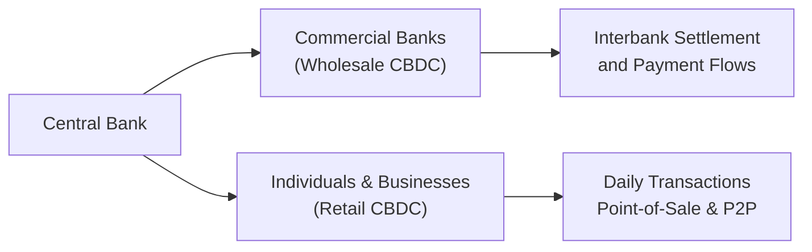

## Introduction

Central Bank Digital Currencies (CBDCs) can feel like something out of a sci-fi thriller—digital money created by a country's central bank that could transform how we transact, save, and even conceptualize money. But trust me, it's quite real. In 2020, when I first heard about the Bahamas’ Sand Dollar pilot, I remember leaning back in my chair and saying, "Wait, an entire country is backing a purely digital currency that's not a private crypto token?" It sounded futuristic, but it also signaled the big changes we might see in fiat currency systems as technology advances.

This section provides a detailed overview of CBDCs, focusing on their design, retail vs. wholesale applications, potential benefits, and possible drawbacks. We’ll also explore how CBDCs might reshape certain aspects of monetary policy, cross-border payments, and the broader economic system. By the end, you’ll have a comprehensive understanding of how these digital assets fit into the alternative investments landscape—and hopefully enough context to view them both as an innovation and a challenge in modern finance.

## Defining Central Bank Digital Currencies

CBDCs are digital forms of a nation’s fiat currency issued by the central bank. Unlike private cryptocurrencies such as Bitcoin, a CBDC is backed by the full faith and credit of the issuing government. Central banks worldwide are exploring pilot programs, from China’s e-CNY to Sweden’s e-Krona and even the European Central Bank’s digital euro experiments. While different in execution and scope, these programs share the goal of leveraging digital currency technology to enhance payments, monetary policy efficiency, and financial inclusion.

## Potential Benefits

### Faster Transaction Settlement
One of the most buzzworthy promises of CBDCs is speed. Traditional bank transfers—especially cross-border ones—can be exasperatingly slow. Retail CBDCs often settle transactions within seconds, thanks to usage of distributed ledger technologies (DLTs), centralized real-time transaction networks, or a hybrid of both. Faster settlements can improve liquidity, reduce counterparty risk, and streamline day-to-day payment flows.

### Enhanced Financial Inclusion
CBDCs aim to reach underbanked or unbanked populations by offering direct access to the nation’s digital currency if you have a smartphone or a basic digital wallet. For instance, an individual might download a government-endorsed app or use a stored-value card to transact in CBDCs, bypassing the need for a traditional bank account. This can be revolutionary for developing nations with large rural populations, bridging the gap in financial services provisioning.

### Reduced Transaction Fees
The cost advantages can be compelling. The plumbing of a CBDC system (where the central bank manages most of the payment infrastructure) can reduce reliance on third-party payment processors. In theory, a consumer sending money to a friend or paying a bill could incur very minimal fees—or even none at all—depending on how the central bank structures transaction costs.

### Improved Oversight in Gray Markets
CBDCs can offer near real-time tracking of transactions, allowing central banks and authorized regulators to monitor suspicious activities more effectively. This is one reason some governments advocate for CBDCs: they wish to counter money laundering, tax evasion, and other illicit flows.

## Key Concerns and Risks

### Privacy Issues and Data Security
Of course, if central banks collect near real-time transaction data, how do we ensure user privacy? This is probably the big question. A digitally traceable currency raises concerns that government agencies might track citizens’ everyday purchases, affecting civil liberties. Central banks around the globe are wrestling with this trade-off, exploring ideas like zero-knowledge proofs, policy-based anonymity thresholds, or tiered identity solutions to address privacy and anti-money-laundering (AML) compliance simultaneously.

### Large-Scale Technological Complexity
Implementing a CBDC is no trivial endeavor. From cryptographic security to building robust payment rails that process millions (or billions) of transactions daily, the technology demands are enormous. Moreover, operational resilience is critical: if a CBDC payment network goes down, that’s the equivalent of the physical cash system failing. Central banks require enterprise-grade solutions with redundancy, failsafes, and rigorous cybersecurity.

### Risk of Bank Disintermediation
Imagine a world where consumers hold large amounts of money in direct central bank-issued digital wallets rather than in traditional bank deposits. Commercial banks would face liquidity shortfalls in deposits—undermining their ability to lend and manage credit creation. Monetary policy efficacy could change, as the traditional distribution mechanism for funds through commercial banks might be overshadowed by direct central bank issuance. Indeed, to mitigate this risk, some designs limit how much CBDC an individual can hold.

## Retail vs. Wholesale CBDCs

CBDCs typically come in two flavors: retail and wholesale.

### Retail CBDC
Retail CBDCs are for individuals and businesses to use in everyday transactions, like buying groceries or paying monthly bills. Think of it as a digital banknote—a direct claim on the central bank, accessible through a smartphone or another device. One example is the Eastern Caribbean Central Bank’s DCash pilot, which aims to promote digital payments in a multi-island region.

### Wholesale CBDC
Wholesale CBDCs function primarily among financial institutions for interbank settlements and large-scale transactions. If, for instance, a commercial bank owes another bank $10 million in overnight funds, that transaction could be settled in near real-time with a wholesale CBDC. This can reduce transaction latencies, mitigate counterparty risk, and increase efficiency in clearing and settlement processes. The average consumer might never “see” a wholesale CBDC directly, but it could speed up the entire banking system behind the scenes.

## Token-Based vs. Account-Based Architecture

One of the big design choices is determining whether the CBDC follows a token-based or an account-based architecture.

- Token-based CBDCs operate somewhat like cryptocurrencies: a user holds cryptographic tokens in a digital wallet. Ownership is proven by possessing the token and the private key that controls it. This structure is akin to how you hold physical cash—possession is (mostly) the proof of ownership.
- Account-based CBDCs are similar to existing bank accounts, where the central bank (or an intermediary) maintains a ledger tied to user identities. When users transact, the ledger updates user account balances. This approach is arguably more straightforward for regulators because it integrates identity verifications (KYC/AML) directly.

Below is a simple diagram showing a conceptual flow of token-based and account-based approaches:

## Monetary Policy Implications

CBDCs could transform how central banks monitor and implement monetary policy. With finer-grained control over money creation and distribution, central banks might be able to adjust parameters (such as interest on CBDC holdings) more directly. However, this also introduces complexities:

• If a central bank pays interest on a retail CBDC, the demand for commercial bank deposits may decline.  
• Direct flows of money to consumers (via “helicopter drops”) could be performed more efficiently with CBDCs, but this might raise inflationary concerns if not carefully managed.  
• Improved transaction data could help policymakers track economic activity in real time.  

Economic theories often revolve around money supply (M) and velocity (V). While we might not want to get overly formal, the classic equation of exchange is:


M \times V = P \times Q


where:  
• \\( M \\) = Money Supply  
• \\( V \\) = Velocity of Money  
• \\( P \\) = Price Level  
• \\( Q \\) = Real Output (Quantity)

CBDCs may alter both \\( M \\) and \\( V \\) in new ways, especially if digital transactions accelerate velocity or change how people hold their funds.

## Cross-Border CBDCs and Interoperability

Cross-border payment systems are notoriously slow and expensive. With a properly designed CBDC infrastructure, two partner countries could drastically reduce the cost and complexity of converting currency and settling payments. This might be done through:

• Shared or interoperable ledgers that handle real-time currency exchanges.  
• Smart contracts that automatically enforce exchange rates and settlement.  
• Joint pilot programs that unify cross-border transaction protocols.

A real-world example includes the BIS Innovation Hub’s “Project mBridge,” exploring multi-CBDC arrangements to support real-time cross-border payments. But we’re not quite there yet—standardization challenges, conflicting regulations, and local monetary policies often create roadblocks to wide-scale global adoption.

## Pilot Programs Around the World

### China (e-CNY)
China’s digital yuan, or e-CNY, has garnered significant attention. It’s being tested in major cities, allowing citizens to carry out daily transactions using an app. The People’s Bank of China has also been analyzing how it might integrate foreign visitors and cross-border payments into its digital framework.

### Sweden (e-Krona)
The Swedish Riksbank recognized the declining usage of cash in Sweden and started exploring the e-Krona. The pilot aims to ensure that Sweden’s financial infrastructure remains robust and inclusive even if physical cash nearly vanishes.

### The Bahamas (Sand Dollar)
I actually recall being surprised when the Bahamas launched the Sand Dollar, making it one of the earliest nationwide CBDCs to go live. The island-based economy has unique challenges—like high remittance costs, multiple remote islands, and tourism dependence—making a digital currency especially appealing for facilitating inter-island commerce.

These pilots reveal different approaches and demonstrate that no “one size fits all” design exists. Analysts should keep an eye on these programs to understand where the global adoption of CBDCs might be heading.

## Diagram of a Simplified CBDC Ecosystem

In many models, both wholesale and retail CBDCs coexist, but they serve different segments of the financial system.

## Practical Applications and Case Studies

### Case Study: Jamaica’s JAM-DEX
Jamaica introduced the JAM-DEX (the Jamaican Digital Exchange), hoping to boost financial inclusion. They used incentives like small government-provided balances for every new user. While uptake has been gradual, it underscores how a central bank might use promotional tactics to jumpstart adoption.

### Case Study: Uruguay’s e-Peso
Uruguay’s central bank tested an e-Peso pilot, focusing on ease of use and offline functionality. Interestingly, they allowed transactions to occur without constant internet access—a crucial feature for rural areas with inconsistent connectivity.

### Possible Pitfalls
• Citizens might resist the switch if they’re concerned about data privacy or if usage is cumbersome.  
• Technological hurdles such as coverage issues, power outages, or device access can undermine adoption.  
• In countries with robust banking systems, a CBDC might overlap with existing e-money solutions, limiting uptake.

## Summary of Best Practices

• Thoroughly define the purpose of the CBDC (e.g., financial inclusion, cheaper payments, digital transformation) to align design with policy goals.  
• Implement robust cybersecurity and data privacy safeguards.  
• Offer user-friendly interfaces—people who are new to digital finance need intuitive solutions.  
• Ensure compliance with local and international regulations, especially regarding financial stability.  
• Pilot extensively and gather feedback from real-world usage to refine the CBDC solution before a large-scale rollout.

## Exam Tips and Strategies

• Familiarize yourself with the concepts of retail vs. wholesale CBDCs and how they impact banks, businesses, and consumers.  
• Understand the distinction between token-based and account-based designs. Don’t forget to highlight the benefits and drawbacks.  
• Know the likely challenges for cross-border CBDCs, including regulatory barriers and technological complexities.  
• Keep your eyes on pilot programs and glean insights into how they might be tested on a small scale before being adopted broadly.  
• Remember potential impacts on monetary policy—especially how CBDCs could either enhance or complicate central bank tools.

From an exam perspective, you might see scenario-based questions where you have to evaluate the effect of a hypothetical CBDC on the financial system. Be prepared to discuss how it influences velocity, inflation, interest rates, and even broader topics such as the role of commercial banks.

## References and Further Reading

- Bank for International Settlements (BIS):  
  [https://www.bis.org/](https://www.bis.org/)  
  (Helpful for detailed reports on global CBDC initiatives and technical prototypes.)

- Official Announcements from Central Banks:  
  Stay updated on websites of the People’s Bank of China (PBoC), the Riksbank (Sweden), the Bahamas Central Bank, and others.

- IMF FinTech Notes and Papers:  
  Offer a broader perspective on digital currency and regulatory considerations.

- “The Tech Behind Digital Currencies” by the CFA Institute Research Foundation:  
  A specialized report focusing on technology fundamentals relevant to CBDCs and digital assets at large.

- For a deeper dive into the concepts of retail payments and microfinance, see “Payment Systems in the Digital Age: A Global Perspective” by the World Bank.

## Test Your Knowledge: Central Bank Digital Currencies Quiz



### Which of the following best describes CBDCs?

- [x] A digital form of a country's fiat currency issued by its central bank
- [ ] A privately issued digital token pegged to a basket of currencies
- [ ] A fully decentralized cryptocurrency with no central authority
- [ ] A form of physical cash accepted in digital transactions

> **Explanation:** CBDCs are specifically issued and regulated by a central bank, directly representing a country’s fiat money in digital form.

### Which statement is most accurate regarding the difference between retail and wholesale CBDCs?

- [x] Retail CBDCs target everyday transactions for the general public, while wholesale CBDCs facilitate interbank settlements.
- [ ] Retail CBDCs are always built on blockchain; wholesale CBDCs are never built on blockchain.
- [ ] Retail CBDCs serve only cross-border transactions; wholesale CBDCs serve only local transactions.
- [ ] Wholesale CBDCs must be interest-bearing, whereas retail CBDCs cannot be.

> **Explanation:** Retail CBDCs are intended for public use in smaller-scale transactions, while wholesale CBDCs are expressly designed for financial institutions to settle large-scale, interbank transactions.

### What is a primary concern regarding CBDCs and privacy?

- [ ] The system will always enable anonymous transactions for all participants.
- [x] The central bank could potentially track and record individual transaction data.
- [ ] Privacy concerns are irrelevant because CBDCs are not traceable.
- [ ] Commercial banks are excluded from all transaction data oversight.

> **Explanation:** One of the biggest issues with CBDCs is that they can be tracked more easily by authorities, raising important debates around data privacy and user protections.

### How might CBDCs affect monetary policy?

- [x] They could provide the central bank a more direct channel to manage the money supply and possibly adjust velocity.
- [ ] They would have no effect on how interest rates or money supply are managed.
- [ ] They would only matter if physical cash is removed from circulation.
- [ ] CBDCs necessarily negate the use of open market operations.

> **Explanation:** With CBDCs, central banks can potentially implement targeted monetary measures (e.g., setting interest rates on digital currency holdings) and get near real-time data on currency usage.

### Which of these solutions could help address privacy concerns in a CBDC system?

- [x] Implementing zero-knowledge proofs or tiers of transparency for different transaction sizes
- [ ] Eliminating user identification requirements entirely
- [x] Employing robust cryptographic methods to mask transaction details
- [ ] Making all transactions publicly viewable on a commercial bank’s website

> **Explanation:** Many central banks are exploring cryptographic techniques (sometimes zero-knowledge proofs or tiered KYC) to protect user privacy while still fulfilling AML/CFT requirements.

### Which statement best captures the concept of disintermediation through CBDCs?

- [x] Individuals could bypass commercial banks by holding significant balances directly with the central bank.
- [ ] Commercial banks opting to buy government bonds in bulk.
- [ ] The CBDC cannot be used beyond the borders of the issuing country.
- [ ] There is always a need for multiple intermediaries when using CBDCs.

> **Explanation:** One risk of CBDCs is that people might not need commercial bank deposits if they can hold balances directly at the central bank, thus reducing commercial banks’ role as intermediaries.

### From an exam standpoint, an analyst assessing a CBDC pilot program should focus on:

- [x] The implications for velocity of money and commercial banking operations
- [ ] The performance of physical cash substitution in a neighboring country
- [x] The technology infrastructure supporting real-time settlements
- [ ] Irrelevant developments in non-fiat cryptocurrencies

> **Explanation:** Understanding how CBDCs affect monetary dynamics, banking, and payment systems—and the technologies enabling them—is key for analyzing their implementation and policy impact.

### Which country is known for pioneering the Sand Dollar, one of the first nationwide CBDCs?

- [x] The Bahamas
- [ ] China
- [ ] Sweden
- [ ] Uruguay

> **Explanation:** The Bahamas launched the Sand Dollar pilot program, becoming one of the earliest countries to go live with a CBDC.

### What is one major potential advantage of cross-border CBDCs?

- [x] They could lower foreign exchange transaction costs and expedite settlement times.
- [ ] Cross-border CBDCs are guaranteed to eliminate all currency risks.
- [ ] They remove the need for monetary policy coordination among countries.
- [ ] They are exempt from all local regulatory constraints.

> **Explanation:** Cross-border CBDCs can reduce the typical delays and expenses of converting currencies internationally, but they do not eliminate currency risk or regulatory complexities altogether.

### True or False: A wholesale CBDC is designed primarily for end users to make everyday purchases.

- [x] True
- [ ] False

> **Explanation:** This statement is actually false. Wholesale CBDCs target interbank transactions. However, note that some advanced questions might list a statement in a tricky way. (In a real exam, read the statements carefully to avoid mistakes!)


