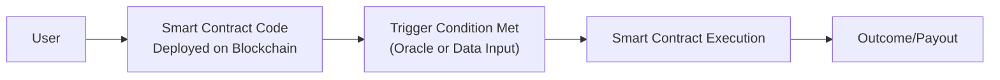

## Overview

Smart contracts—these little bits of code that live on blockchain networks—are quickly becoming one of the most fascinating innovations in finance. In short, they’re self-executing contracts that trigger automatically when certain predefined conditions are met. If you’ve read about decentralized finance (DeFi) at all, you’ve almost certainly seen these mentioned. Yet, the real magic kicks in when you realize that once a smart contract is deployed, it runs without direct human intervention. No single authority can simply step in and hit a pause button. Yes, that can be a bit scary—especially if there’s a bug (like a memory of a developer friend who once lost sleep over a single misplaced bracket). But the fundamental benefits of trustless execution, transparency, and automation ensure that smart contracts remain a foundational pillar in building out the digital asset ecosystem.

In this section, we’ll discuss how the major platforms and protocols underpinning smart contracts work, explore the benefits and risks, and highlight a few best practices. We’ll keep it slightly informal, so feel free to imagine we’re just chatting about the next big wave in alternative investments (over coffee, if you like).

## Role of Smart Contracts in Digital Assets

Smart contracts power decentralized applications (dApps), enabling more complex transactions than a basic cryptocurrency transfer. For instance, you can have:
• Automated swaps on a decentralized exchange (DEX).  
• Peer-to-peer lending without a bank in the middle.  
• Insurance payouts that trigger if, say, rainfall data from an official source crosses a threshold.  

And that’s just scratching the surface. In Chapter 7.2 (Cryptocurrencies, Stablecoins, and Tokenization), we talked about how tokens can represent all sorts of assets—real estate, fine art, or even farmland. Smart contracts are what manage the underlying logic behind these tokens, from minting new tokens to verifying ownership. This is how entire ecosystems—like Ethereum or Binance Smart Chain—run thousands of dApps.

## Key Features and Architecture

### Trustless Execution
“Trustless” is a fancy way of saying you don’t need to trust a central party. The blockchain’s consensus mechanism (like Proof of Work or Proof of Stake) ensures that the code executes as written. This can be a big plus for multi-party agreements riddled with potential for disputes. Think about a complex supply chain contract involving multiple contractors—once the terms are set and coded, the contract only executes if conditions are met, no matter how many separate participants are involved.

### Automation
Because smart contracts are triggered autonomously, tasks that used to need manual verification—like paying out interest on a loan—now happen automatically. This is especially relevant in capital markets, where settlement times can be drastically shortened. In some networks, we’re talking about near-instant settlement if the code determines settlement conditions are satisfied.

### Transparency
Every transaction is recorded on the blockchain’s public ledger. Anyone can review how a smart contract’s logic flows, what inputs triggered it, and what outputs it produced. This transparency can promote accountability, but it also reveals some business logic or proprietary strategies that a firm might prefer to keep hidden—so there’s a bit of a tension point here.

### Irreversibility…and Potential Pitfalls
Once a contract is deployed, the blockchain remembers. If you find you made a mistake, you can’t always just “undo” it. Yes, some contracts have built-in kill switches or upgrade paths, but by and large, a contract might be practically immovable. Bugs in the code can lead to exploits—some catastrophic. This is exactly why security audits and formal verification have become essential.

## Major Smart Contract Platforms

Multiple Layer-1 protocols (the base blockchain architecture) support smart contracts. Each has its own consensus model, developer ecosystem, transaction fees (gas costs), and community culture. Below, we compare a few such platforms:

| Platform          | Consensus Model       | Transaction Throughput | Governance Model                         | Ecosystem Maturity               | Notable Feature                      |
|-------------------|-----------------------|-------------------------|------------------------------------------|-----------------------------------|---------------------------------------|
| Ethereum          | Proof of Stake (PoS)  | ~15–30 TPS (scalable)   | Decentralized w/ Core Devs + Token Votes | Most mature DeFi ecosystem        | Largest dev community, EVM-compatible|
| Binance Smart Chain (BSC) | Proof of Staked Authority | ~100+ TPS            | Some centralization (21 validators)      | Rapid growth, though more centralized | Cheaper fees, EVM-compatible         |
| Solana            | Proof of History + PoS| ~1,000+ TPS             | Hybrid, with high validator count        | Large but newer ecosystem         | High throughput, low fees            |
| Avalanche         | PoS                   | ~4,500 TPS              | Decentralized, subnet architecture       | Quickly expanding DeFi presence   | Subnets allow custom blockchains      |
| Cardano           | PoS (Ouroboros)       | ~250 TPS (future scaling) | Decentralized with layered architecture  | Gradual approach to smart contracts | Formal verification emphasis         |

**TPS**: Transactions Per Second

Although Ethereum’s a big player, other chains (like BSC or Avalanche) offer faster transaction speeds and lower fees, which can be helpful if you’re trying to run a high-frequency trading dApp or you just don’t feel like paying hefty gas fees. But they might also have fewer developers or a smaller user base. For an institutional investor eyeing new DeFi ecosystems, developer community size can be crucial. After all, you don’t want your capital going into a ghost chain with no folks building or using it.

## How Smart Contracts Work

Let’s visualize the basic flow of a smart contract interaction:



1. A user (or another contract) initiates a transaction calling the smart contract code.  
2. The blockchain network checks if the “trigger” conditions are met. Sometimes, data is pulled from oracles—these are off-chain data feeds (like stock prices or temperature readings).  
3. If conditions are met, the network’s consensus mechanism confirms and processes the transaction, and the contract executes.  
4. The outcome might be a token transfer, an update of a contract’s internal ledger, or anything else coded into the contract logic.  

### Micro Example in Solidity

Below is an (overly) simplistic example in Solidity, the language typically used on Ethereum. Sorry if it looks a little like you’d see in a programming class, but trust me, it’s helpful to see how stuff is actually spelled out in code:

```python
// A simple smart contract in Solidity:
pragma solidity ^0.8.0;

contract SimpleStorage {
    uint private storedData;

    function set(uint x) public {
        storedData = x;
    }

    function get() public view returns (uint) {
        return storedData;
    }
}
```

• The contract stores a single number (storedData).  
• Anyone can call “set” to change that number.  
• “get” returns the current value.  

Of course, real-world contracts are more complex. They might handle multi-signature vaults, collateralized lending, or yield-farming complexities. But the principle remains the same: code dictates the logic, and the blockchain enforces it.

## Governance of Smart Contract Protocols

Now, the governance piece can get tricky. Some protocols rely heavily on their core dev teams to propose and implement upgrades or bug fixes (and the community simply trusts them). Others adopt decentralized governance via governance tokens, where token holders vote on proposals. For large protocols, these proposals can determine everything from parameter tweaks (e.g., interest rates in a lending protocol) to major upgrades or forks in the network.

• **Decentralized Governance**: The vision is that no single entity is in control, so changes must be approved by a majority of token holders. This can be slow but is considered more democratic.  
• **Centralized Governance**: Some say it’s more efficient to have a smaller leadership group, especially for urgent fixes (remember the fallback needed for The DAO hack?). But it obviously introduces a trust element in that leadership.  

In Chapter 7.11 (Governance Tokens and DAOs), we take a closer look at how the “decentralized autonomous organization” (DAO) structure occasionally merges with these platforms to manage shared treasuries and product roadmaps.

## Security Audits and Formal Verification

Given the high stakes, security is paramount. A single vulnerability can expose millions of dollars to malicious exploits—some of which, once stolen, can’t be retrieved (there’s no “reverse transaction” button on the blockchain). No wonder so many top-tier protocols invest heavily in:

1. **Third-Party Audits**: Companies like ConsenSys Diligence, Trail of Bits, or CertiK pore over the code, searching for logic flaws.  
2. **Formal Verification**: This is a method to mathematically prove that a contract’s code adheres to a specified behavior. It’s resource-intensive and requires specialized skills, but it can drastically reduce the odds of a catastrophic bug.  

Regardless, no method is foolproof. An exploit might arise from the way multiple verified contracts interact. Hence, continuous vigilance is key.

## Best Practices for Investors and Developers

• **Assess Developer Community**: More developers typically means more robust support, better security testing, and a wide range of use cases.  
• **Transaction Throughput**: High throughput might matter if your protocol is complex or you’re dealing with high-frequency transactions.  
• **Consensus Model**: Proof of Stake vs. Proof of Work vs. a hybrid approach—each has implications for security, speed, and energy usage.  
• **Ecosystem Maturity**: Are there well-known dApps integrated, or is it brand new and unproven? Check out potential user adoption references or cross-ecosystem bridges.  
• **Audits**: Always see if new dApps have been audited by reputable firms. No audit? Maybe approach with caution.  

Oh, and if you’re more on the developer side or representing an organization that builds smart contracts, do everyone a favor and adopt a thorough testing strategy. A single line of code can lead to irreversible losses. Talk about high stakes?

## Case Study: Decentralized Lending

One shining example of how smart contracts change the game is decentralized lending protocols, like Aave or Compound on Ethereum. Borrowers post collateral in the form of crypto, and the smart contract systematically manages interest rates based on supply and demand. There’s no need for credit checks, no need for a traditional underwriter. And if your collateral value dips below a threshold, the smart contract liquidates enough to keep everything fully collateralized—automatically, no phone call from a risk manager at the bank. It’s all math-coded. The system has functioned reasonably well, though we’ve seen some issues when market volatility spikes and network congestion leads to delayed transactions. So, it’s not perfect, but it’s undeniably cool to watch in action.

## Ethical and Professional Considerations

Smart contract platforms promise radical transparency, but ironically, they can also open the door to unscrupulous new ways to exploit code. The CFA Institute Code of Ethics and Standards of Professional Conduct emphasizes due diligence and client protection. When building or recommending a smart contract–driven protocol, finance professionals must ensure exhaustive risk assessments. An overlooked bug or a malicious “back door” can undermine client trust and potentially breach fiduciary duties.

Moreover, in some jurisdictions, the idea of an autonomous contract that executes outside conventional legal frameworks can cause regulatory friction. As a finance practitioner, staying abreast of laws in multiple regions is key—especially as cross-border capital flows into these emerging protocols.

## Exam Relevance and Final Tips

In the context of the CFA® Level I exam, you’ll want to grasp how these smart contracts form the underlying mechanics for digital assets and decentralized finance. Understanding the basics—like trustless execution, public ledgers, and potential vulnerabilities—lays the groundwork for deeper dives into risk management and portfolio construction with digital assets (covered in more detail in Chapter 7.8, Risk Management in Digital Asset Portfolios).

• **Common Pitfalls**: Overlooking security vulnerabilities, ignoring developer community signals, and misunderstanding transaction fee dynamics (gas fees).  
• **Key Strategies for the Constructed-Response Questions**:  
  - Clearly outline advantages and drawbacks of each major smart contract platform.  
  - Show how security audits and formal verification fit within a risk management strategy.  
  - Discuss how governance structures (centralized vs. decentralized) could affect protocol upgrades and investor protections.  

When faced with exam questions, expect scenario-based item sets describing a firm implementing or investing in a smart contract–based protocol. You might be asked to identify the biggest risk factors or to compute some simplified cost comparisons given transaction fees on different platforms.

## References for Further Study

• Vitalik Buterin. “Ethereum Whitepaper.” ethereum.org/en/whitepaper/  
• Andreas M. Antonopoulos and Gavin Wood. Mastering Ethereum.  
• Chapters 7.2 (Cryptocurrencies, Stablecoins, and Tokenization), 7.3 (Regulatory Developments and Custody Solutions), and 7.8 (Risk Management in Digital Asset Portfolios) in this volume for deeper cross-topical insights.  

## Test Your Knowledge: Smart Contract Platforms and Protocols



### Which of the following best describes a smart contract?

- [ ] A private legal document interpreted by a central authority
- [ ] A contract that requires regular manual updates by an administrator
- [x] A self-executing contract on a blockchain that triggers automatically
- [ ] A contract that always requires a notary to validate transactions

> **Explanation:** A smart contract is self-executing code stored on a blockchain. Once deployed, it runs automatically when specific conditions are fulfilled, removing the need for a central authority.

### What advantage does transparency on a public blockchain provide for smart contracts?

- [ ] It allows developers to conceal portions of the code for security reasons
- [x] It enables anyone to inspect contract logic and verify transaction history
- [ ] It eliminates the need for audits and security reviews
- [ ] It ensures that gas fees remain constant

> **Explanation:** Because the code is on a public ledger, any user can view it, making the execution and transactions transparent. However, security audits are still recommended.

### Why might a high transaction throughput (TPS) be important for a smart contract platform?

- [ ] It ensures governance tokens retain a stable value
- [ ] It eliminates the need for Node validators
- [x] It can handle more user interactions quickly, reducing network congestion
- [ ] It increases the complexity of formal verification

> **Explanation:** Higher TPS means the network can process more transactions in a shorter time, which is crucial for apps requiring rapid execution or high user volumes.

### Which of the following statements is true about governance in smart contract protocols?

- [x] Some use decentralized token-based voting, while others rely on core teams
- [ ] All smart contract protocols operate under a single governance model
- [ ] Governance structures rarely affect protocol upgrades
- [ ] Protocol governance is entirely controlled by traditional banks

> **Explanation:** Smart contract protocols vary widely in how they govern upgrades and decisions. Some are fully decentralized, relying on token holders, while others are more centralized and controlled by core teams.

### In a lending dApp on a smart contract platform, what typically triggers automatic liquidation?

- [ ] A manual order from the dApp’s admin
- [x] The borrower’s collateral value dropping below a contract-defined threshold
- [ ] A monthly review by a centralized union
- [ ] A vote by the governance token holders

> **Explanation:** In decentralized lending, the smart contract has parameters defining acceptable collateral ratios. If the collateral drops below those ratios, the contract automatically liquidates positions to protect lenders.

### Which of the following is an effective method for reducing the likelihood of catastrophic bugs in a smart contract?

- [ ] Relying solely on user feedback after deployment
- [ ] Deploying the contract on multiple blockchains without changes
- [ ] Outsourcing code to unverified freelance developers
- [x] Having a reputable firm perform a security audit before deployment

> **Explanation:** Third-party security audits help identify vulnerabilities in the contract code before it goes live, reducing the risk of exploits.

### True or False: Smart contracts cannot interact with any external data, such as stock prices or weather information.

- [ ] True
- [x] False

> **Explanation:** Smart contracts can interact with external data through oracles, which feed real-world data into the blockchain.  

### What is a common drawback of irreversibility in smart contracts?

- [x] Errors in the code can lead to permanent or difficult-to-remediate losses
- [ ] It can be easily fixed by a central authority
- [ ] It is impossible for users to lose assets due to a bug
- [ ] The contract must be renewed yearly

> **Explanation:** Once deployed, a smart contract can’t simply be retracted or reversed. If there’s a flaw, the effects can be irreversible, highlighting the need for thorough testing.

### How does decentralized governance typically handle protocol upgrades?

- [ ] Through legal rulings from each country's Supreme Court
- [x] Via proposals that token holders vote on
- [ ] A single, permanent developer can unilaterally update the protocol
- [ ] By waiting for any competitor network to upgrade first

> **Explanation:** In decentralized governance, token holders propose and vote on changes or upgrades, ensuring no single entity controls the protocol.

### A fundamental risk in investing in a newly launched smart contract platform is:

- [ ] Excessive regulation in every jurisdiction
- [x] Lack of ecosystem maturity and potential low developer adoption
- [ ] Guaranteed government backing in case of failure
- [ ] A reduced risk of bugs or hacks due to new code

> **Explanation:** A new platform might struggle with limited developer adoption, making its ecosystem less robust and potentially more prone to untested features or security issues.


