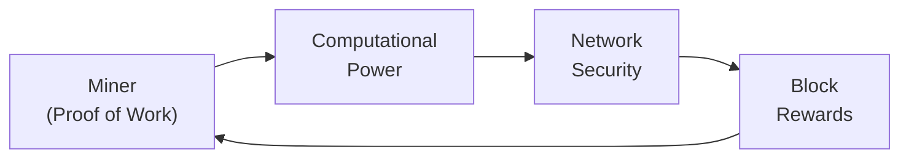

## Introduction

So, maybe you’ve heard the buzz around Bitcoin mining (one of my friends calls it “the digital gold rush”), or you’ve stumbled upon the concept of staking new tokens to earn rewards, or you’re curious about how “yield farming” might help diversify an investment portfolio. These activities—mining, staking, and yield generation—lie at the heart of digital asset markets. They offer novel ways of supporting blockchain networks, earning passive income, and even speculatively piling up digital assets. However, as with any alternative investment, they come with their own complexities and risks. In this section, we’ll lay out the fundamentals, highlight the different operating models, and dig into their risk-reward profiles.

## Proof of Work and Crypto Mining

### Overview of Proof of Work
Cryptocurrency mining is most famously associated with Bitcoin and other networks that use a Proof of Work (PoW) consensus mechanism. PoW requires miners to solve computational puzzles—essentially hashing functions that confirm transactions and secure the network. Those who successfully solve a puzzle first get a “block reward,” usually in the form of new tokens plus any transaction fees included in the block. The more computational power (often called hash power) you throw at the network, the higher your odds of winning the block reward.

### Infrastructure and Capital Requirements
I once contemplated setting up a small mining rig at home—just a couple of GPUs whirling away in a corner of my living room. The up-front cost was fairly high: specialized hardware (ranging from application-specific integrated circuits or ASICs, to high-end GPUs), plus robust cooling and stable electricity supply. Let’s not forget the monthly electricity bills, which can be surprisingly large.

Because of these hardware, cooling, and electricity needs, large mining operations typically concentrate in regions with low electricity costs and cool climates. In more industrial-scale operations, miners often join mining pools, which combine hashing power across many participants to reduce the variance in mining rewards. If you’re a single small-scale miner, you might go months without finding a block; a mining pool provides steadier, albeit smaller, payouts.

### Mining Rewards and Example Formula
Let’s outline a simplified formula for estimating mining returns. The expected daily (or hourly) reward can be expressed as:

$$
\text{Expected Mining Reward} = \frac{\text{Individual Hash Rate}}{\text{Total Network Hash Rate}} \times \text{Block Reward} \times \text{Number of Blocks per Time Period}
$$

• Individual Hash Rate is the computational power a miner contributes.  
• Total Network Hash Rate is the combined computational power of all miners.  
• Block Reward is the amount of new coins (plus fees) awarded for each valid block.  
• Number of Blocks per Time Period is how many blocks are added to the chain (e.g., per day).

Even though this formula looks straightforward, the total network hash rate can change frequently, the block reward might decrease over time (Bitcoin’s “halving” event, for instance), and local electricity costs or hardware obsolescence can drastically impact profitability.

### Risks and Constraints
• Hardware Obsolescence: Mining hardware can become outdated quickly. Newer, more powerful ASICs can render older rigs borderline useless overnight.  
• Electricity Costs: Sustained low electricity costs are crucial for profitability. If power is expensive, yields can turn negative in a bear market.  
• Regulatory Uncertainty: Some jurisdictions have banned or heavily taxed mining due to environmental concerns.  
• Volatility: The coin’s price can rise or fall sharply, so revenues in fiat terms might whipsaw.  

## Proof of Stake and Crypto Staking

### Staking Basics
While Proof of Work demands computational power, Proof of Stake (PoS) requires participants—“validators,” or stakers—to lock up their coins in special wallets or staking pools. PoS networks (like Ethereum post-Merge, Cardano, or Polkadot) rely on economic incentives rather than pure computational might to verify transactions. Because each participant deposits (stakes) tokens, there is “skin in the game”—if bad actors try to cheat, they risk losing part of their stake (through a process called “slashing”).

### Infrastructure Requirements
The immediate capital outlay for staking can be lower. You typically need:
• The required native tokens (often a significant minimum stake).  
• A reliable internet connection and a node to validate blocks (in some networks, a “light client” or staking pool is acceptable).  

Physically, this is much less intensive. You won’t need specialized circuit boards or industrial cooling fans in your living room. Many people stake through pooled environments or with specialized custodians. You just have to ensure your stake remains online and that the validator software isn’t compromised.

### Example Staking Reward Formula
A rough formula for expected staking rewards in a PoS network might be:

$$
\text{Expected Staking Reward per Epoch} = \frac{\text{User's Stake}}{\text{Total Staked}} \times \text{Block (or Epoch) Reward}
$$

Though each network’s reward mechanism can be more elaborate—some layer in inflation rates, bonuses for validator performance, and penalty structures.

### Lock-Up Periods and Risks
While staking is considered more energy-efficient, there are a few trade-offs:
• Lock-Up Periods: Some protocols require you to lock your tokens for weeks or months, reducing liquidity.  
• Slashing: Mistakes, downtime, or malicious validation can trigger penalties.  
• Price Volatility: If the staked asset loses value, the nominal staking rewards might not offset capital losses.  
• Regulatory Hazards: Staking returns may be treated differently for tax purposes in each jurisdiction.  

## Yield Generation Strategies

### Overview
So you’ve mined a stash of coins or purchased tokens on an exchange—what’s next? Instead of letting these assets sit idle, many crypto holders seek ways to earn additional returns. This broad approach is called “yield generation” and can take various forms:

- Lending (peer-to-peer or to institutions)  
- Providing liquidity to Decentralized Exchanges (DEXs)  
- Engaging in yield farming across multiple DeFi protocols  

These strategies have exploded in popularity, partly due to the attractive returns some protocols advertise. However, it’s kind of like chasing yield in any capital market: with bigger returns come bigger risks.

### Lending and Borrowing
One straightforward strategy is lending your crypto on centralized (CeFi) platforms like BlockFi (historically, but subject to changing regulatory climates) or decentralized options like Aave, Compound, or MakerDAO. Borrowers pay interest on the crypto they borrow, and you receive a share of that interest as a lender. But let’s not underestimate the risk:

• Counterparty Risk: If the borrower or platform defaults, lenders can lose their principal.  
• Smart Contract Risk: Decentralized finance platforms rely on code. If there’s a bug or exploit, funds can be lost.  
• Collateral Volatility: Loans are often secured by overcollateralized crypto assets that might plummet in price.  

### Liquidity Mining
In DeFi, “liquidity mining” means you deposit pairs of tokens into an automated market maker (AMM) pool—like Uniswap, SushiSwap, or PancakeSwap. The protocol rewards you with a share of trading fees, plus “bonus” governance tokens. If that sounds too good to be true, note that “impermanent loss” can significantly erode your returns when relative prices of the paired tokens fluctuate.

To illustrate, say you provide ETH and USDC in a liquidity pool. Should ETH’s price skyrocket, your share of ETH in the pool might automatically rebalance downward, redirecting some gains to new pool entrants. That difference in returns compared to simply holding the tokens outright is the “impermanent loss”—which can become permanent if you exit the pool at a certain price ratio.

### Yield Farming
Yield farming is basically the advanced (or sometimes frantic) version of liquidity mining. You:

1. Provide liquidity in Pool A, earning governance token X.  
2. Stake X in another protocol to earn more rewards.  
3. Borrow additional tokens against that staked collateral to reinvest in Pool B.  
4. Rinse and repeat—chasing the best annual percentage yields (APYs) around DeFi.  

And yes, it can get complicated very fast. I remember the first time I tried yield farming, I ended up with half a dozen tokens across multiple protocols, anxiously triple-checking my wallet addresses. The potential yields can be massive, but so is the potential for rapid liquidation if the market dips.

### Risks
• Smart Contract Exploits: Each step in your yield farming journey introduces a new contract you must trust. A hack in any link can drain your funds.  
• Dependent Protocol Risks: If one DeFi service becomes insolvent, it can cause cascading failures across integrated platforms.  
• High Volatility: Many of these “reward tokens” have volatile prices, meaning your APY can plummet quickly.  
• Complexity and Human Error: Managing multiple protocols is not for the faint of heart.  

## Tax Treatment and Regulatory Implications

### Overview of Tax Concerns
Tax authorities around the world often lag behind crypto innovation. Mining rewards, staking rewards, or liquidity pool earnings might be considered:
• Ordinary income upon receipt (e.g., receiving newly minted tokens).  
• Capital gains upon final sale (if the asset price changes and you later liquidate).  

In some jurisdictions, you may be able to offset expenses (like electricity costs for mining) against mining income. In others, staking income may or may not be recognized at the moment of receipt, depending on unsettled legislation. If you plan to hold staked or farmed tokens, changes in token valuation can create additional capital gains or losses. 

### Regulatory Environment
In addition to tax classification, some regulators see staking or yield platforms as financial products subject to securities laws. Centralized platforms might need to register as financial institutions, while decentralized protocols exist in somewhat gray areas. Well, for now at least. New bills and enforcement actions keep popping up, creating an environment where rules can shift suddenly.

## Operational Complexities and Key Considerations

### Mining Complexity
For PoW mining, the operational complexity is high: you need specialized hardware, reliable electricity, and decent negotiations with local utility companies. Then there’s the ongoing maintenance. For those not wanting to manage the day-to-day operations, cloud mining or hosting services can offload some burdens—but also introduce third-party risk.

### Staking Complexity
Staking can be outsourced to a staking-as-a-service provider or done through a staking pool. This reduces technical overhead, but also means trusting a pool operator or custodian with your private keys. If the pool misbehaves or misconfigures the validator node, you could face slashing penalties.

### Yield-Focused Strategies
Let’s face it: yield farming can be extremely hands-on. Monitoring multiple protocols, adjusting liquidity positions, and reconciling your daily yields across different tokens can become a part-time (or even full-time) job. The complexity is no joke.

## Environmental Impact

### Mining Footprint
One hot topic is the environmental footprint. PoW networks, especially Bitcoin, have been criticized for their electricity consumption. Miners are incentivized to find the cheapest electricity possible, often from coal or other non-renewable sources. However, some miners use renewable energy. Whether that’s enough to offset the carbon footprint of the entire industry is an ongoing debate.

### Staking as a Greener Alternative
PoS is generally touted as a “green” solution because it doesn’t rely on massive computational power. From an ESG perspective, staking might be more palatable to institutional investors interested in digital assets but wary of negative environmental externalities.

## Practical Examples and Diagrams

### Mining in Action

Below is a simplified flowchart illustrating how a miner contributes computational power to a PoW network and receives block rewards:

1) The miner invests in hardware (GPUs or ASICs).  
2) The miner adds hashing power to the network.  
3) The network achieves security via distributed computational effort.  
4) When successful, the miner receives block rewards.

## Best Practices and Common Pitfalls

### Mining
• Monitor your breakeven point (electricity + hardware costs).  
• Join a reputable mining pool for more consistent payouts.  
• Keep an eye on difficulty adjustments and network hash rate—your profitability can shift dramatically.

### Staking
• If you’re running your own validator, maintain reliable uptime.  
• Choose a reputable staking pool with transparent fees and robust security.  
• Plan for lock-up periods; if you need quick liquidity, staking might limit your options.

### Yield Generation
• Diversify across multiple protocols. Don’t put all your tokens in a single DeFi contract.  
• Factor in impermanent loss in liquidity mining.  
• Start small: test each platform with minimal funds first to understand the interface and potential pitfalls.  

## Portfolio Management and Exam Relevance

From a CFA perspective, these strategies represent alternative ways of obtaining exposure to digital assets. They also illustrate fundamental risk-reward trade-offs in nascent markets. Crypto mining or staking might be conceptualized as generating a “yield” that partially offsets the underlying asset’s volatility, but you must weigh it against:
• Market Risk: Crypto prices can be highly volatile, overshadowing modest yields from staking or mining.  
• Operational and Regulatory Risks: The complexity and shifting legal landscape can complicate portfolio decisions.  
• Correlation with Other Assets: While digital assets initially showed low correlation with traditional equities, correlation patterns have changed over time.  

On the exam, you might see scenario-based questions testing your understanding of how these returns are generated, how to evaluate them from a portfolio risk standpoint, and how to account for tax and regulatory considerations. Be prepared to compare PoW and PoS from an ESG perspective, or to discuss how to integrate yield-farming activities into an institutional portfolio with strict due diligence requirements.

## References and Further Reading
• Vitalik Buterin, “Proof of Stake: The Making of Ethereum and the Philosophy of Blockchains” (various online publications).  
• DeFi Pulse for yield farming and liquidity metrics: https://defipulse.com/  
• CFA Institute: Continuing Education resources on digital assets and DeFi.  
• Official documentation of various protocols (Ethereum, Cardano, Polkadot, Solana, etc.).  

## Test Your Knowledge: Crypto Mining, Staking, and Yield Generation



### Which of the following best describes the reward structure in a Proof of Work blockchain?

- [ ] Validators receive newly minted tokens proportional to their stake in the network.
- [ ] Tokens are burned and redistributed among all token holders.
- [x] Miners who solve cryptographic puzzles first receive newly minted tokens plus transaction fees.
- [ ] Users who lock up their coins in a staking pool receive reward tokens at a fixed interest rate.

> **Explanation:** Proof of Work systems typically award the block reward and any associated transaction fees to whichever miner verifies the block first.

### In Proof of Stake, what is the primary factor determining a validator’s chance of producing the next block?

- [ ] The total computational power provided by the validator’s hardware.
- [ ] The earliest time a validator joined the network.
- [x] The relative size of the validator’s stake compared to the network’s total staked amount.
- [ ] The validator’s geographic location to minimize latency.

> **Explanation:** In PoS mechanisms, the probability of being chosen to produce the next block aligns with the validator’s share of the total stake, not the amount of computational power.

### What is impermanent loss?

- [ ] A situation where lenders in a staking pool fail to repay their borrowed tokens.
- [x] The potential loss incurred by liquidity providers when the price of the deposited tokens diverges significantly while locked in a liquidity pool.
- [ ] The regulated fee that stakers must pay to the blockchain foundation for operating a node.
- [ ] A permanent decrease in the total number of tokens received by a miner after a network fork.

> **Explanation:** Impermanent loss occurs when the price ratio of deposited tokens changes, causing liquidity providers to have fewer of the token that has appreciated compared to simply holding tokens outside the pool.

### Which of the following is a critical operational requirement for a successful Proof of Work (PoW) mining operation?

- [x] Sustained access to low-cost electricity.
- [ ] A multi-signature wallet for staking rewards.
- [ ] Lock-up functionality for all tokens in the miner’s wallet.
- [ ] High token inflation rates to offset hardware costs.

> **Explanation:** PoW miners need cheap and reliable electricity to run high-powered hardware profitably, making energy costs a key factor in success.

### When participating in yield farming, which of the following is a primary risk?

- [x] Smart contract exploits leading to loss of funds.
- [ ] Guaranteed daily returns that fluctuate slowly.
- [ ] Zero exposure to market price volatility.
- [ ] Lock-up periods that never end.

> **Explanation:** Yield farming involves complex smart contracts. Any vulnerability can be exploited, potentially draining participants’ funds.

### What is the main advantage of staking as it relates to environmental considerations?

- [ ] It pays higher returns than mining under all circumstances.
- [x] It avoids the high electricity consumption required by Proof of Work.
- [ ] It is intrinsically more profitable during bear markets.
- [ ] It is recognized as legal tender worldwide.

> **Explanation:** Staking does not rely on energy-intensive computations, which generally makes it more eco-friendly than PoW mining.

### Which of the following best defines “slashing” in a Proof of Stake network?

- [x] A penalty mechanism that destroys part of a staker’s locked tokens for misbehavior or downtime.
- [ ] Reducing block rewards proportionally to the staker’s annual yield.
- [ ] A chain reorganization event designed to reduce overall token supply.
- [ ] An immediate liquidation of all staked tokens at the end of a lock-up period.

> **Explanation:** Slashing occurs when a validator violates network rules or goes offline, resulting in the loss of a portion of their staked tokens.

### In the context of lending on decentralized finance (DeFi) protocols, “counterparty risk” primarily refers to:

- [ ] The likelihood that a PoS validator’s stake will be diluted over time.
- [ ] The chance that a small miner will be outperformed by a large mining pool.
- [x] The possibility that the loan recipient or protocol might fail to return the lent assets.
- [ ] The risk of coins losing value due to general market conditions.

> **Explanation:** Counterparty risk means the borrower or the platform itself might default or become insolvent, jeopardizing repayment of the lent assets.

### What is one potential reason liquidity mining rewards can diminish rapidly over time?

- [x] The reward or governance tokens earned by liquidity providers can drop in market value.
- [ ] Transaction fees always increase, reducing the pool’s net yields.
- [ ] The majority of token holders remain idle, causing stable APYs.
- [ ] Blockchain usage permanently decreases as more liquidity enters the pool.

> **Explanation:** If the governance token price decreases or if market enthusiasm subsides, the APYs from liquidity mining reflective of that token’s value can decline rapidly.

### True or False: Regulatory frameworks for crypto mining and staking are universally the same across all countries.

- [ ] True
- [x] False

> **Explanation:** Different countries have varying approaches to regulating crypto activities. Some are supportive, while others have banned mining entirely or placed strict rules on staking and DeFi operations.


