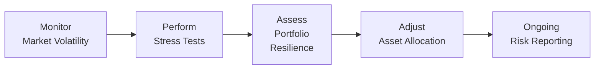
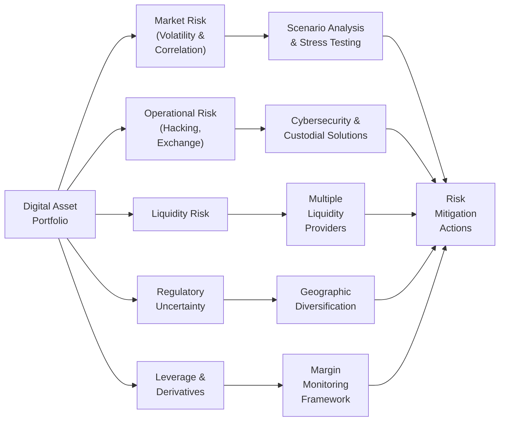

## Setting the Context

Digital assets, such as cryptocurrencies, stablecoins, and tokenized securities, have quickly evolved from fringe curiosities to a noteworthy segment of alternative investments. In previous sections (for instance, 7.2 on Cryptocurrencies, Stablecoins, and Tokenization), we examined the fundamentals; here, we’re rolling up our sleeves to speak about risk management. And trust me, it can get pretty tense in the crypto world. I still remember the first time I saw the entire market drop 50% in a single day—heart rates spike, Slack channels light up, and everyone wonders, “Okay, is this the end?” But let’s take a structured approach: if we overlay robust risk management on top of all that unpredictability, we’ll find that the digital asset world offers both excitement and real portfolio benefits.

## Volatility and Correlation Shifts

Volatility. If there’s one term we keep hearing about digital assets, it’s that. Cryptocurrencies—whether they’re large tokens like Bitcoin or Ethereum, or smaller altcoins—tend to have wide price swings in short periods. Moreover, correlations between coins and traditional assets can change rapidly. There may be times when Bitcoin acts like a tech stock and other times when it behaves as a “digital gold” substitute. That’s why monitoring correlation shifts is a centerpiece of any solid risk management framework. And from a Level III portfolio perspective, we want to ensure that we thoroughly measure how these correlation shifts can impact total portfolio variance.

### Practical Stress Testing and Scenario Analysis

Stress testing is more than plugging random numbers into a spreadsheet. It involves creating a sequence of extreme but plausible market conditions and assessing how a portfolio might cope. For example, we might model a scenario where a major global bank announces the sudden shutdown of crypto exchange inflows, leading to liquidity freezes across the market. By running scenario analysis, we gain insights into potential tail-loss distributions and see how portfolio drawdowns might stack up under those dire events.

In many standard portfolio contexts, value at risk (VaR) or expected shortfall are tested under historical and hypothetical scenarios. For digital assets, you may want to combine new triggers—like major protocol hacking events or abrupt changes in regulatory policy—to see the potential magnitude of losses. Make sure to keep these results well-documented; exam questions often focus on how stress testing aligns with an investor’s risk tolerance.

Here’s a simple schematic in Mermaid to illustrate how these risk analyses feed into a broader portfolio management framework:

## Operational Risk: Hacking, Smart Contracts, and Exchange Insolvency

The excitement around digital assets also comes paired with operational hazards—unlike anything we see in traditional stock or bond investing. You’ve probably read headlines about high-profile exchange hacks or vulnerabilities in smart contracts that cost investors millions, if not billions, of dollars.

### Mitigating Hacking Risk

Your digital assets could be compromised if private keys become exposed. Cold storage solutions (offline wallets) and multi-signature approvals reduce those vulnerabilities. A dedicated cybersecurity framework that includes intrusion detection, routine “white-hat” hacking attempts, and vendor risk assessments is essential. Even small oversights—like an employee leaving a seed phrase scribbled on a notebook—can be disastrous. 

Don’t forget that these operational risk considerations often appear in exam case studies focusing on the CFA Institute Code and Standards. Specifically, the duty of loyalty and prudence might require you to ensure robust control procedures so that client assets remain secure.

### Smart Contract Exploits

Whether it’s a DeFi (Decentralized Finance) protocol or a new token issuance, smart contract exploits are a recurring threat. A coding mistake or a malicious backdoor can let hackers siphon funds from liquidity pools. Combat this by insisting on formal contract audits, bug bounties, and insurance coverage. That said, keep in mind that even well-audited contracts can fail if there’s a new vulnerability. 

### Exchange Insolvency

Have you ever had a friend who found themselves locked out of a failed exchange? Not fun. With no FDIC for crypto, users often face partial—or total—losses when an exchange can’t meet withdrawal requests. 
• Diversify exchanges: Don’t store all your assets in one place.  
• Check solvency metrics: Some regulated exchanges publish Proof of Reserves or financial statements (though these disclosures are not always comprehensive).  
• Use self-custody whenever possible: Minimizes reliance on third-party solvency.  

From a risk management standpoint, exchange insolvency risk calls for careful counterparty due diligence. In certain exam item sets, you might have to evaluate the trade-offs between holding assets in self-custody (better security, less liquidity) versus exchange custody (better liquidity, higher counterparty risk).

## Liquidity Risks in Digital Assets

Liquidity risk manifests quickly in digital asset markets—particularly for smaller tokens (or micro-cap altcoins) with shallow order books. If you place a large sell order, you could see significant slippage, or find no buyers at all. This stands in sharp contrast to blue-chip tokens like BTC or ETH, which generally offer deeper liquidity. 

A few best practices to mitigate liquidity risk include:
• Splitting large trades: Execute orders in smaller blocks or use algorithms to reduce market impact.  
• Monitoring on-chain liquidity: For tokens traded on decentralized exchanges, measure total value locked (TVL). Lower TVL can equate to higher slippage.  
• Building relationships with multiple liquidity providers: Particularly relevant for prime brokerage services that might help obtain best execution.

Remember that from a portfolio manager’s perspective, it’s not just about can we buy or sell; it’s also about how quickly an asset can be converted into stable value (possibly a stablecoin or fiat). This is integral for rebalancing strategies, margin calls, and meeting redemption requests.

## Regulatory Uncertainty

It almost feels like a never-ending saga, right? One moment a country welcomes crypto adoption, and the next it imposes stringent rules. Whether it’s classification as a security, impending capital-gains taxes, or bans on mining, regulatory shifts can upend valuations and trading activity without warning. 

### Geographic Diversification and Regulatory Intelligence

Spreading exposure across multiple jurisdictions can lessen the blow from any one local clampdown. However, that introduces additional complexity in terms of compliance (AML/KYC rules, local taxes, etc.). Keeping a keen eye on pending legislation and engaging with regulatory advisors or specialized counsel also helps. For the exam, consider how scenario analysis might factor in a hypothetical scenario where a major region enacts a sudden ban on certain tokens.

## Leverage and Derivatives Usage

Some participants leverage derivatives—futures, options, and swaps—to gain exposure to digital assets without holding them outright. That’s fine, but we must emphasize: leverage amplifies not only gains but also losses.

### Margin and Collateral Management

The intangible nature of these assets can complicate collateral calls. Crypto’s price can shift so drastically that margin requirements change within hours. You might find yourself liquidated if you can’t post enough collateral quickly. Real-time monitoring of leverage ratios and daily margin checks are crucial.

A helpful approach is to maintain a “stress buffer.” That is, hold surplus stablecoins or fiat to meet margin calls in the event of extreme volatility. This tactic often appears in constructed-response questions that ask how you’d manage margin in a derivative-laden portfolio under high-volatility conditions.

## Combining Fundamental, Technical, and Sentiment Analysis

Risk isn’t just about numbers; it’s also about understanding market sentiment. Let’s face it: social media, forum chatter, and influencer tweets can drive wild swings in digital asset prices. So, managers often combine quantitative tools (like Chartist analysis you might see in standard equity evaluations—moving averages, RSI, or MACD) with fundamentals (developer activity, network adoption metrics) and sentiment (counts of social media mentions, weighted sentiment scores). Identifying potential inflection points early can help you tighten stop-loss orders or reduce positions ahead of a downturn.

## Diversification Strategies

Even if everything in the crypto world feels correlated at times, diversification across multiple tokens and ecosystems still helps. You might hold:
• A “blue-chip” stake in Bitcoin (often viewed as digital gold).  
• Ethereum exposure for decentralized application (dApp) ecosystems.  
• Stablecoins to provide short-term liquidity and lower volatility.  
• Smaller altcoins with specific growth prospects (but these carry higher idiosyncratic risk).  

Be aware that while you might reduce concentration risk by spreading your investments, crypto markets often have cluster risk. A broader meltdown could hurt all tokens, though typically large-cap and stablecoins exhibit relatively milder drawdowns.

## Putting It All Together in a Risk Management Framework

Below is a basic diagram illustrating key elements of a digital asset risk management program:

## Exam Tips: Putting Knowledge into Practice

On the CFA Level III exam, you’ll likely encounter scenarios or item sets that test your ability to apply these risk management strategies. Here are a few tips:

• Always link risk management actions to the client’s Investment Policy Statement (IPS). Emphasize objectives, constraints, and risk tolerance.  
• When you see a question with “stress testing” in it, think about both the scenario’s plausibility and the recommended actions to address potential losses.  
• Operational risk questions often relate to due diligence and compliance with Standards of Professional Conduct.  
• If asked about leverage or derivatives in digital assets, highlight the margin process, real-time monitoring, and the intangible nature of crypto collateral.  
• For scenario-based essays, focus on how you’d adapt your approach if the regulatory context changes or if liquidity conditions erode.

## References and Further Reading

• CFA Institute (multiple articles): Cryptoasset Risk Management, Volatility Analysis, and Operational Due Diligence.  
• Global Association of Risk Professionals (GARP): “Digital Assets Primer for Risk Managers.”  
• Official CFA Institute Curriculum—Readings on Alternative Investments and Risk Management in Evolving Markets.  
• IFRS Guidelines—Treatment of Intangible Assets (though specific guidelines for cryptoassets remain nascent).  
• US GAAP—For US-based reporting on intangible assets and compliance.

---

## Test Your Knowledge: Risk Management in Digital Asset Portfolios



### A portfolio manager wants to test how a sudden 40% drop in Bitcoin prices would impact their overall digital asset holdings. Which method should they primarily use?

- [ ] Fundamental analysis
- [ ] Market fragmentation analysis
- [x] Stress testing
- [ ] Over-the-counter negotiations

> **Explanation:** Stress testing simulates extreme market conditions (like a major crash) to evaluate portfolio impact. Fundamental or market fragmentation analyses may complement but are not as direct for crash simulations.

### During an exam scenario, you see that the liquidity of a certain altcoin is extremely low. Which risk is most directly heightened when trading this token?

- [ ] Credit risk
- [x] Liquidity risk
- [ ] Regulatory risk
- [ ] Execution risk has no impact

> **Explanation:** A shallow order book amplifies liquidity risk because it’s difficult to enter or exit sizable positions without significantly moving the price.

### What is the best first step to mitigate hacking risk for a firm holding client digital assets?

- [ ] Rely on a single hardware wallet stored in the office safe
- [ ] Switch to algorithmic stablecoins
- [ ] Place private keys on an encrypted cloud server
- [x] Use a multi-signature or multi-factor custody solution

> **Explanation:** Multi-signature or multi-factor solutions reduce single points of failure. Cloud servers or safes may not provide adequate security layers.

### Which approach might help a digital asset manager understand the impact of a potential global ban on stablecoins?

- [ ] Collision testing
- [x] Scenario analysis
- [ ] Portfolio optimization
- [ ] Beta-neutral hedging

> **Explanation:** Scenario analysis allows managers to evaluate hypothetical but plausible regulatory shocks, like a ban on stablecoins, and see potential effects on asset values and liquidity.

### An investor uses high leverage on a platform that requires intangible crypto collateral. How can they best minimize forced liquidations during a price slump?

- [x] Keep a buffer of stablecoins or fiat on hand
- [ ] Ignore margin calls entirely
- [ ] Place all capital in illiquid altcoins
- [ ] Rely solely on fundamental analysis

> **Explanation:** Holding stablecoins or fiat on reserve helps meet margin calls quickly and prevents forced liquidation in a volatile environment.

### In the context of operational risk, which factor should be a priority when choosing a digital asset custodian?

- [x] Robust cybersecurity measures
- [ ] Minimal staff training
- [ ] Frequent margin calls
- [ ] Location without regulation

> **Explanation:** Operational risk management relies on strong cybersecurity. Custodians must demonstrate rigorous protocols to protect private keys and ensure asset integrity.

### What is the primary benefit of geographic diversification for a digital asset portfolio?

- [ ] Guaranteed exemption from all security legislation
- [ ] Complete isolation from global market shocks
- [x] Reduced exposure to a single jurisdiction’s regulatory clampdown
- [ ] Eliminate currency risk altogether

> **Explanation:** Holding digital assets in multiple jurisdictions can lessen the impact of strict new regulations in any one location. It does not guarantee isolation from broader market risks.

### When analyzing a portfolio manipulation event triggered by a tweet from a high-profile influencer, which category of analysis is most relevant?

- [ ] Only fundamental analysis
- [ ] Only scenario analysis
- [ ] Simple pivot analysis
- [x] Sentiment analysis

> **Explanation:** Sentiment analysis of social media and public discourse helps determine potential short-term price movements driven by influential voices.

### A fund manager invests heavily in a single new blockchain protocol. This can be best described as what type of risk?

- [ ] Execution risk
- [x] Concentration risk
- [ ] Diversification insight
- [ ] Valuation risk only

> **Explanation:** A large position in a single asset or sector exposes the portfolio to concentration risk, making it vulnerable if that protocol faces issues.

### True or False: Derivatives on digital assets cannot amplify losses since they are used mainly for hedging.

- [x] True
- [ ] False

> **Explanation:** Actually, this statement is false. Derivatives can be used for hedging, but they can also amplify losses if they are leveraged or if the hedge strategy is poorly executed.  


