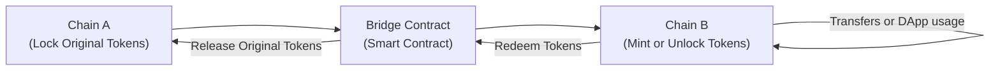

## Overview and Motivation

Let’s face it: popular blockchains are getting crowded. Transactions on well-known blockchains (like Ethereum or Bitcoin) can be relatively slow and expensive when network activity spikes. That’s not exactly what most of us—including investors—envisioned for a streamlined financial system. In earlier sections of this chapter, we explored cryptocurrency fundamentals, mining, staking, and even the broader scope of decentralized finance (DeFi). Here, we step into two of the biggest problem solvers in the blockchain world: cross-chain solutions and Layer-2 scalability solutions.

Cross-chain solutions aim to connect different blockchain networks so assets or data can move around seamlessly. Meanwhile, Layer-2 (L2) solutions focus on scaling a single blockchain by conducting most of the heavy-lifting off-chain, then later settling the final state on the main chain (Layer 1). Both of these developments help reduce transaction fees, speed up confirmations, and expand the possible use cases for digital assets.

In practical terms, imagine you have tokens on one blockchain but want to access a decentralized application (DApp) or yield-farming opportunity on another chain. Without a cross-chain bridge, you might have had to sell your tokens for fiat, then buy new tokens on the other chain—messy, right? Instead, cross-chain solutions help you teleport your assets from one chain to another. Meanwhile, if you’ve ever faced soaring transaction fees or slow block confirmations at the wrong moment, Layer-2 solutions are your new best friend.

This section provides a deep look at how these solutions work, the opportunities and challenges they bring for professional investors, and some best practices to keep in mind.

## Key Concepts in Cross-Chain Interoperability

### Interoperability Essentials
Interoperability describes blockchains’ ability to exchange tokens and data with one another. It sounds easy in theory: “Let’s just send data from Chain A to Chain B.” But in practice, every blockchain has its own consensus rules, data structures, and transaction logic. Making them “talk” requires specialized mechanisms referred to as bridges, sidechains, or even advanced multi-chain protocols.

### Bridges
A bridge lets you lock an asset on one chain and simultaneously “mint” or unlock its representative on another chain—kind of like checking your luggage at one airport and picking it up, magically, at your final destination. When you want your original asset back? You burn or lock the representative token and release the locked asset from the bridge contract on the original chain.

Bridges can be:
• Trusted (centralized) bridges run by a single entity.  
• Trust-minimized (or trustless) bridges relying on decentralized validation.  

### Sidechains
A sidechain is a separate blockchain that exists in parallel to a main chain. Think of it like a dedicated highway that branches off from the main road so you can drive without getting stuck in traffic. The sidechain can define its own consensus mechanism, block size, and transaction speed, often optimizing for lower fees. It remains pegged (by a locking mechanism) to the main chain, ensuring that tokens can move between these networks in a controlled manner.

### Cross-Chain Liquidity Protocols
From an investment perspective—especially if you recall the earlier sections about DeFi—cross-chain liquidity protocols can significantly expand your trading possibilities. They let you provide or access liquidity across multiple blockchains without manually hopping from chain to chain. Often, they have pools or “routers” that route trade orders along the path of least resistance (lowest fees, best price).

Cross-chain liquidity examples include platforms that allow a user to stake stablecoins on one chain and seamlessly borrow or trade derivatives on another chain.

## Layer-2 Solutions for Scalability

While cross-chain solutions address interoperability, Layer-2 projects solve an equally pressing issue—throughput constraints on the main (Layer-1) blockchain. If you’ve ever tried to do a simple token swap during a busy period on Ethereum, you know those fees can sting. Here’s how L2 solutions can help.

### Lightning Network (for Bitcoin)
Bitcoin was the original blockchain trailblazer, but it can also be slow and occasionally pricey to transact on. The Lightning Network aims to tackle that problem by creating payment channels off-chain. You can open a channel with another user, transact with them (or even with third parties through multi-node channels) limitless times off the main chain, and only settle the final net amount on the Bitcoin blockchain. This results in near-instant microtransactions, super-low fees, and improved scalability for Bitcoin overall.

Imagine you and I want to share lunch bills daily using Bitcoin. Rather than broadcasting each transaction to the entire Bitcoin network (and paying multiple transaction fees), we open a Lightning channel. All future lunch payments stay in that channel until we decide to close it. That’s when a single settlement transaction occurs on the main Bitcoin chain, reflecting our final net balances.

### Optimistic Rollups
Optimistic Rollups concentrate on Ethereum’s scaling. They bundle up a massive batch of transactions “off-chain,” compute new states, and periodically present an aggregated data summary to the Ethereum mainnet. As the name “optimistic” suggests, the system assumes the off-chain computations are correct. However, if someone challenges the results, there’s a dispute resolution window in which evidence can be presented on-chain to correct a fraudulent state.

Optimistic Rollups drastically reduce the number of transactions that occur on-chain, lowering congestion and fees while maintaining the security properties of Ethereum (because final settlement is anchored to Layer 1). If you’re active in decentralized finance, you might have encountered L2 solutions such as Optimism or Arbitrum—both are examples of frameworks implementing optimistic rollups.

### Zero-Knowledge Rollups
Although not mentioned explicitly in the main bullet points, zero-knowledge (ZK) rollups are another emerging L2 approach. They use cryptographic proofs to validate a bundle of transactions, minimizing the data that must be published on-chain. Many see ZK rollups as a potential “holy grail” of scalability, but the technology and proofs are still evolving. For a portfolio manager, this may be relevant if you’re weighing the long-term viability of L2 solutions to process large-scale financial products.

## Why Cross-Chain and Layer-2 Solutions Matter

### Lower Fees and Faster Transactions
The most obvious reason is cost. With main-chain fees regularly spiking into double or triple digits during periods of extreme demand, solutions that reduce or eliminate those fees can attract more users and more capital. Faster confirmations also open doors for real-time trading, micropayments, or high-frequency strategies that would otherwise be impossible on slower or costlier networks.

### Unlocking Interoperable DeFi
Cross-chain solutions allow traders to unlock yields and tokens across a range of previously isolated ecosystems. For example, bridging stablecoins from an Ethereum-based chain over to a high-throughput sidechain might let you purchase tokenized real estate or farmland (as discussed in alternative segments of this Volume) that are otherwise unreachable.

### Expanded Payment Use Cases
Layer-2 helps blockchains serve as genuine payment networks for everyday transactions (like a quick coffee purchase). Rather than waiting a half hour for a confirmation, you get near-instant results with minimal fees. This scenario is particularly relevant in global remittances or cross-border microfinance programs where even slight fees can be burdensome.

### Institutional and Enterprise Adoption
Larger institutions might try to integrate blockchains for supply chain tracking, tokenization of real-world assets, or cross-border currency settlements. They often require large throughput, stable fees, and robust security. Cross-chain solutions let them leverage the best features of multiple networks, while L2 solutions keep transaction loads manageable.

## Security Considerations

Security is the lynchpin of any blockchain-based system, and cross-chain or L2 solutions can introduce new attack vectors. Bridges may rely on external validators who could potentially be compromised, or on complex smart contracts with potential vulnerabilities. Meanwhile, off-chain solutions like rollups must ensure that any “fraud proofs” or “validity proofs” posted on the main chain are correct and that validators can’t collude to cheat.

Here are some best practices to consider:

• Conduct thorough due diligence: Evaluate the project’s code audits, developer reputation, and track record of security incidents.  
• Look for robust governance structures: For cross-chain solutions, check who controls the bridging contract or multi-signature wallets.  
• Monitor liquidity pools: With cross-chain liquidity, malicious actors might attempt to exploit bridging functionalities to drain pools.  
• Diversify bridging methods: If you must engage in bridging for your portfolio, consider multiple bridging protocols.  

Professional standards (e.g., the CFA Institute Code of Ethics and Standards of Professional Conduct) remind us to apply due diligence and have a reasonable basis for investment recommendations. In the context of digital assets, this especially applies to verifying the code audits and community trust behind bridging or L2 solutions.

## Real-World Case Studies

### Personal Anecdote: Attempting a Cross-Chain Yield
I remember the first time I tried bridging tokens from Ethereum to a sidechain. It was all about chasing that sweet yield in a liquidity pool for yield farming. The bridging process itself was smooth enough—until I realized there was a 20-minute block confirmation wait on the sidechain’s bridging contract. So I sat there, refreshing the page, slightly panicking that something might go wrong and my tokens would vanish. Thankfully, they didn’t, and I eventually got into the yield farm. But who wants to do that every single time? My impatient self realized quickly: cross-chain bridging is still in its infancy and can cause anxious waiting.  

### Institutional Integration: A Global Payment Pilot
A large financial corporation tested the Lightning Network for micro-fee remittances between employees in different countries. Transaction fees dropped from an average of $5–$10 per transaction on the Bitcoin main chain to just a few cents, with near-instant settlement. The key takeaway? Layer-2 solutions can drastically improve user experience for payment use cases, sometimes overshadowing main-chain reliance altogether.

## Practical Diagram of a Cross-Chain Bridge

Below is a simplified diagram illustrating how a cross-chain bridge locks or pegs assets on one chain and then represents them on another chain.

This process basically establishes a pegged token on Chain B, letting you trade or stake it there. Once you’re done, you head back across the bridge, burn (or lock) your pegged tokens, and reclaim your original assets on Chain A.

## Common Pitfalls and Mitigation Strategies

• Over-Reliance on Single Bridges: If a single bridging protocol is compromised, it could lead to substantial losses. It’s wise to diversify bridging solutions or use well-audited, decentralized options.  
• Liquidity Fragmentation: When too many sidechains or L2 networks exist, each has separate liquidity pools—leading to scattered liquidity and potentially higher slippage. Monitoring overall market liquidity is crucial for large trades.  
• Delayed Transaction Finality: Not all cross-chain solutions offer immediate finality. Some require multiple block confirmations on both chains, adding unpredictability.  
• Regulatory Uncertainty: Cross-chain solutions may raise complexities around AML/KYC across different jurisdictions—especially if bridging involves multiple regulatory regimes.

## Best Practices for Analysts and Investors

• Evaluate Maturity: Cross-chain and L2 solutions are evolving fast. Look for networks with robust developer communities, thorough audits, and proven reliability.  
• Analyze User Adoption: The more participants, the more stable and secure a network typically becomes (due to distributed attention, higher fees for security, etc.).  
• Monitor Security Developments: Stay updated on any new exploits or vulnerabilities disclosed by the community.  
• Factor in Fees vs. Risk: Just because an L2 solution drastically lowers fees doesn’t mean it’s the right choice. Weigh the cost savings against potential bridging or L2-security risks.

## Integration into Portfolio Strategies

In practice, cross-chain solutions and L2 networks open up a broader set of digital assets and DApps. Portfolio managers might:

• Deploy capital across multiple blockchains seamlessly.  
• Hedge volatility via cross-chain derivatives, enabling them to quickly shift positions from one chain to another.  
• Provide liquidity in multiple ecosystems to capture yield from bridging incentives or liquidity mining.  

As always, the due diligence process (see Section 3.3, “Due Diligence and Selection Criteria,” in this Volume) applies just as strongly here. Analysts must maintain a “reasonable basis” for concluding a cross-chain or L2 solution is safe enough to manage client assets or corporate investments (consistent with the CFA Institute’s professional standards).

## Future Prospects

In some ways, cross-chain and L2 solutions resemble the early days of the internet, when different local networks were just barely connected. Over time, as technology matures, successful solutions will likely become user-friendly enough that you won’t have to worry about which chain you’re on or whether your transaction is L2 or L1. You’ll just “send” or “trade.” For context, future chapters (like Chapter 16 on Technology and Future Directions) discuss how tokenization and automated, cross-chain smart contracts may reshape finance.

## Exam Relevance and Final Thoughts

From the CFA Level I perspective, it’s essential to grasp the fundamental trade-offs among blockchain architecture, scalability, and security. Understanding how cross-chain solutions and Layer-2 scaling might impact the cost basis, liquidity, and operational risks of digital asset portfolios is directly relevant to exam questions on alternative investments, portfolio management, and even ethics (particularly regarding due diligence standards).

On the exam, you might see scenario-based cases asking you to recommend or evaluate strategies that rely on bridging solutions. Be prepared to explain potential vulnerabilities and how you would mitigate them. For example, you could be asked whether using an Optimistic Rollup introduces settlement risk within a short time horizon for an arbitrage trade. Another question might test your knowledge of how bridging changes the custody or control of the underlying asset.

Above all, keep an eye on fast-moving developments in the space, as new solutions, protocols, and best practices continuously arise.

## References and Further Reading

• Lightning Network Documentation:  
  https://lightning.network  
• Analysis of Cross-Chain Bridges by DeFi Researchers (various Medium articles)  
• Ethereum Optimistic Rollups Overview:  
  https://docs.ethhub.io/ethereum-roadmap/layer-2-scaling/optimistic_rollups  
• Arbitrum: A Live Implementation of Layer-2 for Ethereum  
  https://developer.offchainlabs.com  
• For background on bridging solutions:  
  https://bridge.ethereum.org  

--------------------------------------------------------------------------------

## Test Your Knowledge: Cross-Chain and Layer-2 Scalability Quiz



### Which of the following best describes a cross-chain bridge?

- [ ] An off-chain scaling solution for processing Bitcoin payments.  
- [x] A protocol that locks tokens on one chain and mints their equivalent on another.  
- [ ] A DeFi platform that prevents price discrepancies between stablecoins.  
- [ ] An automated market maker that only trades on decentralized exchanges.  

> **Explanation:** A cross-chain bridge transfers tokens or data between different blockchains, often locking original assets on one chain and issuing a “pegged” representation on another.

### When using an Optimistic Rollup on Ethereum, which statement is correct?

- [ ] Rollups never share data with the Ethereum mainnet.  
- [x] Rollups bundle transactions off-chain and periodically post state updates to Ethereum.  
- [ ] Rollups operate without relying on any on-chain security.  
- [ ] Rollups allow instant finality on Layer-1 with no dispute period.  

> **Explanation:** Optimistic Rollups process transactions off-chain but periodically post aggregated data on Ethereum for security. The system is “optimistic” that the provided off-chain data is accurate, with a mechanism to challenge incorrect state updates.

### Which of the following is a primary benefit of Layer-2 solutions, such as the Lightning Network?

- [x] Lower transaction fees than on the main chain.  
- [ ] Elimination of all security risks.  
- [ ] Complete independence from Layer-1 validators.  
- [ ] Bridging any two blockchains automatically.  

> **Explanation:** Moving transactions off-chain greatly reduces congestion, lowering fees while retaining security from final settlement on the main chain.

### A sidechain pegged to a main chain primarily functions to:

- [ ] Eliminate the need for the main chain's consensus validators.  
- [x] Process transactions with different rules or consensus, then peg results back to the main chain.  
- [ ] Reorganize blocks on the main chain.  
- [ ] Replace the main chain’s block production.  

> **Explanation:** A sidechain is its own blockchain with an independent set of rules, but it remains pegged to a main chain so that value or data can be transferred between them.

### Which best practice can help mitigate cross-chain bridge security risks?

- [x] Using well-audited protocols with widespread community support.  
- [ ] Always relying on a single, centralized bridging service.  
- [x] Diversifying across multiple bridge solutions.  
- [ ] Avoiding any pegged asset redeem function.  

> **Explanation:** Security audits, decentralized validation, and using multiple bridging services reduce the risk of compromise (e.g., a bug in a single bridging contract).

### In an investment context, why are cross-chain liquidity protocols significant?

- [x] They allow multi-asset trading and liquidity provisioning without manually bridging tokens.  
- [ ] They fully replace the base layer of a blockchain's consensus protocol.  
- [ ] They eliminate price volatility across all digital assets.  
- [ ] They function solely as insurance mechanisms for stablecoins.  

> **Explanation:** Cross-chain protocols let investors engage in multi-chain trades and liquidity moves without individually converting assets on each chain.

### Lightning Network channels:

- [ ] Require every off-chain transaction to be confirmed individually on the main Bitcoin blockchain.  
- [x] Keep payment transactions off-chain and only settle net results to the main chain.  
- [x] Enable near-instant and low-fee Bitcoin transactions.  
- [ ] Are hosted exclusively by large financial institutions.  

> **Explanation:** Once a Lightning channel is opened, transactions remain off-chain, providing near-instant finality until the channel closes and nets results on-chain.

### A main reason the term “optimistic” is used in Optimistic Rollups is:

- [ ] The rollup always finalizes transactions without any on-chain verification.  
- [x] The protocol assumes off-chain transactions are correct unless proven otherwise in a challenge period.  
- [ ] The protocol remains optimistic about bridging multiple sidechains.  
- [ ] The protocol is known for extremely pessimistic liquidity strategies.  

> **Explanation:** Optimistic Rollups assume off-chain blocks are valid but provide a dispute resolution window where fraudulent transactions can be challenged.

### One challenge posed by having many sidechains and Layer-2 solutions is:

- [ ] Reduced security on the main chain.  
- [x] Fragmented liquidity and user adoption across multiple networks.  
- [ ] Complete elimination of bridging solutions.  
- [ ] Transaction confirmation times on the main chain double.  

> **Explanation:** Spreading activity across numerous chains or L2 networks can fragment markets, liquidity, and user bases, complicating cross-chain trades and diminishing network effects.

### True or False: A Layer-2 network always bypasses the base security of the main blockchain.

- [x] True
- [ ] False

> **Explanation:** While L2 solutions rely on the main blockchain for eventual settlement and security, they can temporarily operate off-chain or in a separate context. Strictly speaking, they do not “bypass” the base security but rather extend it off-chain. However, they still periodically rely on the main chain for final confirmations. The statement is tricky—conceptually, L2 doesn’t override or ignore L1 security, but in practice, you could say it “bypasses” day-to-day dependence on the chain for transactional throughput. Always carefully read how the exam question is framed.


