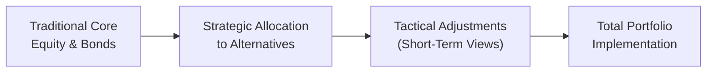
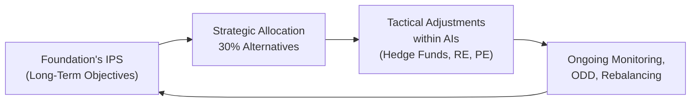

## Introduction and Motivation

Have you ever found yourself staring at your portfolio—stocks, bonds, maybe a sprinkle of cash—and thinking, “Well, everything is riding on the same broad market wave”? If so, you’re not alone. Traditional portfolios can offer simplicity and liquidity, but sometimes the returns can feel a little too correlated to the same economic cycle. That’s where alternative investments (AIs) step in. Many professional investors, including endowments, pensions, and even family offices, rely on these less-traditional assets to spice up their risk-return profile. Or, in more formal terms, they aim to add “non-correlated” exposures that might reduce overall portfolio drawdowns when the market gets choppy.  

I remember the first time I added real estate to a small discretionary portfolio for a tech entrepreneur. She loved the tangibility of real property plus the steady income potential—and was genuinely excited that it didn’t necessarily ebb and flow with her tech stocks. That sense of diversifying away from a single broad risk factor can provide real psychological comfort (although, sure, it comes with its own set of complexities).  

Below, we’ll explore the critical steps required to integrate alternative investments into a portfolio. We’ll look at the importance of setting clear objectives, the role of an updated Investment Policy Statement (IPS), the interplay of strategic and tactical asset allocation, and more. Let’s walk through the fundamentals and some advanced considerations to ensure that your foray into alternatives is well-structured, monitored, and—hopefully—successful.

## The Role of Non-Correlation and Diversification

One of the main arguments for adding alternative investments is non-correlation—the idea that these asset classes, such as hedge funds, private equity, real estate, or commodities, won’t always move in lockstep with traditional equities or fixed income. Formally, correlation (ρ) of two assets A and B can be measured as:  


\rho_{A,B} \;=\; \dfrac{\mathrm{Cov}(A,B)}{\sigma_A \,\sigma_B}


If ρ is near zero (or even negative), those assets might have offsetting movements. In practice, this can lower a portfolio’s overall volatility and protect your downside during a market swoon. Take a scenario where equity markets drop 10%—the hope is that your positions in certain hedge fund strategies, or real assets like farmland and timber, won’t follow lockstep.  

Of course, “non-correlation” doesn’t mean “never declines.” In fact, sometimes alternative investments struggle at the same time as equities. But in many historical periods, properly selected AIs have demonstrated lower correlation to mainstream benchmarks. This can smooth out your returns over the long run and may allow you to take on risk in more targeted ways.

## Balancing Liquidity, Transparency, and Return Potential

Here’s the tricky bit: more often than not, you sacrifice something to gain something else. A private equity stake might offer hefty returns, but you can’t typically redeem funds at will. Real estate offers stable cash flows and potential capital appreciation, but the valuation and sale process can be more opaque.  

We can summarize these trade-offs in the following table:

| Factor               | Advantage of AIs                      | Disadvantage of AIs                           |
|----------------------|---------------------------------------|-----------------------------------------------|
| Liquidity            | Potential to lock in stable capital   | Long lock-up periods or redemption restrictions |
| Transparency         | Less exposure to day-to-day market noise | Valuations may be complex, with limited disclosure |
| Return Potential     | Possibly higher returns, alpha generation | Higher fees, performance heavily dependent on manager skill |

Many times, investors will accept illiquidity if they can capture an illiquidity premium. For instance, private debt might pay a higher yield to compensate you for tying up capital. But not everyone can afford to lock up money for 10+ years—like some venture capital funds require—so consider your own or your client’s liquidity needs carefully.

## Investor Objectives, Constraints, and the IPS

Selecting and sizing alternative investments typically starts with a thorough reevaluation of the Investment Policy Statement (IPS). In fact, I’ve found that rewriting the IPS is often one of the more educational parts of the process because it forces you (and your client, if you’re advising) to articulate what you really want out of these new exposures.  

• Risk Tolerance: Higher risk tolerance may permit a larger slice for illiquid positions. However, constraints on drawdowns or reputational considerations might limit you to lower-risk AIs (e.g., core real estate).  

• Time Horizon: The longer your horizon, the more likely private equity and other illiquid structures might fit. If you’re a foundation that needs steady annual distributions, real estate or hedge funds with partial liquidity windows might be more appropriate.  

• Liquidity Needs: A short-term need for liquidity or a future large cash outlay (college tuition, corporate expansion, philanthropic grants) might be incompatible with long lock-up assets.  

• Regulatory or Ethical Constraints: Some institutional investors must adhere to specific guidelines or prefer environmental, social, and governance (ESG) mandates. This filters out certain strategies.  

When all these details are pinned down, the new IPS can guide how big or small the alternative allocation might be, what strategies to include, and the guardrails for rebalancing.

## Strategic vs. Tactical Allocation with AIs

Allocating to alternatives isn’t just about picking a random portion of your portfolio to “experiment.” It’s helpful to think in terms of strategic and tactical allocations:

• Strategic Asset Allocation (SAA): This is your long-term target mix. You decide how much exposure you want to real estate, private credit, commodities, hedge funds, and so on. The goal is to align with your long-range objectives, such as a 7% nominal return or a 5% real return.  

• Tactical Asset Allocation (TAA): This involves short-term moves to capitalize on perceived market inefficiencies. For instance, if you anticipate a shift in monetary policy, you might overweight macro hedge funds or reduce exposure to distressed debt.  

A personal anecdote: I once worked with a university endowment that maintained a fairly stable ~30% allocation to alternatives as part of its strategic framework. But every few quarters, we’d shift within that 30%, favoring private debt over hedge funds or pivoting between real estate and infrastructure. These moves were essentially TAA decisions, guided by macro conditions and short-term factors like interest rate expectations.  

Below is a simple diagram to illustrate how an alternative investment might slot into the broader portfolio context:



## Operational and Legal Considerations

Adding alternative investments to your portfolio also brings some behind-the-scenes tasks you might not have with plain-vanilla securities:

• Operational Due Diligence (ODD): Evaluate the manager’s operational setup, risk management infrastructure, and compliance. You might be stunned how a well-promoted hedge fund can lack robust back-office processes.  

• Specialized Reporting: You may need detailed capital account statements, K-1 tax forms, or consolidated data for complex multi-strategy funds.  

• Legal Structures: Alternative investments are often offered in limited partnerships, offshore entities, or special purpose vehicles (SPVs). For instance, a private equity GP–LP structure. Make sure you understand your rights and responsibilities under these arrangements.  

• Enhanced Fee Structures: Carried interest, hurdle rates, and performance fees can complicate performance measurement.  

When these complexities initially come up, it can honestly feel overwhelming—like the first time you try to compile everything for a private equity audit. But hooking up with specialized service providers or building in-house expertise can ensure your operations keep pace.

## Stress Testing for Upside and Downside

Even though alternative investments can diversify risk, they are not immune to major market shocks. Look at how real estate fared in the 2008 Global Financial Crisis or how commodities can plummet if global demand collapses. Stress testing helps identify which scenarios might cause your AI exposures to fall short (or ironically to spike in volatility).  

Practically speaking, you might run historical simulations using data from 2000–2002 (the Dot-Com Bust) or 2008–2009 (the Global Financial Crisis) and see how an investment in hedge funds, real estate, or private equity would have performed. You can also create forward-looking scenarios—maybe a scenario of prolonged stagflation or sudden liquidity freeze.  

Here’s a quick snippet (simplified) in Python to show how you might run a small stress-test routine:

```python
import numpy as np

returns_data = np.array([
    [0.01, -0.005, 0.02,  0.03,  -0.02],
    [0.015, 0.01, -0.01,  0.02,  0.005],
    [-0.005, 0.015, 0.017, -0.01, 0.03]
])

shock_factor = 0.75  # 25% shock
shocked_returns = returns_data * shock_factor

avg_shocked_return = np.mean(shocked_returns, axis=1)

print("Average monthly returns after shock:", avg_shocked_return)
```

This snippet obviously oversimplifies real portfolio analytics, but it shows how you could systematically apply a “shock factor” to your alternative investment returns and see how that might affect the bottom line.

## Benchmarking Complex Strategies

Measuring success is tricky if you don’t have a clear yardstick. Yet, finding a benchmark for a niche private equity strategy can be a headache. Many AI managers might claim, “Well, we’re an absolute return strategy—just measure us against LIBOR plus a spread.” Others might create custom blends of hedge fund indices, broad equity benchmarks, and some volatility measures.  

Key points to consider:  
• Make sure your chosen benchmark reflects the strategy’s risk profile.  
• Consider indexing challenges: some AI indices suffer from selection or survivorship biases.  
• Look beyond raw returns—review risk-adjusted metrics like the Sharpe ratio or Information ratio.  

In certain cases, you might implement a blended or custom benchmark. For instance, a global macro hedge fund might be measured against 70% global bond index and 30% global stock index—adjusted by an alpha target. The idea is to approximate the manager’s investing style as closely as possible.

## Monitoring and Rebalancing

Rebalancing a portfolio with alternative assets can be a bit more involved. Some managers restrict redemptions to quarterly or annual windows. If you’re dealing with private equity, you can’t just “rebalance” easily because your capital is locked in for the fund’s life.  

Still, it’s crucial to ensure that your dedicated AI allocations don’t balloon (or shrink) inadvertently. If your hedge fund holdings do well and start to dwarf your real estate stake, you might exceed your target range. Meanwhile, a slump in public equities may artificially inflate your AI percentage. Many institutional investors will set policy bands (e.g., ±5% around the target allocation) to trigger rebalancing discussions.  

## Putting it All Together

Let’s imagine a large philanthropic foundation with a moderate appetite for risk, a perpetual time horizon, and relatively modest liquidity needs. They might define a strategic allocation of 40% equities, 30% fixed income, and 30% alternatives (spreading that among real estate, private equity, and hedge funds). Over time, they keep checking local real estate valuations, manager skill in the private equity space, and relevant hedge fund strategies to see if tactical shifts are beneficial. A market shock or improvement in manager skill can prompt them to move from a multi-strategy hedge fund to, say, a sector-specific distressed credit fund.  



The loop continues with each iteration informed by updated operational due diligence, manager performance, and macroeconomic insight.

## Best Practices and Pitfalls

• Best Practices:  
  - Keep your IPS up to date as conditions, goals, or constraints evolve.  
  - Perform thorough operational due diligence.  
  - Stress test for the unexpected, including partial liquidity freezes.  
  - Use appropriate (ideally customized) benchmarks and measure risk-adjusted performance.  
  - Stay vigilant on rebalancing; drift can creep up unnoticed.  

• Common Pitfalls:  
  - Over-reliance on a single star manager without thorough ODD.  
  - Believing all alternative investments behave the same or always zig when markets zag.  
  - Excessive complexity leading to missed red flags in fund documentation and reporting.  
  - Underestimating liquidity constraints.  
  - Neglecting fees and carried interest when calculating net returns.

## Final Exam Tips

• Understand Scenario-Based Questions: CFA exams often test how you’d handle a client who wants “investments that never lose money.” Practice answering with how you’d incorporate AIs realistically—explaining neither guaranteed returns nor zero correlation.  

• Use Formulas and Concepts Appropriately: If a question involves correlation, stress testing, or advanced performance metrics like the Sharpe ratio, show you can apply these formulas within a real-world scenario.  

• Time Management: In constructed-response questions, you may get scenario prompts about an investor with certain constraints. Outline your steps to integrate AIs, referencing risk checks, the IPS, and rebalancing regimens.  

• Justify Benchmark Choices: The exam might ask you to propose or critique a benchmark for a real asset or private debt fund. Be prepared to explain the pros and cons of a single broad index vs. a custom creation.  

• Ethical Considerations: The CFA Code and Standards highlight proper disclosure and suitability. For example, ensure your recommendation to a client is suitable given their risk tolerance and liquidity constraints.

## Glossary

• Non-Correlation: When two assets do not move together in response to market factors, typically measured by correlation coefficients near zero.  
• Investment Policy Statement (IPS): A formal document outlining objectives, risk tolerances, constraints, and responsibilities in managing a portfolio.  
• Tactical Asset Allocation: Short-term allocation changes to exploit perceived market opportunities or mispricings.  
• Strategic Asset Allocation: A long-term framework for allocating assets in line with an investor’s risk/return objectives.  
• Stress Testing: Simulating hypothetically adverse market conditions to understand potential losses and ensure adequate liquidity.  
• Rebalancing: Periodic (or event-driven) adjustments to restore target asset weights in the portfolio.

## References

• CFA Institute, “Guidance for Integrating Alternative Investments in Client Portfolios.”  
• Ilmanen, A., Expected Returns (Wiley, 2011).  
• “Understanding Alternative Asset Benchmarks,” Financial Analysts Journal, vol. 73, no. 2.

--------------------------------------------------------------------------------

## Test Your Knowledge on Integrating Alternative Investments



### Which statement best describes the primary benefit of non-correlation in alternative investments?

- [x] It helps reduce overall portfolio volatility by minimizing synchronized drawdowns.
- [ ] It guarantees higher returns than traditional equities over the long run.
- [ ] It eliminates all sources of portfolio risk.
- [ ] It ensures instant liquidity under all market conditions.

> **Explanation:** Non-correlation primarily provides a diversification benefit by reducing the likelihood that all assets decline at once. It does not guarantee absolute return nor does it eradicate all risks.

### In updating an Investment Policy Statement (IPS) for the inclusion of alternative investments, which of the following considerations is most critical?

- [ ] Ensuring the portfolio manager’s contract has a fixed duration.
- [ ] Restricting all alternative investments to domestic markets only.
- [x] Stating clear objectives, risk tolerances, liquidity preferences, and constraints.
- [ ] Avoiding performance benchmarks due to the complexity of alternative strategies.

> **Explanation:** The IPS needs to express how much risk the investor is willing to accept, liquidity requirements, and long-term return objectives, all framed within the context of alternatives.

### An institutional investor is integrating a private equity allocation and must plan for liquidity needs. Which statement is most accurate?

- [ ] Private equity investments offer daily liquidity similar to exchange-traded funds.
- [x] Private equity locks up capital for an extended period and typically has limited redemption options.
- [ ] Private equity investments never use capital calls.
- [ ] Private equity funds cannot generate returns above benchmark indices.

> **Explanation:** Private equity investments often use capital calls and feature multi-year lock-up periods, leading to low liquidity relative to traditional public equity.

### Which best describes strategic asset allocation when incorporating alternatives?

- [ ] A short-term reaction to emerging market conditions.  
- [x] A long-term framework establishing baseline exposures to alternative and traditional assets.
- [ ] An opportunistic approach that changes allocations monthly.
- [ ] A regulatory obligation preventing the use of hedge funds.

> **Explanation:** Strategic asset allocation defines a stable long-term allocation, including alternatives, aligned with an investor’s risk-return objectives.

### Stress testing a portfolio containing alternative assets typically involves:

- [x] Simulating low-probability market events to estimate potential losses and liquidity shortfalls.
- [ ] Eliminating all possible negative outcomes from the portfolio’s history.
- [x] Using both historical events and hypothetical scenarios to gauge resilience.
- [ ] Reporting only average returns without volatility measures.

> **Explanation:** Stress testing can use actual past crises as well as hypothetical scenarios to evaluate how the portfolio might handle extreme conditions and liquidity strain.

### When choosing a benchmark for a hedge fund with a global macro strategy, an investor should:

- [x] Consider a blend of indices or risk-free rates adjusted by a suitable risk premium.
- [ ] Use a single broad equity index, as hedge funds and equities are closely correlated.
- [ ] Avoid performance measurement entirely.
- [ ] Choose only fixed-income benchmarks for simplicity.

> **Explanation:** A combination benchmark or a risk-free plus a premium can capture the hedge fund’s global macro exposures. Using a single equity index may misrepresent the fund’s actual strategy profile.

### Which of the following best defines tactical asset allocation for alternatives?

- [x] Short-term deviations from the long-term allocation to capitalize on opportunistic mispricings.
- [ ] A static approach that never changes the portion in alternatives.
- [x] Adjusting alternative exposures based on current market views.
- [ ] Eliminating all volatile alternative exposures permanently.

> **Explanation:** Tactical asset allocation involves adjusting allocations dynamically in response to changing market conditions, leveraging short-term market views.

### Which of the following is a common operational consideration when adding hedge funds to a portfolio?

- [x] The need for operational due diligence on fund managers’ back-office and compliance.
- [ ] The guaranteed daily redemption policy in hedge fund structures.
- [ ] The ban on performance fees in most hedge funds.
- [ ] The uniform tax treatment of hedge funds worldwide.

> **Explanation:** Hedge funds often have complex structures, so operational due diligence (ODD) on procedures, compliance, and data management is critical.

### Rebalancing a portfolio with illiquid alternative assets typically involves:

- [x] Careful monitoring and planning around redemption windows or fund lock-up terms.
- [ ] Selling illiquid assets instantly whenever the allocation drifts.
- [ ] Ignoring the illiquid component when measuring overall portfolio performance.
- [ ] A weekly liquidation schedule determined by the fund manager.

> **Explanation:** Illiquidity means you cannot easily trade in and out of positions, requiring scheduling around redemption and lock-up constraints to maintain target allocations appropriately.

### True or False: Adding alternative investments to a portfolio guarantees a zero-correlation outcome with traditional assets.

- [x] True
- [ ] False

> **Explanation:** Actually, this is a trick question: it’s “True” in the sense that adding alternatives can move you closer to lower correlations, but it never truly “guarantees” zero correlation in all market environments. In reality, correlation can spike during crises (the so-called “correlation breakdown”). Careful selection and continuous monitoring are essential.


