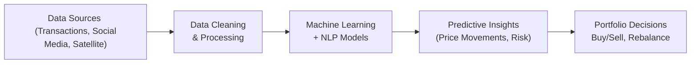

## Introduction

So, you ever find yourself scrolling through social media on your phone, thinking, “Wait a second—could this flood of tweets and satellite images actually highlight investment opportunities?” If so, you’re definitely not alone. Big data and alternative data have become buzzwords for modern investors, especially those seeking an edge in today’s rapidly shifting markets. Data from social media sentiment, web scraping, credit card transactions, or even satellite imagery of parking lots can offer rich perspectives beyond standard financial statements and price histories.

But big data and alternative data aren’t just about having more information. They’re about capturing deeper insight—like a 360-degree panoramic view—into how markets move, how consumer preferences shift, and how real-time events can reshape entire industries. In this section, we’ll explore how these data sets are gathered, managed, shielded from bias, and integrated into your investment process. We’ll also note the ethical and regulatory considerations (because scooping up data is great, but you sure want to avoid legal pitfalls!). By the end, you’ll appreciate how advanced analytics techniques can help you unearth fresh insights, improve risk management, and possibly refine your overall portfolio performance. 

## Understanding Big Data

Big data typically refers to extremely large, complex, and often unstructured data sets that traditional databases and software struggle to analyze. These data sets can include:

• Transaction-level activity in equity and fixed-income markets  
• Clickstream data from websites  
• Public social media posts (think Twitter, Reddit, or LinkedIn)  
• News feeds combined with natural language processing  

In my early days on an investment team, I remember seeing how fundamental analysts spent ages combing through a company’s 10-K, 10-Q, and management commentary. Meanwhile, our “quants” (always seeming a bit mysterious) were analyzing vast troves of streaming data to detect unusual patterns—like sudden spikes in consumer engagement or real-time shipping data that might predict surprising revenue results. The power of big data lies not just in gathering massive volumes of information but also in extracting actionable knowledge with speed.

## Understanding Alternative Data

You might hear “alternative data” thrown around as a catchall for any non-traditional data set. Essentially, alternative data is any source that goes beyond standard market data (e.g., price quotes, fundamentals) or traditional economic indicators. Examples include:

• Social media analytics (e.g., hearts, thumbs-up, and retweets)  
• Satellite imagery (monitoring the volume of inventory in open storage, or how many cars are in a retailer’s parking lot)  
• Web scraping (collecting job postings, user reviews, or e-commerce pricing details)  
• Geolocation data from smartphones (understanding traffic patterns at a business location)  
• Credit card transaction records (anonymous spending trends across different suppliers)  

Some portfolio managers might synthesize these data sources to gauge a company’s real-time performance, long before quarterly earnings calls. Let’s say I spot a spike in foot traffic data at a chain of restaurants—maybe that’s a positive sign for the company’s revenue, or maybe it’s a short-lived curiosity. The trick is discerning the difference.

## Data Analytics Techniques

Collecting massive volumes of data is one thing—turning that data into forecasts and insights is another. This is where data analytics and advanced computational techniques enter the equation:

### Machine Learning

Machine learning involves algorithms that learn patterns from historical data to make predictions or classifications. Picture a model that’s fed 10 years of daily price data, plus consumer sentiment, plus macroeconomic indicators, plus shipping container volumes. The model “trains” itself to recognize hidden correlations.  

Common Machine Learning Approaches:  
• Supervised Learning: You provide labeled data (e.g., stock returns) so the algorithm learns input-output relationships.  
• Unsupervised Learning: The algorithm identifies patterns or clusters without explicit labels (e.g., grouping credit card transaction data to find distinct spending behaviors).  
• Reinforcement Learning: The model “rewards” itself for making correct decisions, continuously improving—often used in algorithmic trading.

### Natural Language Processing (NLP)

NLP extracts meaning and sentiment from text data (news articles, transcripts, social media). For instance, an NLP algorithm can quickly parse thousands of earnings call transcripts to see if a company’s tone is suddenly more cautious—perhaps indicating a looming shortfall in earnings. If integrated with big data sets, NLP can be a powerful tool to assess market sentiment in near-real time.

### Predictive Modeling

Predictive modeling uses various statistical techniques (regression, classification, time series) to forecast potential outcomes. For instance, a predictive model might forecast whether a given stock is likely to experience higher-than-expected volatility next week, based on search engine query trends, social chatter, and broader macro data.

Below is a simple depiction of how these techniques might work together in an investment decision workflow:

## The Role of Data Quality and Bias

A bunch of data is a bunch of data—unless it’s high-quality, it’s not super valuable. And if the data’s inaccurate or biased, it can be worse than worthless because it’ll lead you astray. So always take time to check:

• Data Integrity: Are there anomalies, missing entries, or duplicated records?  
• Representativeness: Does the data represent the whole market or just a tiny subset?  
• Timeliness: Are you getting real-time updates or are you analyzing stale data?  
• Potential Bias: Any systematic skew in how the data was gathered?  

As a personal anecdote: We once used geolocation data to track visits to a chain of fast-food restaurants. Great concept—except the data coverage was skewed toward urban millennials. We missed older demographics in rural areas. That introduced a bias in our model’s results. We needed to augment the data or we risked misjudgment. Data cleaning and preprocessing might not sound glamorous, but trust me, it’s crucial!

## Regulatory and Ethical Implications

Now, let’s talk about regulations and ethics. Using alternative data is exciting—until you inadvertently step on the wrong side of privacy or insider trading rules. The big concerns include:

• Privacy Laws: GDPR in Europe, the California Consumer Privacy Act, and other data protection laws globally. If data sets contain personally identifiable information (PII) or location data that can be traced back to individuals, you must secure and handle them properly.  
• Insider Trading Risks: If your data set is gleaned from restricted or unlawfully obtained sources, it could be considered material nonpublic information (MNPI). Always ensure your method of data acquisition is fully legal and does not violate any company or personal confidentiality.  
• Intellectual Property Rights: Web scraping, for instance, can bump into “terms of service” or intellectual property issues if you’re not careful.  
• Ethical Use: Be candid about how data is collected and used. You don’t want reputational damage for questionable sourcing or misrepresenting your methodologies to clients.

## Integrating Big Data with Traditional Analysis

Even if you’re a fundamental investor who typically relies on financial statements, you can benefit from big data. Combining the depth of fundamental analysis with real-time alternative data can offer a balanced view:

• Fundamental + Alternative Data: Validate your revenue projections by looking at shipping container data for the company’s goods.  
• Technical Analysis + Social Sentiment: Confirm or refute breakout points by analyzing which way the social sentiment is skewing.  
• Macro Forecasting + Satellite Imagery: If you’re making a call on oil prices, perhaps you’d check the volume of oil stored in tanker facilities, visible from the sky.

A typical synergy might involve using alternative data as a “leading indicator” to support or fine-tune your standard fundamental analysis. At the end of the day, it’s all about synergy—pulling from multiple data streams for a single cohesive investment thesis.

## Managing Technology Infrastructure and Talent

To harness big data, you need robust technology infrastructure:

• Scalable Cloud Platforms: Cloud services let you store and process huge data sets without incurring overhead for on-site hardware.  
• Data Lake Architecture: This design handles unstructured data (text, images) and structured data (spreadsheets, SQL databases).  
• Skilled Personnel: Data scientists, machine learning engineers, software developers, and domain experts must collaborate with portfolio managers.  

When I first saw the “tech stack” behind a big data team, I was blown away by the layers: data ingestion, real-time analytics, high-performance computing clusters, model deployment systems. Sound complicated? Sure. But as big data solutions become more user-friendly (and as “low code” or “no code” solutions pop up), the barriers to entry are manageable. 

## Stress Testing Algorithmic Models

Algorithmic trading and predictive models built on big data can look brilliant during normal markets. But what happens during a market crisis or when consumer sentiment drastically changes overnight? Stress testing is critical:

• Historical Stress Tests: Feed your model data from historical crisis periods (e.g., the 2008 financial meltdown, 2020 pandemic). See how it performs.  
• Forward Scenario Analysis: Hypothesize new crises or regime shifts (like a sudden global commodity shortage) and gauge how your model would respond.  
• Sensitivity Analysis: Tweak key variables (like macro indicators or top-line revenue in your dataset) to see how drastically the model’s output changes.  

It’s essential to ensure your big data strategy is robust under extreme conditions, not just in calm waters. That’s how you maintain risk control and avoid messy surprises.

## Conclusion and Final Exam Tips

• Always vet your data sources, ensuring thorough due diligence, data cleansing, and an awareness of biases.  
• Embrace machine learning and NLP tools, but keep in mind that models are just that—models. Stay vigilant and flexible.  
• Remain compliant with data privacy regulations and intellectual property laws.  
• Combine big data insights with traditional methods. Don’t throw out your fundamental analysis just because you have access to a fancy new data source.  
• Stress test regularly—algorithmic models can fail spectacularly if they’re not prepared for tail events.

Exam Tip: CFA exam questions often test your ability to integrate new information into an existing framework. They may show a scenario about linking alternative data (like satellite imagery or social media sentiment) with financial statement analysis. Be prepared to discuss how you would evaluate the data’s credibility, incorporate those insights into a valuation model, and remain ethically compliant.

Keeping the big picture here: big data and alternative data are not silver bullets. They are best used in tandem with structured research and thorough risk management processes.

## Glossary

• Alternative Data: Non-traditional data sources that can offer additional perspectives beyond standard market data.  
• Machine Learning: Algorithms that learn from data patterns to make future predictions or decisions.  
• Data Privacy Laws (e.g., GDPR): Regulations designed to protect personal data and privacy in the digital age.  
• Web Scraping: Automated extraction of data from websites for analysis.

## References

• CFA Institute, “The Next Frontier: Big Data and Machine Learning in Investment Management.”  
• McKinsey Global Institute, “Analytics Comes of Age.”  
• Google Cloud, “Introduction to Machine Learning for Finance Professional Courses.”

---

## Practice Questions on Big Data and Alternative Data



### Which statement best describes "big data" in investment analysis?

- [ ] It exclusively refers to large pricing datasets from major stock exchanges.
- [x] It comprises extremely large, complex, and often unstructured data sets that require specialized tools and techniques to analyze.
- [ ] It pertains only to alternative data that is unverified and often biased.
- [ ] It is solely about the volume of data, regardless of insight.

> **Explanation:** Big data goes beyond just size. It also involves complex, often unstructured data requiring advanced analytics for insights.

### Which of the following is a key advantage of satellite imagery as an alternative data source?

- [ ] Immediate legal compliance without further checks.
- [ ] High-frequency disclosures of a company’s internal audits.
- [x] Real-time or near real-time monitoring of asset volumes (e.g., oil storage, parking lots).
- [ ] Guaranteed elimination of personal data privacy concerns.

> **Explanation:** Satellite imagery provides timely, near real-time information about observable asset changes. However, it does not automatically guarantee compliance with privacy or other regulations.

### In supervised machine learning, how does the model learn?

- [x] The model receives labeled examples and attempts to map inputs to the correct outputs.
- [ ] The model identifies patterns in unlabeled data automatically.
- [ ] The model learns only by trial and error without any labeled data.
- [ ] The model adjusts parameters randomly until it stumbles on a correct pattern.

> **Explanation:** Supervised learning uses labeled data—where inputs and outputs are known—to train algorithms to generalize from examples.

### Which of the following best characterizes data bias?

- [ ] Data bias occurs only when analyzing structured financial statements.
- [ ] Data bias is an irrelevant consideration in big data analytics.
- [x] Data bias arises when certain groups or conditions are overrepresented or underrepresented, leading to skewed results.
- [ ] Data bias always improves predictive accuracy.

> **Explanation:** Bias arises when the sample or the collection method systematically excludes or emphasizes certain groups, skewing results.

### Which scenario could raise insider trading concerns with alternative data?

- [x] Acquiring data that contains unreleased company-specific information illegally obtained from an employee.
- [ ] Gathering publicly available data through web scraping.
- [x] Both of the above.
- [ ] None of the above.

> **Explanation:** If alternative data sources provide material nonpublic information (MNPI) acquired unlawfully, it could result in insider trading violations.

### Which of the following best describes the synergy of big data with traditional fundamental analysis?

- [x] Big data can serve as a leading indicator or corroborate fundamental findings, offering a more complete investment picture.
- [ ] Big data fully replaces the need for fundamental analysis.
- [ ] Combining big data with fundamentals always leads to contradictory signals.
- [ ] Big data is only useful for short-term trading, not fundamental research.

> **Explanation:** Big data often complements fundamental analysis by offering additional real-time or granular perspectives.

### Why is stress testing crucial for data-driven models?

- [ ] It guarantees profits in all market cycles.
- [ ] It completely eliminates the possibility of model failure.
- [x] It evaluates how the model might perform under extreme or unexpected market conditions.
- [ ] It only focuses on improving CPU processing capacity for large datasets.

> **Explanation:** Stress testing helps gauge the resilience of models under adverse scenarios.

### Which organizational setup best ensures success with big data analytics?

- [ ] A single data scientist managing everything alone.  
- [ ] Splitting data scientists and investment teams with minimal communication.  
- [x] Collaborative efforts between data scientists, investment analysts, and IT professionals to align insights with portfolio objectives.  
- [ ] Outsourcing all data analytics to a third-party vendor and ignoring results.  

> **Explanation:** Collaboration ensures that domain expertise shapes data-driven insights, leading to more effective investment decisions.

### What is a primary ethical challenge when using web scraping?

- [x] Potential violation of website terms of service or intellectual property rights.  
- [ ] Easy oversight of the entire data ingestion pipeline.  
- [ ] Guaranteed compliance with data privacy laws.  
- [ ] Extensive legal codes preventing any market advantage.  

> **Explanation:** Ethical use of web scraping involves honoring site terms of service, not infringing on intellectual property, and verifying that data usage complies with privacy rules.

### Is it advisable to rely solely on alternative data sources and ignore traditional market data?

- [x] True  
- [ ] False  

> **Explanation:** While alternative data can be a game-changer, it’s best used to complement, not entirely replace, traditional data such as financial statements, analyst consensus, and established market metrics.


