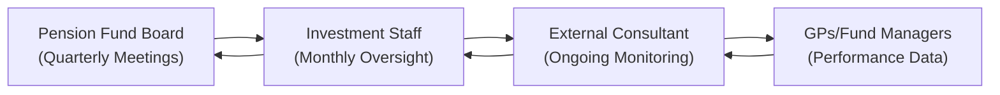

## Introduction and Context

Allocating to alternative investments (AI) can be a thrilling yet complex journey, particularly when you peek into the perspectives of institutional allocators like pension funds, endowments, and foundations. Let’s be honest—these folks carry massive responsibilities. They’re not just trying to beat the S&P 500; they often have liability profiles that stretch decades into the future, strict transparency expectations, and boards that want rock-solid due diligence processes. You might have heard terms like “liability-driven investing” and “regulated mandates” swirling in these conversations. And that’s exactly where specialized investment consultants often enter the picture.

In this lesson, we’ll explore what goes on in the minds of allocators, how consultants fit in (and sometimes don’t), and why RFPs can transform the manager-allocator-consultant relationship. Along the way, I’ll share a story or two, because it’s surprising how a casual conversation with a pension plan sponsor over coffee can shed light on the real pressures they face. We’ll also dive into the importance of setting performance metrics, asking the right questions, and building a transparent accountability framework.

Below is a general roadmap for what’s ahead:

• Understanding Institutional Allocators.  
• Aligning Alternative Investments with Allocators’ Goals.  
• Evaluating the Role of Investment Consultants.  
• Identifying and Mitigating Conflicts of Interest.  
• Effective Communication and the RFP Process.  
• Best Practices, Pitfalls, and Performance Oversight.  
• Key Takeaways, Final Exam Tips, and References.

---

## Understanding Institutional Allocators

Institutional allocators include pension funds, endowments, insurance companies, sovereign wealth funds, and similar entities. They’re typically tasked with preserving capital, growing assets, and meeting future liabilities. Pension plans, for instance, often operate under liability-driven investing (LDI) frameworks. This approach ensures that assets and liabilities move in tandem so that retirees’ pensions remain secure—even if interest rates, mortality rates, or legislative conditions change.

### Liability-Driven Investing (LDI)

LDI might sound like fancy jargon, but the concept is quite straightforward: match your asset profile to your liability structure. If your liabilities behave a certain way when interest rates change—like with pension benefits—your asset portfolio should also respond in a similar pattern, offsetting the risk. This is especially relevant in alternative investments. Many hedge funds, real estate funds, or private debt vehicles can have uncertain liquidity profiles, so LDI demands careful weighting of those exposures.

### Regulatory Mandates and Transparency

Allocators often face a barrage of regulations and rules about reporting, asset concentration, and prudent person standards (or prudent expert standards in some jurisdictions). For example, you might have a foundation that must maintain a minimum annual distribution. This can put a real damper on illiquid allocations if the foundation can’t reliably convert those private equity holdings to cash. The desire for transparency also shows up in robust manager due diligence processes and extensive performance reporting requirements.

### My Anecdote on Allocator Constraints

I once worked with a small city pension fund that struggled to incorporate private equity. Why? They had big benefit payouts every quarter—like clockwork—and couldn’t lock up more than 5% of their portfolio in illiquid assets for fear of a sudden cash crunch. This practical reality overshadowed the theoretical benefits of high expected returns from buyout funds. So, while the returns looked promising on paper, LDI constraints and monthly retiree benefits forced them to keep plenty of liquidity. Moral of the story: fancy expected returns matter, but real-world constraints matter more.

---

## Aligning Alternative Investments with Allocators’ Goals

Allocators typically have three broad goals when they consider alternative investments:

• Risk Diversification  
• Absolute Return Generation  
• Liability Matching

### Risk Diversification

When markets get shaky, many institutional investors hope that alternatives provide some sort of cushion. Hedge funds, real estate, private credit, and infrastructure might offer returns that are less correlated with traditional equities or fixed income. The catch? Not all alternative assets are uncorrelated. And correlation can spike in market crises. So, an allocator’s challenge is to choose strategies that truly lower overall portfolio volatility and not just chase flashy marketing claims.

### Absolute Return Generation

Certain alternatives—like long-short hedge funds or venture capital—focus on generating absolute returns. Pension funds seek managers who can deliver positive performance irrespective of how broader asset classes perform. But let’s remember that absolute return strategies can come with higher fees and lower transparency, especially in times of stress.

### Liability Matching

Pension funds with predictable outflows or insurance companies with claims to pay often seek AI that can match or offset these spending patterns. Infrastructure assets with stable and inflation-linked cash flows might help match outflow obligations. Real estate with long-term leases can also align with multi-year liability horizons.

---

## Evaluating the Role of Investment Consultants

Let’s shift gears and talk about investment consultants. In many ways, these consultants act as a bridge between the allocator and the vast (sometimes overwhelming) universe of alternative investments. They analyze manager pipelines, suggest strategies, and even help negotiate fees.

### The Consultant’s Value Proposition

1. Expertise in Manager Selection:  
   Consultants often maintain massive databases of manager performance. They’ll have scoured track records, done operational due diligence, and can provide lists of top-notch GPs (General Partners).  

2. Deep Knowledge of Specialized Strategies:  
   If an endowment wants to pivot from a heavy equity focus to a more balanced approach including real estate or private debt, a consultant with specialized knowledge can fast-track that transition.  

3. Negotiation Clout with GPs:  
   Consultants who represent a consortium of clients can leverage larger aggregated capital, enabling them to negotiate better fee terms or side letters.  

4. Governance Support:  
   For smaller institutional investors, the consultant may act as an extension of staff, providing critical input to the board or investment committee.  

### The Downsides: Conflicts, Costs, and Over-Reliance

Consultants aren’t miracle workers, and they’re not free of conflicts of interest. Some prime examples:

• Conflicts of Interest and Independence:  
  Consultants might receive revenue-sharing deals from certain fund managers or have preferential relationships. If you’re an allocator, you want to dig deeply into how your consultant is paid. Are they purely fee-based, or do they get a slice from managers as well?

• One-Size-Fits-All Portfolios:  
  A large consultant might propose “model portfolios” or standardized solutions that don’t fully reflect the unique constraints of each allocator. Over time, an allocator might wonder if custom solutions are even possible.  

• Over-Reliance on Brand Name:  
  Sometimes, boards take comfort in a big consulting firm’s brand name, but that doesn’t necessarily guarantee top-quality service. Thorough due diligence is just as important for consultants as it is for managers.

### Personal Story on Consultant Selection

Years ago, I remember an endowment that hired two different consultants simultaneously—one for public markets and one for alternatives. This dual-structure managed to complicate the entire investment process. The public markets consultant wanted to keep large cash buffers to meet capital calls. The alt consultant wanted to be more aggressive. Without a unified viewpoint, they ended up in conflict, slowing decision-making at crucial times. The endowment’s staff spent more time mediating than investing. That taught me (and them) that specialized expertise is great, but at the end of the day, you need a cohesive approach.

---

## Identifying and Mitigating Conflicts of Interest

One of the top concerns in hiring consultants is ensuring their advice is objective. Let’s explore typical conflict points and how to handle them:

### Fee Structures

Consultants might be paid as a percentage of AUM (assets under management), on a retainer, or via project-based fees. Investigate these structures. If a consultant stands to earn more money by recommending a certain product or moving assets around, that’s a red flag. Purely fee-only compensation, in principle, can reduce misaligned incentives, although it’s not a silver bullet.

### Revenue-Sharing Arrangements

Some consultants have in-house “outsourced CIO” (OCIO) solutions or discretionary vehicles that funnel capital to managers. If they partner with managers that pay them a referral fee, your best bet is to demand transparency—and to weigh whether that arrangement clouds their advice.

### Ownership of Multiple Lines of Business

Many consulting firms also offer performance analytics, portfolio monitoring, or even data subscription services. Cross-selling can occur, and it’s vital to understand each line of business’s revenue source.

---

## Effective Communication and the RFP Process

Alright, let’s talk RFPs (Requests for Proposal). If you’ve never run an RFP, it’s basically a chance to tell prospective consultants, “Here’s who we are, what we need, and how we want to work. Now show us your best solution.” You’ll likely receive quite a few proposals, compare them, conduct interviews or final presentations, and then select your consultant.

### Crafting a Strong RFP

An RFP should clearly state:  
• Your overall investment policy and objectives  
• Specific asset class exposures you’re targeting in alternatives  
• Preferred fee structure and the budget range for consultant services  
• Timeline for selection, including interview dates  
• Reporting and transparency expectations (monthly, quarterly)

### Evaluating Proposals

Focus on:  
• Firm experience and track record  
• Conflict of interest disclosures  
• Culture and team continuity (consultant turnover can be a headache)  
• Quality of references from other allocator clients

### Communication Channels

Once you’ve picked a consultant, it’s crucial to set up streamlined communication. Everyone needs to know how to share updates, how often, and in what format. For instance, if your board meets quarterly, you might want a monthly data feed from the consultant and a more in-depth performance deck each quarter.

Here’s a simple Mermaid diagram illustrating an example communication flow for a pension fund working with an external consultant:



In this diagram, the fund board receives updates from the investment staff quarterly, while the staff interacts with the consultant monthly. The consultant also gathers data from GPs and passes insights back to the staff to be summarized and presented to the board.

---

## Best Practices, Pitfalls, and Performance Oversight

### Best Practices

• Develop Clear Performance Metrics:  
  Define accountability measures early. For instance, “Outperform a custom alternative benchmark by 150 basis points over a full market cycle” or “Deliver annual realized volatility less than 6% in the alternatives portfolio.”

• Conduct Periodic Consultant Reviews:  
  Don’t just re-hire them blindly at the end of a contract. Evaluate whether they delivered on their promises and whether they remain a good cultural fit.

• Keep an Eye on Evolving Regulations:  
  If new transparency requirements pop up or if the local regulator changes permitted asset classes, your consultant needs to adapt quickly.

### Common Pitfalls

• Following “Hot” Managers:  
  Consultant hype around a top manager might lead to herding. Overcrowded strategies can lose their alpha edge, especially in alternatives.

• Over-Delegating:  
  Some allocators hand over the keys to the consultant but don’t keep track of evolving conditions. Make sure to maintain your own governance structure.

• Underestimating Fees:  
  Alternative investments can be expensive, and layering consultant fees on top can erode net returns. Keep a close eye on total expense ratios.

---

## Numerically Driven Example: Evaluating Consultant Performance

Let’s do a little numeric illustration. Suppose an endowment hires a consultant to help oversee a $200 million alternatives portfolio. The consultant’s performance is measured against a custom benchmark with a 7% annual return target. Over five years:

• Portfolio returns: 8.50%, 4.00%, 10.00%, 5.00%, 6.00%  
• Benchmark returns: 7.00%, 3.50%, 8.00%, 6.00%, 7.00%  

We can compare geometric returns or a simpler approach—just average them if we’re doing a quick rough check.

Average portfolio return:  
(8.50% + 4.00% + 10.00% + 5.00% + 6.00%) / 5 = 6.70%

Average benchmark return:  
(7.00% + 3.50% + 8.00% + 6.00% + 7.00%) / 5 = 6.30%

At first glance, the consultant delivered an average of 40 basis points above the benchmark over five years. But it might be more insightful to do a time-weighted or money-weighted return analysis depending on how flows occurred. This difference might or might not justify the consultant’s fee structure, which is part of your cost-benefit analysis.

In Python, you could do something like:

```python
import numpy as np

portfolio_returns = np.array([0.085, 0.04, 0.10, 0.05, 0.06])
benchmark_returns = np.array([0.07, 0.035, 0.08, 0.06, 0.07])

annualized_portfolio_return = ((1 + portfolio_returns).prod())**(1/len(portfolio_returns)) - 1
annualized_benchmark_return = ((1 + benchmark_returns).prod())**(1/len(benchmark_returns)) - 1

premium = (annualized_portfolio_return - annualized_benchmark_return)*100

print(f"Portfolio Annualized: {annualized_portfolio_return:.2%}")
print(f"Benchmark Annualized: {annualized_benchmark_return:.2%}")
print(f"Excess Return: {premium:.2f} bps")
```

This snippet would give you a more precise geometric comparison. If the annualized return premium is, say, 50 basis points, you’d then weigh that against the consultant’s fees and whether you find that net performance adequate—and aligned with your risk profile.

---

## Final Exam Tips

• Expect scenario-based questions: The exam might present a situation where a pension fund tries to integrate hedge funds into an LDI framework or asks you to evaluate the relative merits of different consultant fee structures. Be ready to articulate how you’d assess potential conflicts of interest or the rationale for an RFP.  

• Emphasize integrated thinking: Show how consultant selection is not just about picking the “best brand,” but also about alignment with the allocator’s constraints.  

• Familiarize Yourself with LDI Fundamentals: Knowing how liabilities are valued and how alternative assets can or cannot offset them is crucial.  

• Demonstrate Ethical and Professional Judgement: The CFA Institute Code of Ethics strongly emphasizes duty of loyalty, prudence, and care. Consider how these apply when evaluating consultant conflicts or fee transparency.  

• Practice Short-Answer and Essay Responses: You might be asked to illustrate steps in an RFP or write a memo to a board explaining the pros and cons of hiring a consultant with revenue-sharing agreements. A structured, concise, and well-justified approach typically scores higher.

---

## Glossary

• Liability-Driven Investing (LDI): An investment approach focusing on ensuring that assets match current and future liabilities, commonly used by pension funds.  
• Investment Consultant: A third-party advisor who guides asset allocation, manager selection, performance monitoring, and often helps with negotiation and due diligence.  
• GP (General Partner): The managing entity in a private equity, hedge fund, or similar investment arrangement, typically responsible for decision-making and operational control.  
• RFP (Request for Proposal): A formal process of soliciting detailed, competitive proposals from prospective service providers, including consultants, outlining the scope and terms of the engagement.

---

## References

• Preqin, “How Institutional Allocators Choose Their Alternative Investments.”  
• “Best Practices in Consultant Selection,” Investment & Pensions Europe.  
• “Prudent Practices for Investment Advisors,” fi360 Guidance.  
• CFA Institute, “Global Investment Performance Standards (GIPS).”  
• CFA Institute Code of Ethics and Standards of Professional Conduct.

---

## Test Your Knowledge: Allocator and Consultant Principles Quiz



### Which of the following best describes liability-driven investing (LDI)?

- [x] Matching asset behavior to specific future liability obligations.
- [ ] Diversifying across multiple asset classes to maximize return.
- [ ] Holding only government bonds for stable incomes.
- [ ] Investing heavily in short-term instruments.

> **Explanation:** LDI focuses on aligning asset performance with specific liability patterns, such as pension benefit payouts, rather than purely on total returns.

### What is one key advantage that consultants often bring to institutional allocators?

- [x] Access to a broad manager database and negotiation clout.
- [ ] Guaranteed outperformances against equity benchmarks.
- [ ] Zero conflicts of interest, guaranteed by their in-house policies.
- [ ] Complete immunity from market downturns.

> **Explanation:** Consultants often maintain extensive networks and databases of fund managers, enabling them to leverage negotiation power and specialized knowledge. However, they do not guarantee outperformance or complete protection from losses.

### Which of the following is considered a potential downside when working with investment consultants?

- [x] Conflicts of interest if they receive revenue-sharing from managers.
- [ ] They always provide objective, conflict-free advice.
- [ ] They can circumvent all regulatory constraints.
- [ ] They offer unlimited transparency into private funds.

> **Explanation:** Conflicts of interest may arise if consultants receive payments from the managers they recommend. Allocators must carefully scrutinize fee structures and possible biases.

### Why might an institutional allocator issue an RFP before hiring an investment consultant?

- [x] To invite multiple proposals, ensuring broader comparison and transparency.
- [ ] To rely on a pre-existing framework for an immediate hire.
- [ ] To limit potential consultants to only those charging the highest fees.
- [ ] To lock in a single consultant without negotiation.

> **Explanation:** An RFP process helps organizations compare multiple firms, assess transparency, and negotiate terms effectively.

### How can an allocator evaluate whether the consultant's advice aligns with its specific investment mandates?

- [x] By examining the consultant's prior experience with similar portfolios and verifying alignment with the allocator’s risk profile.
- [ ] By focusing exclusively on the consultant’s brand name.
- [x] By reviewing any potential revenue-sharing arrangements disclosed.
- [ ] By retaining multiple consultants and ignoring any overlap in recommendations.

> **Explanation:** To ensure alignment, allocators should consider the consultant’s experience with similar mandates, evaluate potential conflicts, and check that the recommended strategy meets the allocator’s unique constraints.

### Which of the following best describes a potential risk of using a large, well-known consultant?

- [x] Receiving one-size-fits-all solutions that neglect unique client constraints.
- [ ] Guaranteeing tailored, bespoke advice for each client.
- [ ] Eliminating all fee-related conflicts of interest.
- [ ] Minimizing resource needs for due diligence entirely.

> **Explanation:** While recognized consultants may have robust resources, they may also implement standardized portfolios that don't reflect each allocator’s specific goals and constraints.

### Regarding fee structures, which statement is most accurate?

- [x] Fee-only structures reduce certain conflicts but do not eliminate them completely.
- [ ] A performance-based fee removes the need for oversight.
- [x] Consultants charging asset-based fees cannot have any conflicts of interest.
- [ ] Commission-based arrangements guarantee impartial advice.

> **Explanation:** A fee-only arrangement can mitigate some conflicts of interest, but oversight is still required. Performance-based or asset-based fees can pose bias. No structure is entirely conflict-free.

### What is the purpose of ongoing consultant performance reviews?

- [x] To ensure the consultant continues to meet agreed-upon performance criteria and remains a good cultural fit.
- [ ] To finalize a lifetime contract with the consultant.
- [ ] To ensure the consultant is not gaining new capabilities or specialized knowledge.
- [ ] To reduce the chance of adjusting the strategic plan based on market changes.

> **Explanation:** Regularly reviewing a consultant’s performance helps confirm they meet the original objectives and supports continuous alignment with the organization’s evolving needs.

### After receiving proposals, why might an allocator conduct in-person interviews before choosing a consultant?

- [x] To gauge team dynamics, cultural alignment, and deeper technical capabilities.
- [ ] To eliminate the possibility of negotiating fees.
- [ ] To ensure the consultant does all communication purely by email.
- [ ] To avoid referencing any conflicts of interest.

> **Explanation:** In-person (or virtual) interviews help clarifying intangible factors such as team rapport, specialized expertise, and cultural fit, which may not be fully evident in a written proposal.

### A True/False: Consultant independence is always guaranteed under pure fee-only compensation.

- [x] True
- [ ] False

> **Explanation:** While fee-only compensation can reduce certain conflicts, it does not guarantee independence. Allocators must still exercise due diligence to uncover potential unseen biases or relationships.


