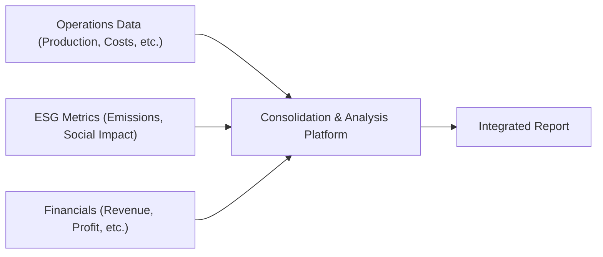

## Introduction
Integrated reporting has gained massive traction in the modern investment landscape. It’s that sweet spot where organizations don’t just talk about their balance sheets and income statements, but also highlight how they’re managing social impact, environmental footprints, and broader governance practices. Believe me, I once sat through a meeting where a CEO rattled off their net income and debt metrics, then ended with, “Oh, by the way, we also lowered our carbon emissions by 15%.” That passing comment triggered more investor questions than any other part of the presentation. So, yeah, integrated reporting is kind of a big deal these days.

In essence, integrated reporting merges both financial and non-financial information in a single cohesive framework, ideally giving stakeholders (including shareholders, employees, regulators, and even society at large) a holistic view of a firm’s operations and value creation strategy. It’s not just about ticking a box for compliance. It’s about appealing to the evolving expectations of today’s investors, many of whom are eyeing the wider impacts of their capital commitments—particularly in the realm of alternative investments.  

## Why Integrated Reporting Matters for Alternative Investments
In the alternative investment universe, which includes private equity, hedge funds, real estate, infrastructure, and more, transparency can be tricky. These sectors frequently involve private deals, less standardized reporting, and fairly complicated asset structures. Traditional financial statements alone might not convey the full picture of long-term value creation, risk factors, or sustainability efforts.  

Integrated reporting goes a step further by capturing intangible factors: Are portfolio companies implementing robust governance frameworks? Is that farmland investment employing methods that improve soil health over time? Did that infrastructure project meaningfully involve local communities in its planning stages?  

All these elements can affect performance, risk, and investor perception. Conducting integrated reporting in alternative investments can enhance:

• Credibility. Demonstrates maturity and ESG awareness to prospective investors.  
• Risk Management. Identifies non-financial risks (environmental, social, governance) that might not show up in a regular financial report.  
• Long-Term Value. Helps highlight intangible assets and overall resilience.  

## Linking Financial and Non-Financial Data
The crux of integrated reporting is to bring financial, operational, and sustainability data together under one roof. It’s sort of like stitching a big quilt that includes a profit and loss statement in one corner and a carbon footprint analysis in another, all held together by your corporate strategy.

Many firms follow recognized frameworks such as the International Integrated Reporting Council (IIRC) guidelines. Others combine multiple frameworks (like SASB Standards, GRI, or TCFD) into a unified narrative presented to stakeholders, especially shareholders. The core principle is that these elements do not exist in isolation. Financial performance is increasingly interdependent with environmental and social initiatives.  

## The Big Picture: Frameworks and Value-Based Metrics
A hallmark of integrated reporting is the use of value-based metrics—performance measures that go beyond pure financial data and attempt to capture broader societal and environmental impacts. Doing this effectively requires an alignment with frameworks that are recognized globally, because consistency is vital for comparability:

• International Integrated Reporting Council (IIRC) Framework: Focuses on communicating how an organization’s strategy, governance, performance, and prospects, in the context of its external environment, lead to the creation of value in the short, medium, and long term.  
• Global ESG Disclosure Standards for Investment Products: Guides firms on how to present ESG factors in a transparent manner to potential and current investors.  
• Voluntary Initiatives (like TCFD): Emphasis on climate-related financial disclosures, especially for carbon-intense industries or investments.  

Value-based metrics can include:

• Environmental indicators: Greenhouse gas emissions, water usage intensity, pollution outputs.  
• Social indicators: Employee training hours, community stakeholder engagement frequency, local sourcing.  
• Governance indicators: Board independence, transparency in shareholder communications, codes of ethics, anti-corruption practices.  

By presenting these metrics, a company addresses the growing demand from investors (including institutional and retail participants) who increasingly ask, “How does this portfolio holding align with my values or reduce certain risks?”

## Enhancing Transparency and Trust
Some folks might wonder, “But isn’t integrated reporting just one more layer of disclosure adding to management’s workload?” Possibly, yes—but the benefits usually outweigh the burden. When done well, integrated reports boost transparency and strengthen trust among stakeholders. Investors get a clearer sense of not only the numbers but also the narrative behind how those numbers are achieved.

Remember that moment I described earlier, when a CEO casually mentioned the company’s environmental initiatives? Investors flocked to that topic because it held deeper meaning than a straightforward EBITDA line. Showcasing these initiatives in a formal integrated report, with relevant metrics and context, engenders even more trust and deeper engagement.

## Technology Platforms for Streamlined Reporting
Since integrated reporting can involve mountains of data—both quantitative and qualitative—technology can be a lifesaver. Many platform solutions help organizations collect, aggregate, and validate data from various sources:

• Automated Data Capture: Tools that tie directly into operational systems to track items like energy consumption or real-time supply chain metrics.  
• Standardized Dashboards: Platforms that convert raw data into standardized metrics for quick, consistent reporting across multiple projects.  
• Analytical Tools: AI-based and advanced analytical software for detecting anomalies, generating predictive insights, and verifying data accuracy.  

Smaller private funds might opt for simpler spreadsheets or manual methods, but as they scale, adopting robust data collection and reporting software can reduce risk of error, and enhance the timeliness and reliability of disclosures.

## Engaging Shareholders and Other Stakeholders
Let’s shift gears and talk about shareholder engagement, which is the often-overlooked counterpart of integrated reporting. Reporting is about pushing out the information; engagement is about pulling in feedback and responses. Shareholders, particularly in alternative investments, appreciate consistent and constructive communication.  

Consider employing multiple avenues for this dialogue:

• Regular Updates: Annual reports (integrated ones), quarterly performance calls, or monthly newsletters.  
• Town Halls or Webinars: A chance for direct Q&A. I remember attending a virtual town hall that started with big plans for expansion but quickly pivoted to enthusiastic questions around the firm’s new net-zero initiative.  
• Shareholder Advisory Committees: Smaller groups of major shareholders or strategic advisors that actively weigh in on corporate decisions or strategic directions.  
• Proxy Voting and Electronic Feedback Loops: Provide digital means for shareholders to cast votes and express opinions on ESG and governance proposals, ensuring a real sense of ownership beyond financial stake.  

Although public companies typically have more formalized structures for shareholder engagement, private market participants are increasingly adopting these methods, especially if they have a diverse or institutional investor base.

## Incorporating Feedback and Voting Rights
Engagement shouldn’t be a one-way street, right? You want to incorporate the feedback you receive, if it aligns with the long-term direction of the firm. Maybe your farmland investment entity discovered from a stakeholder survey that local communities are concerned about water usage. You can revise your operating procedures to adopt more water-efficient irrigation systems and highlight that pivot in your next integrated report.

When it comes to large-scale policy and governance matters, shareholders often exercise voting rights. This can involve approval on major capital expenditures, board compositions, or specific ESG proposals. In many jurisdictions, investor activism is on the rise, with some shareholders pushing for more progressive stances on environmental or social issues. Effective integrated reporting, combined with robust engagement channels, can help these conversations remain constructive rather than combative.

## Compliance with Accounting and Regulatory Standards
The compliance dimension is significant. Firms can face potential regulatory scrutiny if they provide incomplete or misleading non-financial disclosures. Investors also rely on the consistency of these disclosures, cross-referencing them with recognized standards such as IFRS, US GAAP, or the Global ESG Disclosure Standards by the CFA Institute.  

Because alternative investments often span geographic regions, reporting standards might differ from one project to the next. Some countries mandate integrated reporting or climate disclosures, while others are still in the adoption stage. Ensuring compliance requires:

• A Clear Policy: Documenting standard procedures for data gathering, verification, and reporting.  
• Third-Party Audits: Having the integrated report’s ESG metrics audited or verified by independent specialists.  
• Legal Counsel: Understanding how local jurisdictions treat integrated reporting, including potential liabilities for errors or omissions.

## Common Pitfalls and How to Avoid Them
While integrated reporting and shareholder engagement can be transformative, there are a few pitfalls. Perhaps the biggest is “greenwashing” or overstating the positive impacts while ignoring negative externalities. Stakeholders will eventually sniff out inconsistencies.

Additional pitfalls include:

• Data Overload: Dumping too many raw metrics can overwhelm investors and obscure material information.  
• Lack of Materiality: Including metrics that aren’t truly material to value creation can dilute the clarity of the report.  
• Poor Coordination: Producing the integrated report in a silo, without input from key functional areas (finance, operations, ESG teams).  
• Infrequent Updates: Neglecting to maintain consistency in reporting frequency or letting the data become stale.  

Luckily, these pitfalls are fixable by employing thorough internal processes, focusing on material issues, and, again, using robust data governance and technology solutions.

## Example in Action: A Quick Case Study
Imagine a private equity firm with a focus on renewable energy projects. The firm invests in wind farms, solar parks, and green hydrogen facilities spread across different continents. Traditionally, it published annual statements outlining financial returns and asset-level performance (like generation capacity and total revenue from electricity sales).

An integrated reporting approach layered in robust ESG data:

• Environmental: Carbon emissions displaced compared to fossil fuel baselines, biodiversity impact at wind farm sites, water usage in solar panel cleaning.  
• Social: Local community training programs, job creation metrics, partnerships with local educational institutions.  
• Governance: Board composition, anti-corruption training for staff, cybersecurity measures to protect operational data.

Coupled with monthly email updates and quarterly webinar sessions, the shareholders started feeling far more engaged. They knew precisely how each project was performing, not only financially but also in its environmental and social dimensions. This integrated approach paved the way for new investors who were specifically attracted to sustainable projects. It also deepened trust, reinforcing the long-term societal benefits the firm sought to achieve.

## Data Flow in Integrated Reporting
Below is a simple Mermaid diagram illustrating how different data elements can flow into an integrated report:

In the above diagram, raw operational, ESG, and financial information all feed into a consolidation and analysis platform. Then, relevant and validated data is curated into a final integrated report delivered to stakeholders.

## Best Practices
• Materiality Matters: Focus on content that is relevant to the firm’s performance and risk profile.  
• Continuous Learning Loop: Actively incorporate shareholder feedback into strategic decisions.  
• Standardize Early: Use recognized frameworks to ensure comparability, transparency, and credibility across markets.  
• Communicate Often: Share updates regularly and cultivate an ongoing conversation with stakeholders.  
• Validate Data: Use internal or external audits to verify ESG metrics, reinforcing credibility.

## Exam Relevance and Study Tips
On the CFA exam (especially if you’re preparing for advanced-level questions in strategy or ethics), integrated reporting can play a prominent role in item sets testing your grasp of ESG disclosures, governance, and how non-financial data influences investment decisions. You might see scenario-based questions asking you to evaluate a company’s integrated report for completeness, or to recommend additional disclosures for risk reduction.  

Be prepared to:

• Discuss the primary components and benefits of integrated reporting.  
• Identify best practices in ESG and integrated disclosure.  
• Understand how shareholder engagement supports corporate governance.  
• Recognize potential pitfalls and how to address them.

Time management is crucial if a question requires you to interpret integrated disclosure data and link it to an investment decision. Practice synthesizing a mix of financial statements with non-financial indicators to illustrate a coherent investment thesis.

## Glossary
Integrated Reporting (IR): A reporting framework that integrates financial and non-financial (ESG) data into a single document.  
Stakeholder Engagement: The process of involving all individuals or groups that have an interest or stake in the company’s operations and outcomes.  
Value-Based Metrics: Performance measures that capture financial returns as well as broader societal and environmental impacts.

## References
• International Integrated Reporting Council (IIRC). “Integrated Reporting Framework.”  
• Gompers, P., Ishii, J., & Metrick, A. “Corporate Governance and Equity Prices.” The Quarterly Journal of Economics.  
• CFA Institute. “Global ESG Disclosure Standards for Investment Products.”

## Test Your Knowledge: Integrated Reporting & Shareholder Engagement Mastery



### In an integrated report, which of the following best illustrates the inclusion of a non-financial metric?

- [ ] Total revenue from core business operations
- [ ] EBITDA margin for the fiscal year
- [x] Reduction in greenhouse gas emissions compared to baseline
- [ ] Dividend payout ratio over time

> **Explanation:** Non-financial metrics often reflect environmental, social, or governance factors. Greenhouse gas emissions reduction is a classic ESG indicator.

### Which of the following is a primary objective of integrating financial and non-financial disclosures?

- [x] Providing a holistic view of long-term value creation
- [ ] Minimizing the need for regulatory compliance
- [ ] Concealing potentially negative information
- [ ] Reducing the workload for finance departments

> **Explanation:** Integrated reporting aims to give stakeholders a broader perspective on how the organization creates sustained value over time.

### A private equity firm implementing integrated reporting plans to provide a specific metric for social value creation. Which of the following would be most appropriate?

- [x] Number of community jobs created through portfolio investments
- [ ] Yearly return on equity
- [ ] Profit margins for each underlying portfolio company
- [ ] Average management fees paid to the GP

> **Explanation:** “Number of community jobs created” is a clear social indicator aligned with integrated reporting.

### Which statement best describes shareholder engagement in the context of integrated reporting?

- [ ] It is a one-way flow of information from corporations to shareholders.
- [ ] It refers to mandatory approval of financial statements only.
- [x] It involves ongoing dialogue, feedback, and potential voting on corporate decisions.
- [ ] It is unrelated to ESG initiatives or metrics.

> **Explanation:** Shareholder engagement should be a collaborative process, including opportunities for feedback, Q&A sessions, and active decision-making.

### What is a common pitfall in integrated reporting?

- [x] Overloading the report with immaterial data
- [ ] Providing audited financial statements
- [ ] Encouraging stakeholder feedback
- [ ] Using standardized ESG frameworks

> **Explanation:** Including excessive or irrelevant data can obscure the most crucial aspects of the firm’s performance and strategy.

### Which of the following frameworks specifically offers guidance on how to present ESG factors in investment products?

- [ ] SEC Regulation A+
- [x] CFA Institute Global ESG Disclosure Standards
- [ ] Basel III Regulations
- [ ] IFRS 9

> **Explanation:** The CFA Institute’s Global ESG Disclosure Standards are designed to help firms disclose ESG-related information clearly and consistently.

### An investor in a private infrastructure fund wants more frequent updates and a chance to ask questions directly. Which of the following approaches would best address this?

- [x] Hosting regular town halls or webinar sessions for Q&A
- [ ] Publishing only an annual report without further discussion
- [ ] Sending shareholders additional marketing brochures
- [ ] Directing questions exclusively to an automated chatbot

> **Explanation:** Town halls or webinar sessions for interactive Q&A foster genuine engagement and address investor concerns more effectively than static reports.

### One of the benefits of verified ESG metrics in an integrated report is:

- [x] Increased credibility and trust among investors
- [ ] Guaranteed higher stock prices
- [ ] Elimination of all operational risks
- [ ] Permanent tax exemptions

> **Explanation:** External or third-party verification of ESG metrics builds trust and credibility, although it doesn’t directly guarantee stock prices or eliminate all risks.

### If integrated reporting is mandated by local regulations, a firm should:

- [x] Ensure compliance and possibly engage third-party auditors for ESG data
- [ ] Ignore external frameworks entirely
- [ ] Present only positive ESG outcomes regardless of materiality
- [ ] Bundle non-financial data separately from the main report

> **Explanation:** Firms should adhere to local requirements, ideally supported by external verification of data to enhance reliability and demonstrate compliance.

### True or False? Integrated reporting requires firms to merge financial data with environmental, social, and governance (ESG) data into a single cohesive document.

- [x] True
- [ ] False

> **Explanation:** Integrated reporting explicitly aims to blend traditional financial disclosures with relevant non-financial (ESG) data to provide stakeholders a holistic view of overall performance.


