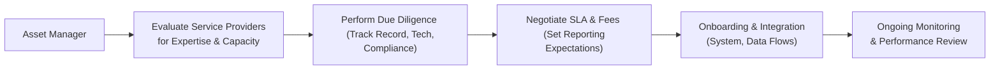

## Overview and Key Considerations

Selecting and working with service providers—particularly fund administrators—can feel a bit like choosing a carefully choreographed dance partner. When it clicks, both parties glide seamlessly across the investment floor, ensuring timely reporting, accurate valuations, and smooth investor communication. When it doesn’t, well… let’s just say you might stumble over missing reports, inconsistent data, or compliance headaches that keep you up at night. 

But worry not, because in this section, we’re going to unpack everything from the roles these providers play to how to evaluate cost structures, technology platforms, and service-level agreements (SLAs).

At the heart of the matter is the understanding that service providers aren’t just vendors; they’re an extension of your firm’s operations. They help ensure you remain compliant with global regulations, keep your investors satisfied with consistent updates, manage data security, and support the entire back-office function. So, let’s explore how to spot the right partner, from a quick look at the due diligence must-haves to tips on negotiating cost structures.

## Crucial Services for Managing Alternative Investments

Before you begin your search for a fund administrator or other service providers, it’s helpful to get a clear sense of what you should expect. Here are three primary support areas for most alternative investment managers:

• Administration: This generally involves accounting, net asset value (NAV) calculations, investor allocations, performance reporting, and distribution of financial statements.  
• Custody: A custodian safeguards the fund’s assets, ensuring that cash and securities are protected against fraud or mishandling. Some providers offer both custody and administration under one roof, while others specialize in just one service.  
• Technology Support: Given the complex nature of hedge funds, private equity, infrastructure, and other alternative assets, robust technology solutions are crucial for data management, regulatory reporting, risk analytics, and investor portals.

I remember working with a small private debt fund manager who was absolutely swamped with manual spreadsheets (and trust me, that’s a hair-pulling scenario!). They tried to run it all in-house but quickly realized they needed specialized software and an admin partner who really understood private credit. The result? They ended up with an all-in-one solution that automated interest calculations, integrated with their middle-office systems, and massively reduced operational risks. 

## Due Diligence on Prospective Providers

Picking a service provider is often approached like an extended version of a job interview. You’re basically hiring them to be part of your extended team. Let’s explore some due diligence aspects:

### Regulatory Track Record

Ensuring compliance with global regulations is paramount. It’s worth verifying any disciplinary actions or fines that may have been levied against your prospective providers. The rules can get tricky if your fund invests across multiple jurisdictions, so you want service providers comfortable navigating the regulatory labyrinth—be it SEC requirements in the United States, MiFID II in Europe, or local guidelines in emerging markets.

### Operational Capacity and Scalability

We’ve all heard stories of a fund outgrowing its administrator’s capabilities, leading to missed deadlines or poor valuations. Evaluate whether the provider has:

• Sufficient staffing and relevant expertise to handle your asset type.  
• High-level automation and technology to scale with your assets under management (AUM).  
• A plan to expand capacity should your fund’s complexity or size grow rapidly.

### Cybersecurity Measures

In a world of phishing attacks, data breaches, and ransomware, you definitely want to feel confident in your provider’s data security protocols. Check that they have robust cybersecurity controls in place, including data encryption, secure servers, multifactor authentication, and a well-documented incident response plan.

## Evaluating Cost Structures and SLAs

Few topics generate more tension than fees. Are they flexible? How do they scale? And what exactly is included in the service-level agreement (SLA)?

### Fee Arrangements

Service providers typically charge a base fee plus additional charges based on specific services or transaction volumes. One common formula might look like this:


\text{Total Fee} = \text{Base Fee} + \alpha \times \text{(AUM)} + \beta \times \text{(Transactions)}


Where:  
• Base Fee covers standard reporting, record keeping, and client support.  
• α (alpha) factor is a percentage that scales with the size of your AUM.  
• β (beta) factor might be a per-transaction fee covering trades, investor subscriptions, or other events.

Let’s say you’re a small real estate fund with $75 million in AUM. You might pay a low-baseline fee because your transaction volume isn’t huge, but the complexity of real estate might increase the “beta” portion for specialized tasks like property-level accounting.

### Service-Level Agreements (SLAs)

Your SLA is the contract that specifies performance standards, reporting frequency, resolution times for issues, and more. You’ll want to clarify:

• Reporting Timelines: How quickly do they finalize valuations post-month-end?  
• Error Resolution: How soon do they address (and correct) any slips in reporting?  
• Communication Protocols: Who is your first point of contact? How often can you expect status updates?

If you’re managing a hedge fund using complex derivatives, for example, you’ll likely want daily or even intraday reporting on trade settlements. Meanwhile, a private equity fund might get by with quarterly or semiannual statements. The SLA ensures your provider knows your expectations and commits in writing to deliver on them.

## Assessing Technology Solutions

No, it’s not enough to simply hire a great admin and hope for the best. You’ll want to see how their tech stack integrates with yours. Keep an eye out for:

• Automated Data Flows: The fewer times humans have to manually re-enter data into spreadsheets, the lower your error rate.  
• Customizable Dashboards: Can you slice and dice your portfolio data by region, sector, or instrument type?  
• Investor Communications: Many administrators now provide investor portals, generating statements and updates on-demand.  
• Compliance Tools: Does their platform flag potential violations or suspicious activity automatically?

## Matching Portfolio Complexity

Alternative investments come in many forms. Some managers trade daily in global futures markets; others lock up capital in farmland or timberland for years at a time. Your chosen service provider should have proven experience in your specific asset class. 

Examples:

• Derivatives-Heavy Hedge Funds: Need robust trade capture, risk management analytics, and collateral management solutions.  
• Private Equity & Real Assets: Require specialized knowledge of capital calls, waterfalls, distribution waterfalls, portfolio company financials, and how to accurately value illiquid assets.  
• Real Estate & Infrastructure: Demand property-specific accounting, rent roll analysis, lease management, and intangible asset valuations.

Make sure your prospective partner has a track record in your segment. Ask for case studies or references from clients with similar investment strategies. 

## Reviewing Client References

Let’s be honest: references are more than just a box you check. By speaking with a provider’s existing or previous clients, you can learn:

• The day-to-day working relationship and communication style.  
• Hidden fees that might only pop up once you’re onboarded.  
• Whether the provider’s actual service levels match what’s promised in marketing brochures.  

Going back to that anecdote about my friend’s private debt fund, they discovered during a reference check that their prospective administrator was phenomenal at large, syndicated deals but struggled with smaller, bespoke direct-lending transactions. Good thing they caught that red flag early.

## Communication Interfaces and Data-Sharing Protocols

One major source of frustration for fund managers is the endless back-and-forth over daily tasks. Minimizing miscommunications is essential. You’ll want clarity on:

• File Formats: Will they accept your transaction data in CSV, XML, or direct API links?  
• Timeliness: How often do they push updates to shared data repositories?  
• System Integration: Do they have an open architecture that plugs into your existing set of risk management or portfolio analytics?

Below is a small Mermaid diagram illustrating a simplified workflow for selecting and onboarding a fund administrator:

## Practical Pitfalls and Best Practices

• Overlooking Time Zones: Working with global service providers can lead to mismatched working hours, delaying urgent tasks.  
• Vaguely Worded SLAs: If your SLA doesn’t specify timeframes—for example, “final valuations will be provided by 3 p.m. Eastern on T+1”—you could face ambiguous or late deliverables.  
• Inadequate Reporting Customization: Service providers sometimes have preset reporting templates that don’t match a fund’s specific metrics. Clarify customization levels early.  
• Underestimating Technology Migration: Switching administrators can require a full-scale data migration that might create temporary disruptions.

On the positive side, a good provider can be your best friend when you encounter an audit or face investor scrutiny. They’ll have a well-documented process, timely data, and a record of compliance that helps keep your operation running smoothly.

## Exam Relevance for CFA Candidates

Although the details of service provider selection might seem operational at first glance, they truly matter for exam scenarios that focus on:

• Risk Management: Errors in valuations or delayed statements can create reputational and compliance risks.  
• Ethical and Professional Standards: The CFA Institute Code of Ethics emphasizes diligence and care in selecting external partners who also adhere to high ethical standards.  
• Performance Evaluation: GIPS (Global Investment Performance Standards) compliance relies on accurate performance calculations.  

In essay or item-set style questions, expect to see scenarios of underperforming providers, or data integration challenges that test your knowledge of best practices. You might be asked to outline the steps in due diligence, to analyze a poorly structured SLA, or to point out missing cybersecurity controls.

## Conclusion and Final Thoughts

Selecting a service provider is more than a cost line item—it’s a collaborative relationship that profoundly affects your investment operations, risk exposure, and reputation. If you invest the time in thorough due diligence, negotiate clear SLAs, check references, and ensure technology alignment, you’ll set the stage for a partnership that not only smooths out your back-office processes but also provides strategic insights and peace of mind.

If you’re evaluating multiple providers, try scoring them across critical dimensions: cost, technology, track record, client support, domain expertise, and sustainability. Another good practice? Maintain a regular performance review that ensures your provider is keeping pace with your fund’s evolution and the broader market environment.

And hey, a friendly piece of advice: never hesitate to ask “too many” questions. It’s better to discover an uncomfortable truth about a provider before you’ve signed the dotted line than to unravel it months later when investor capital is at risk.

## References and Further Reading

• AIMA, “Guide to Sound Practices for Hedge Fund Administrators.”  
• Preqin, “Evaluating Third-Party Services in Private Equity and Hedge Funds.”  
• CPA Australia, “Due Diligence, Monitoring, and Disclosures.”  

These resources provide deeper discussions on the operational intricacies and best practices for picking external administrators and service providers, including recommended checklists and evolving trends in digital systems.

## Sample Exam Questions: Evaluating Service Providers for Alternative Investments



### Which service is commonly included in a third-party fund administrator's responsibilities for alternative investments?

- [ ] Portfolio management and trade execution
- [x] Accounting and investor reporting
- [ ] Risk-parity strategy implementation
- [ ] Underwriting insurance-linked securities

> **Explanation:** Fund administrators typically handle back-office tasks such as accounting, NAV calculations, and investor reporting. Portfolio management or underwriting is generally carried out by the fund’s internal team or specialized underwriters.

### In the context of evaluating a prospective fund administrator’s regulatory track record, which of the following steps is most appropriate?

- [ ] Avoid looking at past disciplinary actions to avoid bias
- [x] Review regulatory filings to identify any fines or sanctions
- [ ] Skip the securities regulator’s website and rely solely on references
- [ ] Conduct only an informal interview with the provider’s compliance officer

> **Explanation:** Reviewing regulatory history for fines, suspensions, or sanctions is crucial to gauge the provider’s compliance culture and operational reliability.

### When negotiating an SLA with a service provider, which of the following elements is most important to clearly define?

- [ ] The manager’s alpha generation methods
- [ ] Internal budgeting processes for staff training
- [x] Reporting timelines and error resolution procedures
- [ ] Marketing budgets for the service provider’s promotional campaign

> **Explanation:** Clarifying reporting timelines and how errors will be resolved is essential for ensuring smooth and transparent operations. The other items are not typically relevant to the SLA’s scope.

### A small hedge fund trades complex derivatives daily and needs intraday reporting. What key factor should the fund emphasize when selecting an administrator?

- [ ] Client references from short-term bond fund managers
- [x] The administrator’s real-time data and valuation capabilities
- [ ] The administrator’s experience with farmland valuations
- [ ] Usage of manual spreadsheets for trade capture

> **Explanation:** A fund actively trading derivatives requires advanced, real-time data handling to calculate valuation and margin updates intraday. Experience with farmland or manual spreadsheets is irrelevant.

### Which of the following scenarios best illustrates typical fee structures for a fund administrator?

- [x] A base fee plus variable components scaling with AUM or transaction volume
- [ ] A pure performance fee with high-water marks
- [ ] A single fixed fee that never changes
- [ ] Payment in the form of fund shares or units only

> **Explanation:** Administrators typically charge a base fee plus a variable fee linked to the size of AUM and perhaps the number of transactions. Pure performance fee structures are more common for investment management fees.

### What is a key benefit of integrating automated data flows between a fund manager and an administrator?

- [x] Reduction of human error through elimination of manual data entry
- [ ] Guarantee of zero compliance breaches
- [ ] Immediate increase in fund returns
- [ ] Elimination of the need for asset custody arrangements

> **Explanation:** Automated data flows reduce human error and improve efficiency. They do not guarantee zero compliance issues and do not directly boost returns or replace asset custody.

### Why is scalability a significant concern when choosing a fund administrator?

- [ ] Administrators prefer to remain with smaller AUM funds
- [ ] Regulators require the same fees, irrespective of fund size
- [x] The fund could grow quickly, overwhelming a smaller provider
- [ ] It only matters for digital asset-based funds

> **Explanation:** If a fund grows fast, administrators lacking scalable systems or enough experienced staff could fail to deliver timely and accurate services. This risk is relevant for any type of fund strategy, not just digital assets.

### What primary value might a specialty custodian offer that a generalist might not?

- [ ] Higher guaranteed returns for investors
- [ ] Free marketing campaigns for fundraising
- [x] Expertise in safeguarding niche asset classes and managing complex documentation
- [ ] Avoidance of any need for compliance oversight

> **Explanation:** Specialty custodians or administrators provide firm-specific expertise in safeguarding complex or niche asset classes such as real estate, private credit, or other alternative strategies. They do not guarantee returns or eliminate compliance requirements.

### Which detail is typically included in an SLA with a fund administrator?

- [ ] The manager’s personal investment preferences
- [ ] Number of daily trades the fund is allowed to make
- [ ] The average age of the administrator’s staff
- [x] Specific performance benchmarks for timely reporting

> **Explanation:** SLAs specify service standards, such as the frequency or deadlines for producing financial statements, how quickly they’ll correct errors, and other performance benchmarks. Personal preferences, trading caps, and staff demographics are not SLA items.

### A manager suspects their fund administrator’s technology might be outdated. Which action would best help confirm this suspicion?

- [x] Reviewing a recent technology audit and comparing competitor offerings
- [ ] Asking for verbal assurances from the administrator’s sales staff
- [ ] Checking the administrator’s social media presence
- [ ] Cancelling the contract without investigation

> **Explanation:** A formal audit or an evidence-based comparison against industry standards is the most reliable way to confirm whether an administrator’s technology platform meets current needs.


