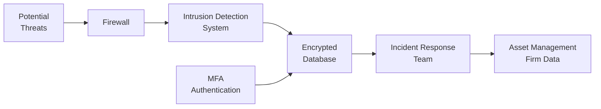

## Overview

Well, let’s be candid for a second: the first time I witnessed a data breach at a financial institution, it felt like watching an unstoppable train heading right off the rails. Client information, proprietary models, and reams of sensitive data were thrown into question, and trust took a huge hit. You might think, “Surely that can’t happen at my firm!” But in an era where cybercriminals grow bolder every day, no asset manager—big or small—can afford complacency. Coupled with extensive data protection regulations and new AI-driven investment strategies (which themselves are built on sensitive datasets), the stakes have never been higher.  

In this article, we’ll explore practical steps to guard against cyberattacks and data breaches. We’ll talk about how to design a robust cybersecurity framework, train staff to spot social engineering, respond to incidents calmly, and keep regulators happy. We’ll also touch upon relevant data protection regulations, such as GDPR, and highlight how the finance sector is meeting mounting security and privacy expectations. So, let’s dive right in.

## The Rise of Cyber Threats in Asset Management

Asset management firms have always been prime targets for bad actors. Think about it: these organizations handle large flows of capital, troves of proprietary investment strategies, and personal data for high-net-worth clients. A single breach can cost millions of dollars in losses, push clients away, and tarnish a firm’s reputation to the point of no return.  

But it’s not just traditional hacking we’re worried about. The surge in AI-driven investment models—where data fuels algorithmic decisions—exposes all sorts of vulnerabilities, especially if those machine learning models rely on incorrectly secured data sets or flawed encryption. Imagine if a competitor or a rogue actor gained access to your AI-based trading algorithms. They could reverse-engineer your strategy or, worse yet, manipulate trades in real time.  

Given these threats, asset managers need to implement cybersecurity best practices that address both external hacks and internal vulnerabilities.  

## Building a Comprehensive Cybersecurity Framework

A cybersecurity framework is like a well-fortified castle wall. It’s designed to keep invaders out and your valuables safely tucked inside. Here are the key components of an effective cybersecurity framework for asset management:

• Firewalls and Intrusion Detection Systems (IDS): Invest in enterprise-grade hardware and software firewalls to monitor and control the flow of traffic. Pair them with intrusion detection/prevention systems to spot (and stop) suspicious activity before it becomes a full-blown attack.

• Encryption: Encryption secures sensitive data at rest and in transit. Whether it’s emails leaving the firm or huge data sets stored in the cloud, robust encryption is crucial. For especially sensitive data, you might rely on solutions that offer end-to-end encryption for both data and metadata.

• Multi-Factor Authentication (MFA): Passwords alone aren’t enough these days. MFA requires multiple independent credentials (like your password plus a code sent to your phone) before allowing system access. MFA significantly reduces the risk of unauthorized logins, even if a password is compromised.

• Regular Patching and Software Updates: Sometimes we’ve all been guilty of clicking “Remind Me Later” when a system update prompt appears. However, up-to-date software patches block known vulnerabilities and are critical allies in helping keep your infrastructure safe.

• Access Controls and Segmentation: Limit system access strictly to employees who need it. Segment your networks so that a compromise in one system doesn’t immediately cascade into the rest of the firm’s infrastructure.

Below is a simplified mermaid diagram illustrating a basic cybersecurity architecture flow in an asset management context:



Here, every stage works together to either detect or neutralize potential intrusions before they can disrupt vital operations or access confidential data.

## Human Factor: Social Engineering and Staff Training

Now, let’s pivot to arguably the biggest x-factor in cybersecurity: people. In so many successful cyberattacks, the attacker didn’t blast through a firewall or exploit a zero-day vulnerability; they simply tricked someone into revealing their password or plugging in a compromised USB device. That’s social engineering in a nutshell—using psychological manipulation to glean confidential information.

We all get busy, or in a hurry, or just plain curious. So a well-crafted phishing email with your boss’s signature might actually fool you. Then—bam—your firm is handing over control of its system to an attacker. The solution? Ongoing staff training.  

• Phishing Simulations: Periodically run simulated phishing campaigns to test how many employees click suspicious links. Provide follow-up education to help them spot red flags.

• Secure Remote Access Protocols: With remote and hybrid work on the rise, put robust policies in place about accessing company data from home or public Wi-Fi. Maybe use a secure VPN or require strong device-level encryption.

• Resilience Testing: Beyond technology, resilience tests can include “red team exercises,” where security professionals intentionally try to breach the firm’s defenses or trick employees, then share lessons learned.

## Incident Response Planning

If a breach or cyberattack does occur—and let’s face it, we hope it never does, but you can’t bank on that hope—an Incident Response Plan (IRP) is pure gold. Think of the IRP as a crisis management playbook:

• Communication Channels: When chaos hits, everyone needs to know exactly whom to contact. This means designated lines of communication both inside and outside the organization (including media relations, regulators, and clients).

• Containment Procedures: If a certain system is compromised, how do you isolate it? Stopping the spread quickly can be the difference between a minor hack and a full meltdown.

• Data Recovery Steps: Ensure frequent backups stored in separate, secure locations. Outline how data can be restored quickly, especially if production servers go offline.

• Post-Incident Review: After the dust settles, it’s time to assess how the breach occurred and how to prevent a recurrence. Document everything for future auditors, regulators, and internal awareness.

## Data Protection Regulations and Compliance

If you’ve taken a peek at European law, you’ve probably heard of the General Data Protection Regulation (GDPR). In essence, GDPR sets out guidelines on how personal data—ranging from phone numbers to investment preferences—must be collected, processed, and stored. Failure to comply can result in monstrous fines.

In other regions, you’ll find other frameworks, like the California Consumer Privacy Act (CCPA), the Personal Data Protection Act in various APAC countries, and many more. Regardless of your geographical base, these regulations share three common themes:

• Authenticated Consent: You must have a legitimate reason (often spelled out in a privacy policy) for processing data, and you must obtain explicit consent for certain uses.

• Right to be Forgotten: Individuals may request that their personal data be erased. Firms have a set timeframe to comply (subject to other legal or regulatory requirements).

• Process Accountability: You need robust systems and controls to track data flows, including how data is acquired, stored, shared, or destroyed.

It’s crucial for asset managers to coordinate with legal teams and compliance officers to ensure that cybersecurity measures align with relevant data-protection rules across jurisdictions.  

## Evaluating Cybersecurity Insurance

Here’s a question I get all the time: “Does my firm really need cybersecurity insurance?” Given the cost of potential damages—financial, reputational, or legal—the right insurance policy can be a lifesaver (or at least a portfolio saver).

• Coverage Scope: Ensure that the policy covers not just the direct costs of a breach (like client notification expenses) but also potential liability claims, regulatory penalties, and any required forensic investigations.  

• Third-Party Audits: Many insurers require a technology risk audit. This is actually a great opportunity for the firm to uncover vulnerabilities and fix them in a proactive manner.

• Exclusions: Some policies might have exclusions for “acts of war” or “state-sponsored” attacks, which can be tricky to define. Read the fine print carefully.

## Continuous Monitoring and Periodic Reviews

Cyber threats change quickly. One day, you’re dealing with structured phishing attempts; the next, it’s sophisticated AI-based “Deep Fake” impersonations. For that reason, you’ve got to keep your cybersecurity framework agile:

• Annual Policy Revisions: Update all relevant security documents, policies, and controls at least once a year (or more if new major threats emerge).

• Ongoing Threat Intelligence: Sign up for threat intelligence feeds and attend industry security roundtables so you’re aware of the newest hacking tricks.

• Penetration Testing: Conduct more frequent penetration tests and simulate advanced persistent threats to better assess how capable your systems are of handling modern attacks.

## Brief Python Illustration: A Simple Hashing Check

Just to give you a small taste of how easy it is to incorporate security measures (albeit in a simplistic form), check out this quick Python snippet using the hashlib library. This code demonstrates hashing a string (like a password) with the SHA-256 algorithm:

```python
import hashlib

def generate_hash(input_string):
    # Convert the input to bytes
    encoded_input = input_string.encode('utf-8')
    # Create a sha256 hash object
    hash_object = hashlib.sha256(encoded_input)
    # Convert the hash to a hexadecimal string
    return hash_object.hexdigest()

plain_password = "P@ssw0rd123"
hashed_password = generate_hash(plain_password)
print("Plain:", plain_password)
print("SHA-256 Hashed:", hashed_password)
```

Obviously, real-world scenarios call for salting (adding random data to the password before hashing) and other best practices, but the snippet highlights how straightforward it can be to integrate cryptographic functions into your workflows.

## Practical Case Study

One mid-sized asset management firm discovered it was leaking client statements via an unsecured cloud folder—ouch. A quick Google search by a curious researcher turned up private information. After an internal scramble, the firm instituted immediate changes:

• Encrypted Cloud Services: They switched to a zero-knowledge encryption provider.  
• Access Logging: Each folder now automatically logs user access.  
• Routine “Data Sweeps”: A newly formed IT Security Team runs monthly scans looking for misconfigurations in cloud repositories.  

As you can guess, the fiasco was a huge embarrassment. Clients questioned the firm’s reliability, but by quickly adopting corrective measures—and being transparent about the fix—the firm managed to regain some trust.  

## Conclusion and Final Exam Tips

Cybersecurity and data protection in asset management are way more than just technical niceties. They are critical pillars supporting the trust your clients place in you—trust that’s easily lost and incredibly difficult to rebuild. By implementing a cohesive framework (strong perimeter defenses, robust encryption, staff training, and continuous updates), you can reduce your firm’s risk profile significantly.

On the CFA exam, it’s possible you’ll face scenario-based questions about operational risk, compliance, or technological disruptions. Here are some practical tips:

• Study Real-World Attacks: Understand how actual firms have been compromised, and think about which controls could have prevented it.  
• Use Frameworks: Familiarize yourself with recognized frameworks like NIST Cybersecurity Framework and ISO/IEC 27001. Being able to map a scenario to established frameworks can be a game-changer in essay questions.  
• Integrate with ERM: Cyberrisk is part of Enterprise Risk Management. If you see a question about overall firm risk, ensure you mention cybersecurity as a key subcomponent.  
• Speak the Language: Terms like “encryption at rest,” “incident response plan,” and “social engineering” come up frequently in exam contexts.  
• Timing: If you encounter a multi-part question involving a breach scenario, structure your answer around immediate containment, communication, and longer-term prevention.

## References

• National Institute of Standards and Technology (NIST):  
  Cybersecurity Framework. https://www.nist.gov/cyberframework  

• ISO/IEC 27001:  
  Information Security Management Systems Requirements. https://www.iso.org/isoiec-27001-information-security.html  

• Financial Stability Board (FSB):  
  “Cybersecurity and the Finance Sector.” https://www.fsb.org  

• Various Regulations (GDPR, CCPA, etc.)

## Test Your Knowledge: Cybersecurity and Data Protection



### Which of the following best describes “Social Engineering” in the context of cybersecurity breaches? 
- [ ] Unauthorized access through software vulnerabilities
- [ ] Using advanced encryption to secure communication channels
- [x] Psychological manipulation to trick individuals into revealing data
- [ ] Large-scale denial-of-service attacks on servers

> **Explanation:** Social engineering relies on human interaction and tricks individuals into divulging sensitive information, rather than exploiting software or hardware flaws.

### Which cybersecurity measure most directly prevents unauthorized access if an employee’s password becomes compromised?
- [ ] Firewalls
- [x] Multi-Factor Authentication (MFA)
- [ ] Single sign-on (SSO)
- [ ] Basic password encryption

> **Explanation:** MFA requires users to provide multiple verification factors (e.g., password + a device code), thereby reducing compromise risk if just the password is known.

### Under GDPR, firms must be prepared to respond to a data subject’s request to:
- [x] Erase their personal data (the “right to be forgotten”)
- [ ] Share data about other clients
- [ ] Provide full details of proprietary AI trading algorithms
- [ ] Ignore any requests that are more than 30 days old

> **Explanation:** GDPR includes the concept of a “right to erasure,” allowing individuals to request the deletion of their personal data, subject to legal grounds.

### Which of the following is a key benefit of a robust Incident Response Plan for asset managers?
- [ ] It eliminates all risk of a cyberattack
- [x] It provides a structured approach to contain a breach and guide recovery
- [ ] It automatically notifies regulators without legal counsel’s involvement
- [ ] It only applies to system downtime events

> **Explanation:** An Incident Response Plan ensures a firm can quickly identify, contain, and recover from a breach by following predefined steps.

### A “penetration test” is best described as:
- [ ] A method of encrypting personal data in the cloud
- [ ] A regulatory requirement applicable only to banks
- [ ] A backup verification procedure for physical security
- [x] An authorized simulation of a cyberattack to identify security weaknesses

> **Explanation:** Penetration testing involves security experts who attempt to breach your systems legally, revealing any vulnerabilities that real hackers might exploit.

### In the event of a cyber breach, which action should asset managers prioritize first?
- [x] Contain the compromised systems to prevent spread
- [ ] Notify clients via social media
- [ ] Immediately destroy all logs to prevent further access
- [ ] Modify passwords only after consulting law enforcement

> **Explanation:** Containment is the essential earliest step to stop additional damage or data leakage. Communication and other actions follow from there.

### From a security standpoint, which solution combination most effectively reduces exposure to phishing attacks?
- [ ] Single sign-on and local file encryption
- [x] Continuous staff training and email filtering tools
- [ ] Only high-end firewalls
- [ ] Zero logging on user activities

> **Explanation:** Phishing attacks often target employees. Staff training and robust email scanning/filters are critical lines of defense.

### Which scenario exemplifies social engineering in a financial firm?
- [x] An email disguised as a CEO request for a quick wire transfer
- [ ] Using advanced quantum encryption to protect client data
- [ ] Upgrading the company’s firewall to the latest version
- [ ] Conducting an annual phishing simulation test

> **Explanation:** An attacker masquerading as an executive to trick employees into sending money or data is a classic social engineering tactic.

### Cybersecurity insurance primarily helps asset management firms by:
- [x] Providing financial and legal coverage in case of breach-related damages
- [ ] Eliminating the need for an Incident Response Plan
- [ ] Guaranteeing that no government fines will be levied
- [ ] Allowing unlimited data sharing with clients

> **Explanation:** Cybersecurity insurance helps cover costs related to business interruptions, legal fees, and data recovery, but it does not negate the need for strong internal security controls.

### Adopting Multi-Factor Authentication (MFA) is always a foolproof protection measure.
- [x] True
- [ ] False

> **Explanation:** While MFA significantly bolsters security, nothing is truly foolproof. Attacks can still occur through social engineering, stolen devices, or other sophisticated methods. Nonetheless, MFA remains one of the most effective measures.


