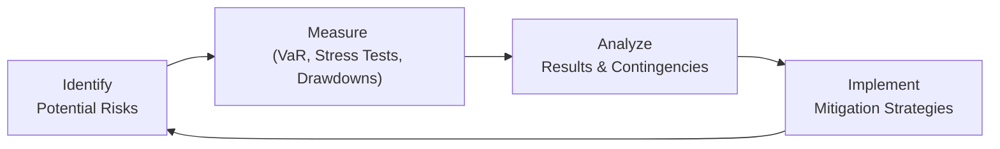

## Overview and Key Concepts

Imagine you’re building a house: you need a solid structure (your investment approach) plus a sturdy roof and strong walls (your risk management framework) to protect everything inside. When it comes to alternative investments, that roof and those walls need to be especially robust. After all, alternative investments—whether in hedge funds, private equity, real assets, or digital tokens—tend to have more complex risk profiles than traditional stocks and bonds. 

I still recall working at a boutique hedge fund years ago, when a sudden liquidity crunch jolted the markets. We realized that our prime broker was also under pressure, and it highlighted our vulnerabilities in both market and counterparty risk. That was the moment I truly grasped how intertwined these risks can be and how quickly things can unravel without a thorough risk management plan.

Below you’ll find an in-depth look at the major types of risk facing alternative investments, along with the tools and techniques to measure and manage them. I promise: by the end of this discussion, you’ll feel more comfortable about approaching alternative assets, spotting the warning signs, and keeping your portfolio intact—even if the markets get a little wild.

## Categories of Risk in Alternative Investments

Market, credit, liquidity, and operational risks come up in conventional portfolios too—but they’re often amplified in the alternative realm. You know how people say, “Expect the unexpected?” That phrase is basically the motto of alternative investment managers.

Market Risk  
• Price volatility might be extreme in certain strategies, such as distressed debt or cryptocurrency.  
• Correlation structures can be unstable, especially during crises.

Credit (Counterparty) Risk  
• OTC derivatives expose you to the creditworthiness of the counterparty.  
• Over-leveraged structures can suddenly freeze if lenders pull out.

Liquidity Risk  
• Hard-to-sell assets (private equity stakes, real estate holdings) can trap capital.  
• Lock-up periods for hedge funds and gating provisions can be triggered at the worst times.

Operational Risk  
• Sometimes overshadowed, but it’s huge: poor controls, fraud, or inadequate continuity plans can ruin a firm.  
• It also covers technology breakdowns and compliance lapses.

## Risk Measurement and Monitoring Frameworks

It’s one thing to talk about big, scary risks, but how do we actually measure them? That’s where quantitative frameworks come in: Value at Risk (VaR), stress testing, and scenario analysis all play key roles. Each technique has strengths and weaknesses:

Value at Risk (VaR)  
VaR attempts to answer the question: “With X% confidence, what is my maximum expected loss over Y time horizon?”  
• For instance, a 99% one-day VaR of USD 2 million suggests that, on 99% of days, losses won’t exceed USD 2 million.  
• VaR is popular for portfolio-wide snapshots but can be misleading if you rely on normal distributions or if markets become highly illiquid.

Stress Testing and Scenario Analysis  
• Stress testing simulates extreme, yet plausible, market events.  
• Scenario analysis goes further by combining shocks to multiple factors—maybe interest rates spike while commodity prices crash, and a major counterparty defaults.  
• These tools reveal hidden pockets of risk that VaR may miss.  
• In my own experience, scenario analysis is a powerful conversation starter with stakeholders. You can ask, “What if the Fed unexpectedly doubles interest rates?” or “What if a new regulation slashes commodity exports?” Those ‘what ifs’ can spark robust contingency plans.

Drawdown Monitoring  
• Specifically looks at the peak-to-trough decline of your portfolio.  
• A quick example: Suppose your fund hits a peak value of USD 50 million and later drops to USD 40 million; that’s a 20% drawdown.  
• Monitoring drawdowns is especially vital for retail or smaller investors who can’t tolerate large capital losses.

Below is a simple diagram illustrating how different risk measurement techniques form parts of an overall risk management system:

This cycle helps ensure you’re in a continuous loop of identifying, measuring, analyzing, and mitigating risks.

## Risk Budgeting and Position Sizing

Now that we’re measuring risk, how do we allocate capital so that our total exposure aligns with our comfort level (or that of our clients)? Here comes risk budgeting. Essentially, we figure out how much “risk capital” we’re willing to put into each strategy or asset.

• A typical approach might say: we have a total “risk budget” of 10% volatility for the entire portfolio. So we try to keep each strategy or asset’s share of that budget consistent with our expected returns and correlation patterns.  
• Position sizing is the micro version. For each trade or asset, we ask, “How big a position can my fund hold before exceeding our volatility (or VaR) target?”  

If you’re a global macro manager going long foreign bonds, you might only allow each currency position to account for, say, 2% of your overall VaR. Once a position starts to devour more than 2%, you rebalance or hedge.

## Derivatives and Hedging Strategies

Derivatives sometimes get a bad rap, but used properly, they can be fantastic shock absorbers. Think of them as the seatbelts and airbags of your portfolio. You don’t want to rely entirely on them to drive recklessly, but it’s nice to have them if something unexpected happens.

Common Tools  
• Futures: Great for quickly adjusting market exposure or hedging commodity price risks without selling your underlying holdings.  
• Options: Provide asymmetric payoff structures—ideal when you don’t want to cap upside but wish to limit downside.  
• Swaps: Used to exchange cash flows, such as fixed vs. floating interest rates or to receive equity index returns in exchange for a floating rate. Particularly prevalent in interest rate or currency hedging.  

Implementation Pitfalls  
• Liquidity might dry up in derivatives markets during financial stress.  
• OTC derivatives involve credit exposure to the counterparty.  
• A mismatch between your underlying position and the derivative’s payoff structure can lead to partial or ineffective hedges.

## Evaluating Counterparty Risk

If you completely rely on your derivatives broker or private lender, you’ll want to be sure they can deliver on their obligations. That’s counterparty risk—like you’re playing a doubles tennis match, and you have to trust your partner not to double fault under pressure.

Key Considerations  
• Creditworthiness: Look at credit ratings, liquidity positions, regulatory oversight, and track record.  
• Collateral and Margin: Often, you’ll want daily margin calls or robust collateral agreements to mitigate potential losses if a counterparty defaults.  
• Concentration Risk: Relying too heavily on one or two big counterparties can create single-points-of-failure.

In 2008, for example, some funds got burned when a few large prime brokers suddenly became distressed. Everyone thought these big firms were bulletproof—turns out, they weren’t.

## Contingency Planning for Unforeseen Market Dislocations

Remember 2020, when so many professionals found themselves working from home overnight? That’s just one example of how the unexpected can arrive without an invitation. Whether it’s a global pandemic, a sovereign default, or a massive cyberattack, a robust contingency plan is your friend in a crisis.

Typical Elements of a Contingency Plan  
• Lines of credit or bridging facilities to meet capital calls.  
• Plans for remote work or alternate data centers.  
• Emergency communication protocols with investors, regulators, and employees.  
• A playbook for quickly unwinding positions, if necessary.

## Ongoing Review of Risk Management Policies

Regulations evolve, markets shift, new technologies emerge. Your risk management policies should stay current—this is not a “set it and forget it” exercise. Let’s face it, the times are always changing. 

Make it a habit to review your risk policies at least quarterly or semiannually. Ask yourself:  
• Are we aligning with new regulatory standards?  
• Have our portfolio’s objectives or constraints changed?  
• Is our technology infrastructure still adequate to track risk exposures in real-time?  

In one fund I advised, we discovered that as we scaled up assets under management, our old trade entry system had trouble capturing real-time exposures. Upgrading risk systems was a game-changer—but it required an honest look at policy and process shortfalls.

## Glossary

Value at Risk (VaR)  
• Maximum expected loss over a set time horizon, given a certain confidence level.

Scenario Analysis  
• Predicting various future outcomes based on hypothetical events, such as commodity price shocks or regulatory overhauls.

Position Sizing  
• Determining how much capital to allocate to each position. Aligns with risk tolerance and overall portfolio strategy.

Counterparty Risk  
• The possibility that another party in a transaction or agreement fails to meet its contractual obligations.

Risk Budgeting  
• Allocating total capital according to risk metrics rather than simply nominal exposures. This ensures overall portfolio risk is constrained in line with targets.

## Practical Tips for the Exam

• Identify Hidden Risks: CFA exam questions on alternatives sometimes present a scenario where obvious risks are overshadowed by something subtle—like operational or counterparty exposure.  
• Show Your Work: If asked to compute VaR or stress test outcomes, lay out your assumptions clearly (time horizon, confidence level, distribution).  
• Tie It All Together: The exam often tests your ability to integrate risk measures (e.g., VaR outputs) into portfolio decisions (e.g., adjusting position sizing).  
• Plan for “What If” Scenarios: You may face short-answer questions about how you’d respond if interest rates spike or a key derivative counterparty fails. Offer a logical, step-by-step plan.

## References

• Jorion, P., Value at Risk: The New Benchmark for Managing Financial Risk (McGraw-Hill, 2007).  
• “Risk Management Approaches in Alternative Investments,” Journal of Portfolio Management.  
• GARP (Global Association of Risk Professionals) website for frameworks and certifications on risk management.

## Test Your Knowledge: Risk Management in Alternative Investments



### Which risk category specifically addresses the difficulty of selling a private equity stake in a timely manner?

- [ ] Credit risk
- [x] Liquidity risk
- [ ] Market risk
- [ ] Operational risk

> **Explanation:** Liquidity risk refers to the inability to sell or convert an asset into cash promptly without significantly impacting its price. Private equity stakes are famously illiquid, often requiring longer holding periods and facing limited buyers.

### What is a common limitation of Value at Risk (VaR)?

- [ ] It offers a thorough look at tail risks.
- [ ] It accounts for non-normal market conditions automatically.
- [ ] It excludes scenario analysis.
- [x] It may underestimate losses if markets become highly illiquid or if there is abnormal market behavior.

> **Explanation:** VaR uses assumptions about market distributions, often underestimating losses in extreme market conditions or when liquidity evaporates.

### A technique where analysts evaluate the effect of various hypothetical market shocks (like interest rate hikes or currency collapses) is called:

- [ ] Position sizing
- [x] Scenario analysis
- [ ] Variance decomposition
- [ ] Portfolio optimization

> **Explanation:** Scenario analysis models the impact of hypothetical or extreme events to see how portfolios might behave, revealing vulnerabilities not captured by simpler measures.

### What term describes the proportion of risk capital allocated to each position or strategy within a portfolio?

- [ ] Stress testing
- [ ] Alpha generation
- [x] Risk budgeting
- [ ] Ratio analysis

> **Explanation:** Risk budgeting involves setting an overall “risk budget” and allocating slices of that total to each position or strategy.

### In the context of hedging, which of the following is true regarding derivatives?

- [x] Options can limit downside while preserving some upside potential.
- [ ] Swaps are used only for equity exposure.
- [x] Futures can help adjust market exposure quickly.
- [ ] Derivatives can only be traded on formal exchanges.

> **Explanation:** Options provide asymmetric payoffs, allowing downside protection with some upside remaining. Futures allow rapid changes to market exposures. Some derivatives do trade OTC, not just on exchanges.

### Which of the following is a direct way to control your exposure to catastrophic losses?

- [x] Drawdown monitoring
- [ ] Market correlation analysis
- [ ] Tax-loss harvesting
- [ ] Dollar-cost averaging

> **Explanation:** Drawdown monitoring helps ensure that when losses reach a certain threshold, you take steps (like reducing positions) to protect the portfolio.

### When assessing counterparty risk, you should:

- [x] Review the counterparty’s credit ratings
- [ ] Assume major institutions never default
- [x] Examine their operational infrastructure
- [ ] Rely solely on internal auditing

> **Explanation:** A thorough evaluation includes looking at both the credit standing and the operational reliability of the counterparty; historical events proved even large firms can fail.

### Which tool specifically accounts for event correlations and cross-asset shocks under extreme conditions?

- [ ] Time-weighted return
- [x] Stress testing
- [ ] Information ratio
- [ ] Dividend discount modeling

> **Explanation:** Stress testing can incorporate extreme shifts across multiple asset classes and reveal correlations that spike in times of crisis.

### What’s an essential component of a contingency plan during unforeseen market dislocations?

- [x] Access to emergency liquidity
- [ ] Ignoring capital calls
- [ ] Reducing reporting transparency
- [ ] Eliminating all leverage immediately

> **Explanation:** A typical contingency plan includes having sufficient liquidity, whether via lines of credit or other facilities, to handle sudden needs such as margin calls or capital calls.

### True or False: Regular risk policy reviews are unnecessary if your fund’s investment strategy never changes.

- [x] True
- [ ] False

> **Explanation:** Even when investment strategies remain stable, external factors (market dynamics, regulatory changes, technology, etc.) evolve. Periodic reviews provide a safeguard against external shifts that could impact risk exposures.


