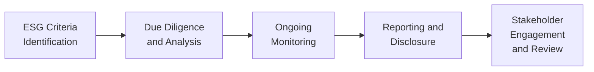

## Introduction

I remember chatting with a mentor who once worked at a hedge fund that pivoted to more ESG-friendly strategies. They initially felt it was just another layer of bureaucracy—“Why do I need to check whether the board has enough independent directors?” they complained. But guess what? Soon after, that fund discovered that board oversight directly influenced risk-taking in ways that affected returns big time. Point is, ESG isn’t just a feel-good concept; it’s a pragmatic extension of the investment process. 

Environmental, Social, and Governance (ESG) factors have rapidly become front-and-center considerations in alternative investing. Why? Because they can affect portfolio returns and influence how investors gauge risk and reward. Well, yes—if a company’s carbon footprint or labor practice scandal triggers regulatory fines, that’s a big deal. So in this section, let’s explore why ESG matters, how to integrate it into our due diligence, and the compliance frameworks that can help or—let’s be honest—sometimes drive you nuts, but are essential.

## Why ESG Matters in Alternative Investments

Alternative investments (think private equity, hedge funds, real estate, infrastructure, etc.) give investors access to unique, less traditional sources of return. But these assets can carry distinct ESG footprints—like farmland with pesticide usage or a private fintech startup with questionable labor policies. Incorporating ESG means investigating these footprints and factoring them into your valuation and risk assessment.

• Risk Mitigation: Good ESG practices often mean fewer lawsuits, fines, or headline-grabbing scandals.  
• Stakeholder Expectations: Many institutional investors—such as pension funds—are insisting on ESG reporting and compliance.  
• Long-Term Performance: Studies increasingly show that companies with robust ESG practices may outperform peers over the long run, though results vary by sector and region.  

### The Role of Environmental Factors

Environmental considerations, often referred to as the “E” in ESG, assess how an investment targets issues like climate change, resource depletion, waste management, or biodiversity. For instance, a renewable energy fund might focus on wind farms or solar infrastructure, while a real estate investor might look into efficient HVAC systems to reduce carbon footprints. Emerging regulatory trends, like carbon taxes, also add cost structures that can change capital allocation decisions.

### The Role of Social Factors

Social factors (the “S”) revolve around labor practices, diversity, community relations, and product safety. For alternative investments, especially in private markets, it’s crucial to ensure that portfolio companies uphold fair labor standards, maintain a positive relationship with local communities, and avoid exploitative practices. If you’ve ever seen a fund manager scrambling because their portfolio company faces a labor protest or a regulatory ban for unethical supply chains, you’ll know that ignoring social factors can come back to bite you.

### The Role of Governance

Governance (the “G”) is often the trickiest. It examines board composition, executive compensation, shareholder rights, transparency, minority investor protections, and checks and balances within the organizational structure. In a private equity deal, you might not have the same level of disclosure as a publicly listed company—meaning you need to vet internal governance structures carefully. Is the board independent enough? Do limited partners have any recourse if management acts against their interests? In many ways, the governance piece forms the backbone that keeps the “E” and “S” honest.

## ESG Integration: Tools & Frameworks

An ESG-integrated approach doesn’t mean you ignore traditional financial metrics. Rather, you enhance them by examining how well an asset aligns with broader environmental, social, and governance standards. This typically involves:

• Identifying key ESG risks and opportunities during due diligence  
• Integrating findings into investment valuations  
• Setting ongoing monitoring and reporting protocols  

Below is a simplified flow of how ESG typically folds into the investment process:

### Approaches to Implementation

• **Negative Screening:** Excluding investments that violate certain ESG criteria. For instance, not investing in a coal-mining project or a biotech company that tests on animals in inhumane ways.  
• **Positive or Best-in-Class Screening:** Selecting investments that demonstrate superior ESG performance relative to peers.  
• **ESG Integration:** Embedding ESG data directly into traditional fundamental analysis.  
• **Active Ownership:** Engaging with management to push for better ESG practices, either through shareholder voting or board representation.

Use whichever approach suits your style and your clients’ preferences. Some managers combine a bit of everything. 

#### Quick Example: Calculating Carbon Emissions

Let’s say a private real estate fund invests in commercial properties. An environmental consultant might measure each property’s carbon footprint in tons of CO₂ per year. That data might factor into projected operating costs, especially if a carbon tax is looming. A simplified version of the carbon tax formula can be expressed in KaTeX as:


T = C \times E,


where T is total carbon tax owed, C is the cost per ton of CO₂, and E is total emissions (in tons). If your building emits fewer tons of CO₂, your costs are lower—and that might make your property more attractive.

## Governance and Compliance

Governance in alternatives can differ significantly from governance in public markets. For one, private deals often have more complex capital structures, less comprehensive disclosure, and fewer formal protections for minority investors. 

On the compliance front, managers need to align range of local and cross-border requirements. For example, a European-based private equity fund investing in an African infrastructure project might face a patchwork of local laws, as well as ESG reporting standards required by their European limited partners. That’s complicated. But ignoring it can incur heavy fines or even losing your license—a big no-no!

It’s also common to see funds adopt voluntary standards like SASB (Sustainability Accounting Standards Board) or TCFD (Task Force on Climate-Related Financial Disclosures) to communicate climate risks. Meanwhile, the Global Reporting Initiative (GRI) offers guidelines for overall ESG transparency. Institutional investors often request these disclosures to monitor the risk profiles of their portfolios.

### Potential Pitfalls and Best Practices

- **Incomplete Due Diligence:** If you fail to map out a target company’s supply chain or corporate culture, you could miss giant red flags.  
- **Misalignment with Stakeholders:** Not aligning with limited partners’ ESG goals can lead to friction or forced early exits.  
- **Inconsistent Reporting:** Jumping between multiple ESG frameworks without standardizing data can create confusion.  
- **Lack of Board Independence:** This can be especially problematic in private markets, where management teams occasionally hold too much sway.

On the bright side, there are best practices that can save your skin:

- **Clear ESG Policy:** Document your policy, goals, and frameworks for measuring outcomes.  
- **Dedicated ESG Team:** Whether it’s one point person or an entire division, someone must ensure procedures are followed.  
- **Transparency:** Provide timely updates on ESG performance to investors and stakeholders, even if it’s “bad” news. At least they trust you for the candor.  
- **Regular Training:** Teams should stay up-to-date on local and international ESG regulations—especially as new carbon taxes or data-reporting requirements emerge.

## Emerging Trends: Carbon Taxes and More

Maybe you’ve wondered, “So, what big changes are knocking on our door?” One prime example is the rising adoption of carbon taxes. Governments increasingly want to hold companies accountable for their emissions, which can alter operating margins and profitability. Another trend is the wave of new guidelines requiring standardized ESG disclosures—meaning more uniformity and less greenwashing.

Private markets, in particular, could see ESG become a formal part of fund agreements. We’re seeing more limited partners tie capital commitments to ESG performance. So if a fund fails an ESG target, part of its carried interest might get clawed back. Sound harsh? Possibly. But it highlights how seriously investors are taking these factors.

## Final Thoughts and Exam Tips

ESG isn’t a passing fad or a moral grandstand. It’s a framework that addresses real-world risks and opportunities. In alternative investments, ignoring ESG can blow up your portfolio in ways you might not expect—from hidden carbon liabilities to poor community relations that halt a project before it even starts. So, keep these points in mind:

• Focus on the “why” of ESG as much as the “what.”  
• Document your approach and ensure measurable metrics.  
• Be consistent—both in reporting and in applying standards.  
• Watch out for evolving regulations, especially on carbon emissions.  

In CFA exam contexts, scenarios may test your understanding of ESG integration. One question might revolve around analyzing the carbon footprints of different portfolio companies, or evaluating how a fund’s governance structure shapes minority rights. Another might ask how well you understand TCFD requirements for climate-related disclosures. In short: anticipate scenario-based questions bridging ESG principles with real-life investment decisions.

## Glossary

• **ESG Integration:** The practice of incorporating environmental, social, and governance considerations into investment analysis and decisions.  
• **SASB (Sustainability Accounting Standards Board):** An organization that sets standards for sustainability reporting, helping investors understand the financially material ESG factors of an investment.  
• **TCFD (Task Force on Climate-Related Financial Disclosures):** Provides guidance on disclosing climate-related financial risks and opportunities.  
• **GRI (Global Reporting Initiative):** International independent organization that helps businesses, governments, and other organizations understand and communicate ESG impacts.  
• **Carbon Tax:** A tax levied on the carbon content of fuels, aiming to reduce carbon dioxide emissions.

## References

- CFA Institute, “ESG Investing and Analysis.”  
- Friede, G., Busch, T., & Bassen, A., “ESG and Financial Performance,” Journal of Sustainable Finance & Investment.  
- Global Reporting Initiative (GRI), available at https://www.globalreporting.org

## Test Your Knowledge: ESG Factors, Governance, and Compliance in Alternative Investments



### Which of the following describes one potential benefit of integrating ESG factors into alternative investment decisions?

- [ ] It guarantees above-market returns in all market conditions.
- [x] It can mitigate reputational and regulatory risks over the long term.
- [ ] It eliminates exposure to macroeconomic factors.
- [ ] It removes the need to conduct fundamental analysis.

> **Explanation:** ESG integration aims to identify and mitigate risks (including reputational and regulatory), but it does not guarantee returns nor eliminate broader market factors. Fundamental analysis remains necessary.

### A private equity fund invests in a manufacturing firm with high carbon emissions. Which framework focuses specifically on presenting climate-related financial risks and opportunities?

- [ ] SASB
- [ ] GRI
- [x] TCFD
- [ ] UN Global Compact

> **Explanation:** TCFD (Task Force on Climate-Related Financial Disclosures) is specifically designed to guide companies on reporting climate-related financial information.

### Which scenario exemplifies a governance risk unique to private market strategies?

- [x] A private company where the CEO holds voting control, limiting minority shareholder influence.
- [ ] A public venture that must disclose quarterly financials.
- [ ] A mutual fund requiring daily NAV reporting.
- [ ] A real estate investment trust subject to exchange listing rules.

> **Explanation:** Private companies often have concentrated ownership, which can reduce oversight and protection for minority investors, hence creating governance risk.

### When incorporating ESG into due diligence, which is the best approach?

- [ ] Rely exclusively on third-party ESG scores with no internal review.
- [ ] Ignore social factors in favor of immediate returns.
- [x] Combine quantitative assessments (e.g., carbon footprints) with qualitative insights (e.g., labor practices).
- [ ] Consider ESG only if mandated by a regulator.

> **Explanation:** A robust ESG due diligence process typically blends both quantitative measures and qualitative analyses to gain a comprehensive picture.

### A real estate fund invests in green buildings using advanced energy-efficiency technology. This can lower:

- [x] Operating costs due to reduced energy consumption.
- [ ] Tenant satisfaction and retention.
- [x] The fund’s carbon footprint.
- [ ] The likelihood of natural disasters occurring.

> **Explanation:** Energy-efficient technologies can cut operating costs and reduce carbon emissions. However, they don’t influence the probability of natural disasters.

### Which of the following is a potential pitfall if a hedge fund adopts ESG in name only (i.e., “greenwashing”)?

- [x] Eroded investor trust and possible regulatory scrutiny.
- [ ] Guaranteed outperformance of market benchmarks.
- [ ] Improved brand reputation with no additional consequences.
- [ ] Automatic compliance with TCFD and GRI frameworks.

> **Explanation:** Claiming ESG without real substance can damage trust and attract regulatory penalties. It also doesn’t automatically meet major reporting standards.

### What is the major purpose of environmental regulation initiatives like carbon taxes?

- [x] To incentivize lower carbon emissions by making pollution more expensive.
- [ ] To raise government revenues exclusively for military expenses.
- [x] To encourage alternatives to fossil fuels.
- [ ] To create uniform environmental standards across all industries automatically.

> **Explanation:** Carbon taxes aim to reduce emissions by attaching a financial cost to carbon-intensive activities and to encourage greener alternatives.

### In effective ESG integration, stakeholders should receive updates on ESG performance:

- [x] Regularly, through transparent reporting practices.
- [ ] Only after a crisis emerges.
- [ ] Strictly by private email with no official documentation.
- [ ] Once every five years during valuations.

> **Explanation:** Continuous communication and transparent reporting help build trust and keep investors informed about ESG progress.

### Which description best fits “active ownership” in ESG investing?

- [x] Engaging with company management to improve board diversity.
- [ ] Divesting from all companies in a specific sector.
- [ ] Providing no feedback or support to management teams.
- [ ] Keeping action limited to public protest movements.

> **Explanation:** Active ownership refers to using shareholder rights or direct engagement with management to effect positive ESG changes.

### True or False: Private equity funds operating in different regions may face a variety of ESG-related regulations and standards, requiring careful coordination of compliance efforts.

- [x] True
- [ ] False

> **Explanation:** Each region can have unique ESG regulations, creating complexity for cross-border private equity operations and requiring thorough coordination to remain compliant.


