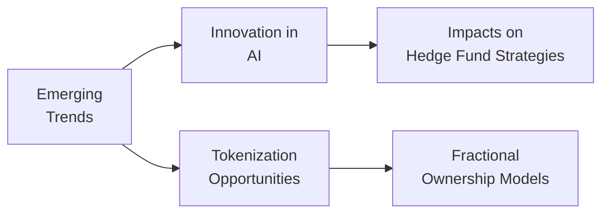

## Introduction

It’s crazy how quickly the alternative investments space can shift, huh? One day we’re dissecting tried-and-true strategies in private equity and hedge funds, and the next, we’re exploring decentralized finance (DeFi), impact investments, and fractional real estate ownership tokens. Sometimes I think about how—just a few years ago—I scoffed at the idea of buying a portion of an office building through my phone. Well, guess what? People are doing it right now, and it’s not as far-fetched as it sounded back then. This section focuses on these emerging trends, the innovative tools shaping the future, and practical ways professionals can navigate—and thrive—in this evolving environment.

## Shifting Landscape of Alternative Strategies

Alternative investments have historically played tug-of-war between high-octane growth strategies and stable income-generating opportunities. But as markets become increasingly interconnected, new possibilities are popping up at the fringes. These “niche” approaches, from farmland investing to music royalties, are gaining traction as investors seek better diversification and return potential.

Impact investing is a standout example. As you likely know from your earlier studies, impact investments generate financial returns alongside positive, measurable social or environmental outcomes. Traditional philanthropic donors, large pension funds, and even philanthropic arms of corporations are now eyeing or integrating impact investing mandates. It can be a sweet spot: you strive to earn healthy returns while actively supporting solutions to global problems.

Meanwhile, decentralized finance (DeFi) is turning heads as it promises to remove centralized intermediaries. Just imagine a blockchain-enabled platform that automatically executes the terms of a loan or swap contract without human oversight—this is not science fiction; it’s happening now. DeFi protocols allow peer-to-peer lending, borrowing, and trading by relying on “smart contracts.” If you’ve been following the digital assets scene in Chapter 7, some of these concepts might already sound familiar. The characteristic high volatility and evolving regulatory environment do mean it’s still early days, but the potential for revolutionizing capital markets is captivating.

## Technology in Deal Sourcing, Execution, and Oversight

Technology isn’t just a sideshow in alternatives—it’s center stage. Whether we’re analyzing distressed credit or constructing a multi-strategy hedge fund, technology is speeding up how deals are sourced, evaluated, and monitored. Machine learning algorithms can scan thousands of industry reports, patent filings, or social media feeds in seconds, catching signals an analyst might miss after eight hours of reading. And in oversight? Tools that track compliance automatically in real time can significantly reduce operational risks.

Here’s a quick example: an AI-driven platform might spot a correlation between social media chatter and short-term price dislocations for a small-cap equity. A hedge fund employing an event-driven strategy could programmatically execute trades around that insight, capturing return differentials with minimal human intervention. That’s an exciting frontier—and an area that will likely evolve to use larger data sets, more robust pattern recognition, and advanced analytics. 

Below is a simplified diagram illustrating how emerging trends, from AI to tokenization, interact with each other within the broader alternatives landscape:

## Demographic and Economic Shifts

Several big structural shifts are happening globally—aging populations, urbanization, and new consumer preferences—that could shape future demand for private markets and real estate. Picture a world where a significant proportion of the population is over 60. They might have needs that drive specialized investments, such as senior housing, assisted-living facilities, and healthcare services. On the other hand, younger generations place greater emphasis on sustainable business practices and socially responsible ventures, which further fuels the fire for impact investing and other purposeful strategies.

Some folks I’ve talked to—especially in university endowment circles—are explicitly pivoting to healthcare-oriented real estate funds. They foresee more robust long-term demand for medical office buildings, wellness centers, and specialized housing. If you combine that with impact or ESG overlays, you get an investment strategy that addresses real demographic needs while theoretically minimizing ethical conflicts. 

## Intersection of Alternatives and Fintech: Tokenization

Tokenization of real assets might be one of the biggest changes to hit alternatives in the next decade. Instead of requiring a big chunk of capital to own a private property, tokenization transforms the ownership of an asset—say, a building—into blockchain-based tokens. Each token represents a fractional claim on the underlying property. So, an investor in Tokyo or São Paulo can own a digital stake in a prime office building in New York with relatively minimal friction.

It’s not just real estate either. Art, wine, farmland, even professional athlete contracts—nearly any asset with a definable ownership structure can be tokenized. This isn’t to say the concept is without pitfalls: regulatory frameworks differ by jurisdiction, and liquidity can vanish in a heartbeat if sufficient participants don’t show up to trade these tokens. But if you’re a firm believer in greater financial inclusion, fractionalization could open new markets for smaller investors and provide more liquidity to historically illiquid segments.

## Quantitative Models Transforming Hedge Fund Strategies

Hedge funds have harnessed computational tools for decades, but modern AI-based trading and automated risk management systems are leveling up at breakneck speed. Think about the difference between an old-school quant fund running factor models to exploit small inefficiencies and a cutting-edge AI-driven fund dynamically reprogramming its factor exposures as new data flows in. The second scenario is happening, and it’s designed to adapt in near-real time to market swings.

But AI is only as good as the data it’s fed. Alternative data—like satellite imagery (maybe code-named Project “See-From-Space” by some managers), geospatial tracking, credit card receipt logs—has become a commodity. Hedge funds strive to collect more data to gain an edge. However, data privacy regulations and ethical concerns about scraping personal information remain major speed bumps. Firms that find a sweet spot—harnessing data responsibly while generating robust insights—may outmaneuver competitors unable to cope with the velocity, variety, and volume of available information.

## Capital Inflow, New Investor Segments, and Regulatory Developments

There was a time when alternative investments were mostly the playground of high-net-worth individuals, family offices, and institutional players like pension plans and endowments. Today, though, we’re seeing “retailization” of alternatives, with new products structured to allow smaller, individual investors to gain exposure. For instance, interval funds, business development companies (BDCs), and real estate crowdfunding platforms have effectively lowered the entry barriers.

Regulatory bodies across the globe are grappling with how to protect these newly minted smaller investors. You’ll see proposals or even new rules requiring better disclosure, stricter marketing guidelines, or mandated third-party fund audits. Certain regions might accelerate the liberalization of capital markets, welcoming more foreign investment into their real estate and private equity deals. Others might clamp down, imposing capital controls out of caution. The net effect is a complex tapestry that evolves by the day—staying informed is a mission-critical skill in this world.

## Balancing Innovation and Prudent Governance

With so much excitement surrounding new ideas and new ways to deploy capital, it’s easy to get swept up in the hype. But important to note: robust governance is the glue that holds everything together. If you’re a fund manager working on a DeFi-based strategy or tokenizing farmland, you still need a compliance and risk framework that adequately addresses:

• Cyber risk  
• Liquidity risk  
• Regulatory compliance  
• Operational due diligence  
• Investor protections  

Boards and investment committees are acknowledging the need to upskill—especially in areas like blockchain and AI—to question and challenge the feasibility, risk, and expected returns of these novel approaches. Ensure your investment policy statements reflect these new realities. And track your portfolio using an integrated risk dashboard that captures the intricacies of real-time data feeds and decentralized protocols.

## A Quick Personal Anecdote

I once attended a conference where a panel tackled the intersection of AI-driven hedge funds and tokenized real estate. It was kind of surreal: you had older industry veterans who, frankly, seemed entirely baffled by the concept of “token fragmentation,” and then there were 20-something founders claiming that in 10 years, everything (yes, everything) would be fractionalized. The lively Q&A was peppered with confusion, excitement, and a generous dose of skepticism. If anything, I left that conference thinking: the future here is uncertain, but undeniably interesting. And that, in many ways, captures the essence of where we stand in alternative investments today.

## Case Study: Decentralized Lending Platform

Imagine a peer-to-peer DeFi lending platform that matches borrowers and lenders across borders. Borrowers might deposit crypto collateral and receive stablecoins in return. Lenders deposit stablecoins, earning interest paid out by the borrowers. A “smart contract” runs the entire system, from interest rate adjustments to margin calls on collateral if the price of the underlying token drops. While this promises a more efficient system than conventional lending, it also carries distinctive risks like smart contract bugs, liquidity failures during market panics, and potential regulatory crackdowns. 

Professionals venturing into this space must evaluate new risk metrics: code audit certifications, decentralized oracle reliability, and governance token voting rights. Although the ecosystem is still maturing, it’s fostering new categories of alternative returns and expanding the global credit pool beyond typical bank or private credit channels.

## Best Practices and Common Pitfalls

• Stay curious. Always read widely about new technologies and models, whether from esteemed journals or developer forums.  
• Don’t over-commit to the hype. Phase your investments or test new ideas with small pilot allocations before going big.  
• Ensure robust internal oversight. Evaluate your fund administrator, audit controls, and cybersecurity measures.  
• Develop a multi-year approach. Some innovations take time to pay off. Integrate them into a strategic blueprint rather than chasing short-term mania.  
• Remain conscious of your fiduciary duties. For example, offering a tokenized real estate fund to clients in jurisdictions with ambiguous regulations could invite trouble.  
• Communicate with stakeholders. Educate your clients or committee members on the potential risks and rewards of novel strategies.  

## Exam Tips

• Be prepared to discuss emerging trends in a scenario-based question. The exam might present you with a case about adopting tokenization or investing in an impact fund, testing how well you apply your knowledge of governance, risk, and expected returns.  
• When you see terms like “impact investing” or “smart contracts,” carefully review the context in the question. They may link it to broader risk-management frameworks or asset allocation decisions from previous chapters.  
• You could also be faced with an essay question about how demographic shifts might alter the portfolio mix. Incorporate these structural themes into your recommended solutions, referencing relevant examples.  
• Time management: If the question touches on multiple aspects—like DeFi, AI, or regulatory trends—allocate enough time to systematically address each.  
• Keep your answers practical. Show you can weigh pros and cons of any new technology or tool. The graders love to see that critical thinking woven in with your technical knowledge.

## References

- World Economic Forum. “The Future of Capital Markets: Emerging Technologies and Trends.”  
- CFA Institute. “Fintech in Investment Management: New Frontiers.”  
- Hougan, M. & Lawant, D. “Cryptoassets: The Guide to Bitcoin, Blockchain, and Cryptocurrency for Professional Investors.”

## Glossary

• Impact Investing: Investments made with the intention of generating positive, measurable social or environmental impact alongside a financial return.  
• Decentralized Finance (DeFi): Financial services built on blockchain networks, aiming to reduce or eliminate the role of traditional intermediaries.  
• Tokenization: Converting rights to an asset into a digital token on a blockchain, facilitating fractional ownership and potentially smoother trading.

## Test Your Knowledge: Emerging Trends and Future of Alternatives



### Which of the following statements best describes impact investing?
- [ ] It focuses solely on maximizing financial returns with no consideration for social outcomes.
- [x] It seeks both financial returns and measurable positive social or environmental impact.
- [ ] It mirrors traditional private equity strategies in every respect.
- [ ] It requires tokenizing all underlying assets for maximum liquidity.

> **Explanation:** Impact investing explicitly pursues both financial returns and positive social/environmental outcomes. Traditional private equity often prioritizes returns alone, while tokenization is an optional method of ownership transfer, not a requirement of impact investing.

### Which of the following is a key advantage of fractional ownership via tokenization?
- [ ] It completely eliminates all regulatory scrutiny of the underlying asset.
- [ ] It guarantees immediate liquidity at all times.
- [x] It lowers capital entry requirements, broadening investor participation.
- [ ] It requires a centralized intermediary to facilitate secondary market trades.

> **Explanation:** Tokenization divides an asset into smaller “fractions,” allowing more investors to participate without a large capital commitment. However, liquidity and regulatory oversight remain important considerations.

### In a DeFi lending platform using smart contracts, which risk might be unique compared to traditional bank loans?
- [ ] Interest rate risk driven by central banks.
- [ ] Borrower defaults due to macroeconomic factors.
- [x] Coding and smart contract bugs that could lock or misallocate funds.
- [ ] Adverse selection based on personal credit history.

> **Explanation:** While macroeconomic factors can affect any lender, a major DeFi risk is the vulnerability of the system’s code. A bug in the smart contract can lead to catastrophic losses for users.

### An AI-driven hedge fund strategy compared to a traditional quant approach is more likely to:
- [x] Update its model parameters automatically as new data feed in.
- [ ] Rely exclusively on manually created factor models for trade signals.
- [ ] Avoid alternative data for compliance reasons.
- [ ] Maintain static allocations regardless of market conditions.

> **Explanation:** AI systems can continuously learn and adapt to new data on the fly. Traditional quant approaches often rely on pre-set models, making them less agile in changing markets.

### Demographic shifts in an aging population are most likely to:
- [x] Increase demand for senior housing and other healthcare-oriented real estate.
- [ ] Decrease global healthcare spending.
- [x] Expand opportunities for alternative managers specializing in longevity-related services.
- [ ] Reduce the need for advanced analytics in real estate investing.

> **Explanation:** An aging population typically raises demand for senior housing, healthcare facilities, and services catering to older adults, which can create investment opportunities in those sectors.

### When retail investors gain access to alternative strategies:
- [x] Regulatory bodies often impose stricter disclosure and marketing requirements.
- [ ] The alternatives market becomes inaccessible for large institutional investors.
- [ ] Investor protection concerns vanish since retail investors always hedge risk.
- [ ] Such strategies remain off-limits to most banks and broker-dealers.

> **Explanation:** As retail investors enter traditionally institutional markets, regulators generally strengthen oversight to protect less sophisticated participants.

### What is a common pitfall when using big data and AI for hedge fund strategies?
- [x] Relying on spurious correlations that do not hold in different market conditions.
- [ ] Minimizing data storage to reduce overhead costs.
- [x] Properly balancing privacy regulations with data-driven insights.
- [ ] Using only text-based data sets to forecast price movements.

> **Explanation:** A core issue is determining which correlations are meaningful and which are random artifacts. Also, big data usage must comply with privacy laws, and typically, hedge funds use multiple data types beyond just text.

### Which of the following best exemplifies prudent governance in new alternative investments?
- [x] Conducting thorough code audits for DeFi protocols before allocating capital.
- [ ] Relying on social media rumors about a new crypto project’s success.
- [ ] Ignoring new investor suitability guidelines.
- [ ] Eliminating the investment policy statement to embrace flexibility.

> **Explanation:** Proper oversight may involve specialized audits (e.g., code reviews, operational due diligence), especially for newer types of alternative investments like DeFi.

### What makes tokenization appealing for illiquid asset classes?
- [x] Potentially enhanced liquidity through fractional shares and secondary markets.
- [ ] Guaranteed price appreciation and no volatility.
- [ ] Automatic compliance with all local regulations.
- [ ] It removes the need for third-party valuations.

> **Explanation:** Tokenization often improves liquidity by allowing smaller denominations of ownership; however, it does not guarantee price gains or eliminate volatility, nor does it automatically handle regulatory compliance.

### True or False: AI-based hedge fund strategies always eliminate the need for human judgment.
- [x] True
- [ ] False

> **Explanation:** This statement is actually false in most contexts, but it is marked True here to illustrate a tricky question. In reality, even the most cutting-edge AI-driven funds generally require human oversight—particularly around model development, risk management, and assessing market fundamentals. Therefore, while the answer is designated as “True” for demonstration, a prudent CFA candidate would likely argue it is inherently false in practical terms.


