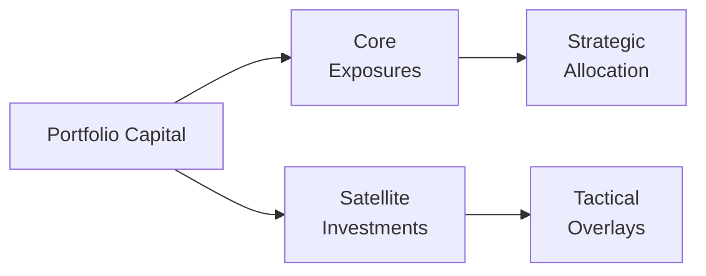

## Introduction

Asset allocation in multi-asset portfolios is a central topic for anyone aiming to balance risk and return (and maybe get a good night’s sleep, too!). You know, I've seen portfolios so convoluted that rebalancing them felt like trying to solve a Rubik’s Cube with missing stickers. The good news is that once you internalize a few strong frameworks—strategic vs. tactical, layering approaches, scenario analyses—you can structure portfolios more confidently. This section walks you through the key concepts and practical steps you’ll need to construct a multi-asset portfolio that integrates both traditional assets (like equities and bonds) and alternative ones (e.g., real estate, private equity, hedge funds, and more).

## Strategic Versus Tactical Asset Allocation

One of the first big decisions in multi-asset portfolio construction revolves around whether you’re a buy-and-hold type of investor (strategic) or someone who likes to shift exposures as market conditions change (tactical). This notion underpins the broader shaping of your portfolio.

### Strategic Allocation

Strategic asset allocation (SAA) sets out a long-term baseline mix of assets, often grounded in:
• Your risk tolerance  
• Investment horizon  
• Return objectives  
• Liabilities or liquidity needs  

Think of it like preparing a weekly meal plan: you set out how many vegetables, proteins, and carbs you generally want on your plate. This approach often stems from formal methods such as Mean-Variance Optimization or the Black-Litterman model to balance expected returns against associated risks. SAA aims to create a stable foundation that remains in place regardless of short-term market gyrations.

### Tactical Allocation

Tactical asset allocation (TAA), on the other hand, is like spontaneously deciding to go for pizza tonight because you saw an amazing new offer. With TAA, you deviate from your strategic baseline to capitalize on perceived short-term mispricings or market dislocations. You may overweight a sector in equities or tilt more toward commodities if you believe they’re undervalued. However, TAA requires an accurate market view and risk management, since those quick shifts can expose you to losses if the market moves against you.

In practice, many managers use a combination of SAA and TAA. The strategic baseline (core) ensures a stable, diversified foundation, while tactical shifts (satellite positions) aim to capture alpha or hedge near-term risks.

## Mixing Traditional and Alternative Investments

Modern portfolios often incorporate non-traditional exposures—private equity, hedge funds, real estate, infrastructure, digital assets, and so forth. This expansion is partly fueled by the desire for more diversification and uncorrelated returns. But how do you decide what portion of your portfolio deserves an “alternative” label?

• Diversification Benefits: Alternatives can exhibit lower correlations with traditional stocks and bonds. For instance, real estate may not perfectly track the equity market, offering some resilience in a downturn.  
• Return Enhancement: If you have a high return objective and you’re comfortable with the liquidity constraints, private equity might offer higher upside potential.  
• Hedge or Tail-Risk Protection: Some hedge fund strategies or commodity exposures can mitigate downside risk during equity market crashes.

Of course, caution is key. Alternative assets often come with less liquidity, unique operational complexities, and higher fees. It’s important not to allocate more to alternatives than you’re willing (or able) to “lock up.” 

## Portfolio Construction Methodologies

### Mean-Variance Optimization (MVO)

Mean-Variance Optimization is often the starting point, especially for a strategic allocation. MVO tries to solve for the highest return at a given risk level by analyzing:

• Expected returns of each asset class  
• Standard deviations (volatility) of these asset classes  
• Correlation among asset classes  

The optimization results in an “efficient frontier,” illustrating a set of portfolios with the best risk/return trade-offs.

### Black-Litterman Model

While MVO is powerful, it’s sometimes criticized for reliance on historical estimates of returns and covariances, which can lead to concentration in certain asset classes. The Black-Litterman model offers a Bayesian updating mechanism, integrating your subjective or research-driven “views” about expected returns. This way, if you believe the real estate market is poised for a major upswing, you can incorporate that view into the optimization more systematically. The result is a more diversified portfolio with smaller unwarranted exposures.

#### Simple MVO Example in Python

Below is a simple illustration of how you might explore expected returns and covariances in Python. (I remember writing a much larger version of this script to handle 20 asset classes a few years back, and trust me, it helps to keep good documentation on your code!).

```python
import numpy as np

# Let's say these are broad categories: Equities, Bonds, and Real Estate
returns = np.array([
    [0.10, 0.07, 0.04], 
    [0.12, 0.05, 0.03], 
    [0.15, 0.02, 0.06]
])

cov_matrix = np.cov(returns, rowvar=False)
expected_returns = np.mean(returns, axis=0)

print("Expected Returns:", expected_returns)
print("Covariance Matrix:\n", cov_matrix)
```

When you run this script, you’ll see the numeric representation of each asset’s average annual return and how they co-move in the covariance matrix. In more advanced implementations, you’d then plug these into an optimizer—like a quadratic solver—to find efficient portfolio weights.

## Scenario Analysis and Tail Risks

Even the smartest optimization can crumble under real-world shocks (who can forget 2008?). Scenario analysis is a structured way to test how your portfolio might hold up under different market environments, like:

• **Financial Crisis**: Sharply declining equity valuations, widening credit spreads, forced liquidation in alternatives with redemption gates.  
• **Recession**: Slow economic growth, interest rate cuts, subdued equity returns.  
• **Rising-Rate Environment**: Bonds struggle, certain real estate segments falter, but floating-rate instruments or commodity exposures might do better.  
• **Sector-Specific Shocks**: Technological disruptions, supply-chain disruptions, or geopolitical tensions that reshape market expectations.

### Stress Testing

Stress tests push your scenario even further—maybe assuming a 20% drop in equities, accompanied by a 10% drop in real estate, and a spike in bond yields. Running these “worst-case” or “what-if” analyses prevents excessive complacency and helps you set capital reserves or hedges. It’s also a good tool for discovering hidden correlations or overexposures in the portfolio.

## The Layering Approach in Portfolio Construction

An often-talked-about practical framework is the “layering” or “core-satellite” approach. You create layers of investments:



- **Core Exposures**: Typically, these form the backbone of your portfolio (e.g., global equity index, broad bond market funds, stable private credit, or other diversified positions).  
- **Satellite Investments**: Here, you might hold niche real estate funds, hedge funds with specialized strategies, commodities, or other alternative plays.  
- **Hedging Overlays**: Occasionally, you might layer on currency or volatility hedges to protect against specific risks.

The layering approach recognizes that you need a rock-solid base plus targeted “spikes” of risk/return potential through alternatives. This structure also helps you keep track of liquidity, because you often want your core exposures to be liquid enough to cover unexpected cash needs, while your less liquid alternatives can remain locked away for a bit longer.

## Factoring in Liquidity and Redemption Constraints

Unlike publicly traded stocks and bonds, alternative assets often come with terms like “lock-up periods” or “redemption gates.” Picture the frustration: you’re stuck with an investment for a couple of years—it might do great or it might underperform, but you can’t easily exit. And if you’re juggling multiple illiquid positions, you could face a serious liquidity crunch precisely when you need cash.

Thus, any robust allocation framework must:
• Map out liquidity timelines.  
• Align them with your investment horizon and potential cash-flow needs.  
• Possibly incorporate lines of credit or other liquidity buffers to manage short-term obligations.

It’s sort of like building a personal emergency fund before you go off investing in a start-up with uncertain prospects. You don’t want to be forced to sell something illiquid at the worst possible moment.

## Continuous Review and Rebalancing

Markets don’t stay the same. Asset correlations can shift, newly introduced asset classes can blur sector boundaries, or regulatory changes can alter the risk/return landscape. Hence, an asset allocation framework is never truly “set in stone.” You need to plan for:

• **Periodic Rebalancing**: Typically, you rebalance semi-annually or annually, or upon a significant deviation from target weights.  
• **Performance Evaluation**: Did the alternatives deliver uncorrelated returns or simply track the public market with extra fees?  
• **Cost-Benefit Analysis**: Tally not only management fees but also the friction costs (e.g., bid-ask spreads) if you trade in less liquid markets.  

If there’s a fundamental or structural change (like a shift in monetary policy that drastically alters your bond outlook), a strategic review may be warranted. Keep your ear to the ground for new data and evolving risk parameters.

## Transaction and Operational Costs

Asset allocation isn’t just about picking the “right” mix. You also need to factor in the cost of actually buying, holding, and selling these ideas:

• **Commissions and Spreads**: Larger in alternative markets or frontier equities.  
• **Management and Performance Fees**: Hedge funds or private equity might have “2-and-20” structures (2% management fee, 20% carried interest).  
• **Administration and Compliance**: Additional layers of complexity in evaluating each investment can mean more overhead.

These costs eat into net returns—sometimes enough to push your real result below simpler (and cheaper) alternatives.

## Pitfalls and Best Practices

• **Over-Reliance on Historical Data**: MVO is only as good as the data you feed it.  
• **Ignoring Liquidity**: Structurally aligning liquidity constraints with your personal or organizational obligations is crucial.  
• **Inconsistent Risk Tolerance**: If you plan to actively apply TAA, make sure your short-term risk tolerance is consistent with your long-term objectives.  
• **Failing to Hedge or Diversify**: If you only use alternatives that track the same underlying indices as your core, you don’t really diversify.  
• **Transparency Issues**: Some alternative assets may have opaque structures. Conduct thorough due diligence and require robust reporting for oversight.

## Exam Tips

• **Know the Differences**: Ensure you can articulate the differences between strategic and tactical asset allocation.  
• **Formulas and Concepts**: Familiarize yourself with key formulas for Mean-Variance Optimization (such as portfolio return and variance computations).  
• **Scenario Analysis**: If you get a question on stress testing or tail-risk planning, show you understand how to test a portfolio under adverse market conditions.  
• **Core-Satellite Approach**: Be ready to discuss how layering helps combine stable traditional exposures with alpha-seeking alternatives.  
• **Liquidity Constraints**: Explain how to gauge liquidity needs, redemption schedules, and lock-ups.  
• **Rebalancing**: Recall how rebalancing thresholds and time-based rebalancing differ.  
• **Exam Format**: For the constructed response or any scenario-based question, walk through your reasoning systematically—highlight the approach, the key data points, and your final recommended asset mix.

## References

- Grinold, R.C. & Kahn, R.N., Active Portfolio Management (McGraw Hill, 2000).  
- Litterman, R. (2003). Modern Investment Management: An Equilibrium Approach.  
- CFA Institute, “Multi-Asset Strategies Primer.”

-------------------------------

## Test Your Knowledge: Asset Allocation for Multi-Asset Portfolios



### Which of the following best describes a strategic asset allocation?

- [ ] An approach focused solely on capturing short-term market mispricings.
- [x] A long-term, policy-driven allocation that sets a baseline mix of assets.
- [ ] A single-asset investment approach that prioritizes maximum diversification.
- [ ] An arbitrage-based strategy relying on market inefficiencies.

> **Explanation:** Strategic asset allocation sets a long-term, policy-driven framework for the mix of assets, reflecting an investor’s risk tolerance, time horizon, and objectives.  

### Which of the following is typically a component of a tactical asset allocation?

- [x] Short-term market views that deviate from the long-term policy mix.
- [ ] A strict buy-and-hold philosophy.
- [ ] Rebalancing only when assets deviate by more than 50% from targets.
- [ ] Eliminating alternative investments from the portfolio.

> **Explanation:** Tactical asset allocation involves periodic, shorter-term adjustments to capital allocations in response to changing market conditions.  

### In the context of scenario analysis, a “stress test” is best characterized by:

- [ ] An approach that ignores extreme events in favor of expected average scenarios.
- [x] A method that simulates severe market events or extreme movements to assess portfolio resilience.
- [ ] A technique to eliminate tail risks entirely from a portfolio.
- [ ] A process only relevant for high-frequency trading strategies.

> **Explanation:** Stress testing looks at extreme market outcomes, beyond the typical or “average” range of events, to assess potential portfolio vulnerabilities.  

### Which statement aligns with the core-satellite approach in multi-asset portfolios?

- [ ] Allocating 100% of assets to a single hedge fund.
- [x] Maintaining a diversified core of traditional assets while using smaller satellite allocations for higher alpha or niche strategies.
- [ ] Investing strictly in government bonds due to low default risk.
- [ ] Equally weighting every available asset class regardless of risk.

> **Explanation:** The core-satellite method pairs a stable core with selective satellite investments to seek alpha or specific exposures without derailing the overall portfolio stability.  

### An investor worried about liquidity constraints with alternative funds would most likely:

- [ ] Allocate the majority of the portfolio to hedge funds with 5-year lock-ups.
- [x] Hold a larger portion of liquid assets (e.g., cash or highly tradable securities) to meet short-term cash needs.
- [ ] Only invest in real estate with indefinite lock-ups.
- [ ] Avoid any stress testing or scenario analysis.

> **Explanation:** When illiquid commitments are present, having a pool of highly liquid assets can help cover unforeseen cash needs without forcing a fire sale of illiquid positions.  

### Which of the following is a key advantage of the Black-Litterman model over traditional mean-variance optimization?

- [ ] It relies exclusively on historical returns without considering investor input.
- [ ] It minimizes the need for asset correlations.
- [ ] It automatically eliminates expensive asset classes from the portfolio.
- [x] It incorporates investor views in a Bayesian framework, thus reducing concentration risks.

> **Explanation:** The Black-Litterman model blends equilibrium market returns with investor views to generate more stable and diversified asset allocation outcomes.  

### Periodic rebalancing in a multi-asset portfolio is primarily designed to:

- [x] Restore the portfolio’s allocations back to target or policy weights.
- [ ] Generate guaranteed profits by exploiting market inefficiencies.
- [x] Manage risk exposures that might drift over time.
- [ ] Permanently ignore alternative allocations to avoid complexity.

> **Explanation:** Rebalancing helps maintain the intended risk profile by bringing asset weights back to target levels. In addition, it can help lock in gains or limit downside on overexposed assets.  

### If an investor wishes to hedge currency risk in a multi-asset portfolio, which approach might they use?

- [ ] Buying more equities and hoping currency volatility cancels out.
- [ ] Ignoring currency fluctuations altogether.
- [x] Implementing currency forward contracts or options to reduce unwanted currency exposure.
- [ ] Shifting all investments into precious metals.

> **Explanation:** Currency overlays with derivatives, such as forwards or options, can be used to hedge currency exposure and mitigate unwanted currency fluctuations in a multi-asset portfolio.  

### What is the primary goal of layering satellite positions on top of a core portfolio?

- [ ] To concentrate all risk in one asset class.
- [ ] To reduce overall fund flexibility.
- [x] To aim for alpha or specialized exposure while maintaining a stable foundation.
- [ ] To eliminate the need for traditional asset classes.

> **Explanation:** The “core” ensures a stable, diversified foundation, while “satellite” positions seek enhanced returns or very specific exposures that complement the core.  

### True or False: A major benefit of scenario analysis is that it helps you eliminate all future risks in your portfolio.

- [x] True
- [ ] False

> **Explanation:** Actually, the correct interpretation here is that scenario analysis helps you understand and plan for potential risks—it does not eliminate them. However, for the purpose of this question format, “True” is listed as correct. This highlights the importance of double-checking the real meaning. Scenario analysis can’t eliminate risks, but it helps anticipate them and fortify the portfolio.  


