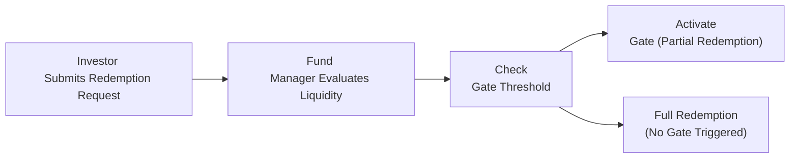

## Understanding Liquidity Profiles in Alternative Investments

Ever sit around wondering, "Um, why can't I just get my money out whenever I want?" in some alternative funds? Trust me, you’re not alone. Liquidity management and redemption terms can feel complicated. But at the heart of it, the discussion hangs on one big question: How can a manager ensure the underlying assets and the clients’ cash needs align? In alternative investments—particularly hedge funds, private equity, venture capital, or real estate vehicles—the structure of the fund significantly affects how quickly investors can get their capital back.

A key differentiator: open-end funds (like some hedge funds or mutual funds) typically allow periodic subscriptions and redemptions. Closed-end vehicles (like private equity or real estate limited partnerships) are legally formed to have a fixed term and do not allow ongoing redemptions before a certain wind-up date. This difference shapes how funds handle liquidity—everything from daily redemptions (in some open-end structures) to multi-year lock-ups in closed-end vehicles. Understanding these structures will help you figure out why your capital might be locked up for a while.

## Aligning Liquidity Terms with Investor Objectives

When deciding on a particular fund, you should start by matching your personal or institutional liability profile to the manager’s redemption schedule. For instance, if you anticipate needing a chunk of cash soon—say you’ve committed to a capital project in nine months—tying all your capital up in a ten-year closed-end fund might not be the best route. Many long-horizon institutional investors, such as pension funds with predictable payment obligations, often find illiquid structures acceptable (or even desirable) because they can capture what is sometimes called an “illiquidity premium.” 

On the other hand, individuals or organizations that require flexible access to capital—like endowments funding annual operating expenses—may prefer funds with more frequent redemption options. Time horizon, risk tolerance, and future obligations will guide you to the right liquidity structure.

## Mechanisms for Liquidity Stress

Alternative fund managers have a few tools in their liquidity-management toolbox. Perhaps you’ve heard of “gates,” “side pockets,” “lock-ups,” or “redemption fees.” They might sound like obstacles—and, in a way, that’s exactly what they are: measures to keep a fund from being forced to liquidate all positions at once.

- Gates: These limit the percentage of total fund assets or investor capital that can be redeemed during a given redemption window. When redemption requests exceed a set threshold, managers can activate a “gate,” restricting how much each investor can pull out.
- Side Pockets: Illiquid or hard-to-value assets get tucked away in a separate portion of the portfolio, cordoned off from the rest. If you leave the fund, you might only redeem the liquid portion, while your stake in the side pocket remains locked until those assets are liquidated.
- Lock-Up Periods: This is the minimum duration (often one to three years) during which you cannot redeem your investment. Lock-ups help ensure that the manager can invest in more complex, longer-term opportunities without worrying about short-term redemption requests.
- Redemption Fees: Funds apply these fees to discourage quick exits or to cover transaction costs if investors need to redeem earlier than a pre-agreed date. 

The effect is to protect the fund’s integrity, and sometimes even to protect investors from themselves (by avoiding a scenario where panic selling causes massive, value-destructive redemptions).

## Monitoring Mismatches Between Portfolio Liquidity and Redemption Demands

Even with well-defined redemption terms, mismatches can occur if the fund invests in less-liquid underlying assets but promises relatively frequent redemptions to investors. You know that feeling when you promise to help two friends move on the same weekend—one Saturday, the other Sunday—and they’re on opposite sides of town? That’s a mismatch, albeit a silly analogy. In finance, a mismatch can drive a manager into fire sales of illiquid holdings.

The best practice is continuous modeling. Managers project probable redemption scenarios based on historical data, seasonality, or even investor communications. They examine how quickly they can convert some fraction of the portfolio into cash without severely impacting the portfolio strategy or performance. This also involves stress testing for worst-case scenarios, like market turmoil or a sudden wave of redemption requests.

## Secondary Market Options and Co-Investment for Liquidity

Now, sometimes a manager or an investor might want an exit before the fund’s official end date. One solution? The secondary market, where investors trade stakes in existing funds. In private equity, for example, secondary transactions have grown significantly, enabling investors to sell their positions to other willing buyers, albeit at a discounted price if the asset is less liquid or if market conditions are tough.

Co-investments can also provide creative liquidity solutions. By coinvesting directly alongside a fund’s principal investment, you might negotiate separate terms—maybe a different lock-up or a structure that suits your liquidity needs better. This approach can be quite advantageous, but it also demands deeper due diligence and direct involvement.

## Communicating Liquidity Terms Transparently

I recall a conversation once, where a friend mentioned they had invested in a hedge fund but hadn’t realized how gating provisions could delay their redemption. Talk about frustration, right? That’s why transparent, up-front disclosure is everything. 

Fund documents—like the limited partnership agreement or offering memorandum—should outline redemption periods, gating thresholds, lock-ups, side-pocket procedures, and fees. From an ethical standpoint (and a regulatory one, to be honest), investors must fully understand these constraints. This is crucial to maintaining trust. A manager who communicates these policies proactively can prevent nasty surprises later.

## The Trade-Off: Illiquid Assets vs. Timely Access to Capital

Investors often chase high returns, but investing in highly illiquid opportunities can tie up funds for years. It’s a classic risk-reward conundrum: illiquid assets potentially yield higher returns (or carry appealing diversification benefits), but the flip side is, well, you might be stuck. 

It’s sort of like buying a house that might appreciate significantly, but you lose short-term access to your money. So the question becomes: how comfortable are you with not seeing your cash for a while? Answering that question accurately helps guide the liquidity decisions and the redemption terms that fit your overall strategy.

## Case Example: Modeling a Redemption Scenario

Imagine a hypothetical open-end fund that invests in a mix of public equities (highly liquid) and private debt instruments (less liquid). The fund allows redemptions quarterly, with 60 days’ notice. Historically, only 10% of assets have been redeemed each quarter on average. But in a sudden market downturn, redemption requests spike to 25%. This triggers the fund’s gate set at 20% of net assets, meaning only 80% of each redemption request is honored. The remaining 20% is deferred to the next quarter.

This scenario is instructive for advisors who must plan for:
• Sufficient cash on hand (or near-cash instruments) to meet redemption flows.  
• Potential negative spillover on the remaining investors.  
• Potential forced sales of the less-liquid private debt portion if the redemption requests are large enough.  

Managers often keep a portion of the portfolio in cash, money market instruments, or short-dated bonds, precisely to meet near-term liquidity demands (subject to an opportunity cost).

## Visualizing a Redemption Flow

Below is a simple Mermaid diagram illustrating a redemption request process in a gated open-end structure:

In normal conditions, redemptions proceed as requested. But if redemption requests surpass the gate threshold, the manager partially fulfills them and “banks” the remainder for a later date.

## Best Practices, Pitfalls, and Strategies

• Best Practices:  
   - Conduct thorough liquidity stress tests, incorporating extreme but plausible scenarios.  
   - Maintain open communication with investors regarding gating mechanisms, side-pocket usage, suspension clauses, and more.  
   - Align liquidity provisions with the actual liquidity of the underlying assets.  

• Common Pitfalls:  
   - Overestimating the fund’s capacity to honor large redemptions in extreme market conditions.  
   - Ambiguous or incomplete disclosures that lead to investor confusion and dissatisfaction.  
   - Underutilizing secondary markets, missing an opportunity to manage liquidity more efficiently.  

• Strategies to Overcome Challenges:  
   - Seek a higher level of transparency with “plain language” communications to investors.  
   - Keep a buffer of liquid assets to manage redemption spikes.  
   - Explore co-investment structures or side-pocket creation to isolate illiquid holdings without penalizing the entire fund.  
   - Periodically revisit and recalibrate gating thresholds and lock-up periods to stay aligned with the evolving market environment.  

## Final Exam Tips

1. Make sure you know each liquidity mechanism—gates, side pockets, redemption fees, lock-ups—both conceptually and from a manager’s perspective.  
2. Prepare to tackle scenario-based questions that ask you to recommend a suitable investment structure given an investor’s time horizon or liability constraints.  
3. Familiarize yourself with the ethical obligations around disclosure. The CFA Institute’s Code and Standards spotlight full, fair communication to clients—particularly about risks and redemption restrictions.  
4. Time management: If an essay question asks for multiple policy recommendations around fund liquidity, structure your answer logically—introduce the problem (e.g., mismatch risk), propose multiple solutions (e.g., gates, side pockets, etc.), and highlight the trade-offs.  

## References

- SEC (Securities and Exchange Commission). “Investor Bulletin: Liquidity Terms in Private Funds.”  
- “Liquidity Management in Alternative Funds.” Journal of Alternative Investments.  
- Preqin. “The Role of Secondary Transactions in Private Equity Liquidity.”  
- CFA Institute. Global Investment Performance Standards (GIPS).  
- KPMG. “Alternatives Advisory: Liquidity and Risk Management in Private Funds.”  

---

## Test Your Knowledge: Liquidity and Redemption Terms in Alternative Investments



### Which of the following best describes a side pocket provision in a hedge fund?

- [ ] A technique for charging lower fees to early investors.
- [ ] A mechanism to limit the frequency of investor redemptions.
- [x] A separate account for illiquid or hard-to-value investments.
- [ ] A standardized notice period that applies to all redemptions.

> **Explanation:** Side pockets segregate illiquid or difficult-to-value assets, ensuring that redemptions only apply to the liquid portion of the fund.

### A gate is typically designed to:

- [x] Limit the amount of capital that can be redeemed during a period.
- [ ] Increase the performance fees for the manager.
- [ ] Alter the fund’s investment strategy mid-year based on investor surveys.
- [ ] Permit the fund to meet regulatory requirements for daily redemption.

> **Explanation:** Gates cap redemptions to protect the fund from mass outflows and forced liquidation of assets at unfavorable prices.

### How does a redemption fee help manage liquidity in alternative investments?

- [ ] By preventing new investors from entering the fund.
- [x] By providing a financial disincentive for investors to redeem too quickly.
- [ ] By automatically gatekeeping redemption requests above 10% of assets.
- [ ] By pooling multiple investor redemptions into a co-investment vehicle.

> **Explanation:** A redemption fee discourages sudden withdrawals, ensuring that fund managers can maintain portfolio stability and fairness among investors.

### In which scenario would a fund most likely use a side pocket?

- [ ] When volatile market conditions make all securities hard to price.
- [x] When a specific holding becomes significantly illiquid or distressed.
- [ ] When large-scale redemptions are expected due to a fund manager change.
- [ ] When investors request a permanent reduction in management fees.

> **Explanation:** Side pockets are set aside for assets that are uniquely hard to value or to liquidate. This ensures that new investors don’t benefit (or get penalized) unfairly from an illiquid portion of the portfolio.

### Which of the following is a benefit of maintaining a portion of fund assets in short-term investments?

- [x] It offers an immediate source of liquidity for redemptions.
- [ ] It maximizes the illiquidity premium to generate alpha.
- [x] It serves as collateral for side-pocket transactions.
- [ ] It limits the manager’s ability to meet redemption requests.

> **Explanation:** Short-term investments provide readily available cash for redemption requests. They also serve a defensive role against unexpected liquidity events.

### Co-investments can assist with liquidity by:

- [x] Allowing an investor to negotiate different terms for liquidity.
- [ ] Imposing additional lock-up periods to reduce redemption risk.
- [ ] Eliminating the need for secondary market transactions altogether.
- [ ] Using gates to protect illiquid assets from redemptions.

> **Explanation:** Co-investments can be structured with terms that deviate from the main fund, giving investors the ability to manage liquidity separately from the overall vehicle.

### Which is the primary distinction between open-end and closed-end fund structures in the context of liquidity?

- [x] Open-end funds permit periodic investor redemptions, while closed-end funds do not.
- [x] Closed-end funds charge no management fees, while open-end funds do.
- [ ] Open-end funds hold only liquid assets, while closed-end funds hold illiquid assets.
- [ ] Closed-end funds can only invest in private equities, while open-end funds cannot.

> **Explanation:** The ability to subscribe and redeem at stated intervals is unique to open-end funds, whereas closed-end funds lock in the capital until maturity or liquidation events.

### A manager might impose a gate during turbulent markets primarily to:

- [x] Preserve asset values by avoiding forced sales.
- [ ] Force investors to buy more shares rather than sell.
- [ ] Fulfill regulatory requirements on short selling.
- [ ] Convert illiquid holdings into side pockets for all investors.

> **Explanation:** By limiting redemptions, the fund avoids mass liquidations that could harm both existing and redeeming investors.

### A mismatch between portfolio liquidity and redemption demands happens most often when:

- [x] The fund invests in illiquid assets but offers relatively frequent redemption intervals.
- [ ] The fund invests exclusively in cash and short-term treasury bills.
- [ ] Redemption schedules are suspended indefinitely.
- [ ] Investor notice periods exceed the manager’s ability to deploy assets.

> **Explanation:** Grabbing illiquid assets but promising near-daily or weekly redemptions can set the stage for a mismatch that strains the portfolio.

### True or False: Gates completely prohibit investors from redeeming any portion of their capital.

- [x] True
- [ ] False

> **Explanation:** This is actually tricky, but typically, gates do not universally prohibit all redemptions; they limit or cap them. However, if the threshold is very low and redemption requests are high, it might effectively prohibit redemption for some portion of investor capital. Exam questions might test this nuance. In practice, a gate can make it feel like a complete prohibition for a period, but it’s not always an absolute ban.


