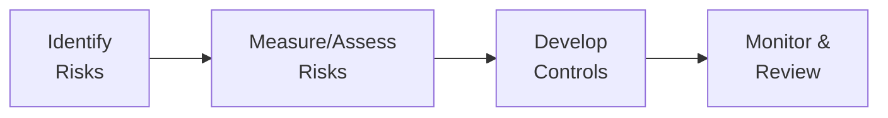

Many alternative investment managers focus intently on portfolio construction, deal sourcing, and achieving target returns—fair enough, right? But in my opinion (and, frankly, based on a few personal missteps I’ve witnessed), operational and reputational risks can unfold into some of the biggest headaches. I remember sitting in on a crisis call years ago: The team discovered that a vendor handling investor statements had a massive data security breach. Talk about stress! This incident made it crystal clear that robust operations and a bulletproof reputation are essential to the life and growth of any investment firm.

Below, we’ll explore the key operational risks, highlight best practices, and then dig into those dreaded reputational issues that can snowball if not tackled properly. While we’ll keep the conversation somewhat casual—because, hey, we’re all learning—these topics are critical for anyone wanting to become (and remain) a top-tier alternative investments professional.

## Identifying Key Operational Risks

Operational risk is, at its core, the risk that arises from the people, processes, and systems used to run the business. It’s scary how many small cracks can lead to significant financial and reputational damage—errors in trade capturing, IT outages, or even good old-fashioned fraud. Let’s look at some common sources:

• Inadequate internal controls: Loose oversight on who approves trades, who reconciles cash, and who updates performance figures can mean a single mistake or malicious act quietly amplifies into a major fiasco.

• Poor record-keeping: If you see someone rummaging through unorganized spreadsheets to confirm a private equity investment or retrieve investor documentation, that’s a warning sign. Compliance loves consistency and thoroughness, so do regulators and investors.

• IT system failures: Technology is a lifesaver until it isn’t. Outdated software, unpatched servers, or weak cybersecurity infrastructure can leave you open to hacks, data loss, or operational chaos.

• Fraud and misconduct: This can range from front-running trades to falsifying valuations. While hopefully rare, these situations undermine trust and can severely tarnish a firm’s brand.

• Human error: Sometimes it’s not a complex conspiracy—just a simple oversight. Still, that oversight can cause large and embarrassing losses if no one detects it.

## Developing Comprehensive Operational Policies and Procedures

If identifying risk was the first step, establishing robust controls is the next. A well-documented set of policies and procedures might sound bureaucratic, but it’s your safety net—especially when things get wacky.

• Formal transaction processing: Have a standard sequence for every trade or investment—initiation, authorization, execution, and settlement. The more you standardize and automate, the less chance you’ll end up with manual errors.

• Reconciliation protocols: Every day, tens of thousands of transactions happen in major investment firms. If you don’t reconcile promptly—matching internal records with external statements or custodian/trust bank data—it’s easy to lose track of assets or uncover mistakes too late.

• Compliance monitoring: Track compliance with regulations, codes of ethics, and internal guidelines. In alternative investments, where structures can get complicated and cross borders, a specialized compliance team (or external compliance consultants) is a lifesaver.

• Internal oversight committees: Some organizations convene weekly or monthly committees—compliance committees, risk committees, or valuation committees—to ensure decisions pass the sniff test. This approach can be tedious, but it keeps everyone accountable.

Here’s a diagram of a simple operational risk management cycle often used to keep track of key processes:

This cyclical process is crucial because risks evolve, new technologies emerge, and regulations shift over time.

## Best Practices for Internal Governance

Governance is the foundation of both operational and reputational resilience. For alternative investment managers—hedge funds, private equity firms, real asset managers—governance often rears its head in everything from LPA (Limited Partnership Agreement) negotiations to boards overseeing special purpose vehicles.

• Independent board or oversight committees: To reduce conflicts of interest and ensure checks and balances, consider having at least some independent members. They can look at issues through a more objective lens, especially during critical times like valuation disputes.

• Segregation of duties: Even in smaller shops, try to separate sensitive functions like cash accountability and wire transfer approvals from the people who record the transactions. This is a basic internal control principle.

• Transparent reporting: Provide your investors and stakeholders with comprehensive updates that detail performance, fees, conflicts of interest, and risk exposures. Transparency builds trust and reduces the rumor mill.

• Culture of accountability: People often talk about “tone at the top,” and I truly believe it sets the vibe for how seriously employees take compliance and risk management. If leaders value honesty and are open about mistakes, employees are more inclined to follow suit.

## Vendor Due Diligence and Oversight

Sometimes your operational resilience is only as strong as your weakest external partner—fund administrators, custodians, auditors, or technology providers. Too many managers pick vendors based solely on cost or brand name without digging deeper.

• Evaluate third-party administrators: Admins handle (or assist with) valuations, investor statements, and general ledger accounting. Improper reconciliation or errors in official communications can wreak havoc on your reputation. Vet them as you would a potential employee, analyzing their track record, staff qualifications, system capabilities, and financial stability.

• Custodianship: The custodian physically (or electronically) holds your assets. Evaluate their internal security protocols, business continuity plans, and handling of short-term liquidity events. A meltdown at the custodian caused by, say, a cybersecurity breach, can quickly ripple onto your firm.

• Oversight committees and SLAs (Service Level Agreements): Build processes and operational metrics into your agreements. Revisit them regularly—this helps ensure accountability. For instance: “Trade reconciliations must be completed by T+1 at noon.”

• Technology providers: Fancy data analytics or risk management software is awesome, but don’t forget to check data security policies, encryption, server redundancy, and track record with previous clients. If a new technology product is untested, demand references and stress tests.

## Crisis Management and Reputational Risk

Reputational risk is that intangible threat—when negative publicity, whether true or not, can sink your relationships with investors, regulators, or the public. Even short-lived controversies can linger in search engine results forever.

• Negative press scenarios: Suppose your fund invests in a controversial industry, or a portfolio company experiences a labor scandal. You need a well-defined protocol for how to respond quickly, factually, and transparently. Stonewalling the press or investors often makes things worse.

• Default or liquidity issues: Especially in private debt or real estate deals, defaults can occur. If you need to freeze redemptions or restructure, do it with clear communication and a plan that shows you’re respecting investor rights.

• Operational outages: If your technology platform goes down for days (knock on wood, that never happens), you’ll see both operational disruptions and reputational dents. Have a business continuity plan, plus a communication plan for investors and relevant authorities.

• Social media management: Social platforms evolve quickly. Even if you primarily serve institutional clients, you can’t ignore online chatter or rumors. Keep a handle on your brand’s digital presence and correct misinformation as soon as it arises. It’s not overkill to have a small crisis communications team or at least a designated point person.

## Operational Audits and Stress Tests

Would you rather discover weaknesses through your own testing or through a real-life crisis? Periodic operational audits and stress tests let you see where the cracks are before they become full-blown disasters.

• Operational audit scope: Audits can cover everything—transaction processing, record-keeping, IT controls, and data integrity. A thorough audit may also look at vendor relationships, internal committees, and data protection policies.

• Stress testing: While more common for market risk, operational stress tests can simulate “What if the fund administrator’s system is inaccessible for 48 hours?” or “What if half the investment staff can’t access the building due to a natural disaster?” Testing these scenarios proactively reveals your firm’s genuine ability to cope.

• Response strategies: If you identify a gap—say, your pandemic contingency plan is outdated—document the needed fixes, assign responsibilities, and set timelines for completion. Revisit these tasks to ensure they’re actually done.

## Ethical Standards and Compliance with Professional Codes

In alternative investments, ethical missteps—like misvaluation of illiquid assets or deceptive marketing practices—pose both immediate legal problems and long-term reputational damage. Adherence to the CFA Institute Code and Standards or other recognized codes of conduct fosters a culture where employees feel proud to uphold investor interests.

• Conflict of interest policies: Whether dealing with personal trading, allocating hot IPOs, or awarding a side letter to a large investor, explicitly outline how your firm handles such conflicts to maintain fairness.

• Gifts and entertainment procedures: If employees can accept lavish gifts from potential vendors or portfolio companies, that might influence decisions. Keeping these policies clear reduces gray areas.

• Personal trading rules: Front-running or insider trading can kill your reputation in an instant. Enforce blackouts, require pre-clearance, and review employee transaction statements.

• Whistleblower procedures: Employees must feel safe reporting wrongdoing. If someone has the courage to speak up, you want to respond properly rather than risk a scandal later.

## Real-World Scenarios and Lessons

1) The Data Breach Nightmare: A mid-sized hedge fund’s external risk analytics provider was hacked. Investor names, holdings, and personal data leaked. The firm scrambled to clarify that the breach was vendor-driven, but trust was shaken. Lesson learned: Your reputation depends on the entire data chain, not just your in-house IT.

2) Failure of Internal Controls: A private equity firm relied on a single junior analyst to update the official cap tables and valuation spreadsheets (yikes!). Errors were discovered months later, forcing restatements of quarterly reports. Investors were obviously upset, suspecting deeper operational issues. Lesson learned: Always implement cross-checks and do not centralize critical duties in a single person’s hands.  

3) Reputational Fallout from a Portfolio Company’s Controversy: A global hedge fund had partial ownership in a commodity producer that faced allegations of environmental damage. The hedge fund insisted it was “just a minority investor,” but environmental groups targeted them anyways. Lesson learned: Adopting an ESG screening process or at least a risk assessment for reputational blowback is worth your time.

## Glossary

• Reputational Risk: The potential that negative publicity—whether substantiated or not—will harm your organization in ways that can affect both current and future business relationships.

• Third-Party Administrator: An external firm providing administrative services such as fund accounting, investor reporting, and sometimes even regulatory filings. Often crucial for hedge funds and private funds looking to outsource non-core tasks.

• Operational Audit: A review designed to evaluate whether a firm’s operational processes, risk management, and internal controls are adequate, efficient, and compliant with relevant standards.

## References

• Cumming, D. & Johan, S. “Investment Due Diligence and Operational Risk Management,” European Financial Management Journal.  
• AIMA (Alternative Investment Management Association) guides on operational and reputational risk management.  
• CFA Institute, “Codes, Standards, and Ethics for Investment Professionals.”

## Final Thoughts

Operational and reputational risks can’t be solved once and for all; it’s an ongoing process. Tweak your approaches as you go—stress test your assumptions, audit your systems, analyze vendor performance, and keep your ethics high. And remember: When red flags appear, address them openly with your team. Yes, it can be uncomfortable, but it’s a lot less painful than having to draft frantic apology letters or re-edit quarterly statements in front of disappointed investors.

At the end of the day, the best scenario is being known not only for your returns but also for how you scrupulously manage your firm’s operations and uphold its reputation. A balanced approach—focusing on strong returns and strong controls—will set you apart in the competitive world of alternative investments.

---

## Managing Operational and Reputational Risks: 10 Sample Exam Questions



### Which of the following best describes operational risk?

- [ ] The risk that your investment strategies will underperform the market.
- [ ] The risk of losing key personnel in a competitive market.
- [x] The risk arising from people, processes, and systems.
- [ ] The risk that interest rates fluctuate unexpectedly.

> **Explanation:** Operational risk generally refers to potential losses resulting from inadequate or failed internal processes, people, internal systems, or external events.

### A firm wants to reduce the likelihood of fraud in its back-office operations. Which practice would be the most effective preventative measure?

- [ ] Rely on a single employee to handle bank reconciliations for consistent outcomes.
- [x] Enforce segregation of duties between transaction approval and reconciliation.
- [ ] Merge all front-office and middle-office functions to streamline operations.
- [ ] Permit employees to approve their own wire transfers.

> **Explanation:** Dividing responsibilities among different people (segregation of duties) lowers the risk that any single person can commit and conceal fraud.

### A reputational risk event typically:

- [ ] Only affects the public relations department.
- [x] Can result from negative events or perceptions, whether founded or unfounded.
- [ ] Is solely driven by regulatory penalties.
- [ ] Is limited to product or service issues.

> **Explanation:** Reputational risk arises from negative perception that may or may not be based on facts, yet still damages stakeholder trust and confidence.

### A periodic operational audit within an alternative investment firm primarily aims to:

- [x] Evaluate internal controls, compliance with policies, and identify process inefficiencies.
- [ ] Generate trading signals based on technical analysis.
- [ ] Help in the marketing and client acquisition process.
- [ ] Guarantee 100% accuracy in financial statements.

> **Explanation:** Operational audits examine whether processes, controls, and risk management frameworks operate effectively and align with regulatory, organizational, and ethical standards.

### What is the key function of a third-party fund administrator in alternative investments?

- [ ] Making all investment decisions on behalf of the fund.
- [ ] Providing external credit rating for the fund’s portfolio.
- [x] Handling certain back-office tasks such as fund accounting and investor reporting.
- [ ] Ensuring legal compliance with all cross-border transactions.

> **Explanation:** Third-party administrators typically manage back-office and administrative tasks (e.g., accounting, investor statements), providing an external layer of checks and balances.

### Which of the following BEST describes a realistic approach to responding to crisis or negative press?

- [ ] Issue no public statement to avoid further attention.
- [x] Have a prepared plan, respond quickly and transparently, and engage stakeholders directly.
- [ ] Immediately refute any claims, threatening legal action against critics.
- [ ] Fire managers associated with the issue without conducting an internal investigation.

> **Explanation:** Candid, timely, and factual responses accompanied by direct engagement tend to mitigate damage and restore stakeholder confidence.

### In establishing an effective governance structure for a private equity fund, a recommended best practice is to:

- [x] Include at least some independent members on the fund’s board or oversight committee.
- [ ] Assign all valuations solely to the fund’s general partner.
- [ ] Allow the marketing director to handle compliance matters as well.
- [ ] Create an unchallenged hierarchical system for the CFO to approve all deals.

> **Explanation:** Independent directors help reduce conflicts of interest and strengthen oversight by providing unbiased viewpoints on valuations, strategies, and risk management.

### Stress testing for operational risk in alternative investments might involve:

- [x] Simulating system outages or vendor failures and assessing the firm’s contingency plans.
- [ ] Focusing exclusively on forecast interest rate changes in government bonds.
- [ ] Monitoring staff satisfaction through annual surveys.
- [ ] Calculating the fund’s Sharpe ratio over multiple market cycles.

> **Explanation:** Stress tests analyze how well the firm’s internal processes deal with extreme conditions such as system outages, natural disasters, or vendor disruptions.

### To minimize reputational damage from a portfolio company’s scandal:

- [ ] Remain silent and deny any association with the company.
- [x] Conduct thorough due diligence, adopt ESG considerations, and develop a crisis communication plan.
- [ ] Remove your brand from marketing materials and website.
- [ ] Shift blame to minority shareholders.

> **Explanation:** While managers may not directly control portfolio companies, enhanced due diligence, ESG criteria, and well-structured crisis management can reduce reputational fallout.

### A manager who trades on personal accounts ahead of client trades is primarily violating:

- [x] Ethical standards on misappropriation and fiduciary duty.
- [ ] Regulations on leverage ratios and margin requirements.
- [ ] Guidelines for second-tier capital adequacy.
- [ ] Vendor oversight policies.

> **Explanation:** Trading on inside or priority knowledge ahead of client trades is a clear breach of fiduciary duty and of professional ethics outlined by organizations such as the CFA Institute.


