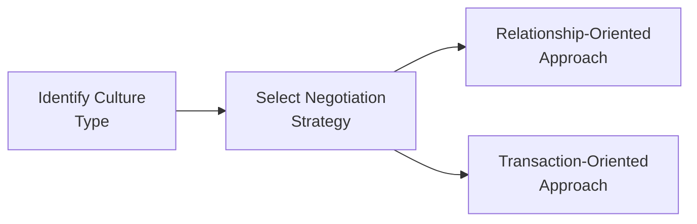

## Overview

Cross-cultural negotiations and relationship management play an increasingly vital role in alternative investments. Whether you're arranging a joint venture with a timberland operator overseas or seeking capital commitments from limited partners in different parts of the world, you’ll need more than just financial acumen. You’ll need cultural awareness, empathy, and robust communication skills to navigate these complex transactions effectively. It’s one thing to run spreadsheet models and evaluate IRRs. But trust me, if you overlook the cultural nuances (like what we do in certain parts of Asia, where building a personal relationship is a big deal before any serious talk about money), you could severely hamper your negotiation outcomes. 

In this article, we’ll dive into how cultural context shapes negotiation styles, explore practical ways to build trust with counterparts from different regions, and discuss ongoing relationship management once the deal is sealed. Along the way, I’ll share a few personal observations, potential pitfalls to avoid, and references for you to explore in more depth.

## Impact of Cultural Norms on Negotiation Styles

Culture is the lens through which we interpret behavior, language, and even financial data. When negotiations take place between parties from different countries—or even different regions within the same country—misunderstandings can happen. And when millions of dollars (or more) are on the line, well, you want to minimize any chance of confusion or unproductive tension.

• Relationship-Oriented vs. Transaction-Oriented  
  Some cultures prioritize building personal connections before even discussing numbers. This is typical in many parts of Latin America, Asia, and the Middle East. In such cultures:  
  – People value trust and personal rapport above immediate business efficiency.  
  – Long-term connections often outweigh short-term transactional gains.  
  – Negotiations may move more slowly as the parties focus heavily on relationship-building.  

  Meanwhile, other cultures, often considered transaction-oriented, place a premium on efficiency, directness, and a quick “get to the point” approach. Commonly seen in places like the United States, the Netherlands, and parts of Northern Europe, negotiators from these regions tend to:  
  – Conduct negotiations in a linear, objective-focused manner.  
  – Expect minimal small talk and place more emphasis on detailed commercial terms.  
  – Aim for swift resolution and efficiency rather than lengthy personal engagement.  

Recognizing which approach your counterparty prefers and adapting accordingly can make all the difference in your negotiation success.

## Preparation and Research

If you’re entering a new market—maybe you’re a hedge fund manager looking to secure capital from a sovereign wealth fund in the Middle East, or you manage a private equity real estate fund exploring projects in Southeast Asia—do your prep work. Learn the local business etiquette, understand the hierarchy, and glean insights into negotiation practices that might differ radically from your home environment.

• Hierarchy and Decision-Making  
  Some cultures (like Japan) integrate a strong committee-based approach, meaning that consensus might be required from multiple stakeholders, which can slow down the negotiation process. Others (like certain family-run conglomerates in various regions) rely on a single key decision-maker who sits at the top. If you don’t know who holds ultimate authority, you might spend weeks negotiating with someone who can’t actually finalize the deal.

• Language Barriers  
  Communication can break down if your counterpart interprets your words differently due to cultural nuance. Even the meaning of specific English words may shift. If needed, consider hiring a professional interpreter or local advisor—for instance, a local boutique investment bank with knowledge of standard business practices and local dialects. Better to invest in bridging that language gap early on than risk misinterpretation.  

## Communication Styles and Active Listening

Let’s be honest: active listening often feels like an afterthought in negotiations. But it’s crucial—especially in a cross-cultural context. Do folks in your counterpart’s culture pause more frequently? Might a long silence simply signify they’re pondering carefully, rather than losing interest? Understanding these subtle cues helps you avoid accidentally “talking over” them or pressing them to move faster than their comfort level allows.

Anyway, a big part of active listening also involves clarifying your understanding of what’s been said. Summarize their point in your own words and then politely confirm. You might say, “So, just to confirm, you would be more comfortable with a phased capital call structure over two years rather than one, correct?” This approach helps reduce the chance of small misunderstandings spiraling into major issues.

## Building Empathy and Trust

Focusing on empathy can be a game-changer. One time, I was working with a group of investors from a relationship-oriented culture on a farmland investment. We spent the first two weekends not talking about farmland at all but just having dinner, touring local sights, and discussing our families. At first, I felt a bit restless—like, “Let’s get to the farm details already!” But guess what? By the time we actually started discussing the specifics, there was a foundation of trust and sincerity that made the negotiations not only more pleasant but also more efficient.

Showing real interest in local customs is key. Even if it’s as simple as learning two or three phrases in the local language, acknowledging important holidays, or exploring local flavors at dinner, these small gestures can resonate in a big way. And if you’re dealing with a more transaction-oriented culture, you might do less of this social bonding but still take the time to demonstrate curiosity about their unique business environment.

## Navigating Deal Structures and Timelines Across Borders

Cross-border transactions in alternative investments can involve everything from co-investments in a private equity buyout to setting up an offshore vehicle in a tax-friendly jurisdiction. Each country’s regulatory environment might enforce different pacing and structure around how deals must be executed. Some markets have stringent foreign ownership limits or require local partner involvement. Others might have slower legal and bureaucratic processes.

• Adaptation to Local Realities  
  – Accounting Standards: IFRS vs. local GAAP.  
  – Regulatory Bodies: Understanding guideline differences between, say, the Securities and Exchange Commission (SEC) in the U.S. versus the Monetary Authority of Singapore (MAS).  
  – Documentation: Additional legal translations, notarial requirements, or official government stamps.  

It’s often wise to work with local legal counsel and specialized auditors. If your negotiation timeline doesn’t allow for these local requirements, the deal may stall or face compliance exposure.

## Ongoing Relationship Management Beyond the Deal

Negotiations aren’t just about signing on the dotted line. Particularly in an era where multi-year partnerships define many alternative investment strategies, from real estate joint ventures to fund-of-funds structures, relationship management is an active, ongoing process. This is especially critical in relationship-oriented cultures where communication and trust-building must continue post-close.

• Regular Communication 
  – Schedule periodic update calls or personal visits.  
  – Share relevant market intelligence or portfolio updates, even if not required by contract.  

• Cross-Border Team Collaboration  
  – Encourage secondments or rotational assignments where employees from one region temporarily work in the other region’s office.  
  – Develop a short “cultural onboarding” for new employees or cross-border team members so they understand the norms of their partners.

## Ethical Considerations in Unfamiliar Markets

When you move into cross-border investments, whether it’s hedge funds, infrastructure, or farmland, you might confront environments where local norms around gifting, facilitation payments, and vendor relationships differ significantly from your home market. For instance, in some regions, giving large gifts before a business deal is seen as standard courtesy—whereas in others it’s considered a violation of anti-bribery laws.

Make sure you and your team have clear guidelines for operating ethically. This includes training sessions on regulations like the Foreign Corrupt Practices Act (FCPA) in the United States, the UK Bribery Act, and local equivalents. The CFA Institute Code of Ethics and Standards of Professional Conduct also emphasize integrity, diligence, and respect for the law. Reminding your cross-border partners of these expectations not only protects you from legal risk but sets a tone of mutual accountability.

## Diagram: Negotiation Approach Decision Flow

Below is a simple flowchart illustrating how to identify a culture’s main orientation and adapt your negotiation strategy accordingly:

## Common Pitfalls

1. Overgeneralizing Cultural Stereotypes  
   – While cultural frameworks are helpful, remember that individuals vary. Avoid “all-or-nothing” assumptions.  

2. Underestimating Language Nuances  
   – A seemingly trivial phrase in your language may be offensive or ambiguous to your counterpart.  

3. Ignoring Local Regulations  
   – Don’t try to force a generic deal structure onto a foreign jurisdiction. Seek local legal advice.  

4. Failing to Maintain the Relationship Post-Close  
   – In many cultures, the real work begins after closing. If you vanish, you risk deteriorating goodwill.

## Exam Relevance for CFA Level III Candidates

At the CFA Level III exam, especially with case-based item sets, you may see scenarios describing cross-border private equity investments or global macro hedge fund expansions—often accompanied by subtle cultural and ethical complexities. You might be asked about how to adapt negotiation tactics, identify potential ethical red flags, or integrate local cultural practices into the due diligence process.

Remember:
• Constructed-response questions could ask you to detail how you would avoid miscommunication and maintain alignment with the CFA Institute Code of Ethics.  
• You could also encounter a question where you need to propose strategies to maintain investor relations across different cultural environments.  

## Practical Tips for the Exam

• Look for Clues in the Vignette  
  – If you see references to hierarchical decision-making or emphasis on personal relationships, that’s a hint that the setting is relationship-oriented.  

• Link Cultural Awareness to Ethical Standards  
  – The exam might test whether you understand the differences between culturally accepted practices and ethically or legally permissible conduct.  

• Summarize Key Takeaways in Your Answers  
  – Show that you can articulate not only the financial side of the deal, but also your deeper understanding of how cultural nuances can affect negotiations.

## References

- Brealey, R., Myers, S., & Allen, F. (Latest Edition). Principles of Corporate Finance – Cross-Border Negotiation Sections.  
- Fang, T. “Negotiation: The Chinese Style,” Journal of Business & Industrial Marketing.  
- Harvard Business School Publishing, “Cross-Cultural Negotiation” case studies.  
- CFA Institute, CFA Institute Code of Ethics and Standards of Professional Conduct.  

--------------------------

## Test Your Knowledge: Cross-Cultural Negotiations and Relationship Management Quiz



### Which of the following best describes a relationship-oriented culture?

- [x] Business dealings center on personal connections and long-term affiliations.  
- [ ] Emphasizes short-term gains and transactional efficiency above all.  
- [ ] Prefers minimal personal interaction and quick decision-making.  
- [ ] Avoids all forms of in-person meetings.  

> **Explanation:** Relationship-oriented cultures place a high value on personal connections, trust, and long-term relationships. Negotiations often proceed with patience and greater emphasis on rapport.

### A main characteristic of a transaction-oriented culture is:

- [ ] Extensive time devoted to personal rapport.  
- [ ] Reliance on third-party relationships for decision-making.  
- [x] High emphasis on direct communication and efficiency.  
- [ ] A strict avoidance of written contracts.  

> **Explanation:** Transaction-oriented negotiators are often direct and prefer to conclude deals without extensive personal bonding. They focus on efficiency and clarity.

### When dealing with a language barrier in a cross-border meeting, which best practice should a negotiator implement first?

- [ ] Rely on gestures to communicate important points.  
- [ ] Use slang and idiomatic expressions to build rapport.  
- [x] Hire a professional interpreter or local advisor.  
- [ ] Delay all communications until you’re fluent in the local language.  

> **Explanation:** An interpreter who understands business context reduces the chance of misunderstandings or misinterpretation, ensuring clarity in negotiations.

### Which of the following is a potential ethical risk in cross-cultural negotiations?

- [ ] Using respectful, culturally appropriate greetings.  
- [x] Offering lavish gifts that might breach anti-corruption guidelines.  
- [ ] Consulting local legal advisors to navigate regulations.  
- [ ] Scheduling personal interactions to build trust.  

> **Explanation:** Lavish gifts may be part of local traditions, but they can also violate laws such as the FCPA or UK Bribery Act if perceived as a bribe.

### In a relationship-oriented negotiation setting, a prolonged initial phase of informal conversation likely indicates:

- [x] A cultural emphasis on building trust before discussing specifics.  
- [ ] That the counterpart is disorganized and unprofessional.  
- [ ] A hidden negotiation tactic meant to frustrate the other party.  
- [ ] A misunderstanding that the meeting was even scheduled.  

> **Explanation:** Spending time on personal interaction is a common practice in relationship-oriented cultures, serving to foster trust and familiarity.

### When a signing authority is unclear in a cross-cultural transaction, the negotiator should:

- [ ] Immediately withdraw from the negotiation.  
- [ ] Request to speak only with the individual’s subordinates.  
- [x] Clarify decision-maker roles by asking questions or consulting local partners.  
- [ ] Ignore the issue and finalize the deal documents.  

> **Explanation:** In some cultures, authority structures are complex. Confirming who has formal signing power is essential to avoid delays or invalid agreements.

### After closing a cross-border deal, how should a negotiator manage the relationship on an ongoing basis?

- [x] Maintain regular communication and in-person visits if feasible.
- [ ] Assume the relationship is complete once legal documents are signed.  
- [ ] Reduce all contact to a single annual update.  
- [ ] Avoid further personal connections to maintain objectivity.  

> **Explanation:** Relationship-oriented cultures (and many transaction-oriented ones) benefit from periodic check-ins, updates, and face-to-face visits, preserving trust and encouraging future collaboration.

### A negotiator from a transaction-oriented culture is meeting a counterpart from a relationship-oriented culture. What’s the most effective approach?

- [ ] Impose their direct style and keep the counterpart on a strict timetable.  
- [ ] Expect relationships to unfold without any personal effort.  
- [x] Adapt by allowing more time for rapport building and personal engagement.  
- [ ] Focus on immediate cost-saving tactics.  

> **Explanation:** Flexibility is key. Adapting to a relationship-oriented culture often means dedicating more time to building trust before addressing business details.

### Why might local regulatory requirements pose a challenge in cross-border negotiations?

- [ ] They are generally irrelevant in alternative investments.  
- [ ] They rarely affect deal structures or timelines.  
- [x] They may demand additional legal, tax, or administrative steps that prolong negotiations.  
- [ ] They are uniform across all jurisdictions.  

> **Explanation:** Different countries have their own legal and tax frameworks, which can complicate deal execution and prolong negotiation timelines.

### A cross-cultural negotiation is considered successful when:

- [x] Both parties feel respected, and the agreement aligns with local norms and mutual objectives.  
- [ ] One party walks away with all concessions.  
- [ ] A personal conflict arises but is ignored for the sake of efficiency.  
- [ ] No time is spent understanding local cultural traditions or ethics.  

> **Explanation:** Success in cross-cultural settings combines respect, mutual understanding, and a deal structure that benefits both sides under local norms and global best practices.


