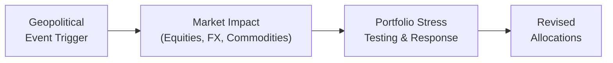

## Introduction and Purpose

Have you ever woken up, checked the news, and felt a jolt because a major country just announced unexpected tariffs, or a political election took an unforeseen turn? Well, you’re not alone. Geopolitical environment changes can be sudden, nerve-racking, and undeniably influential on global asset prices. In the world of alternative investments—especially those under the Global Macro umbrella—geopolitical scenario planning is key. It’s about having a “what-if” roadmap for major political, social, or economic surprises that can upend your well-crafted portfolio.

This section focuses on how to incorporate forecasts of geopolitical events (like elections, trade wars, and territorial disputes) into portfolio stress testing. We’ll discuss methodologies for scenario planning, practical ways to evaluate disruptions, and strategies (both hedging and opportunistic) to position portfolios in real time. While “scenario planning” might sound like a lofty concept, it’s really just a structured way to stay nimble in a world defined by constant political change. 

## Core Concepts in Geopolitical Scenario Planning

### 1. Scenario Planning
Scenario Planning is a strategic method used to develop multiple plausible future states and plan responses to each. Think of it like brainstorming parallel universes: in one universe, the trade war escalates dramatically; in another, it fizzles out due to a treaty; in yet another, it morphs into technological decoupling. By envisioning several plausible pathways, you prepare for a range of outcomes.

### 2. Stress Testing
Stress Testing involves applying severe—but still plausible—conditions to your investment portfolio. In the geopolitical realm, that could mean modeling the impact of a sudden leadership change in a major oil-exporting country or a breakdown in diplomatic relations between key economic partners.

### 3. Supply Chain Disruption
Supply Chain Disruption occurs when global flows of goods and services are interrupted. Imagine a region that suddenly imposes import quotas—or, worse, closes its ports due to conflict. This disruption can significantly alter commodity prices, foreign direct investment (FDI) inflows, and the availability of critical materials.

### 4. Flashpoints
A Flashpoint is a region or issue likely to erupt into conflict or tension, such as long-disputed territories or heavily contested resource areas. Monitoring these potential hotspots helps you anticipate market volatility.

### 5. Trade War
A Trade War is an economic conflict that arises from extreme protectionism. Tariffs, quotas, and retaliatory measures can create unwelcome headwinds for multinational companies, shift currency values, and rattle capital markets.

### 6. Regime Change
A Regime Change is a significant shift in a country’s leadership or ruling structure. This can result in abrupt changes to economic policy, currency valuations, or monetary policy approaches.

## Why Scenario Planning Matters for Alternative Investments

In Alternative Investments, particularly in Global Macro or hedge fund strategies, the ability to pivot quickly in response to geopolitical signals can be a major driver of alpha. For instance:

• A political election in a large emerging economy might cause currency fluctuations, which can ripple across carry trades.  
• The threat of tariffs could reshape supply chains, benefiting certain domestic industries while hurting import-dependent firms.  
• Territorial disputes might lead to immediate commodity price spikes (imagine a naval standoff in a key shipping route).  

By weaving scenario planning into your portfolio construction and risk management processes, you add a layer of rapid-response readiness.

## Methodologies for Geopolitical Scenario Planning

There are various ways to build and stress-test geopolitical scenarios. Three common approaches are:

### Qualitative Brainstorming
You and your investment team (or maybe just you if you’re an independent analyst) scribble down possible political developments—elections, international summits, alliance breakdowns. Then, you discuss their likelihood, potential timing, and market impact. This approach is flexible and encourages creativity, albeit it can be subjective.

### Quantitative Statistical Models
Some managers track historical data on how markets reacted to similar geopolitical events in the past. Then they apply statistical models (like Bayesian updating) to estimate how probable an event is and measure the potential magnitude of its impact on macroeconomic indicators. While this provides rigor, purely data-driven approaches can fail to capture “first-time” or black swan events.

### Hybrid Techniques
A combination of qualitative and quantitative. Start with big-picture scenarios referencing insight from specialized think-tanks (e.g., The Economist Intelligence Unit). Then refine your assumptions with historical data on market behavior, cross-checking with probability distributions before you finalize your portfolio responses.

## Intelligence Gathering and Specialized Think-Tanks

Following reliable intelligence sources is half the battle:

• Think-Tanks: Organizations like RAND Corporation, Brookings Institution, or Chatham House often publish research on emerging regional conflicts or big election trends.  
• Research Firms: S&P Global or Moody’s can provide sovereign risk assessments complementing your internal scenario planning.  
• Policy Forums: Places like the World Economic Forum occasionally highlight “regional flashpoints” or technology trade challenges that can tip you off to big changes.  

If it feels overwhelming to track everything, consider focusing on the hotspots relevant to your portfolio. Investing in global technology equities? Then pay close attention to trade agreements around semiconductor exports. Never disregard the big elections, though—policy pivot risk can come from anywhere.

## Evaluating Potential Disruptions

Geopolitical tensions often manifest in:

• Supply Chain Shocks: If a conflict region is central to critical materials (e.g., rare earth metals), you might suddenly face price surges or scarcity.  
• Commodity Flows: Oil, natural gas, and agricultural commodities are especially sensitive to trade disputes or blockades.  
• Foreign Direct Investment: A shift in policy can spur or deter FDI, affecting local business expansions, currency stability, and capital flows.  
• Investor Sentiment: Markets can overreact or underreact. Stay alert to momentum swings and potential oversold or overbought conditions.

### Quick Example
Say a technology sector–heavy portfolio invests in companies reliant on advanced semiconductor imports. If a trade war intensifies between major semiconductor-exporting countries, your portfolio faces a double whammy of rising input costs and decreased supply. You might plan a scenario where you hedge with put options on technology sector ETFs or reduce direct technology exposure until clarity returns.

## Constructing Geopolitical Stress Tests

A systematic set of steps can help you conduct your stress tests:

1. Identify Events: Start with a list of “top plausible events”—political elections, leadership changes, flashpoints for conflict.  
2. Determine Key Variables: Pinpoint the macro drivers most likely to shift: interest rates, currency exchange rates, commodity prices, trade volumes.  
3. Model Market Impact: Decide how you expect each variable to move in that scenario (e.g., in a trade war scenario, you might see a stronger domestic currency for one country and a weaker currency for its trade partner).  
4. Apply Factor Shocks: Create plausible shocks to relevant factors (like a 10% drop in the local equity index or a 15% depreciation in the currency).  
5. Evaluate Portfolio Exposure: Overlay these shocks on your portfolio to see the net effect on returns, liquidity, and risk measures (e.g., Value at Risk (VaR), expected shortfall).  
6. Formulate Actions: Identify potential hedges—like currency forwards, options, or dynamic allocation to safe-haven assets. Or, if the scenario suggests a region about to benefit (like alternative energy stocks if an oil supply disruption is expected), consider adding exposure on a tactical basis.

Here’s a simplified Mermaid diagram to illustrate the overall scenario planning workflow:

Each step loops back into your ongoing intelligence updates. If tensions escalate or a new event enters the horizon, you revise and pivot.

## Hedging and Opportunistic Positioning

### Hedging
Hedging strategies might include:

• Currency Forwards: Lock in exchange rates if you suspect dramatic volatility from geopolitical turmoil.  
• Options (Puts/Calls): Protect against sharp equity drops or, conversely, profit if circumstances move the markets in a predictable way.  
• Commodity Hedges: Futures or swaps can offset commodity price risks if a flashpoint threatens supply lines.

### Opportunistic Trades
Conversely, some investors may see opportunity in the chaos:

• Relative Value Plays: Identify markets that have overreacted or underreacted. For instance, if a conflict in one region spooks investors globally, you might see mispricing in unrelated markets.  
• Emerging Market Advantage: Rapid capital flight from emerging markets sometimes leads to oversold conditions, offering attractive entry points—provided you can stomach the risk.  
• Sector Rotation: Move between sectors based on how you anticipate governments will respond to crises. A government might subsidize certain strategic industries if tensions rise.

## Integrating Scenario Planning into Global Macro Strategies

Within Global Macro, scenario planning naturally complements:

• Fundamental Discretionary Macro: Portfolio managers form macroeconomic theses around interest rates, inflation trends, and growth data. Layering in geopolitical triggers can refine the investment narrative.  
• Systematic Macro: Model-based strategies can incorporate signals from real-time political risk indicators or social sentiment data. For instance, an algorithm might scan news headlines to detect trade war language spikes and rapidly adjust positions.  
• Alternative Risk Premia: Factor-based investing strategies can tilt exposures based on scenario-based calibrations. If you foresee heightened uncertainty, you might reduce a risk-on factor tilt (like a high-yield bond factor) and shift to safer exposures (like a low-volatility equity factor).

## Real-World Example: A Territorial Dispute

Imagine you have a portfolio with significant exposure to an Emerging Asia region known for simmering territorial conflicts over shipping lanes. A new leadership emerges in a neighboring country and decides to assert maritime claims. 

• Scenario: Under a full-blown dispute, shipping routes could be restricted, leading to freight cost surges, commodity supply disruptions, and potential currency outflows.  
• Market Impact: Domestic markets might see a flight to safety. Bond yields could rise due to heightened perceived risk. Energy carriers might scramble for alternative shipping paths.  
• Portfolio Response:  
  - Consider short positions in local equities if you expect a retreat in foreign investment.  
  - Hedge currency risk with forward contracts.  
  - Track commodity vulnerabilities: if alternative shipping lanes bypass your region, shipping and logistics companies in other nations might actually benefit.

It’s often surprising how quickly a “faraway dispute” can echo through global trade networks.

## Common Pitfalls

• Overfitting: Relying too heavily on historical analogies. Each geopolitical conflict has unique cultural, economic, and historical drivers.  
• Ignoring Low-Probability Events: Yes, they’re unlikely—but ignoring them altogether can be disastrous if they become reality (e.g., unanticipated regime changes).  
• Oversimplification: Political alliances are rarely binary. A short conflict might escalate or pivot quickly.  
• Failing to Update: Scenario assumptions must evolve as new information emerges. A scenario plan quickly grows stale if not revisited regularly.

## Best Practices and Future Outlook

• Annual or Semi-Annual Updates: Schedule scenario review sessions, especially around major global events like elections in heavily weighted markets.  
• Multi-Factor Approach: Combine fundamental, technical, and sentiment-based data to refine your event probability estimates.  
• Think Long-Term: Even short bursts of volatility can have long-range implications. A regime change might alter monetary policy for years, not just weeks.  
• Lean on Experts: External expertise from think-tanks, economists, and historians helps keep your perspective fresh and well-rounded.

## Exam Tips for CFA Candidates

On the exam, you might see item sets describing a real or hypothetical geopolitical event—a leadership change, a tariff spat—and then be asked to evaluate how best to hedge or reposition a portfolio. In constructed-response questions, you could be prompted to outline a scenario’s key assumptions, stress-test metrics, or recommended portfolio adjustments. Common pitfalls include:

• Overlooking second-order effects (like how a neighboring country might benefit from trade route diversions).  
• Confusing short-term hedging measures (like options) with more permanent adjustments (like shifting strategic asset allocation).  
• Failing to integrate historical context in your scenario narrative, especially if the exam question references a region with known conflicts.  

Your best bet: practice walking through scenario stress tests methodically. Identify the event, estimate how each market variable might shift, and propose a coherent portfolio response.

## References

• The Economist Intelligence Unit forecasts and country risk reports.  
• World Bank's World Development Report.  
• S&P Global or Moody’s analytics for sovereign risk assessments and examples of political risk pricing.  
• RAND Corporation, Brookings Institution, and other global-policy think-tanks for in-depth geopolitical research.

--------------------------------------------------------------------------------

## Test Your Knowledge: Geopolitical Scenario Planning Quiz



### What is the main goal of geopolitical scenario planning in portfolio management?

- [x] To anticipate multiple plausible political or economic backdrops and plan corresponding portfolio actions.
- [ ] To eliminate all risk from unexpected political events.
- [ ] To increase leverage during complex market situations.
- [ ] To predict international disputes with certainty.

> **Explanation:** The goal is to consider multiple plausible futures and figure out how portfolios might react, not to remove all risk or guarantee perfect forecasts.

### Which of the following best describes a trade war?

- [x] A conflict that arises from extreme protectionism, involving hefty tariffs or quotas.
- [ ] A standard negotiation process among trading nations.
- [ ] A short-term diplomatic disagreement unrelated to trade policy.
- [ ] A campaign to promote free trade and globalization.

> **Explanation:** A trade war is characterized by retaliatory tariffs and protectionist measures, which can escalate quickly and disrupt global trade flows.

### In constructing a geopolitical stress test, which step should typically come first?

- [x] Identifying potential geopolitical events such as elections or flashpoints.
- [ ] Hedging with options and forwards.
- [ ] Allocating capital to safe-haven assets immediately.
- [ ] Reviewing current portfolio performance.

> **Explanation:** You begin by identifying plausible events and scenarios, then proceeding to assess how each might impact key market variables before applying hedges or making adjustments.

### How might specialized think-tanks be useful in scenario planning?

- [x] They often publish detailed research on regional conflicts, policy changes, and election insights that can shape scenarios.
- [ ] They only offer quantitative models and ignore qualitative trends.
- [ ] They are exclusively used for academic citation and seldom influence investment decisions.
- [ ] They focus mainly on corporate governance and auditing standards.

> **Explanation:** Think-tanks commonly analyze geopolitical dynamics, providing valuable insights and data that can refine scenario construction and stress testing.

### Which of the following is most likely a benefit of scenario planning for an alternative investment manager?

- [x] Identifying overlooked opportunities for relative value plays under specific geopolitical conditions.
- [ ] Guaranteeing outperformance in all market conditions.
- [ ] Eliminating exposure to commodities entirely.
- [ ] Preventing any currency fluctuations from affecting the portfolio.

> **Explanation:** Scenario planning cannot guarantee outperformance or remove all risk, but it can reveal new opportunities in times of geopolitical stress, such as relative value or sector rotation.

### What is a common pitfall in geopolitical scenario planning?

- [x] Overfitting to historical events without considering new and unique circumstances.
- [ ] Seeking external expertise from policy institutes.
- [ ] Using multiple possible scenarios to capture a wide range of outcomes.
- [ ] Recognizing early signals of leadership changes.

> **Explanation:** Relying purely on past analogies or ignoring new structural realities is a common error, underscoring the importance of ongoing monitoring and flexible thinking.

### When a dispute arises in a key shipping route, which of the following is the most direct impact on markets?

- [x] Supply chain disruptions leading to rising freight costs and commodity prices.
- [ ] An automatic global shift to renewable energy.
- [ ] Instant currency appreciation for all emerging markets.
- [ ] Uniform stock market gains across technology sectors.

> **Explanation:** When shipping lanes are threatened, you often see immediate supply chain disruptions. Costs can rise, commodity prices can fluctuate, and investor sentiment can shift rapidly.

### Which of the following statements about hedging is correct?

- [x] Currency forwards lock in exchange rates and can help mitigate significant FX volatility.
- [ ] Hedging only works if the scenario with higher volatility never occurs.
- [ ] Hedging always maximizes portfolio returns.
- [ ] Hedging is only possible if your portfolio is entirely in domestic equities.

> **Explanation:** Forwards can be used to manage currency risk. Hedging doesn’t necessarily maximize returns; it’s a protective mechanism against adverse moves.

### What role do stress tests play in geopolitical scenario planning?

- [x] Evaluate how the portfolio might respond to severe but plausible market conditions.
- [ ] Replace the need for fundamental analysis or economic research.
- [ ] Ensure perfect liquidity in times of crisis.
- [ ] Guarantee that political risks never materialize.

> **Explanation:** Stress tests simulate the impact of significant (yet plausible) scenarios on the portfolio. They don’t eliminate risk or guarantee liquidity, but they help investors plan responses.

### A True or False question: Hedging can sometimes create opportunistic trades if a scenario unfolds favorably.

- [x] True
- [ ] False

> **Explanation:** While hedging is primarily for protection, having hedges in place may allow an investor to pursue more aggressive positions elsewhere, creating potential gains when scenarios evolve as anticipated.


