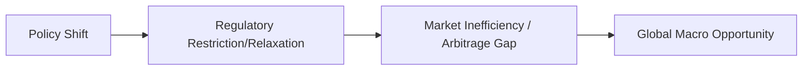

## Introduction

So, you might have heard stories like, "Folks loaded up on emerging market debt when interest rates in advanced economies were near-zero," and then—boom— rates climbed, and money flowed right back into the safer markets. These ebbs and flows often connect to one core factor: policy shifts. Whether it’s your central bank fiddling with the money supply (monetary policy) or your government passing new tax incentives (fiscal policy), each action can rewrite the rules for global macro investing overnight. Let’s walk through the major aspects of these policy changes, the regulatory frameworks in which they operate, and how global macro managers adapt when, say, a new capital control stunts their high-flying arbitrage strategy.

## Monetary, Fiscal, and Trade Policy Shifts Overview

1. Monetary Policy  
   Monetary policy refers to central bank-led measures to influence interest rates, inflation, and the money supply. Central banks such as the Federal Reserve (Fed), European Central Bank (ECB), or People’s Bank of China (PBoC) set benchmark interest rates or conduct open market operations to steer economic growth and manage inflation. Well, these changes can cause shockwaves across foreign exchange rates, credit markets, and global capital flows.

   • Example: Suppose the ECB announces a surprise rate hike from 2.5% to 3.0%. Instantly, you might see an appreciation of the euro because investors seek higher yields in euro-denominated assets, influencing global currency markets.

2. Fiscal Policy  
   Fiscal policy involves government spending and taxation. If a government increases infrastructure spending or cuts certain taxes, that can spur economic expansion—and, in some cases, it can raise inflation or increase borrowing needs. Investors pay close attention to budget deficits, sovereign debt issuance, and how these factors interplay with monetary policy directives.

   • Example: Let’s say the U.S. government decrees a significant corporate tax reduction. That might nudge more foreign companies to shift or expand operations in the U.S., or it might repatriate corporate earnings. Both scenarios can affect equity valuations, bond yields, and countless global macro strategies.

3. Trade Policy  
   Trade policy includes tariffs, trade agreements, and import/export restrictions. Alterations in trade policy—like a sudden increase in tariffs between two large economies—can distort supply chains, hamper growth, or, sometimes, create brand-new trade corridors.

   • Example: The tariff battles in recent years triggered uncertainties in manufacturing and agriculture markets. Savvy global macro managers who foresaw the shift sometimes capitalized by going short on vulnerable export industries while going long on domestic sectors poised to benefit from protective tariffs.

Policy changes in these three domains can drastically affect asset prices, inflation expectations, and investor sentiment, thus shaping all sorts of risk premia in the capital markets.

## Regulations and Market Inefficiencies

Capital controls, currency transaction taxes, or changing disclosure requirements: these rules can open or close the door to new inefficiencies. Market inefficiencies, in turn, are the lifeblood of many global macro and arbitrage strategies because that’s where managers sniff out mispricing or dislocations to exploit.

• Capital Controls  
  Governments impose capital controls to regulate the flow of foreign capital. For instance, a country concerned about excessive currency appreciation might limit foreign inflows to shield its domestic exporters. On the flip side, a country battling a recession might lift capital restrictions to attract investment. Changes in such controls can surprise the market, driving up or down local currency values or interest rates.  

• Currency Transaction Taxes  
  Some countries experiment with taxes on currency transactions, aiming to curb speculation or stabilize currency movements. Although these taxes slow down some strategies (like very short-term currency arbitrage), they can create longer-horizon opportunities as liquidity spreads widen and certain risk premiums increase.

• Regulatory Arbitrage Potential  
  Regulatory arbitrage arises when firms or funds exploit differences in regulations across countries to secure more favorable conditions (like lower taxes or less strict compliance). Complexity in cross-border regulations can lead to persistent risk-adjusted return differentials across regions.  

Here’s a quick diagram to visualize how policy changes lead to new market inefficiencies:

The whole point: a new threshold on short-selling in one jurisdiction or a sudden tweak in foreign exchange controls can create pockets of dislocation. Managers who watch these developments like hawks might seize an advantage.

## Global Entities Shaping Capital Markets

Major supranational institutions also shape policy and regulatory frameworks, influencing macro strategies in a big way.

• International Monetary Fund (IMF)  
  The IMF often steps in during crises (like a currency meltdown or a sovereign debt default) by imposing conditions on a country’s policy setup as part of a bailout package. These conditions can drastically alter the local investment climate.  

• World Bank  
  Focuses on long-term development and grants/loans to alleviate poverty. Sometimes, World Bank funding requires structural reforms that can open up or transform an economy’s capital markets.  

• Bank for International Settlements (BIS)  
  BIS fosters global monetary and financial stability by coordinating among central banks. BIS sets guidelines on bank capital adequacy, liquidity coverage, etc. For instance, new macroprudential regulations—like the Basel III reforms—can limit banks’ ability to lend or trade certain assets.

• Others  
  The Financial Stability Board (FSB) suggests systemically important institutions (SIFIs) or non-banks that might need heavier regulation. The World Trade Organization (WTO) can shape trade policy dialogues and set frameworks for dispute resolution.

Yes, there’s a lot of “alphabet soup,” but each entity plays a distinct role that can shift cross-border financial flows.

## The Evolution of Macro Strategies Under Regulatory Changes

Global macro managers, by definition, ride the waves of big-picture economic transformations. But if regulators say “Actually, your favorite derivative contract is now restricted,” a manager must pivot—fast. In my opinion, the best managers are those who keep scenario analyses for each potential regulatory shift.  

1. Transparency Requirements  
   Regulators increasingly push for transparency in derivatives markets via centralized clearing or mandatory reporting. That shift might reduce a manager’s ability to build large secret positions discreetly.  

2. Derivative Usage Limits  
   Some jurisdictions place position limits on commodity derivatives to prevent large players from dominating the market. This can hamper certain speculation or hedging strategies, even as it opens other angles—like cross-exchange strategies or deeper fundamental plays.  

3. Short-Selling Bans  
   During a severe market downturn, authorities occasionally ban or limit short-selling to (theoretically) prevent a downward spiral. A global macro fund with a big short position might have to unwind quickly—which can be painful or might create a forced and profitable short squeeze for someone else.

4. Leverage Restrictions  
   A new leverage cap can mean you can’t exploit your bullish or bearish calls with as much borrowed money anymore. While that might hamper potential returns, it also might reduce meltdown risk.  

Over time, these shifting compliance landscapes pressure managers to adapt. Some strategies (like high-frequency or algorithmic) might become more challenging under new regulatory data or time-lag rules, while others (like relative value arbitrage or longer-horizon fundamental macro) might flourish because they have less direct exposure to intraday compliance constraints.

## Adapting to Shifting Compliance Landscapes

Anyway, it’s not just about abiding by new rules; it’s about spotting how they alter the risk-reward equation. For instance:

• If short-selling is restricted, maybe you pivot to proxy hedging using currency or index derivatives.  
• If certain derivatives become more expensive due to compliance or collateral requirements, you might rely more on direct spot markets or other instruments.  
• If a government changes ESG disclosure requirements, you might reevaluate which industries get “punished” or excluded from major index providers—leading to potential mispricing.

This might sound complicated, and guess what—it is. But well-prepared global macro funds maintain compliance staff, regulatory lawyers, or external consultants to track major legislative shifts across key markets (U.S., EU, China, etc.). It’s basically the cost of doing business at this level.

## Tracking Legislative Agendas in Major Economies

Whether it’s the U.S. Congress considering new banking reforms or the European Parliament tightening environmental disclosure, that stuff matters for your trades. And don’t forget: local politics can also become the epicenter of new shifts. If Chile’s government changes its approach to copper resource taxation, or if India opens more sectors to foreign direct investment, advanced heads-up can be pure gold for your global macro allocations.

Keeping an eye out for legislative and regulatory updates in G-3 (U.S., EU, Japan), big emerging markets like China, and commodity powerhouses like Australia or Brazil can often signal the next wave of opportunities. Notice that these changes might have longer lead times, so you usually have some runway to position your portfolio. But when the day of implementation arrives, the market can move swiftly.

## Scenario Analyses and Risk Premia Harvesting

One crucial tactic is scenario analysis, where managers imagine different policy paths (e.g., a hawkish vs. dovish Fed, or more vs. fewer capital controls in Asia) and examine how each scenario might affect yield curves, currency pairs, credit spreads, or equity valuations. By preparing these scenario analyses, you can see how potential policy changes shift the underlying risk premia.  

• Low Interest Rate Scenario  
  If rates stay ultra-low, risk assets may continue performing strongly, but currency carry trades might thrive.  

• Rising Interest Rate Scenario  
  Could hamper carry trades, reduce equity valuations, and shift capital back to safe-haven currencies.  

• Implementation of Capital Controls  
  Might isolate local markets from global flows, so local rates or currency pairs might deviate from typical relationships.  

• New ESG Regulations  
  Could cause capital outflows from heavy carbon emitters, temporarily depressing valuations (or leading to discounted buying opportunities).

## Practical Implementation Guidelines

• Continuously Monitor Official Sources:  
  Keep an eye on central bank statements, government press releases, IMF guidelines, BIS reports, and so forth. If you can’t read everything, at least set up alerts.

• Use Data Analytics:  
  Some funds have begun employing machine learning to parse regulatory documents or political discourse. You might build custom “regulation watch” dashboards to catch changes in real time.

• Diversify Your Prime Brokers:  
  Different brokers in different jurisdictions might each have unique compliance constraints (like margin requirements). A multi-broker approach can reduce the risk of being locked out if one jurisdiction imposes harsh new rules.

• Defensive Strategies:  
  When uncertain about a looming policy shift, reduce leverage, increase liquidity, or utilize simpler strategies until more clarity emerges.

• Maintain Flexible Hedging:  
  Sometimes, you can’t hedge a risk if your direct instrument has been banned or limited. But creative hedging with correlated assets or different geographies can still partially mitigate that risk.

## Conclusion and Best Practices

All in all, policy shifts and regulatory frameworks are the bedrock of the unpredictable environment in which global macro strategies operate. The trick, in my view, is not just to comply but to see how changing rules can create new inefficiencies or distortions. In times of major policy transitions, capital flows, exchange rates, and interest rate differentials can swing wildly, uncovering hidden pockets of profitable mispricing.

You might find yourself thinking: “Well, that’s a lot to keep track of!” Indeed, it is. But by blending strong scenario analysis with a constant ear to the ground on central bank chatter, legislative agendas, and global macro institutions, you’ll be in a solid position to pivot when these changes inevitably arise. Because, yep, they inevitably do.

## Final Exam Tips

• Prioritize Understanding Over Memorization: For the exam, it’s crucial to demonstrate how you’d respond to a policy shift. Scenarios or item sets might ask: “If the EU enacts stricter short-selling regulations, how would you adjust your portfolio’s currency hedge?”

• Use Real-World Data Points in Constructed Responses: If a question references a hypothetical scenario, adapt the relevant policy concepts (like capital controls or new ESG rules) to show you know the logic behind them.  

• Don’t Forget the Why: Regulators often target systemic risk, speculation, or transparency. In your responses, referencing these motivations for policy actions can strengthen your case for how you manage or exploit them.

• Time Management: In multi-part item sets, break down the question methodically. Usually, they’ll ask you to step through a policy shift’s effect on interest rates, then on currency, then on a derivative strategy, etc.

Happy studying, and keep that regulatory radar on full alert!

## References for Further Study

1. Bank for International Settlements (BIS):  
   – Papers discussing macroprudential regulation and the global role of central banks.  
   – https://www.bis.org

2. OECD Guidelines on Capital Movement and Regulatory Harmonization:  
   – https://www.oecd.org

3. IMF and World Bank Publications:  
   – For real-time policy guidance, read annual IMF World Economic Outlook reports.  
   – World Bank’s “Doing Business” series for investment climates.  

4. Government Websites:  
   – U.S. Department of the Treasury: https://home.treasury.gov  
   – European Commission: https://ec.europa.eu/info/index_en

5. CFA Institute Research Foundation:  
   – Additional studies and articles on how policy and regulation shape global investing.  

--------------------------------------------------------------------------------

## Test Your Knowledge: Policy Shifts and Regulatory Frameworks Quiz



### Which of the following policies deals with a country's money supply and interest rates?

- [ ] Fiscal Policy
- [x] Monetary Policy
- [ ] Trade Policy
- [ ] Social Policy

> **Explanation:** Monetary policy relates to central bank actions that manage money supply, interest rates, and overall liquidity within an economy.

### When a government imposes restrictions on the flow of capital across borders, what is this called?

- [ ] Fiscal stimulus
- [ ] Regulatory arbitrage
- [x] Capital controls
- [ ] Currency depreciation

> **Explanation:** Capital controls limit or regulate the inflow and outflow of foreign capital to protect a domestic economy from volatility or speculation.

### A ban on short-selling is most likely to affect which of the following?

- [x] The ability of investors to profit from falling prices
- [ ] The ability to hedge currency risk
- [ ] The government’s tax revenue
- [ ] The liquidity of long positions only

> **Explanation:** A short-selling ban restricts the practice of selling borrowed securities to profit from a decline in their price, thereby impacting specific global macro strategies.

### Which global institution primarily provides conditional loans to countries in crisis, often mandating policy reforms?

- [ ] World Bank
- [x] International Monetary Fund (IMF)
- [ ] Bank for International Settlements (BIS)
- [ ] European Central Bank (ECB)

> **Explanation:** The IMF typically steps in during severe balance of payments or debt crises, requiring structural policy changes as a condition of the loan.

### Under a restrictive new leverage cap, one possible outcome for global macro funds is:

- [ ] Increased maximum borrowing levels
- [x] A smaller capacity to amplify returns through borrowed funds
- [ ] Higher reliance on short-selling
- [ ] Guaranteed improvement in alpha

> **Explanation:** A leverage limit forces managers to reduce borrowed amounts, potentially lowering both risk and potential returns.

### When a government unexpectedly reduces corporate taxes, which of the following might occur?

- [ ] Decreased investment flows into that country
- [ ] Instant currency devaluation
- [x] More businesses shift operations to that country
- [ ] Limited potential for future growth

> **Explanation:** Lower corporate taxes often make it more attractive for companies to set up or expand operations, potentially increasing foreign direct investment.

### Why would a global macro manager need to update their strategy if a central bank transitions from a dovish to a hawkish stance?

- [ ] To reduce opportunities for currency arbitrage
- [ ] To avoid confusion over short-selling constraints
- [x] Because interest rates are likely to rise, impacting bond yields and capital flows
- [ ] Because it automatically suspends cross-border taxation

> **Explanation:** A hawkish stance typically means increasing interest rates to combat inflation, which affects bond prices, credit markets, and exchange rates.

### If a country announces stricter ESG disclosure requirements for energy companies, one likely result is:

- [ ] Universal deregulation of energy markets
- [x] Adjustments in asset valuations for heavy-emitting industries
- [ ] A surge in cross-border currency taxes
- [ ] Immediate closure of derivative markets

> **Explanation:** Managers will monitor how markets re-price carbon-heavy industries due to new compliance and investor sentiment changes, potentially widening risk premia.

### Regulatory arbitrage occurs when:

- [ ] Managers choose to break the law
- [ ] The central bank lowers interest rates
- [ ] There are no global regulatory differences
- [x] Managers exploit discrepancies in rules between regions

> **Explanation:** Regulatory arbitrage is about taking advantage of varying rules and requirements in different jurisdictions.

### True or False: Scenario analysis helps global macro managers prepare for potential regulatory changes and identify tailoring strategies in response.

- [x] True
- [ ] False

> **Explanation:** Scenario analysis is a key approach in evaluating different policy outcomes and deciding how to position a portfolio preemptively.


