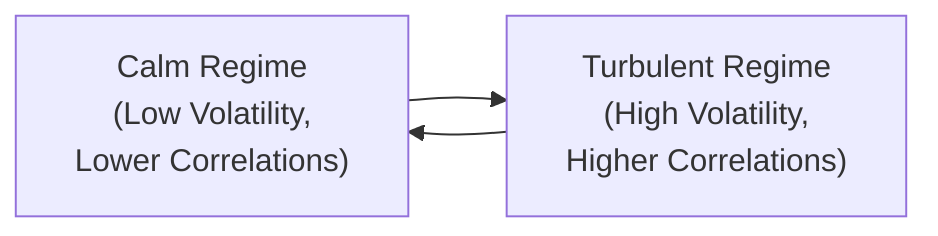

## Introduction

Correlation patterns can be tricky, right? One day you’re celebrating how perfectly uncorrelated your portfolio’s alternative assets are with the equity market. The next, a sudden market shock triggers a “risk-off” environment, and suddenly everything moves lockstep together—like they’re planning a family reunion you didn’t exactly sign up for. In this section, we’ll dive into the subtlety and complexity of correlation dynamics in multi-asset portfolios, especially in the context of alternative investments. We’ll get into why correlations may rise (or collapse) at inconvenient times, how advanced measurement tools such as copulas and regime-switching models can help, and how to prudently manage correlation assumptions in real-world portfolio construction. And hopefully, by the end, you’ll feel more confident about analyzing the correlation puzzle—because yes, it can be a puzzle.

## Why Correlation Dynamics Matter

Most of us have heard the mantra: “Diversify to reduce risk.” Indeed, correlation is at the heart of diversification. In an ideal world, we’d hold a neat basket of assets that neatly offset each other when the market turns volatile. But in practice, correlations evolve over time, especially when investor sentiment flips from “risk-on” to “risk-off.” 

• Risk-On Environment: Investors get comfortable taking on more risk. Equities and other growth-oriented assets typically rally, while safe-haven assets might be less in demand. Correlations among riskier assets may remain moderate or even low, promising a degree of diversification.  
• Risk-Off Environment: This is when fear takes over. Investors flock to government bonds, gold, or other safer havens, and many risk assets suddenly move in tandem. Correlations ramp up—sometimes dramatically—precisely when diversification would be most needed.

It’s not just an academic concept. I recall a time when I thought I was cleverly hedged with a portfolio of equities, emerging market currencies, and some real estate exposure. Then, after a small credit event triggered a larger global panic, all my “uncorrelated” assets decided it was party time—together. That’s when I realized correlation is not simply a static number but a living, breathing phenomenon.

## Advanced Methods to Measure Correlation

Relying on the classic correlation coefficient (i.e., the linear Pearson correlation) can be misleading—especially if you want to capture nonlinear or tail relationships. Let’s take a brief look at some advanced approaches:

### Copula Models
A “copula” is not just a fancy term to impress your friends at dinner; it’s a statistical function describing the dependence structure among multiple variables independent of their marginal distributions. Copulas allow risk modelers to specify the degree to which extreme outcomes in different assets might cluster together—a concept known as tail dependency.  
• Tail Dependency: If two assets have a high lower-tail dependency, it implies that when one experiences extremely negative returns, the other might do the same more often than a simple linear correlation might suggest.

### Regime-Switching Models
Ever wonder why correlation estimates seem stable for years and then blow up in one sudden quarter? Regime-switching models address this by assuming there are different “states of the world” (or regimes), each with its own correlation structure.  
• State 1 (e.g., Calm Market Regime): Low volatility, moderate or low correlations.  
• State 2 (e.g., Turbulent Market Regime): High volatility, high correlations.  
• Transition probabilities are estimated statistically, which helps you model how likely it is that we’ll switch from calm to turbulent—and how fast.

### Non-Linear or Dynamic Approaches
Beyond copulas and regime-switching, you might also come across dynamic conditional correlation (DCC) models and multivariate GARCH-based methods. These tools update correlation estimates as new market data arrives, attempting to reflect the reality that relationships shift continuously over time.  

If you’re performing a quick “back-of-the-envelope” correlation calculation, it’s typically just:


\rho_{X,Y} = \frac{\mathrm{Cov}(X,Y)}{\sqrt{\mathrm{Var}(X)\,\mathrm{Var}(Y)}}


But if you’re in a high-stakes environment—like a large pension plan or a hedge fund—good luck relying solely on that single, static correlation coefficient to forecast how assets interact under market stress.

## Correlation Spikes and the Limits of Diversification

A key frustration with correlations is their tendency to spike under stress. The well-documented phenomenon is that historically negative or near-zero correlations suddenly rise toward 1.0 during market drawdowns.

Why does this happen?  
• Liquidity Stress: When liquidity vanishes, investors often rush to sell anything they can sell. This can drive up correlations significantly, especially among risk assets.  
• Contagion Sentiment: Fear can be contagious. If enough market participants decide to de-risk, it leads to a simultaneous collapse in multiple asset classes.  
• Systemic Leverage: Leverage can amplify moves across asset classes, causing large sell-offs that feed on each other.

The end result? That once-lovely “uncorrelated” corner of your portfolio might not provide the safe-haven performance you hoped for. This is why, if you ask many asset allocators, they’ll remind you that correlation is famously known to be “conditional.”

## Cross-Asset Influences

You know how sometimes you watch currencies, bond yields, and commodities all moving roughly together, and you wonder: “Wait, I thought these were all different markets?” In reality, fundamental macroeconomic forces can tightly link previously unrelated markets. For example:

• Equity Prices and Currencies: Strong equity markets in emerging economies can attract foreign capital, causing local currencies to appreciate. Under stress, that flow can reverse.  
• Commodity Shocks and Bonds: If there is an oil price shock, inflation expectations might spike, which could push bond yields higher, hurting bond prices.  
• Real Estate and Credit Markets: Tighter credit conditions can bring real estate valuations down, correlating these two segments much more than historical data might suggest.

A single “shock” in one market might be the first domino in a chain reaction that drives correlated moves in seemingly unrelated assets.

## Correlation Breakdown and Structural Shifts

The flipside of correlation spiking is correlation breakdown—when a historically robust relationship dissolves as new drivers reshape market behavior. Maybe currency pegging changes, or new regulations drastically alter how certain derivatives trade. 

Real-life case in point: Some traders historically banked on stable correlations between U.S. Treasuries and corporate bonds. Then a wave of new issuance and shifting risk appetites changed the game, and that “reliable” correlation was no longer so predictable. Always keep your eyes open for structural shifts—market conditions can transform in ways that void old assumptions.

## Factor-Based Portfolio Considerations

These days, a lot of managers are building factor-based portfolios that target risk premia such as value, momentum, carry, or low volatility. One big pitfall is duplicating the same underlying systematic factor across different strategies. For instance:  
• You might hold a “value” equity strategy and a “value” bond carry strategy that inadvertently both load heavily on a broad “value” factor.  
• During turbulent markets, strategies that plug into the same factor can become highly correlated, couch-surfing in each other’s homes when risk sentiment changes.

By carefully examining factor exposures, you can avoid layering the same risk factor multiple times under different investment labels—and reduce correlation surprises.

## Monitoring and Revisiting Correlation Assumptions

Markets evolve—sometimes faster than we care to admit—so it’s crucial to continually revisit correlation assumptions:

• Frequency of Recalibration: Some practitioners update their correlation matrix monthly or quarterly, while others rely on automated systems to recalculate daily.  
• Stress Testing: Evaluate how correlations might behave during specific crisis scenarios (e.g., a major downturn in an overall equity market, a spike in oil prices, or a sharp jump in interest rates).  
• Regime Analysis: Keep an eye on leading indicators (like volatility indices or credit spreads) that might signal a shift from one regime to another.

## Practical Example

Maybe it’s helpful to walk through a hypothetical scenario. Let’s say you manage a diversified portfolio with the following exposures:

• 40% U.S. Equities  
• 20% Hedge Funds  
• 20% Commodities  
• 15% Global Bonds  
• 5% Cryptocurrency  

You run a correlation analysis on the last five years of returns. Great news: The correlation matrix looks comfortably below 0.3 for everything except for moderate correlation between U.S. Equities and Hedge Funds. Then a global credit scare hits:

1. U.S. Equities drop 15%.  
2. Investors redeem hedge fund shares en masse, forcing hedge funds to liquidate commodity positions, driving commodities down 10%.  
3. Global bonds rally initially, but eventually experience some stress anyway due to forced selling by leveraged players.  
4. Cryptocurrency experiences a wave of panic selling, with a 25% drop as liquidity thins out.

When you re-run correlations during that stressed period alone, you find that equities, hedge funds, and commodities all soared to correlations north of 0.7, up from their usual 0.2 or 0.3. So yes, over a five-year horizon, your portfolio seemed diversified. But in that crucial two-week meltdown, it felt like all your riskier assets were basically the same position—ouch.

## Mermaid Diagram: Regime-Switching Correlation Overview

Below is a simplified diagram illustrating two regimes (Calm and Turbulent) and how correlations shift between them.



In this model, the portfolio transitions from a calm regime to a turbulent regime (and back), each having its own correlation pattern. Monitoring the transition probabilities between these states helps anticipate correlation surges.

## Python Snippet for Correlation Calculation

For those who want a quick refresher, here is an example of basic Python code to compute rolling correlations between two sets of returns:

```python
import pandas as pd
import numpy as np

np.random.seed(42)
asset1_returns = pd.Series(np.random.normal(0, 0.01, 1000))
asset2_returns = pd.Series(np.random.normal(0, 0.01, 1000))

rolling_corr = asset1_returns.rolling(window=60).corr(asset2_returns)

print(rolling_corr.tail())
```

Of course, this is a very simplistic approach. Real-world modeling would likely incorporate dynamic or regime-sensitive methods.

## Conclusion

Correlation dynamics in multi-asset portfolios are central to risk management and diversification. The correlation coefficient is never as simple as it looks, especially with alternative investments or factor-based strategies. Markets can shift from risk-on to risk-off swiftly, often driving correlations upward at the worst possible times. And even if your correlation assumptions have been rock-solid historically, structural changes and new market drivers can lead to correlation breakdown. 

What’s the bottom line? Always keep an eye on your portfolio’s factor exposures and remain vigilant about updating correlation estimates. Stress test for tail events and consider advanced statistical models (like copulas and regime-switching) to capture the full picture of cross-asset relationships. By putting in the extra effort, you’ll avoid some nasty diversification surprises and make more informed decisions—especially when the markets throw you a curveball.

## References and Further Reading

- Meucci, A. (2010). “Managing Diversification.” Risk Journals.  
- Embrechts, P., McNeil, A., & Straumann, D. (2002). “Correlation and Dependence in Risk Management.”  
- “Correlation Breakdown” articles in The Journal of Portfolio Management.  
- CFA Institute. (Current Edition). CFA Program Curriculum, Level III, for detailed analysis of multi-asset portfolio management and advanced risk concepts.  

---

## Test Your Knowledge: Correlation Dynamics in Multi-Asset Portfolios



### Which statement best describes why correlations often rise during a risk-off environment?

- [ ] Because all assets perfectly hedge each other in times of crisis.  
- [x] Because investors simultaneously de-risk, causing multiple asset classes to sell off together.  
- [ ] Because advanced models always overestimate volatility in calm markets.  
- [ ] Because risk premiums remain stable even under high market stress.  

> **Explanation:** In a risk-off environment, fear leads to simultaneous selling of many risky assets, causing correlations to spike just when investors need diversification the most.

### What is the main advantage of using copula models in correlation analysis?

- [ ] They eliminate all downside risk.  
- [ ] They ignore tail dependencies.  
- [ ] They are only suitable for linear relationships.  
- [x] They can capture complex, non-linear dependencies and tail events.  

> **Explanation:** Copula models allow for flexible modeling of dependence structures and tail relationships, which standard linear correlations can miss.

### Why is it important to monitor factor exposures in a multi-asset portfolio?

- [x] Different assets may load on the same risk factor, unexpectedly increasing correlation.  
- [ ] It guarantees that correlations will remain near zero.  
- [ ] Factor models never exhibit regime changes.  
- [ ] Factor-based investing eliminates the need for diversification.  

> **Explanation:** Exposure to a single underlying factor in multiple strategies can amplify correlation and reduce overall diversification benefits.

### What best describes “tail dependency” in the context of correlations?

- [ ] The dependence of assets exclusively in stable market regimes.  
- [ ] A type of correlation that occurs only during expansions.  
- [x] The tendency for extreme negative (or positive) returns to coincide more than linear correlation predicts.  
- [ ] The dependency when only one asset experiences a gain.  

> **Explanation:** Tail dependency focuses on the likelihood of assets experiencing simultaneous extreme movements, a key consideration in risk management.

### In a regime-switching model, how do correlation estimates differ between calm and turbulent regimes?

- [x] Turbulent regimes usually show higher correlations due to systemic risk and investor panic.  
- [ ] Correlation is zero during turbulent regimes.  
- [ ] Calm regimes always show negative correlations.  
- [ ] Correlations remain constant across both regimes.  

> **Explanation:** Under turbulence, a surge in systemic risk or contagion can cause assets to move together more tightly, raising correlations relative to calmer periods.

### Which of the following best illustrates correlation breakdown?

- [x] A historically reliable relationship between two assets abruptly changes when new regulations alter market pricing.  
- [ ] A static correlation of 0.5 repeating for decades.  
- [ ] Perfect correlation between two unrelated assets.  
- [ ] Constant negative correlation in all market states.  

> **Explanation:** Correlation breakdown happens when historical relationships change unexpectedly, often due to structural market shifts or novel factors.

### How do liquidity stresses contribute to rising correlations?

- [x] Investors sell what they can, often across asset classes, creating forced selling.  
- [ ] Liquidity stress ensures that different assets always move inversely.  
- [ ] Liquidity stress reduces the need to sell any positions.  
- [ ] Liquidity stress applies only to government securities, not alternative assets.  

> **Explanation:** When liquidity is scarce, investors may unload positions in multiple asset classes concurrently, pushing correlations upward.

### What is a key limitation of a static correlation coefficient?

- [ ] It perfectly captures regime shifts.  
- [ ] It always accounts for non-linear dependencies.  
- [ ] It automatically adjusts for tail risks.  
- [x] It doesn’t reflect that correlations can change significantly over time and across market conditions.  

> **Explanation:** A single coefficient from historical data might not apply in a completely different market regime, leading to misleading assumptions.

### What is an example of cross-asset influence?

- [x] An equity sell-off triggers margin calls, forcing hedge funds to liquidate commodities.  
- [ ] Correlations remain constant naming the same risk factor.  
- [ ] A bond price controlling currency returns by definition.  
- [ ] Diversifications become total, ignoring external shocks.  

> **Explanation:** A single large drawdown in one asset class can spill over into others, due to margin calls, financing constraints, or general panic in markets.

### In most market crises, correlations among risky assets:

- [x] Tend to increase significantly.  
- [ ] Tend to decrease significantly.  
- [ ] Remain at moderate levels.  
- [ ] Become perfectly negative.  

> **Explanation:** When crisis hits, risky assets often move together, eroding the benefits of diversification at the precise moment it’s most needed.


