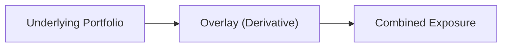

## Introduction

I remember years ago, chatting with a macro manager who was juggling multiple currencies, bond exposures, and equity index positions. The uneasy market environment had everyone on edge—interest rates were flashing potential trouble, currency regimes were shifting, and equities were as volatile as ever. In that sort of setting, derivatives can feel like a lifeline. If you’re comfortable structuring the right derivative, you can quickly adjust exposures and potentially dampen risk without having to liquidate your entire portfolio. 

So, let’s step back and explore a range of derivative instruments used for macro hedging. We’ll look at how they work, what you need to watch out for, and how to fit them into a broader portfolio strategy. We’ll dig especially into interest rate swaps, currency forwards, and options-based strategies such as protective puts and collars. 

## Key Derivatives for Macro Hedging

Many macro investors—like global bond managers, currency traders, or multi-asset portfolios—rely on derivatives to either dial up or dial down risk. The main contract types include:

- Options (calls and puts): Grants the buyer the right (but not the obligation) to buy or sell an underlying asset at a fixed price (strike) by a certain date.  
- Futures: Standardized agreements to buy or sell an underlying asset (like an equity index or government bond) on a future date.  
- Forwards: Customizable agreements (over-the-counter, OTC) for buying or selling an asset (like a currency) at a locked-in price on a future date.  
- Swaps: Agreements to exchange cash flows—such as swapping a floating rate for a fixed rate to manage interest rate exposure.  

These tools help in addressing interest rate risk, currency fluctuations, equity market volatility, or any macro factor that might keep you up at night.  

## Hedging with Options and Collars

Let’s say you’re worried about a potential market downturn in your equity holdings. One of the most straightforward ways to hedge is by purchasing a protective put. This is a long put option on the underlying asset that gives you the right to sell at a certain strike, effectively capping your downside. Of course, you’ll pay a premium for that insurance.  

If you’re looking for a cost-effective approach, you might use a collar. You purchase a protective put, but to lower the cost of that put premium, you sell a covered call at a higher strike. The sale of the call offsets part (or all) of the cost of the put but caps your upside if the market rallies.  

Another approach is an interest rate cap if you’re dealing with floating-rate debt. Suppose you have a floating-rate loan tied to LIBOR (or a replacement benchmark). By purchasing an interest rate cap, you pay a premium upfront, and if rates exceed a predetermined cap level, your contract compensates you for any excess interest expense.  

### Protective Put (Quick Example)

Imagine you hold a $10 million position in an S&P 500 ETF, trading at 4,000 points. You fear a market correction over the next three months. You buy put options with a strike at 3,800 that expire in 90 days. If the market plummets below 3,800, your put options grant you the right to sell at the strike—limiting your downside. The premium cost might be, say, 1.5% of notional, so $150,000. Think of it like an insurance policy on your equity.  

## Hedging with Futures and Forwards

Futures and forwards are particularly popular for currency and equity index hedging because they are direct and often cheaper than options. However, they do not provide asymmetric payoffs. If your position moves favorably, a future or forward-based hedge will offset part of the gain.  

- Futures for Equity Indices: If you have long exposure to a global equity index, but you’re worried about a short-term macro event, you can sell equity index futures to reduce your net exposure. When the event risk passes, you can buy back those futures.  

- Currency Forwards: A currency forward locks in an exchange rate for a future transaction. If your global portfolio is denominated in USD but has large euro holdings, you may fear that the euro could depreciate. You can sell EUR forward for USD at today’s forward rate, effectively locking in the exchange rate and mitigating currency risk.  

One personal anecdote: I once tried to hedge a currency exposure in a time zone mismatch—my forward was for a certain settlement date, but my local markets had a slightly different holiday schedule. I ended up scrambling for overnight coverage. Little issues like that can turn into big headaches, so always confirm settlement details, holiday calendars, and margin requirements (OTC products often have different margin rules than exchange-traded futures).  

## Interest Rate Swaps

Interest rate swaps (IRS) are a mainstay for any investor with floating or fixed-rate obligations. Suppose you have a floating-rate liability but believe interest rates will spike soon. You can enter into a pay-fixed, receive-floating swap: effectively, you lock your future payments at a fixed rate. If rates do go up, you’re protected because you’re receiving the higher floating payment while paying a pre-agreed fixed rate.  

Conversely, if you hold fixed-rate debt (or prefer to lock in a floating rate because you think interest rates might drop), you might use a pay-floating, receive-fixed swap. The net effect is to convert your current debt structure into something matching your market views or hedging needs.  

### Swap Mechanics

- Notional Principal: The face amount on which interest calculations are based—usually not exchanged, just used for computing interest.  
- Floating Rate Index: Commonly references LIBOR, EURIBOR, or newer risk-free rates.  
- Settlement Frequency: How often payments are exchanged (e.g., quarterly, semi-annually).  
- Termination Conditions: Early termination might be possible, but you’ll typically pay or earn a settlement cost.  

Here’s a simplistic example: If you have a $50 million floating-rate loan at LIBOR + 2% and you’re worried rates might shoot up, you might enter an interest rate swap where you pay a fixed 5% per year and receive LIBOR from your swap counterparty. If LIBOR spikes to 4%, you’d receive 4% from the swap, meaning your effective floating cost is offset, and you only pay your fixed portion net of that.  

## Liquidity, Margin Requirements, and Credit Risk

One crucial consideration with derivatives is liquidity and margin. 

- Liquidity: Futures markets tend to be quite liquid, especially for major equity indexes or government bonds. OTC swaps and forwards can be less liquid, with wide bid-ask spreads—especially for certain currency pairs or longer-dated swaps.  

- Margin Requirements: Exchange-traded futures require initial margin and daily variation margin calls. OTC derivatives often involve collateral agreements, possibly under ISDA Credit Support Annex (CSA) frameworks. You need to ensure you have enough cash or other collateral to meet any margin calls if your positions move against you.  

- Credit Risk: If using an OTC derivative, your biggest concern is the counterparty’s creditworthiness. If your hedge’s counterparty fails, you might lose that protection in a worst-case scenario. A robust clearing mechanism or collateral arrangements reduce credit risks, but they don’t eliminate them entirely.  

It can be tempting to skip the fine print on margin or credit terms, but that’s often a recipe for bigger trouble later.  

## Derivative Overlays in Macro Management

Macro managers often employ so-called “overlay” strategies. An overlay is a separate derivative position layered on top of an existing portfolio to adjust exposures without disturbing the underlying holdings. 

For instance, if an asset manager has a globally diversified portfolio but wants to temporarily reduce equity beta, they might overlay a short equity index futures position. Or, if they feel the euro is going to weaken but still want to keep the underlying euro assets for strategic allocation, they’ll sell EUR forwards as an overlay.  

The beauty of overlays is speed and flexibility. You don’t have to sell the underlying asset, which might be illiquid or come with tax implications. Instead, you craft a derivative that offers the same economic effect.  

In this diagram, the manager’s base portfolio (“A”) is the strategic holding, while the overlay (“B”) is used to fine-tune or hedge macro exposures, resulting in the combined net exposure (“C”).  

## Basis Risk

Basis risk is the mismatch between the performance of the hedge instrument and the actual exposure you aim to hedge. For example, let’s say you hold local-currency emerging market bonds but try to hedge them using a broad currency basket forward contract. The correlation might not be perfect, so if the local currency moves differently from that basket, your hedge might not perfectly offset your losses (or gains).  

You see basis risk a lot with commodity hedges or specialized equity indexes that don’t map perfectly to an available futures contract. In practice, you try to pick the derivative that has the highest correlation to your underlying. But perfect hedges are rare, so basis risk management becomes part science, part art.  

## Practical Case Study: Hedging Currency Exposure

Picture a U.S. pension fund holding EUR-denominated bonds. The manager is bullish on the credit spreads of these bonds but doesn’t want currency risk. A currency forward contract can lock in the EUR-to-USD exchange rate. The manager enters into a forward to sell EUR and receive USD on a rolling basis every three months. This approach effectively isolates the bond’s credit performance from Euro movements.  

However, if the manager picks a short-term forward contract and the pension invests for the long term, repeated rollovers might introduce rolling costs and potential gap risks (if the forward market moves materially between each rollover).  

## Putting It All Together for the Exam

- Make sure you thoroughly understand how each derivative type functions in practice. That means knowing how an option payoff is structured (protective put vs. covered call), or how a currency forward might create an exact or partial hedge for an international asset.  
- Always consider margin requirements and liquidity. The exam often highlights scenarios where quick changes in interest rates or currency values lead to margin calls, forcing an investor to liquidate positions.  
- Watch out for basis risk. The exam might give you a scenario with mismatched underlyings, asking about the partial effectiveness of a hedge.  
- Pay attention to the difference between exchange-traded vs. OTC derivatives from a credit risk perspective.  
- Draw from the CFA Institute Code and Standards regarding prudent risk management, professional conduct, and the disclosure of derivative risks to clients.

## References and Further Reading

- Das, S. (2015). “Swaps and Financial Derivatives.”  
- Hull, J. (2017). “Options, Futures, and Other Derivatives.”  
- ISDA (International Swaps and Derivatives Association), [http://www.isda.org/](http://www.isda.org/)  

Below are a few major takeaway terms:

- Protective Put: Long put to limit asset downside.  
- Collar: Combines a protective put and covered call.  
- Interest Rate Cap: Limits floating-rate interest expenses.  
- Currency Forward: Locks in FX rate for future exchange.  
- Interest Rate Swap: Exchanges fixed and floating interest payments.  
- Margin Requirements: Collateral obligations for derivative positions.  
- Credit Risk: Counterparty default risk in derivative contracts.  
- Basis Risk: Hedge mismatch between the derivative and underlying.  

## Test Your Knowledge: Derivatives for Macro Hedging



### A portfolio manager is concerned about a near-term equity market decline but does not want to liquidate holdings. Which strategy could help limit downside without selling core assets?

- [ ] Selling equity futures
- [ ] Buying call options
- [x] Purchasing protective puts
- [ ] Writing covered calls

> **Explanation:** Purchasing protective puts allows the manager to retain long equity exposure but limit downside risk by having the right to sell the stock (or index) at a predetermined strike price.

### A U.S. investor expects to receive EUR 5 million in six months and wants to avoid currency risk. Which is the most direct hedge?

- [ ] Sell Euro currency futures on a daily basis
- [x] Enter into a currency forward to sell EUR for USD in six months
- [ ] Buy put options on the Euro
- [ ] Buy a currency swap receiving USD floating and paying EUR fixed

> **Explanation:** A currency forward to sell EUR for USD at a future date locks in the exchange rate, eliminating near-term currency fluctuations.

### Which derivative instrument is designed primarily to protect against rising floating interest rates on debt?

- [x] Interest Rate Cap
- [ ] Protective Put
- [ ] Currency Forward
- [ ] Equity Collar

> **Explanation:** An interest rate cap establishes a maximum interest rate for a floating-rate debt instrument, thereby limiting the borrower’s interest expense.

### If a manager believes that interest rates will decline, how can they benefit by adjusting a floating-to-fixed interest rate swap?

- [ ] Enter a swap to pay fixed and receive floating
- [ ] Terminate the existing pay-floating swap
- [x] Enter a new swap to pay floating, receive fixed
- [ ] Nothing—this scenario cannot be exploited with swaps

> **Explanation:** A pay-floating, receive-fixed swap will gain value if floating rates fall below the fixed rate the manager is receiving.

### Which of the following is a potential downside of using equity index futures to hedge a portfolio?

- [ ] Elimination of all basis risk
- [ ] Ability to close positions any time
- [ ] No daily mark-to-market requirements
- [x] Partial mismatch between the index and the portfolio’s constituents

> **Explanation:** There can be basis risk if the underlying portfolio differs in composition from the index used for the futures hedge.

### An overlay is best described as:

- [ ] A set of distressed assets added to the portfolio
- [x] A separate derivative position adjusting overall exposure
- [ ] A type of capital structure arbitrage
- [ ] A fundamental research analysis tool

> **Explanation:** Overlays are derivative-driven positions layered on top of existing holdings to tweak exposure without altering the core assets.

### The primary motivation for using currency forwards in a global macro strategy is:

- [x] To hedge exchange rate risk or profit from anticipated currency moves
- [ ] To reduce credit risk entirely
- [x] To lock in future interest rates
- [ ] None; forwards are only used for short-term speculation

> **Explanation:** Forwards are suitable for hedging or speculating on currency moves, locking in future exchange rates. (Note: The statement about locking in future interest rates is incorrect, but the “currency moves” part is correct. This question has two correct answers listed.)

### Which of the following best describes basis risk?

- [ ] The risk that the investment manager guesses the wrong direction of interest rates
- [ ] The risk that the protective put expires worthless
- [ ] The risk that your counterparty defaults
- [x] The risk that the hedge and underlying asset do not move in perfect correlation

> **Explanation:** Basis risk arises when there is an imperfect correlation between the hedging instrument and the underlying exposure.

### Which of the following statements about margin requirements is accurate?

- [x] Exchange-traded futures generally involve daily variation margin calls
- [ ] OTC swaps are fully collateralized on day one without exceptions
- [ ] Collateral is never required for currency forwards
- [ ] Margin requirements only apply if the trade is profitable

> **Explanation:** Exchange-traded futures require posting initial margin and meeting daily variation margin calls. OTC swaps may have different (or no) standardized margin frameworks, often governed by ISDA agreements.

### All else equal, which statement is true regarding an interest rate swap used to hedge floating rate debt?

- [x] The pay-fixed, receive-floating swap will profit if short-term rates rise
- [ ] The pay-floating, receive-fixed swap will profit if short-term rates rise
- [ ] The pay-fixed swap is equivalent to a put option on interest rates
- [ ] The pay-floating swap has unlimited upside if rates fall below zero

> **Explanation:** A pay-fixed, receive-floating structure benefits from rising floating rates because the floating payments received go up, offsetting the higher debt cost.


