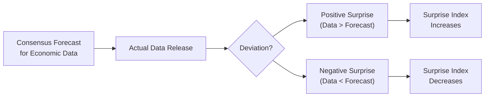

## Introduction

Picture this: you’re eagerly awaiting an unemployment report for a major economy—maybe the U.S. or the EU. You tune in, see the headlines, and figure that the markets will react if the number is “good” or “bad.” But sometimes the market does exactly the opposite of what you’d expect. Have you ever wondered why? Often, it’s because markets have already priced in their own consensus expectations. If the “bad” unemployment number wasn’t as bad as everyone predicted, it might still be interpreted as a positive relative surprise, triggering a market rally. Monitoring macro indicators and paying attention to how the data deviates from forecasts can be a game-changer in global macro and alternative investment strategies.

This section explores the central role that macro indicators—and particularly their “surprises”—play in shaping asset price movements. The concept of the “surprise index” captures how the actual data stacks up against consensus expectations. We’ll look at why it’s not necessarily the absolute performance of an economy that matters, but how far (and in what direction) the economy veers from what everyone thought would happen.

## Core Macro Indicators and Their Market Impact

When discussing macro indicators, we’re talking about big-picture data points like gross domestic product (GDP), inflation, unemployment rates, corporate earnings, and more specialized measures such as the Purchasing Managers’ Index (PMI). Let’s break down a few of the big ones:

• GDP Growth: This is one of the most recognized measures of economic health. A higher GDP growth rate often signals strong economic momentum and can boost cyclical sectors such as consumer discretionary and industrials. A slowdown suggests investors might shift into defensive assets like utilities or government bonds.  
• Unemployment Rate: In many economies, the unemployment rate gives a quick read on labor market health and consumer purchasing power. An improving rate is often positive for equities, though not always if markets expected an even bigger improvement.  
• PMI (Purchasing Managers’ Index): This survey-based indicator measures the activity level of purchasing managers in manufacturing and services. A reading above 50 indicates expansion; below 50 suggests contraction. Markets watch PMI to gauge economic turning points.  
• Inflation Data (e.g., CPI, PCE): Inflation influences central bank policy. If inflation comes in hotter than expected, bond yields might rise in anticipation of monetary tightening, possibly weighing on equity valuations.  

(Glossary note: PMI is a survey-based indicator of manufacturing and services health, typically published monthly.)

### Why Monitoring These Indicators Matters

Markets are forward-looking. They move not just on present conditions but on how today’s conditions compare to yesterday’s or tomorrow’s expectations. If GDP grows at 2% while the consensus predicted 1.5%, that might spark bullishness in equity markets—despite 2% maybe not being super impressive in absolute terms, the key is it exceeded consensus. Conversely, if unemployment ticks down to 6% but the market was counting on 5.8%, that “surprise” could dampen investor sentiment.

## Surprise Indexes Explained

A “surprise index” is basically a running score of how actual economic data stacks up against a consensus forecast. The most widely followed example is the Citigroup Economic Surprise Index (CESI). It aggregates various macro data points, compares each new data release to the consensus expectation, and updates the index to reflect positive or negative surprises.

• Surprise Index: Measures how economic announcements deviate from consensus estimates.  
• Positive Values: Mean that on balance, actual data is beating consensus forecasts.  
• Negative Values: Indicate most data is underperforming relative to expectations.

### Why Surprise Data Often Matters More Than the Absolute Number

There’s a saying on trading desks: “It’s not the news, it’s the reaction to the news.” If the market is fully prepared for a certain outcome, even if it’s somewhat negative, the equity or bond market reaction might be muted. But if the actual outcome diverges from that consensus—even if just slightly—it can spark a surge of volatility. Macro-oriented hedge funds and traders thrive on these disconnects. That’s why surprise indexes are so valuable; they measure that gap between what we all expected and what actually happened.

Here’s a simple visual representation of how a surprise index works:

## Building an Economic Calendar

You might be wondering: “Okay, so how do I stay on top of all these economic releases?” Well, a lot of folks use an economic calendar, which outlines the release times for major indicators like GDP, CPI, retail sales, and more. These calendars are provided by numerous financial data providers—Bloomberg, Reuters, and many brokerage platforms list them extensively.

Official government agency websites also offer schedules for data releases. For instance, the U.S. Bureau of Labor Statistics publishes a release calendar for key indicators like nonfarm payrolls and unemployment rates. Setting up alerts or notifications can help you anticipate potentially market-moving data and manage risk more proactively.

(Glossary note: An economic calendar is simply a schedule listing upcoming official releases of economic indicators, along with consensus forecasts and prior readings.)

## Integrating Real-Time and High-Frequency Data

We live in a world of near real-time data. Sure, you can wait for a monthly jobs report, or you can get a hint about evolving labor conditions by examining daily cybersecurity job postings, analyzing credit card spending patterns, or even referencing satellite imagery to see how busy port terminals appear. Yes, that’s right—some hedge funds track shipping volumes by literally counting the number of ships in major ports. Another example: tungsten prices can sometimes hint at industrial demand.

• High-Frequency Data: Real-time or near-real-time data streams (e.g., credit card transactions, satellite data) that can offer immediate insights into economic trends, often ahead of official statistical releases.  

In addition, we’re seeing macro managers expand their toolkits to:
• Monitor tungsten, copper, or steel rebar prices for real-time industrial demand signals.  
• Analyze shipping container rates to gauge global trade volumes.  
• Use credit card or point-of-sale transaction data for consumer spending patterns.  

(Glossary note: High-Frequency Data includes any real-time metric that provides immediate insight into economic trends. It’s particularly popular among quantitative hedge funds and global macro managers looking for an informational edge.)

## Evaluating Consumer Confidence and Leading Indicators

Leading indicators, as their name suggests, can predict (to some extent) broader economic trends. Building permits, for example, often forecast future construction activity. Changes in consumer confidence may foreshadow shifts in retail spending. If you understand where an economy might be headed in a few months, you can position your portfolio accordingly, rotating between cyclical and defensive assets.

(Glossary note: Leading Indicators are economic variables—like building permits or new orders—that reliably change before the macroeconomic cycle shifts.)

### Macro Managers’ Approach to Leading Indicators

Many macro managers combine official leading indicators (like the Conference Board Leading Economic Index) with proprietary signals from market data (such as the yield curve, business surveys in niche sectors, or even social media sentiment). If these leading indicators suggest an imminent slowdown, they might reduce exposure to cyclical sectors like industrials or technology and add exposure to more defensive sectors, such as consumer staples or government bonds.

(Glossary note: Cyclical Assets typically thrive during economic expansions, while Defensive Assets are more resilient during downturns.)

## Bringing It All Together: Case Study

Let’s consider a hypothetical scenario:

• Consensus: Economists predict that next month’s U.S. GDP will come in at an annualized growth rate of 2.5%.  
• Surprise Indicator: Leading up to the release, the Citigroup Economic Surprise Index is slightly negative, implying on average, recent data has disappointed.  
• High-Frequency Data: However, satellite imagery shows busy ports in Los Angeles and Long Beach, plus real-time railroad cargo data indicates robust freight movement.  

Heading into the GDP announcement, you notice a mismatch between the negative Surprise Index trend and the real-time freight data. If the official GDP figure is announced at, say, 3.2%, that is well above consensus and could create a positive macro surprise. Equity markets might rally, bond yields could spike, and cyclical sectors might outperform defensive sectors.

As a global macro investor, you may have overweighted equities (particularly cyclical names) and underweighted defensive assets leading up to the release, anticipating the possibility of a positive deviation from the consensus.

## Best Practices

• Update Your Outlook Often: Macroeconomic conditions can shift quickly. Keep an updated calendar of data releases for major economies you track.  
• Use Multiple Sources: Don’t rely on one news source. Combine official government statistics with institutional data feeds like Bloomberg, Refinitiv, or even social media sentiment trackers.  
• Analyze Surprises Over Time: A single outlier might not mean much. But a consecutive string of high or low surprise readings can signal a shift in overall economic momentum.  
• Incorporate Risk Management: Surprises cause volatility. Consider hedging or using derivatives (see other chapters in this volume) if you’re uncertain about how far markets might swing.  
• Integrate Qualitative Factors: Sometimes you can’t capture everything in data. A sudden geopolitical event may overshadow positive economic numbers.

## Common Pitfalls

• Ignoring Context: A surprising data release during holiday trading might impact markets less than a surprise in a fully liquid market environment.  
• Over-Reliance on One Indicator: PMI alone—or any single metric—rarely tells the whole story. Look at the broader mosaic of data.  
• Emotional Trading: It’s easy to get swept up in the excitement. A disciplined framework helps you interpret the data clearly.  
• Misreading Seasonal Adjustments: Certain economic releases are seasonally adjusted. A robust “raw” number might not be so impressive once adjusted.  
• Time Zone Challenges: Major data for global markets might drop at times that are off-hours for you, so plan your schedule or set alerts accordingly.

## Application in Alternative Investments

Although it’s tempting to associate macro data purely with trading interest rate futures and currencies, alternative investment managers (including those in private equity, real estate, or commodities) watch these indicators too. For example:

• Real Estate: Managers track local employment trends and building permits to anticipate occupancy rates and property valuations (see also Chapter 4: Real Estate and Infrastructure).  
• Private Equity: A stronger labor market, robust retail sales, or industrial growth can all signal healthy leverage or exit environments. Firms might speed up or delay certain M&A deals based on the economic climate.  
• Commodities: Surprise movements in industrial production or inflation can drive commodity price volatility. Surprising industrial slowdowns might reduce demand for metals or energy.  

## Conclusion and Exam Relevance

Monitoring macro indicators and focusing on how they compare to consensus is a cornerstone of global macro investing. Surprise indexes offer a uniquely valuable lens for understanding market shifts driven by expectations. In the context of the CFA® curriculum, you’re often asked to apply macro data analysis to portfolio management or to evaluate the broader economic landscape when selecting assets. Understanding how to interpret surprise data—and how it might affect different asset classes—prepares you to tackle scenario-based questions on the exam.

Remember: The absolute data is only part of the story. Markets run on expectations, and the magnitude and direction of surprises can be the difference between a profitable investment decision and a missed opportunity.

## References for Further Study

• Citigroup Economic Surprise Index (CESI) Methodology  
• Bloomberg and Reuters for comprehensive real-time data on macro releases  
• Federal Reserve Economic Data (FRED) for historical macro time series  
• Chapter 9.1 of this volume for an overview of Global Macro Strategies in Alternative Investments  
• Goldman, M. (2024). “Anticipating Surprise: How Forecast Deviations Move Markets.” Journal of Global Macro Trends, 12(3).  
• CFA Institute. (2025). CFA Program Curriculum, Level I, Volume 8: Alternative Investments (Sections on macro factors and hedge funds).

---

## Test Your Knowledge: Macro Indicators, Surprises, and Market Reactions



### GDP Forecast Surprise
- [x] A higher-than-expected GDP growth may push cyclical stocks higher.
- [ ] A lower-than-expected GDP growth always leads to a market rally.
- [ ] GDP data has no direct impact on equity markets.
- [ ] Surprises in GDP do not influence currency exchange rates.

> **Explanation:** If GDP growth beats forecasts, cyclical assets often rally. The consensus matters: it’s the deviation from expectations that typically drives price moves.

### Citigroup Economic Surprise Index
- [ ] Reflects the level of consumer sentiment.
- [x] Measures whether economic data is exceeding or failing to meet consensus estimates.
- [ ] Tracks only inflation surprises.
- [ ] Is a measure of investor confidence in equities.

> **Explanation:** The Citigroup Economic Surprise Index aggregates many economic indicators and compares their reported results against consensus forecasts.

### Interpreting PMI
- [x] A PMI reading above 50 suggests expansion in manufacturing activity.
- [ ] A PMI reading above 10 suggests immediate inflation risk.
- [ ] PMI only applies to the services sector.
- [ ] PMI is calculated once every fiscal year.

> **Explanation:** PMI above 50 generally indicates expansion, while below 50 signals contraction. It covers both manufacturing and services, typically published monthly.

### Impact of Employment Data
- [ ] Employment data releases never cause volatility.
- [x] Markets focus on how employment numbers compare to consensus.
- [ ] Higher unemployment rates are always bullish for equities.
- [ ] The market does not consider revisions to previous employment data.

> **Explanation:** Markets react strongly to how the actual employment numbers deviate from forecasts, not just the headline figure.

### Defensive vs. Cyclical Assets
- [x] Defensive assets often perform better when economic indicators disappoint.
- [ ] Cyclical assets are immune to macro shocks.
- [x] Cyclical assets tend to benefit when indicators surprise on the upside.
- [ ] Defensive assets always underperform in a recession.

> **Explanation:** Defensive assets (e.g., utilities, consumer staples) hold up better in economic downturns, while cyclical assets (e.g., industrials, consumer discretionary) thrive when economic surprises are positive.

### High-Frequency Data Usage
- [x] Satellite imagery of port activity can give real-time insights into trade flows.
- [ ] High-frequency data is too slow to catch short-term developments.
- [ ] Only central banks analyze high-frequency data.
- [ ] High-frequency data is never more accurate than official monthly releases.

> **Explanation:** Some macro managers utilize satellite images, mobile location data, or credit card transactions to gain timely insights into economic activity—often before official releases.

### Surprise Index Direction
- [x] If most releases exceed forecasts, the surprise index tends to rise.
- [ ] A single economic release determines the entire surprise index.
- [x] If most releases undershoot forecasts, the index declines.
- [ ] A surprise index remains constant regardless of data trends.

> **Explanation:** The surprise index is aggregated from multiple data points. Consecutive beats or misses against consensus drive index fluctuations.

### Economic Calendar
- [x] Lists upcoming data releases and times.
- [ ] Contains only commodity price forecasts.
- [ ] Is typically published annually with no updates.
- [ ] Ignores consensus forecasts.

> **Explanation:** An economic calendar is used to track key macro data releases, which helps market participants anticipate volatility and plan trades.

### Inflation Surprise
- [x] Higher-than-expected inflation announcements can trigger bond yield spikes.
- [ ] High inflation always reduces equity prices in the short run.
- [ ] Inflation surprises have no link to central bank policy.
- [ ] Lower-than-expected inflation never influences currency markets.

> **Explanation:** When inflation data exceeds expectations, markets often price in a potential rate hike, causing bond yields to rise. Equity and currency markets may also react strongly.

### True or False: Market Anticipation
- [x] True
- [ ] False

> **Explanation:** Markets are forward-looking entities and often price in expectations ahead of a data release. The reaction largely depends on how actual data deviates from these expectations.


