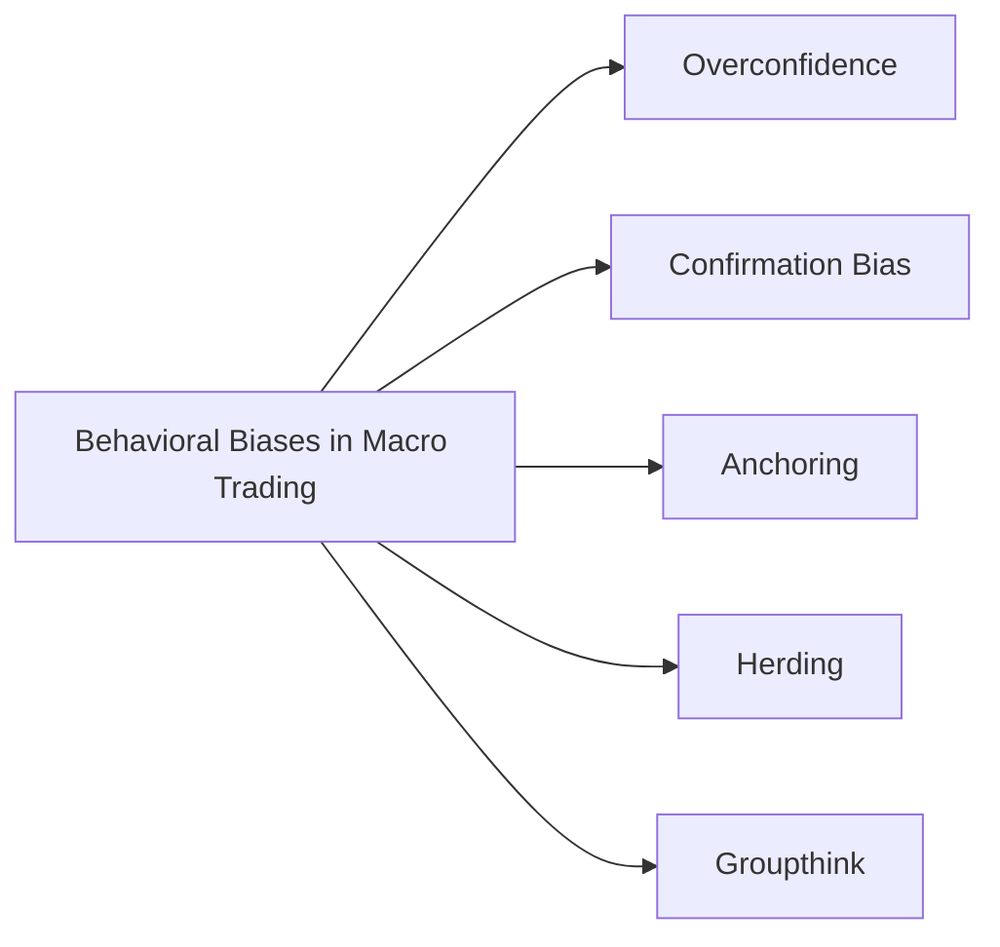

## Introduction
You know, I still remember chatting with a seasoned global macro manager who told me about a time he was “absolutely sure” that interest rates in a particular emerging market were destined to fall. Armed with a decade of success in currency predictions, he took a massive position—but the rates stubbornly held high, and his fund incurred weeks of painful losses. Every new headline that contradicted his thesis was waved away. In hindsight, the manager realized that overconfidence and confirmation bias worked hand in hand to derail his usually meticulous approach.

Macro trading involves analyzing broad economic factors—interest rates, currency regimes, global inflation trends—and then positioning portfolios based on an overarching thesis about how these elements will evolve. But large amounts of data and high uncertainty create fertile ground for behavioral distortions. Overconfidence might seduce a manager into believing they’ve “cracked the code” of the market, while anchoring can prevent them from adjusting quickly when signals change. Groupthink in large institutions can reinforce misguided conclusions, and herding can push everyone toward the same trades. This section explores how these biases creep into macro trading decisions—and what can be done to mitigate them.

## Common Behavioral Biases in Macro Trading
Behavioral finance introduces a catalog of biases that can affect all sorts of investment decisions—even more so in global macro strategies that require sifting through volumes of economic data, political events, and sentiment indicators. Below is a simple diagram highlighting common biases we’ll touch upon:

• Overconfidence: The belief that you’re more skilled or your forecasts are more accurate than they really are. In global macro, overconfidence can lead a manager to make oversized bets, ignoring data that might indicate caution.

• Confirmation Bias: Seeking only the information that aligns with your thesis (e.g., focusing on news articles that support your assumption that oil prices will surge) and dismissing any contradictory evidence.

• Anchoring: Clinging to initial macro projections—say, expecting a central bank to raise rates by 200 basis points—despite changing conditions. This is especially dangerous for discretionary traders who build entire portfolios around a single anchor point.

• Herding: Following market sentiment or copying what the majority of large funds are doing. You might jump on trades that “everyone” else is doing, often missing the turning point when the crowd unravels.

• Groupthink: More of an institutional phenomenon, where committees or teams discourage dissent to preserve consensus. In big banks or large mutual funds, groupthink can lead to detrimental blind spots.

## The Challenge of Anchoring in Discretionary Macro Trading
Anchoring often goes hand in hand with discretionary macro trading. Picture a macro manager who starts the quarter convinced the Federal Reserve will pivot to easier monetary policy. They frame every new piece of rising inflation data or hawkish commentary in a way that fits their anchor: “It’s just transitory.” Before they know it, they’re ignoring clear signals that the Fed is on a tightening path. 

• Example Scenario:  
  Suppose a fund expects the European Central Bank (ECB) to slash rates due to sluggish economic growth. The manager invests heavily in European equities on the premise that lower rates will stimulate the eurozone economy. However, new data indicates that inflation is running hotter than expected, and the ECB begins hinting at a policy pause. If the manager refuses to let go of the initial anchor—lower rates—they might stay trapped in a losing position.

• Mitigation:  
  - Use dynamic models to adjust interest rate forecasts as new data arrives.  
  - Pre-commit to reevaluating positions if market signals deviate from expectations by a certain threshold (e.g., if inflation reads 1% higher than original forecasts, it triggers a forced discussion).

## Groupthink and Institutional Pressures
In large organizations, groupthink can be a real hazard. When a well-known portfolio manager or a respected economist in the firm confidently asserts a stance—say they’re “absolutely certain” about a certain currency’s devaluation—junior analysts might feel pressure to agree. Over time, healthy internal debates can fade into mechanical head-nodding sessions. This dynamic might explain why entire research departments occasionally miss glaring warning signs.

• Example:  
  It’s not unheard of for big institutions to support a “house view” on an upcoming Federal Reserve policy pivot. If everyone’s bonus or job security is linked, in some indirect fashion, to aligning with that house view, dissenting voices fade. The entire team might end up ignoring contradictory signals until it’s far too late to pivot.

• Mitigation:  
  - Implement a red-team review: A designated group or individual whose job is to argue the opposite side of major theses.  
  - Encourage “devil’s advocate” sessions, and reward people for highlighting inconvenient facts or alternative interpretations.

## Protective Measures and Tools to Mitigate Biases
Behavioral distortions often lurk beneath the surface. Critical thinking and well-defined controls can help:

• Objective Risk Models:  
  Statistical models—Value at Risk (VaR), scenario analyses, or stress tests—can be harnessed to challenge subjective confidence. When the model’s risk metric surges, it prompts a review of positions and rethinking of assumptions.

• Data-Driven Checklists:  
  Before initiating a macro trade, managers might consult a multi-point checklist: key economic indicators, relative valuations, alternative scenarios, correlation breakdowns. Checklists reduce reliance on gut intuitions and anchor the process in structured analysis.

• Red-Team Review:  
  Some funds formally designate a “red team” to punch holes in trading theses. If your entire group is bullish on an emerging market currency, the red team must build the most compelling bearish argument. This process can reveal overlooked vulnerabilities—like political instability or less obvious external debt risks.

• Periodic Breaks for Reflection:  
  It sounds obvious, but stepping away from the screens and revisiting your trade rationale can bring clarity. Macro managers often get swept into the daily noise and forget the bigger picture they once had.

## Emotional Control Under Stress
Let’s say you’re a macro trader who’s confident in a short position on the Japanese yen, predicting further monetary loosening by the Bank of Japan. Then, out of nowhere, the BoJ does the opposite—tightening policy. The yen skyrockets, your portfolio is underwater, and your heart’s racing. This is where emotional discipline steps in.

• Drawdowns Are Inevitable:  
  Macro strategies can have prolonged periods of underperformance because macro variables don’t move in a straight line. Large drawdowns can increase the risk of panic, causing traders to double down impulsively or exit too soon in fear.

• Practical Tools:  
  - Pre-Define Stop-Losses: Setting an unemotional exit threshold in advance can prevent catastrophic losses driven by hope.  
  - Psych Coaching & Breaks: Many funds now offer performance coaches or structured “cool-down” sessions to help managers avoid impulsive reactions.  
  - Portfolio Diversification: Allocating across multiple uncorrelated macro themes so if one bet reverses abruptly, other positions might offset part of the loss.

## Role of Sentiment Analysis
Sentiment analysis—scraping news headlines, social media chatter, or major economic news sites for bullish or bearish words—has emerged as a major input for global macro strategies. Some managers interpret extreme bullish sentiment as a signal of overexuberance, supporting a contrarian move, while others see a rising tide of optimism as a potential momentum play.

• Contrarian Techniques:  
  If mention of a “strong dollar” saturates the financial press and social media, a contrarian macro trader might short the dollar, expecting a mean reversion once the hype fades.

• Trend-Following Techniques:  
  Traders might use sentiment data to confirm a macro trend. If sentiment is turning more bearish on emerging markets—and fundamentals also are weakening—this alignment can provide greater conviction for short positions.

• Caveats:  
  - Sentiment data can change quickly and be prone to noise.  
  - Too much reliance on social media could lead to false signals or “fake news.”  
  - Don’t forget the possibility of your own bias shaping how you interpret sentiment signals.

## Systematic Macro Approaches and Model Bias
One might assume that systematic macro strategies, heavily reliant on quantitative models and automated signals, are immune to the common behavioral pitfalls. The truth is, they’re not entirely free of bias. The quirks or biases of the individuals designing the models can seep into the system.

• Model Curation Bias:  
  If developers of a momentum-based global macro model strongly believe in the concept of “buy high, sell higher,” they may tune the model’s parameters to confirm that strategy. Confirmation bias can occur before the code even goes live.

• Data Bias:  
  Sometimes, the data used to train the model can be incomplete or unrepresentative of certain market conditions. If an extreme event like a sovereign crisis in an emerging market is absent from the historical data set, the model might fail to capture tail risks.

• Overfitting:  
  Overconfidence in your model’s ability to predict macro events might cause overfitting to historical data. The model can appear very robust in backtests but perform poorly in real-time. 

Despite being systematic, these strategies still require vigilant oversight. Regular review of performance drivers, stress testing, and independent validation can safeguard against hidden pitfalls.

## Conclusion
Behavioral biases are woven into every part of the macro trading journey—from the moment we form a thesis about interest rates or exchange rates to the final decision of whether to exit a position after a new wave of market data. Overconfidence, confirmation bias, anchoring, herding, and groupthink may tempt even the most seasoned professionals into unbalanced or suboptimal decisions.

However, it’s not all doom and gloom. If recognized early, biases can be mitigated through robust risk models, encouraging dissent, employing red-team reviews, and building systematic frameworks that force reevaluation when the facts shift. Emotional control, especially when markets lurch in unexpected directions, provides the psychological backbone to stay rational when pressure mounts.

For aspiring CFA® candidates—and truly, for all investment professionals—awareness of these behavioral pitfalls forms a critical line of defense. After all, global macro is as much about the human psyche as it is about economic models.

## Final Exam Tips
• Practice Identifying Biases: In a case-study question, be prepared to spot bias (e.g., overconfidence) and suggest remedies (like red-team reviews).  
• Use Structured Approaches: The CFA® exam often rewards systematic frameworks—like employing scenario analysis or checklists—when justifying decision-making processes.  
• Link Behavioral Biases to Portfolio Outcomes: Connect how each bias (e.g., anchoring) directly affects returns or risk in a macro strategy.  
• Discuss Mitigation Tactics Clearly: Outline specific, concrete steps—diversification, pre-commitment stop losses, or scheduled rebalancing—that reduce the impact of biases.  
• Time Management: Behavioral questions can be multi-layered. Allocate sufficient time to succinctly discuss identification, implications, and mitigation strategies.

## Key Terms
• Overconfidence Bias: Tendency to overestimate personal forecasting skill.  
• Confirmation Bias: Selecting only the evidence that supports a preconceived hypothesis.  
• Herding: Copying the majority or widely shared market view.  
• Groupthink: Emphasizing consensus over a realistic evaluation of differing opinions.  
• Sentiment Analysis: Tools analyzing text and language to gauge market mood.  
• Red-Team Review: A structured process assigning a person/team to challenge prevailing assumptions.  
• Contrarian Strategy: Investing against crowd sentiment, expecting a reversion to the mean.  
• Anchoring: Relying too heavily on an initial data point or assumption.

## References and Further Reading
1. Kahneman, D. (2011). “Thinking, Fast and Slow.”  
2. Tversky, A. & Kahneman, D. (1974). “Judgment under Uncertainty: Heuristics and Biases.” Science.  
3. CFA Institute research on behavioral finance principles applied to global macro.  
4. CFA Institute Code of Ethics and Standards of Professional Conduct.  

## Test Your Knowledge: Behavioral Aspects in Macro Trading Decisions



### A macro fund manager continues to hold onto a long position in a country’s bond market after the central bank surprisingly signals higher rates. This is most likely an example of which behavioral bias?

- [ ] Herding
- [x] Anchoring
- [ ] Overconfidence
- [ ] Groupthink

> **Explanation:** Anchoring occurs when the fund manager excessively relies on the initial thesis of declining rates and fails to properly adjust to new central bank signals.

### Which of the following best illustrates overconfidence in the context of macro trading?

- [ ] A trader who uses multiple risk models to confirm a new position
- [x] A trader who believes their GDP forecast is always more accurate than consensus
- [ ] A manager who reduces position size to avoid volatility risk
- [ ] An analyst who consults alternative data sources

> **Explanation:** Overconfidence involves unwarranted faith in personal forecasting skills, such as believing one’s forecasts are inherently superior to market consensus.

### When an institutional investment committee discourages skepticism about the “house view,” the committee is likely demonstrating:

- [x] Groupthink
- [ ] Sentiment analysis
- [ ] Confirmation bias
- [ ] Herding

> **Explanation:** Groupthink arises when preserving unity or consensus inhibits objective analysis, hindering dissenting or contrary opinions.

### Which measure specifically aims to combat confirmation bias within a fund’s investment process?

- [ ] Increasing leverage on profitable trades
- [x] Instituting a red-team review
- [ ] Assigning deadlines for research reports
- [ ] Encouraging managers to size positions aggressively

> **Explanation:** A red-team exercise mandates that someone actively challenge the prevailing thesis, which helps counter confirmation bias.

### A manager who invests against a highly bullish market mood, anticipating a pullback, is employing a:

- [ ] Systematic macro model
- [ ] Random walk approach
- [ ] Leverage-based strategy
- [x] Contrarian strategy

> **Explanation:** Contrarian strategies deliberately oppose prevailing market sentiments, seeking to capitalize on potential reversals or mean reversion.

### In large macro-driven portfolios, emotional discipline is especially critical during:

- [ ] Periods of sideways markets with low volatility
- [ ] Early-stage bull markets
- [ ] Periods of stable interest rates
- [x] Significant drawdowns or high market stress

> **Explanation:** Emotional control helps prevent panic trades and irrational decision-making when markets move sharply against positions.

### Which of the following best describes the risk of data bias in systematic macro strategies?

- [ ] Overreliance on fundamental analysis
- [ ] Excessive usage of mechanical stop losses
- [x] Training models on incomplete or unrepresentative data sets
- [ ] Blindly ignoring all sentiment measures

> **Explanation:** Systematic models may be trained on datasets that do not capture rare market conditions, leading to skewed outputs and misinformed decisions.

### A fund manager finds only bullish articles that confirm an optimistic economic outlook on a new emerging market and dismisses multiple negative indicators. This is an example of:

- [ ] Herding
- [ ] Groupthink
- [x] Confirmation bias
- [ ] Sentiment analysis

> **Explanation:** Confirmation bias involves selectively using or acknowledging information that reaffirms existing beliefs.

### Implementing a checklist that includes analyzing alternative scenarios prior to any big trade is primarily intended to reduce:

- [ ] Market volatility
- [x] Behavioral distortions
- [ ] Brokerage fees
- [ ] Correlation across positions

> **Explanation:** A structured checklist helps traders methodically consider diverse perspectives and reduce reliance on emotional or biased decision-making.

### A systematic macro model is typically free from behavioral biases because it only uses quantitative inputs.

- [ ] True
- [x] False

> **Explanation:** Even systematic models can be shaped by the biases of their designers and the datasets used, so they are not entirely immune to human error.


