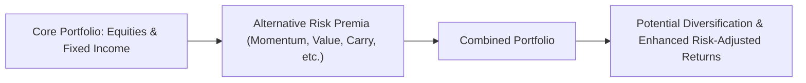

## Fundamentals of Alternative Risk Premia

If you’ve been around the investment world for a while, you’ve probably heard the term “factor investing” tossed around in casual conversations and coffee-shop catch-ups with colleagues. And maybe it struck you as a buzzword at first—like something only quants or large hedge funds would seriously delve into. But alternative risk premia (ARP) is not just a passing fad. In fact, these systematic factors are often treated as building blocks for modern portfolios, right alongside (or even in place of) traditional hedge fund strategies.

To start, alternative risk premia are basically systematic sources of return—like momentum, value, carry, and quality—that lie beyond your standard equity and fixed-income market beta. They’re “alternative” in the sense that they aim to extract returns from persistent, well-documented market anomalies or investor behaviors, rather than from broad exposure to stock or bond indices. Over the years, institutional investors have grown interested in these strategies for a few good reasons:

• They can provide diversifying returns that show low correlation to traditional asset classes.  
• They can potentially be implemented at a lower cost relative to high-fee hedge fund structures.  
• They are more transparent, rules-based, and replicable than nebulous “black box” approaches.  

Think of ARP as harnessing the same underlying economic forces that hedge funds might exploit, but without paying the massive two-and-twenty fees for skill (alpha). Before we get to how these building blocks fit into a broader portfolio, let’s flesh out a few important concepts.

## Alpha vs. ARP: The Difference in a Nutshell

One of the biggest misconceptions about alternative risk premia is that they’re the same as alpha. But they’re not. Alpha is typically performance that cannot be fully explained by common risk factors. It reflects the manager’s true skill or unique insight, such as trading on obscure credit anomalies or leveraging exceptional research on emerging technology stocks. By contrast, ARP can be systematically accessed and repeated by most investors who are willing to replicate the underlying factor exposures.

• Alpha:  
  – About manager skill or unique insights.  
  – Often capacity constrained (only so many trades or investable ideas).  
  – Priced as “premium management fees.”  

• Alternative Risk Premia:  
  – Transparent and rules-based.  
  – Often capacity “lighter” than alpha, though not without limits.  
  – Usually accessible at lower management fees.  

A conversation I had with a peer at a large pension fund pretty much summed this up. She said, “We love alpha, but we don’t want to pay alpha prices for factor returns.” And that’s precisely the shift we’ve seen in the industry: investors wanting to separate what’s truly alpha from what’s basically systematic factor exposure—so they can pay the right fee for the right strategy.

## Integration of ARP into a Broader Portfolio

Alternative risk premia can be woven into portfolios in a few different ways. Some folks replace a portion of their hedge fund allocation with ARP mandates, effectively unbundling the high-fee “mystery sauce” in search of cheaper, more transparent factor exposures. Others prefer to merge ARP systematically into a multi-asset portfolio to improve diversification.

There’s no single “correct” approach. However, to decide how best to integrate ARP, you’ll want to clarify:

• Correlation Profiles: How does each ARP factor co-move with your existing portfolio holdings?  
• Expected Drawdowns: In which market environments do certain factors underperform?  
• Liquidity Needs: Are you comfortable with daily/weekly liquidity or do you need more flexible redemption terms?  
• Operational Practicalities: ARP solutions can range from in-house factor replication to external providers offering managed accounts or pooled funds.

You might hear references to factor tilts—like overweighting value stocks globally or systematically shorting low-quality credit to capture a credit spread premium. These tilts help shape the overall return and risk profile of a portfolio. In Chapter 6 (Hedge Funds), we touched on how many hedge funds do something similar but couch it in more discretionary or skill-based language. With ARP, you’re explicitly targeting these same exposures in a disciplined, rules-based manner.

Below is a simple diagram illustrating how ARP might slot into an existing portfolio:



At a high level, ARP slices up the risk factors underlying your portfolio, giving you better clarity on where returns are truly coming from.

## Factor Blending: Balancing Momentum, Carry, and Others

Remember when you were a kid, and you discovered how mixing flavors of ice cream could create something unexpectedly delicious? Factor blending works on a similar principle—by combining different alternative risk premia, you can smooth out the lumps in your return stream and reduce overall volatility.

• Momentum: Invests in assets (equities, currencies, commodities) that have been trending upward, shorting those trending downward.  
• Carry: Seeks to capture the yield differential (interest rate, forward discount/premium, or dividend) between two assets.  
• Value: Buys undervalued assets relative to their fundamentals (like cheap stocks or currencies) and shorts “expensive” ones.  
• Quality (not always included in the “big three” but widely cited): Focuses on financially healthy companies, often with stronger balance sheets, stable earnings, and low leverage.

On their own, each factor has its own cyclical patterns. Value might shine in “mean-reversion” environments, while momentum thrives in trending or directional markets. By blending factors like momentum and carry, you can aim for a more stable, all-season approach. A balanced factor mix can reduce the chance of a catastrophic drawdown if a single factor (like value) hits a rough patch.

Practically, factor blending often involves weighting each factor according to a risk budget or volatility target. Let’s say you’re comfortable with a 10% volatility targeting approach for your ARP sleeve. You might allocate to momentum, carry, and value, each with an initial risk budget of about 3–4%. You regularly rebalance exposures as market conditions change, ensuring that no single factor starts overshadowing the others.

## Risk Management and Tail-Risk Mitigation

You won’t find a free lunch, even with a carefully crafted ARP approach. Indeed, each factor can stumble during certain market regimes. Momentum can blow up in swift reversals; value can experience painful drawdowns if the market remains irrationally expensive for an extended period. For these reasons, you need a plan to handle tail risks.

One approach is pairing ARP strategies with defensive overlays or protective options strategies. Alternatively, you can tactically reduce certain factor exposures when macro signals suggest a heightened risk of severe corrections. That said, initiative alone can be tough—macro timing is tricky, after all. As we discuss in Chapter 9.5 (Discretionary vs. Systematic Macro Approaches), it’s often best to maintain discipline around your factor exposures unless a truly clear macro risk emerges.

Another angle is to intentionally include a factor that exhibits negative correlation in equity drawdowns—though, in practice, finding a consistently negative correlation is easier said than done. Low-volatility (low-vol) factor investing, or certain carry trades in stable periods, might offer smaller drawdowns. But you still have to do your homework on correlation structures across different regimes.

## Practical Considerations: Operational and Governance

ARP strategies can be delivered through vehicles with daily, weekly, or quarterly liquidity, whereas many hedge funds might lock up your capital for a year or more. This liquidity difference can be a big plus. However, you’ll want to ensure that these ARP strategies aren’t merely “packaged” versions of illiquid trades, which could present serious mismatch risk (offering daily liquidity when the underlying positions are thinly traded or require time to unwind).

From a governance standpoint, you also need to hold providers accountable for staying true to the “systematic” approach. Sometimes, an ARP fund might drift toward discretionary calls in real time, which could depart from the factor exposures you signed up for. This phenomenon is often referred to as “style drift,” and it can erode the transparency that attracted you to ARP in the first place.

Moreover, a robust operational due diligence process—similar to that used for hedge funds—remains essential. Check for modern risk management systems, reliable data feeds, consistent factor definitions, and thorough compliance with relevant accounting standards (e.g., IFRS or US GAAP). Although ARP strategies tend to be more systematic, they still need strong infrastructure and controls.

## Real-World Example of ARP Implementation

Let’s say you’re a multi-asset manager responsible for a global pension fund. You hold large exposures to equities, sovereign bonds, and some credit. You’re also invested in a few traditional hedge funds. Recently, you realized half your hedge fund exposure exhibits strong correlation to equity markets—meaning you might be paying hedge-fund-level fees for mostly equity-like returns.

• Step 1: You analyze those hedge fund strategies, identifying that a big portion of their returns can be explained by well-known factors like value and momentum.  
• Step 2: You decide to redeem from a portion of your hedge fund positions and redeploy to an ARP mandate that systematically targets value and momentum across global equities, currencies, and commodities.  
• Step 3: You assess the correlation of these factors with your core portfolio holdings. The result: the new ARP sleeve exhibits moderate correlation to equities, but much lower correlation than the original hedge fund.  
• Step 4: You build a factor blend with 40% momentum and 40% value, then you layer in 20% carry to hopefully provide consistent yield-based returns.  
• Step 5: Over time, you monitor performance, rebalancing the factor weights if any single factor significantly deviates from your original risk budget.

The outcome? Your total portfolio may see improved risk-adjusted returns and higher liquidity for that portion of your alternatives allocation, potentially saving on fees and complexity.

## Python Code Example: Evaluating Factor-Based Returns

Below is a simplified Python snippet you might use to compare the historical Sharpe ratios for three factors—momentum, value, and carry. Obviously, in real life, you’d rely on robust factor signal construction rather than random draws, but this snippet provides a quick demonstration:

```python
import numpy as np

# (In real-world practice, these would come from your data feed of factor signals)
momentum_returns = np.random.normal(0.0005, 0.01, 252)
value_returns = np.random.normal(0.0004, 0.009, 252)
carry_returns = np.random.normal(0.0006, 0.011, 252)

def annualized_sharpe_ratio(returns, rf=0.0):
    daily_return_mean = np.mean(returns)
    daily_return_std = np.std(returns)
    sharpe_ratio = (daily_return_mean - rf) / daily_return_std * np.sqrt(252)
    return sharpe_ratio

mom_sharpe = annualized_sharpe_ratio(momentum_returns)
val_sharpe = annualized_sharpe_ratio(value_returns)
carr_sharpe = annualized_sharpe_ratio(carry_returns)

print("Momentum Sharpe:", round(mom_sharpe, 2))
print("Value Sharpe:", round(val_sharpe, 2))
print("Carry Sharpe:", round(carr_sharpe, 2))
```

You’d then take these values, along with correlation data, and figure out how best to weight your exposures in a factor-blended portfolio. You might even run a small portfolio optimization routine, subject to maximum and minimum constraints on each factor weight, to find your targeted risk profile.

## Common Pitfalls and Best Practices

• Overconcentration: Piling into one factor (say, momentum) can look great for a while, but mean-reversion can be harsh when the market turns.  
• Style Drift: If your ARP manager starts modifying the rules or timing trades based on discretionary macro views, you might not be getting an authentic factor approach.  
• Unrealistic Return Expectations: ARP might underperform in certain market regimes. Factor returns are not guaranteed.  
• Underappreciated Correlation: Watch out for changes in correlations during market stress. Momentum and value might both take a big hit when volatility spikes.  
• Insufficient Due Diligence: Even a systematic strategy can have operational or governance issues.  
• Fee Negotiations: Always ensure you’re paying fees that align with the systematic nature of the strategy, not inflated “2-and-20” rates.

## Key Takeaways for the CFA® Exam

• Alternative risk premia serve as systematic exposures that can complement—or potentially replace—traditional hedge fund allocations.  
• ARP differs from alpha by focusing on repeatable factors rather than manager-specific skill.  
• Proper factor blending helps mitigate single-factor drawdowns and can stabilize portfolio returns over varying market cycles.  
• Stay aware of how each ARP aligns (or doesn’t) with your existing exposures, especially during stressful market regimes.  
• Governance, operational integrity, and consistent factor definitions remain as crucial here as they are for hedge funds.

## Final Exam Tips

Focus on how the exam might test your ability to:  
• Distinguish alpha from ARP in scenario-based questions.  
• Recommend factor blends in different market environments.  
• Calculate—and interpret—risk-adjusted performance metrics (e.g., Sharpe ratio) for ARP strategies.  
• Evaluate potential correlation pitfalls when combining ARP with core assets.  
• Consider the role of liquidity, fees, and operational controls when choosing ARP funds or managed accounts.

When answering constructed-response (essay) questions, be sure to carefully articulate the logic behind your recommendation. For instance, if you advise introducing a momentum factor to a portfolio, clarify how that factor’s historical performance or correlation helps achieve the stated client objective. In item set questions, expect to interpret data on factor returns, weigh rebalancing decisions, and identify the best combination of momentum, carry, and value signals.

## References and Further Reading

• Ang, A. (2014). Asset Management: A Systematic Approach to Factor Investing.  
• Ilmanen, A. (2011). Expected Returns.  
• The Journal of Alternative Investments (various articles on factor-based investing).  
• CFA Institute publications on Factor Investing and Hedge Fund Strategies.  

## Test Your Knowledge of Alternative Risk Premia in Portfolio Construction



### Which of the following best describes alternative risk premia (ARP)?

- [ ] They are unpredictable returns that cannot be systematically accessed.  
- [x] They are systematic factors, beyond market beta, such as value and momentum.  
- [ ] They are always negatively correlated to equity markets.  
- [ ] They are fixed rates of return guaranteed by governments.  

> **Explanation:** Alternative risk premia are systematic (factor) exposures beyond traditional market beta—like value, momentum, and carry—and they are not guaranteed or always negatively correlated.

### What is a key difference between alpha and ARP?

- [ ] ARP depends on manager skill, while alpha is systematic.  
- [x] Alpha is based on manager skill, while ARP focuses on systematic factors.  
- [ ] ARP and alpha are identical in risk and return.  
- [ ] ARP is always more expensive than alpha.  

> **Explanation:** Alpha reflects manager skill that cannot be replicated easily, whereas ARP focuses on systematic, repeatable factors.

### Which factor is typically associated with profiting from the yield differential between two assets?

- [x] Carry  
- [ ] Value  
- [ ] Momentum  
- [ ] Quality  

> **Explanation:** The carry factor strategy attempts to exploit interest rate (or similar yield) differentials—buying higher-yielding assets and shorting lower-yielding assets.

### When combining momentum and value factors in a portfolio, what is one primary benefit?

- [ ] Guaranteed positive returns every year.  
- [x] Reduced overall volatility through factor diversification.  
- [ ] Elimination of all drawdowns.  
- [ ] Lower regulatory scrutiny.  

> **Explanation:** Pairing different factors like momentum and value can help smooth out performance because each factor tends to behave differently in various market conditions, potentially reducing total volatility.

### Which of the following represents a best practice for ARP implementation?

- [x] Conduct operational due diligence to confirm consistent and transparent factor definitions.  
- [ ] Rely solely on the manager’s oral description of how they construct factors.  
- [ ] Avoid monitoring style drift since it rarely occurs.  
- [ ] Employ daily liquidity for even illiquid underlying positions.  

> **Explanation:** ARP strategies require proper oversight to ensure the manager adheres to the stated factor methodologies without drifting, and appropriate liquidity terms must match the underlying positions.

### Which statement most accurately describes how to approach tail-risk mitigation with ARP?

- [ ] Tail-risk management is unnecessary with ARP since factors never experience extreme declines.  
- [x] ARP factors can suffer in specific market regimes, so pairing them with defensive overlays or diversifying factors is critical.  
- [ ] Always short all ARP factors during volatile markets.  
- [ ] The best tail-risk solution is to leverage all factor exposures as high as possible.  

> **Explanation:** While ARP strategies can diversify portfolio risks, each factor can still face drawdowns in certain conditions, making defensive overlays and thoughtful diversification important.

### In an exam context, if given data on factor returns, a typical question would require you to:

- [x] Calculate risk-adjusted performance and propose an optimal factor mix.  
- [ ] Ignore factor returns and focus only on the broad market beta.  
- [x] Compare the results to alpha-based returns when evaluating cost-benefit.  
- [ ] Take the manager’s performance at face value without analysis.  

> **Explanation:** CFA exam questions often ask you to use data to assess Sharpe ratios, correlations, or other metrics, then recommend portfolio construction choices or factor blends.

### All else being equal, which benefit might ARP provide over a traditional hedge fund allocation?

- [x] Lower fees and more transparency through systematic approaches.  
- [ ] Guaranteed outperformance of the equity market.  
- [ ] Elimination of all drawdown risks.  
- [ ] Complete replacement of manager skill in every market environment.  

> **Explanation:** ARP strategies generally charge lower fees and offer more transparency and repeatability, but they cannot guarantee outperformance or eliminate drawdowns.

### From a governance perspective, which issue is most relevant for ARP strategies?

- [ ] Determining the best location for more frequent board meetings.  
- [x] Ensuring style consistency and preventing style drift.  
- [ ] Completely ignoring any correlation analysis.  
- [ ] Using only monthly statements for factor analysis.  

> **Explanation:** One of the most common concerns with ARP is that a manager might deviate from the stated, systematic approach, leading to unanticipated exposures and style drift.

### True or False: Factor blending across multiple alternative risk premia can mitigate the cyclical underperformance of any single factor.

- [x] True  
- [ ] False  

> **Explanation:** By blending different factors (like momentum, value, and carry), investors can potentially offset the underperformance of one factor with the outperformance of another, thus smoothing overall returns.


