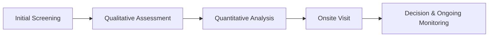

## Hallmarks of Successful Global Macro and Risk Premia Managers

Global macro and alternative risk premia strategies can sometimes feel like the wild west of investing—covering everything from currency trades in emerging markets to interest rate bets in developed economies. Let’s see what sets the best managers apart:

• Consistent Track Record: Managers who demonstrate repeatable success tend to rely on systematic models or well-honed discretionary processes. While no one expects every month to be a winner, you probably want managers who can articulate how their returns relate to the broader macro environment and who can replicate that approach with disciplined risk management.

• Disciplined Risk Management: Whether the manager employs Value at Risk (VaR) metrics, scenario analyses, or old-school stress tests, robust guardrails keep drawdowns in check. In global macro, a single leveraged bet gone wrong can wipe out a year’s gains. So a good risk framework—one that prevents catastrophic tail events—often correlates with longevity in the industry.

• Robust Infrastructure: Part of being “institutional quality” is having a strong back-office, compliance function, and technology infrastructure. As you probably know, the best investment ideas can be derailed by operational hiccups—like failing to settle trades properly or lacking internal controls that detect style drift. We’ll get to style drift later, but trust me, it can be a big deal.

• Thoughtful Liquidity Management: When managers trade in emerging markets, local liquidity can be limited. They might need to size positions carefully based on daily volume or use forward markets to hedge currency exposures. Successful managers pay attention to how quickly they can scale up or unwind positions, so they don’t get stuck in illiquid trades.

## Implementation Across Different Global Markets

Global macro managers often implement trades across various asset classes—currencies, rates, equities, and commodities—across multiple geographic regions. One day it might be shorting the euro, the next day it could be going long U.S. Treasuries. However, every local market has its own set of regulatory constraints, liquidity characteristics, and transaction costs. Here’s the gist:

• Regulatory Constraints: Some countries have capital controls that limit currency convertibility, or they impose short-selling restrictions. Managers must factor these rules into their top-down or bottom-up theses. For example, going short an equity in a market that disallows short sales might require a workaround (like using derivatives).

• Local Market Conditions: Let me share a quick personal anecdote. A friend of mine once worked at a global macro fund that tried to gain exposure to Brazilian interest rates. They discovered that while the opportunity was compelling, the local rates market had trading quirks and custodial complexities that led to unexpected fees. The moral? Implementation details matter as much as the overall macro call.

• Liquidity and Slippage: Even in major developed markets, ramping into large positions can cause price slippage. Managers typically break up trades or stagger execution to avoid moving the market unnecessarily.

## The Due Diligence Framework

If you’re going to pick a manager to handle your global macro or alternative risk premia exposures, you want a well-structured due diligence framework. “Due Diligence” is a thorough assessment of a manager’s strategy, historical performance, operations, and compliance environment.

Below is a simple visual that outlines one approach to manager due diligence:

• Initial Screening: Identify potential managers via performance databases, industry events, or referrals. This is a broad sweep, focusing on track record and strategy fit.

• Qualitative Assessment: Examine the manager’s investment philosophy, how they generate ideas, their culture, and the background of key personnel. Stability in the investment team is huge—the departure of a star portfolio manager can sometimes derail strategy execution.

• Quantitative Analysis: Dive deeper into monthly or weekly returns, drawdowns, correlations, and risk-adjusted metrics like the Sharpe ratio. This is also the stage to confirm that outperformance isn’t luck or simply a byproduct of a raging bull market.

• Onsite Visit: Often, you’ll visit the manager’s offices to see trading floors, meet researchers, and assess the operational setup. This is when you review compliance manuals, face time with back-office staff, and see if day-to-day processes match the polished marketing pitch.

• Decision & Ongoing Monitoring: If everything checks out, you invest—and then the real work starts: Ongoing monitoring includes monthly calls, quarterly or annual visits, and a continuous review of performance attribution and risk exposures.

## Manager Compensation and Incentive Structures

Global macro and risk premia managers often earn performance-based fees, typically a percentage of net profits. To ensure that managers do not chase short-term gains at excessive risk, many funds use a “High-Water Mark” mechanism: performance fees are only charged on new net profits above the highest historical net asset value (NAV).

In formula form, the performance fee an investor pays the manager might look like this:


\text{Performance Fee} = \max(0, \text{NAV}_{\text{end}} - \text{HWM}) \times \text{Incentive Rate}


Where:
• \\(\text{NAV}_{\text{end}}\\) is the net asset value at period end.  
• \\(\text{HWM}\\) is the highest NAV previously recorded at any period end.  
• \\(\text{Incentive Rate}\\) is the performance fee percentage (e.g., 20%).  

Managers use these structures to align investor and manager interests, but watch for nuance. If a manager has significant drawdowns and remains below the high-water mark for a long time, they may become highly incentivized to pursue riskier bets to earn back the lost ground. This might lead to style drift or even blow-ups.

## Style Drift and Ongoing Monitoring

“Style Drift” is when a manager strays from their stated strategy. It might be a macro manager starting to dabble in high-frequency trading, or a risk premia fund that goes from factor investing in equities to exotic currency derivatives.

Why does style drift happen? Sometimes it’s greed—chasing the hottest fad. Other times it’s a reaction to poor performance. Monitoring the manager’s exposures via position-level transparency (where possible) or factor analysis can help detect these shifts early. It’s crucial: if you signed on for a certain type of risk, finding out your manager has pivoted to something entirely different can sabotage your portfolio’s overall risk/return profile.

## Multi-Manager Platforms and Fund-of-Funds

• Multi-Manager Platform: A structure where several portfolio managers (“teams”) operate under one umbrella, each focusing on different strategies—perhaps one invests in foreign exchange carry trades, another focuses on short-term rates. They share a common operational platform, risk oversight, and compliance. This can be great for diversification, but also requires strong central oversight to prevent each team from taking correlated exposures.

• Fund-of-Funds (FoF): These vehicles invest in multiple underlying funds, providing diversification through a single investment. The FoF manager conducts due diligence, negotiates fees, and handles ongoing monitoring for the underlying funds. One big trade-off, though: you pay another layer of fees. However, for newcomers to the global macro or risk premia space (or for those lacking the resources to vet each manager individually), FoFs can be a pragmatic solution.

## Culture, Ethics, and Governance

Culture might sound like a fluffy concept, but it’s often the glue that holds top managers together. If leadership prioritizes compliance and fosters an environment of open debate and ethical conduct, chances are good that the portfolio teams follow robust research processes and risk controls.

• Alignment of Interests: Look for managers who co-invest a substantial portion of their personal capital in the fund. Nothing aligns interests better than “skin in the game.”

• Values and Regulatory Considerations: Some investors are subject to specific regulatory requirements (e.g., pension funds or endowments with ESG mandates). Check that the manager’s approach to governance aligns with your compliance obligations.

• Operational Robustness: This term refers to the strength of operational processes, from trade reconciliation to regulatory filings. An operational meltdown can lead to lawsuits or major losses, so treat this as seriously as the manager’s track record.

## Performance Attribution

Performance attribution in these strategies can be tricky. Is the outperformance truly alpha, or is it just factor exposure to common macro or risk premia factors? For example:

• Beta or Factor Exposure: Perhaps your macro manager consistently owns high-yield emerging market debt. If that’s the driver of returns, is it alpha or just a carry trade?  
• Alpha: This is the portion of returns not explained by exposure to systematic factors, tied to the manager’s skill in timing, trade structuring, or original research.  

Managers may provide you with attribution reports. It’s wise to complement those with your own factor analysis. That way, you can verify if the manager is delivering what they promised.

## Best Practices and Pitfalls

• Best Practices:  
  – Verify that the manager has robust processes and strong risk management.  
  – Evaluate the team’s stability; manager turnover often leads to performance inconsistency.  
  – Ensure fees are transparent and that the timeframe for measuring performance aligns with your investment horizon.  

• Common Pitfalls:  
  – Overreliance on past performance might lead to chasing top performers who got lucky.  
  – Inadequate operational due diligence is a recipe for heartbreak if the manager faces compliance woes.  
  – Ignoring style drift can result in unintended exposures.  

## Real-World Example and Case Study

Consider an institutional investor evaluating two global macro managers:

• Manager A: A disciplined macro team with a five-year performance track record, a consistent risk budget, and robust compliance. They have a moderate management fee (say 1.5%) and a 20% performance fee with a high-water mark.

• Manager B: A newer team that posted spectacular returns over two years, focusing heavily on emerging market rates. Their fee is lower, but they lack a robust risk management framework.

On deeper due diligence, the investor learns Manager B’s entire return is basically tied to a single EM rate carry trade. If the local currency sees a downturn, the position might unravel quickly. Meanwhile, Manager A’s method offers more diversification across multiple geographies and trades. In this scenario, Manager A’s consistent approach might carry more weight despite Manager B’s short-term star performance.

## Final Exam Tips for CFA Candidates

• Understand Fee Structures: The exam might present scenarios with management fees, performance fees, or high-water marks. Be ready to calculate net returns to investors and consider the behavioral incentives created by these fees.

• Master Risk Attribution: Know how to break down a manager’s returns into systematic (factor) exposures vs. alpha. You might be asked to identify or confirm style drift from performance data.

• Evaluate Qualitative Factors: Expect essay questions asking you to assess a manager’s philosophy, team stability, or culture. Use the standard due diligence logic: strategy, performance, personnel, operations, compliance.

• Provide Clear, Concise Explanations: On constructed-response questions, demonstrating the reasons behind a manager’s success/failure is just as important as numeric calculations.

• Watch Out for Liquidity Constraints: Global macro strategies often trade in less-liquid markets, so be ready to interpret how managers handle liquidity risk. This might appear in item-set or scenario-based questions.

## References

• Brown, S. & Goetzmann, W. (2003). “Hedge Funds with Style.”  
• Lhabitant, F. (2006). “Hedge Funds: Quantitative Insights.”  
• Society of Actuaries. Research papers on alternative manager selection.  

## Test Your Knowledge: Strategy Implementation and Manager Selection Quiz



### Which of the following best describes the purpose of a high-water mark in a manager’s performance fee structure?

- [ ] It helps allocate trades among multiple sub-managers.  
- [x] It ensures managers only earn incentive fees on net new gains.  
- [ ] It imposes liquidity constraints on large positions.  
- [ ] It sets drawdown limits for the manager’s capital.  

> **Explanation:** A high-water mark helps ensure that managers only receive performance fees if the fund’s NAV surpasses its previous peak, preventing them from double-dipping on the same performance.

### What is a potential downside of a manager remaining below the high-water mark for a prolonged period?

- [ ] They may become subject to additional lock-up provisions.  
- [x] They might take on excessive risk to regain previous NAV levels.  
- [ ] They have to forfeit management fees until the NAV recovers.  
- [ ] Their new investors pay a higher management fee.  

> **Explanation:** In an effort to climb above the high-water mark, managers may engage in riskier strategies–a phenomenon sometimes called “gaming for resurrection.”

### When applying due diligence to a global macro manager, which step typically involves a site visit?

- [ ] Initial screening of performance data.  
- [ ] Fee negotiation and incentive structure analysis.  
- [x] Qualitative and operations assessment with an onsite visit.  
- [ ] Selecting underlying managers for a multi-manager platform.  

> **Explanation:** Onsite visits typically follow the initial screening and deeper quantitative analysis, allowing investors to evaluate the actual operations, culture, and compliance processes firsthand.

### Which statement regarding fund-of-funds is most accurate?

- [x] They provide diversified exposures by investing in multiple underlying funds.  
- [ ] They invest exclusively in short-duration debt instruments.  
- [ ] They are designed to replicate a single macro manager’s style.  
- [ ] They eliminate the need for a high-water mark.  

> **Explanation:** Fund-of-funds invest in multiple managers to create diversified exposure for investors. However, an added layer of fees often accompanies this convenience.

### Which of the following is a key indicator of “style drift” in a global macro strategy?

- [ ] A manager decreases position exposures to maintain VaR within a set threshold.  
- [ ] The strategy’s returns deviate from the Sharpe ratio but remain positive.  
- [ ] The manager invests in a new technology platform to automate trades.  
- [x] The manager significantly changes asset classes or trades outside the original mandate.  

> **Explanation:** Style drift occurs when a manager departs from their stated strategy, such as pivoting from macro-driven currency positions into long-term equities or illiquid assets.

### What is a primary benefit of a multi-manager platform?

- [x] Diversification across different portfolio managers under one umbrella.  
- [ ] Ability to bypass regulatory constraints in emerging markets.  
- [ ] Exclusive exposure to venture capital funds.  
- [ ] Eliminates the need for a performance fee.  

> **Explanation:** A multi-manager platform offers a centralized structure where various managers can implement distinct strategies. This helps achieve diversification because each team might focus on different markets or asset classes.

### If an investor’s primary goal is to ensure robust operational processes, which aspect would they focus on most during due diligence?

- [ ] The manager’s historical return mean and standard deviation.  
- [ ] The skillset of the portfolio managers in short-term trading.  
- [ ] The global macro strategy’s correlation with market indices.  
- [x] Operational robustness, including compliance, technology, and back-office procedures.  

> **Explanation:** Operational due diligence is crucial to confirm that the manager has solid back-office systems, risk controls, and a well-trained compliance staff to prevent operational failures.

### An institutional investor sees that a global macro manager has posted strong positive performance primarily from emerging markets carry trades. Which question best addresses whether the returns are true alpha?

- [ ] Which prime broker does the manager use for settlements?  
- [ ] How many years of experience does the manager have in frontier markets?  
- [x] To what extent could these returns be replicated by a standard carry trade index?  
- [ ] What is the manager’s corporate legal structure?  

> **Explanation:** Asking whether an index or factor exposure could replicate the performance helps distinguish alpha from systematic risk premia.

### What is the main reason performance attribution is important?

- [x] It breaks down the sources of return, separating alpha from factor exposures.  
- [ ] It outlines all marketing channels used by the manager.  
- [ ] It standardizes management fees across multiple strategies.  
- [ ] It assigns new high-water marks each month.  

> **Explanation:** Performance attribution separates the strategy’s skill-based returns (alpha) from returns derived from systematic market exposures, which are often factor-based.

### True or False: Managers who invest personal capital in their own funds are typically seen as having better alignment of interests with investors.

- [x] True  
- [ ] False  

> **Explanation:** When managers have their own money at stake, they are often more motivated to manage risks appropriately and align strategies with investor objectives.


