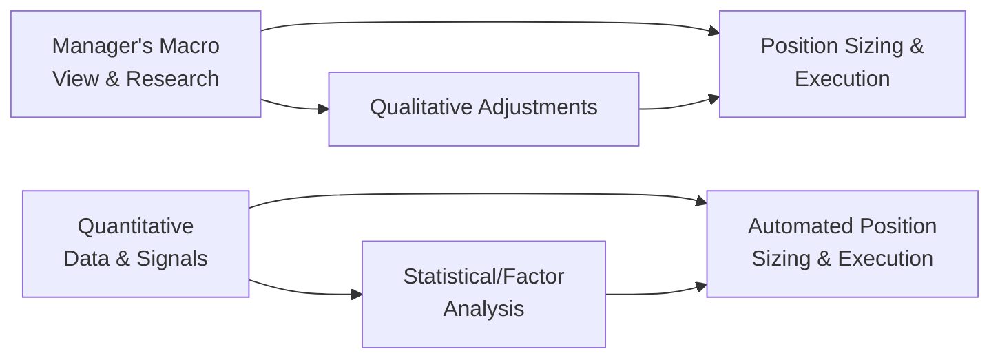

## Introduction

Global macro investing—an approach that seeks to capitalize on broad market movements driven by macroeconomic events—has become a cornerstone of many alternative investment portfolios. Within global macro, there are two primary styles: (1) discretionary macro, where seasoned investors rely heavily on their judgments and insights, and (2) systematic macro, where quantitative models and algorithms guide portfolio positioning. Perhaps you’ve encountered a fund manager who invests based on gut instinct about central bank policy shifts or, conversely, a “robotic” model that runs thousands of simulations every day—these are great illustrations of the two ends of the macro strategy spectrum.

In this section, we’ll take a deep dive into these styles. We’ll look at how discretionary macro managers integrate news flow and deep economic analysis, whereas systematic macro managers feed historical data into specialized models to generate signals. We’ll also check out the potential pitfalls, from emotional biases for discretionary managers to model overfitting for systematic funds. By the end, you should have a solid grasp on how these strategies fit into a broader investment program, what risk attributes they bring to the table, and when they might shine—or fall short.

## Defining Discretionary Macro

Discretionary macro managers typically build their strategies around a combination of:

• Qualitative research  
• Personal experience  
• Fundamental analysis  
• Macroeconomic forecasting  
• Insights into geopolitical risks and central bank policy  

These managers look at global capital flows, growth outlooks, and real-time market sentiment, making flexible decisions that may not strictly follow a prescribed model. If the manager believes a sudden ECB policy change is on the horizon, they may swiftly adjust currency exposures—even if the data do not fully confirm their view. It’s a bit like a chef tasting a sauce and intuitively adding a pinch of salt or spice based on experience.

Remember, in discretionary macro, human judgment is paramount. This means managers can swiftly pivot in response to news headlines or one-off dislocations—temporary distortions in pricing that might be triggered by a political crisis or unexpected trade war. Discretionary macro managers can also apply thematic convictions: if they believe rising inflation in emerging markets is structural, they might hold a position for months or even years. That’s where flexibility becomes a competitive advantage.

### Strengths of Discretionary Macro

• Adaptability: The approach can respond to market regime changes on the fly.  
• Big-Picture Thematics: Strong for expressing broader global themes (e.g., commodity supercycles, demographic shifts).  
• Seizing Unusual Opportunities: Human foresight may capitalize on unique, short-lived mispricings or policy shifts.  

### Potential Weaknesses of Discretionary Macro

• Emotional Bias: Managers may hold onto a losing position too long if they’re personally attached to a thesis.  
• Inconsistent Execution: Highly susceptible to human error and overconfidence.  
• Scalability: Relying on a small group of experts can limit how quickly assets under management grow without diluting the strategy’s effectiveness.

## Defining Systematic Macro

Systematic macro managers lean on quantitative models and algorithms, usually harnessing large data sets. Let’s be honest, though: it’s not all robots and whirring computers. Humans still design these models, set parameters, and decide when to overhaul them. But once the system is in place, day-to-day portfolio decisions typically follow strict rules, leaving less room for personal whims.

Formulas in a systematic macro approach often consider aspects like price momentum, carry, valuation measures, macroeconomic indicators, and even textual data analytics sourced from news feeds. The manager might say, “Well, the model signaled a 2% short in the euro; let’s do it,” without injecting too much personal opinion.

### Strengths of Systematic Macro

• Objectivity: Minimizes cognitive or emotional biases.  
• Consistency and Speed: Automated processes can react rapidly to changing data feeds.  
• Backtesting and Persistence: The model can be rigorously tested on historical data before live trading.  

### Potential Weaknesses of Systematic Macro

• Model Overfitting: Reliance on historical data can lead to strategies that “fit” the past but fail in the future.  
• Black Swan Events: Systematic models may not quickly adapt to unforeseen shocks or regime changes that weren’t present in the historical sample.  
• Limited Discretion: In extreme events, pure systematic managers may remain fully invested in a losing trade until the next model rebalancing date.

## Conceptual Diagram of Discretionary vs. Systematic Flows

Below is a basic Mermaid diagram. Imagine the left side for discretionary flow (where a manager’s subjective view matters) and the right side for systematic flow (where data and models drive the process).

In the discretionary side (A → C → B), there’s a feedback loop that can incorporate sudden shifts in sentiment. Meanwhile, in the systematic pipeline (E → D → F), data flows through an algorithm, culminating in trading with minimal human override.

## Tools and Techniques

While discretionary macro managers might spend hours dissecting IMF economic reports, central bankers’ speeches, or news from data providers, systematic managers rely more on:

• Statistical models (e.g., factor analysis, regression-based forecasts)  
• Machine learning tools  
• Signal extraction (momentum, trend, carry, relative value)  
• Portfolio optimization frameworks  

Of course, both can also adopt derivative overlays—using futures, options, or currency forwards—to hedge or capture macro-economic trends.

### Hybrid Strategies

Some funds blend both approaches. You might see a manager run a systematic model to rank countries by growth prospects and inflation outlook, but then use discretionary judgment to refine currency bets. It’s like having GPS navigation plus the ability to take an alternate scenic route if real-time traffic looks ugly. Hybrid methods can mitigate the pitfalls of pure systematic or pure discretionary approaches but may also introduce complexity in decision-making—especially around allocating risk between the systematic and discretionary components.

## Risk Management Considerations

### Volatility and Drawdowns

• Discretionary managers might actively reduce positions if they sense the macro environment is deteriorating, thereby minimizing drawdowns—or they might hold on too long if they become convinced of an eventual turnaround.  
• Systematic managers rely on model-driven signals that may or may not respond swiftly to rising volatility. If the model deems the “trend” still intact, the fund may keep a large position despite mounting risk.

### Correlation with Market Cycles

Discretionary macro funds might exhibit lower correlation to standard market indices when the manager is skillful at identifying out-of-consensus themes. However, some discretionary macro managers can become “closet indexers” if their convictions align with mainstream consensus.

Systematic approaches often have correlations that shift with volatility regimes. For instance, a trend-following sub-strategy might earn positive returns in strongly trending environments and face challenges in whipsaw periods.

### Potential Tail Risks

• Discretionary Tail Handling: A manager can detect an anomalous event (like a major credit freeze) and shift the portfolio dramatically. But they can also be caught wrong-footed if they interpret the event incorrectly or rely too heavily on political commentary.  
• Systematic Tail Handling: Typically relies on pre-coded risk triggers or volatility filters. However, no model is perfect, and a poor set of parameters might fail during a once-in-a-century meltdown.

## Real-World Anecdote

I remember chatting with a friend who managed a discretionary macro fund during a politically driven trade war. They saw the trade war as a threat to global growth and drastically reduced equities exposure. It turned out the market soared in the months following the initial announcement. The fund underperformed for a while, but then once growth did slow, they ended up looking quite prescient. Meanwhile, a systematic manager I knew stayed 100% invested based on price momentum signals. They caught the short-term rally but were late to reduce risk when fundamentals turned. Which approach was “better”? Well, it depends on your time horizon and risk tolerance.

## Implementation Examples

• **Currency Trades**: A discretionary manager might short a currency because of an upcoming election with a policy tilt. A systematic manager might short a currency if the model detects downward momentum relative to major peers.  
• **Rates Positions**: Discretionary managers interpret central bank rhetoric to predict rate moves. Systematic managers plug in yield, inflation, and growth data into factor models to determine net exposures.  
• **Commodity Exposures**: Discretionary investors consider weather forecasts, policy changes, or consumption trends. Systematic approaches rely on price and fundamental signals within standardized frameworks.

## Best Practices for Managers

• **Maintain Clarity of Process**: Whether you’re discretionary or systematic, ensure you have a clear investment philosophy and repeatable process that guides decision-making.  
• **Ongoing Research and Model Updating**: Systematic managers need to avoid stasis—they must regularly test and refine models. Discretionary managers should guard against “getting stale” in their macro worldview.  
• **Emotional Discipline**: Discretionary managers must identify potential biases in their decision-making. Tools like scenario planning or “pre-mortems” (thinking ahead about what could go wrong) can be invaluable.  
• **Transparent Risk Budgeting**: Regardless of approach, make sure you can articulate where risk is coming from (e.g., currency risk, rates risk, commodity risk, etc.) and how you plan to mitigate undesired exposures.  
• **Combine or Overlay Strategies**: Explore whether a small systematic overlay can enhance or hedge a large discretionary position, or vice versa.

## Exam Tips for CFA Candidates

• **Know the Distinctions**: Be prepared to explain the key differences in manager behavior, risk profiles, and the role of human input vs. data modeling.  
• **Discuss Pros and Cons**: Questions often ask how each style deals with regime shifts, tail risk, and emotional bias.  
• **Focus on Real-World Application**: The exam might present a scenario involving a major geopolitical event. A strong answer explains how discretionary managers vs. systematic managers would adapt.  
• **Understand Hybrid Approaches**: You might see a question about how managers incorporate both discretionary insight and systematic signals.  
• **Tie Back to Portfolio Construction**: Show how these differences influence allocation decisions, risk management, and performance measurement in a global macro context.

## References

- Schwager, J. (2012). Hedge Fund Market Wizards.  
- Bernstein, P. L. (2007). Capital Ideas Evolving.  
- Drobny, S. (2006). Inside the House of Money: Top Hedge Fund Traders on Profiting in the Global Markets.  
- CFA Institute. (Latest Edition). “Reading on Hedge Strategies and Global Macro,” CFA Program Curriculum.

---

## Practice Questions: Evaluating Discretionary vs. Systematic Macro



### A manager relies heavily on macroeconomic insights and adjusts positions based on central bank statements. What type of strategy is she most likely employing?

- [x] Discretionary macro
- [ ] Systematic macro
- [ ] Hybrid approach
- [ ] Momentum-only approach

> **Explanation:** By focusing on qualitative judgments and central bank insights, she is using a discretionary macro strategy.

### Which of the following is a key advantage of a systematic macro approach?

- [ ] It only invests in stable, highly liquid instruments.
- [ ] It can predict central bank policy with perfect accuracy.
- [x] It helps reduce emotional biases through rules-based trading.
- [ ] It is entirely immune to losses during market turbulence.

> **Explanation:** Systematic macro investing relies on quantitative models, which helps reduce emotional biases that can plague discretionary decisions.

### A discretionary macro manager believes a rare political crisis in a key oil-exporting nation will drive up prices. What is the manager’s primary potential advantage in this scenario?

- [ ] Automatic position sizing from algorithmic signals
- [x] Ability to exploit one-off market distortions
- [ ] Guaranteed outperformance during crises
- [ ] Immunity from tail risk events

> **Explanation:** Discretionary managers can quickly respond to unique, one-off circumstances, potentially capturing alpha if the broader market hasn’t yet priced in the crisis.

### In systematic macro strategies, which of the following poses the greatest risk?

- [ ] Higher fees due to active management
- [x] Overfitting models to historical data
- [ ] Emotional biases leading to poor stock picking
- [ ] Lack of reliance on any form of data analysis

> **Explanation:** Systematic managers rely on historically based quantitative models, which often introduces the risk of overfitting. This can cause the strategy to perform poorly in new market regimes.

### How do many hybrid macro funds operate?

- [ ] By ignoring data analytics and trusting gut feeling alone
- [ ] By completely segregating discretionary and systematic trades with no coordination
- [x] By using systematic signals for initial inputs and refining them through manager judgment
- [ ] By only focusing on high-frequency trading signals

> **Explanation:** Hybrid strategies blend systematic data-driven insights with discretionary oversight, balancing model outputs with thematic and fundamental viewpoints.

### A discretionary macro manager decreases emerging market equity exposure after reading new central bank guidance. Which of the following is a potential weakness in this approach?

- [x] The manager could be influenced by emotional biases and shift too early.
- [ ] They cannot exit positions without algorithmic triggers.
- [ ] They rely on purely mechanical rules.
- [ ] Their decisions are solely based on historical data patterns.

> **Explanation:** Discretionary managers, while flexible, risk letting fear or emotional biases push them to exit positions too quickly.

### Systematic managers can use trend-following signals. During a sudden market whipsaw, which is the most likely outcome under a pure systematic style?

- [ ] Immediate discretionary override
- [x] The model might remain in a position until the next signal, potentially experiencing losses
- [ ] Reduction of the position solely based on the manager’s intuition
- [ ] No losses due to algorithmic precision

> **Explanation:** Pure systematic approaches adhere to predetermined signals and may not exit until specified criteria are met, which can lead to losses if the market quickly reverses.

### When comparing drawdowns in discretionary vs. systematic macro strategies, which statement is generally correct?

- [x] Discretionary managers may mitigate drawdowns if they correctly anticipate market shifts.
- [ ] Systematic strategies have no drawdowns because they are algorithm-driven.
- [ ] Both strategies are equally immune to market downturns.
- [ ] Discretionary strategies always have deeper drawdowns.

> **Explanation:** Discretionary managers can make rapid changes based on insight, helping potentially mitigate drawdowns—though of course this depends on the quality of their decisions.

### Which term refers to a unique or exceptional market scenario creating temporary pricing dislocations?

- [ ] Market momentum
- [ ] Asset correlation
- [ ] Central bank intervention
- [x] One-off dislocation

> **Explanation:** In the global macro context, a one-off dislocation is an abnormal market event that can create a temporary mispricing.

### True or False: Systematic macro approaches typically rely on daily interpretation of macro news headlines, adjusting the entire portfolio based on commentary from central bankers.

- [ ] True
- [x] False

> **Explanation:** Systematic macro is generally driven by quantitative signals and would not typically adjust the entire portfolio solely based on subjective interpretations of news or commentary. It’s more rules-based, though the models might incorporate data from news feeds if structured systematically.


