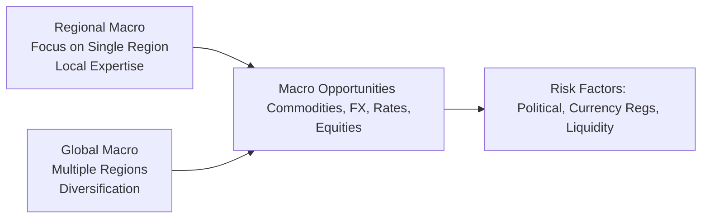

## Introduction

So, let’s talk about the contrast between regional macro strategies—where a fund concentrates on one particular zone like Asia or Latin America—and global macro strategies that scan the entire planet for economic opportunities. You might think, “Why would anyone skip the rest of the world and just focus on one region?” or “How do global managers keep track of all those moving parts?” Both approaches have their own sweet spots. In this article, we’ll dig into the differences, examine why you might pick one approach over the other, and discuss the risk factors that come with each.

It’s sort of like choosing whether to focus your time on mastering one video game at the highest level or playing a variety of games casually. If you know the local “environment” in depth, you’ll spot tiny nuances others might miss. But stepping out to a global playing field might broaden your horizon for creative strategies and diversification. Let’s jump right in.

## Regional Macro Funds: Getting Up Close and Personal

Regional macro funds center on a geographic area—think East Asia, the Middle East, or maybe just the Gulf Cooperation Council (GCC) countries. The logic is that you develop specialized local expertise so you can trade across the region’s sovereign bonds, stock indexes, currencies, and sometimes even local commodity markets. 

One of my friends used to say, “I’d rather be the best local contractor than the universal handyman.” In specialized regions, especially emerging or frontier markets, local knowledge can unveil inefficiencies. For instance, one country might have a currency peg that is sure to break if certain macro indicators cross a threshold. Because of deeper on-the-ground insights, a regional macro manager might see this tilt earlier than a global manager who’s scanning the entire world.

### Local Expertise

Local expertise refers to intimate knowledge of cultural, political, and economic dynamics. In frontier markets, relationships with local business owners, bankers, or even government officials can provide a clearer picture of the real economy. Are farmers struggling with water shortages? Is there political noise that could trigger foreign capital outflows? These nuances don’t always show up in the standard data or might be underexploited due to language or cultural barriers.

### Political Risk and Regulatory Hurdles

Now, being region-specific also means compliance challenges. Certain governments heavily regulate capital flows, require currency conversions to go through authorized dealers, or suddenly alter tax policies. For instance, a local government might impose capital controls to stop money from rushing out during an election cycle. If you’re a specialized manager, you’re more likely to have studied these quirks and maybe keep a “Plan B” to mitigate them—like employing local currency hedges or setting up alternative structures for capital movements.

### Liquidity Constraints

Emerging and frontier markets don’t always have the same depth as major developed markets. Suppose a big wave of capital tries to exit a small local bond market—well, you might see violent price swings. This illiquidity can be a double-edged sword. It’s riskier (who wants to be stuck in a bond that’s plunging?), but it might also offer higher alpha when macro conditions are favorable. Sometimes I think of it like investing in an up-and-coming neighborhood—prices can jump quickly if you get in early and the place starts booming.

### Case Example: Asia-Focused Macro

Picture a regional macro fund focusing on Asia. This fund might hone in on China’s monetary policy, Japan’s interest rate environment, and, say, currency fluctuations in Southeast Asia. When the People’s Bank of China (PBOC) changes reserve requirements, the manager knows how that might filter through local banks, property developers, and commodity imports. They might also build relative-value trades comparing interest rate differentials among, say, Indonesia, Malaysia, and the Philippines. That’s quite specialized knowledge. Sure, a global macro fund sees these changes too, but the level of detail and nuance might not match a region-specific pro who’s been analyzing these trends for years.

## Global Macro Funds: Casting a Wider Net

On the flip side, global macro funds look at the entire planet. They might be sorting through everything from U.S. Federal Reserve policy and Eurozone inflation numbers to commodity prices in Latin America and currency pegs in the Middle East. It’s like scanning a huge buffet table for the best dish. That approach often yields a broader set of opportunities and can offer more diversification—if one region’s in a slump, maybe another is on the upswing. 

But let’s not pretend it’s all sunshine. Keeping track of so many moving parts can be complicated. You need top-notch research teams, sophisticated analytics, and the ability to pivot fast when your living, breathing, 24-hour global markets turn on a dime. 

### Diversification Benefits

One of the big upsides of global macro is the potential for diversification. If an equity meltdown is happening in one part of the world, a manager might offset some of that risk with a long position in a different region’s government bonds or a currency trade in a country that’s benefiting from the meltdown. For example, during certain risk-off periods, the U.S. dollar or the Japanese yen might appreciate, providing a hedge against falling equity markets in emerging Asia or Latin America.

### Tracking Multiple Markets

Of course, staying on top of global economic releases, geopolitical tensions, and cross-asset correlations is no small feat. Do you recall the Swiss National Bank’s decision in 2015 to remove the Swiss franc’s peg to the euro? Global macro funds that were watching global currency markets might have been more prepared—whereas a manager focusing on, say, Latin American bonds might’ve had only a distant eye on that event. 

### Policy Divergence

We also see how policy divergence across developed markets can shape global macro portfolios. Maybe the Federal Reserve is tightening while the European Central Bank is staying neutral, or the Bank of Japan is keeping rates near zero. Global macro managers can try to exploit these divergences via currency pairs, relative interest rate trades, or cross-asset strategies that capitalize on changing yield spreads. A big chunk of global macro’s success can come from effectively reading those tea leaves on central bank moves.

### Case Example: Currency Carry Across Continents

Imagine a global macro fund noticing that interest rates in Brazil remain relatively high compared to Japan. The manager might implement a carry trade: borrow in Japanese yen (low interest rate) and invest in Brazilian government bonds (higher yield). This approach, however, must carefully account for currency volatility, liquidity conditions, and sudden capital controls that could pop up in the emerging market. The upside is a global manager might be able to exit a position in Brazil if political risk flares, and quickly rotate funds to, say, Eastern Europe or a different EM currency, thus cross-pollinating opportunities across continents.

## Comparing Regional vs. Global Approaches

Below is a brief comparative overview to highlight how these two macro styles stack up across various dimensions:

| Focus              | Region-Specific                                  | Global Scope                                    |
|--------------------|-------------------------------------------------|-------------------------------------------------|
| Geographic Breadth | Single region (e.g., Asia, LatAm, MENA)         | Multiple regions worldwide                      |
| Depth of Analysis  | Very granular, local insights                   | Broad, multi-region analytics                   |
| Primary Strength   | Identifying niche inefficiencies, local trades  | Diversification, policy divergence trades       |
| Liquidity Profile  | Often lower liquidity, especially in EM/Frontier| Usually stronger liquidity via global markets   |
| Key Risks          | Political/regulatory instability in one region  | Complexity of monitoring many economies         |
| Typical Investors  | Those seeking specialized EM exposure           | Those seeking broader diversification           |

## Key Drivers Influencing Macro Strategies

Managers, whether regional or global, keep a close eye on a few triggers that can move markets instantly:

• Interest Rates: Central banks’ policy rates, yield curve shapes, and market expectations matter profoundly.  
• Currency Regimes: Fixed pegged or floating exchange rates define the potential for extraordinary currency moves.  
• Geopolitical Instability: Wars, trade sanctions, or sudden election upsets can destabilize regions or ripple globally.  
• Trade Policies: Tariffs, quotas, and free-trade agreements shift flows of goods and capital.  
• Domestic Economic Indicators: Employment data, inflation, GDP growth, and consumer sentiment can spark revaluation in bonds, equities, or currencies.  
• Capital Flow Regulations: Some markets have free capital movement, while others impose capital controls, dampening or amplifying volatility.

## Interplay Among Developed, Emerging, and Frontier Markets

You might recall from earlier chapters that emerging and frontier markets offer higher growth potential but come with bigger tail risks. Global macro managers typically cycle their allocations among developed (lower-yield, more stable) and emerging (higher-yield, higher-risk) markets, attempting to time expansions and contractions. Meanwhile, a regional fund in, say, Africa, might not have the luxury of rotating extensively into U.S. or European markets. So they adapt by specializing in a narrower set of opportunities—maybe taking advantage of price dislocations in local consumer goods stocks or farmland REITs (tying back to the real estate and natural resources concepts in Chapter 4 and Chapter 5).

## Currency Regime Differences

Currency regime differences can heavily shape strategy. A pegged currency might be either stable or a ticking time bomb if the central bank can’t defend it. Floating currencies ebb and flow with market sentiment and trade flows. Global macro managers frequently keep watch for mispriced currency pegs—such as a scenario in which an overvalued currency is artificially tied to the U.S. dollar. When fundamental indicators suggest the peg might snap, that’s a prime shorting opportunity.

Here’s a quick formula that might pop up in your mind when you consider interest rate differentials and currency expectations. Under uncovered interest rate parity (theoretically):


E[S_{1}] = S_{0} \times \frac{(1 + i_{\text{domestic}})}{(1 + i_{\text{foreign}})}


Where:
• \\( E[S_{1}] \\) is the expected future spot exchange rate.  
• \\( S_{0} \\) is the current spot exchange rate.  
• \\( i_{\text{domestic}} \\) is the domestic interest rate.  
• \\( i_{\text{foreign}} \\) is the foreign interest rate.

Regional managers might use local knowledge to challenge or refine these assumptions if, for instance, pegged rates are artificially held at certain levels. 

## Visualizing Regional vs. Global Macro Flows

Below is a simplified diagram to illustrate how these two approaches connect:

• A feeds specialized insights into the single-region markets.  
• D casts a broader net across multiple regions.  
• Both aim at B—identifying macro opportunities.  
• C highlights the main risk considerations that can affect either style.

## Potential Pitfalls and Best Practices

• Concentration Risk (Regional Funds): If a country experiences a shock (e.g., a coup, extreme inflation, or natural disaster), a purely regional manager can be heavily impacted. Diversify within the region’s asset classes (for example, balancing local currency bonds with equities or commodity-exposed assets).  
• Overextension (Global Funds): Global macro managers can overreach by trying to follow every market. Building a strong research committee or leveraging specialized analysts for each region helps maintain clarity.  
• Regulatory Shifts: Stay updated with local central bank statements, finance ministry announcements, and any policy papers from global bodies like the International Monetary Fund (IMF).  
• Political Risk: In some emerging or frontier markets, political changes can be abrupt. Managers often set strict stop-loss rules or use options to hedge.  
• Capital Flow Regulation: Don’t get caught in a market where you can’t repatriate capital when you want. Plan advanced exit strategies (like positioning in more liquid instruments).  
• Behavioral Bias: Sometimes, local investors or political institutions have deep-seated biases (e.g., anchoring to old currency levels). Regional managers who study these behavioral patterns might get a flow-based edge. Global managers should watch out for cognitive overload when analyzing multiple markets.

## Practical Insights and Real-World Scenarios

• Geopolitical Tensions: If trade negotiations between large economies break down, both regional and global funds might see massive currency market shifts. A global macro manager could hedge with positions in safer currencies (like the U.S. dollar or Japanese yen), while a regional manager might pivot to local fixed income if they expect a policy response.  
• Sudden Policy Announcements: Large-scale tax reforms or unexpected central bank moves can cause immediate price revaluations. For example, an Asian country might abruptly remove fuel subsidies, boosting inflation. A region-focused manager might catch that policy chatter earlier—maybe from local newspapers or from private sector contacts.  
• Infrastructure Booms: Certain regions, especially emerging markets, go through infrastructure expansions. That can lift local construction and materials stocks, or cause interest rate shifts if government debt issuance rises. Regional managers can exploit these niche opportunities; global managers might simply see them as one line item in their big macro mosaic.  

## References and Further Reading

• IMF World Economic Outlook reports for periodic insights on regional growth differentials and policy developments.  
• Local central bank publications (e.g., People’s Bank of China Monthly Financial Data, European Central Bank’s Economic Bulletins).  
• Research from The Review of Financial Studies on the microstructure and inefficiencies in emerging market currencies.  
• In this book, see Chapters 9.1 for an overview of global macro strategies and 9.9 for inflation-linked approaches in currency regimes.

## Final Exam Tips

• Anticipate scenario-based questions that ask you to evaluate the pros and cons of focusing on one region versus going global. Illustrate knowledge of liquidity, political risk, and capital controls.  
• Become comfortable with how interest rate parity concepts apply differently in pegged vs. floating regimes.  
• Time management: If you spot a question that merges global strategies with local political risk, break down the answer in a structured manner (market context, position rationale, potential hedge, exit strategy).  
• For item sets, quickly identify whether the question focuses on a specific region or a broader multi-region scenario. Adapt your framework accordingly.  

## Test Your Knowledge: Regional and Global Macro Strategies



### A manager specializing in Latin American equities believes they have superior local understanding of cultural nuances and capital flow restrictions. Which best describes this advantage?

- [ ] Global diversification
- [ ] Political risk immunity
- [x] Local expertise
- [ ] Interest rate leveling

> **Explanation:** Local expertise refers to deep knowledge of a specific region’s economic, cultural, and political environment, enabling specialized opportunities that broader global funds might miss.

### Which of the following is a primary risk associated with a regional macro fund in emerging markets?

- [x] Severe liquidity shocks during crises
- [ ] Inability to trade currency derivatives
- [ ] Mandatory hedging requirements
- [ ] Complete immunity from global sentiment

> **Explanation:** Emerging markets often face liquidity constraints. If foreign investors retreat quickly, liquidity can dry up, causing severe price movements.

### When might a global macro strategy have an advantage over a regional strategy?

- [ ] When it places all capital in a single emerging market
- [ ] When focusing solely on domestic consumer spending in Frontier Africa
- [x] When attempting to diversify across varied economic cycles
- [ ] When ignoring central bank policy differentials

> **Explanation:** A global macro fund can rotate capital across different regions experiencing various economic cycles, offering better diversification and risk management.

### A currency peg is most likely to create a tipping point for a shorting opportunity if:

- [ ] The underlying economy is stable.
- [ ] The central bank has unlimited reserves.
- [x] The central bank struggles to defend the peg under economic pressure.
- [ ] The currency is fully convertible without restrictions.

> **Explanation:** Once markets sense a central bank cannot defend a peg (due to low reserves or deteriorating fundamentals), currency traders often anticipate a devaluation or peg break.

### A key benefit of a hedged carry trade between emerging and developed currencies in a global macro strategy is:

- [ ] Guaranteed positive returns
- [ ] Elimination of all foreign exchange risk
- [x] Potential to earn higher yields from EM markets while mitigating some currency fluctuation
- [ ] Exclusion from capital flow regulations

> **Explanation:** While no strategy guarantees returns, hedging can help manage currency risk, allowing managers to more effectively capture an interest rate differential between emerging and developed markets.

### In analyzing the political risk of an emerging market, a regional macro manager might:

- [x] Utilize local networks to identify policy changes before official announcements
- [ ] Rely exclusively on global rating agency reports
- [ ] Ignore local newspapers and business forums
- [ ] Always assume politics have minimal effect on currency markets

> **Explanation:** Regional managers often have closer contacts and a better understanding of local politics, enabling them to anticipate disruptions and policy changes earlier than what might be reflected in global reporting.

### What is a strategic advantage of focusing solely on one region?

- [ ] Complete insulation from market turbulence
- [ ] Full compliance immunity from local regulations
- [x] Deeper knowledge of local market nuances and potential inefficiencies
- [ ] Elimination of currency volatility

> **Explanation:** Specializing in one region typically yields a deeper level of detail about local market conditions, including cultural and political factors that can create unique inefficiencies. 

### Why might global macro managers track the IMF World Economic Outlook?

- [ ] To ignore competing economic perspectives
- [ ] To avoid cross-border comparisons
- [x] To stay updated on global and regional economic indicators and policy shifts
- [ ] Because they cannot access country-specific central bank publications

> **Explanation:** The IMF World Economic Outlook provides comprehensive examinations of both global and regional economies, helping global macro managers identify potential shifts in policy or economic growth rates.

### Which example mostly indicates a behavioral bias exploit by a regional macro fund?

- [ ] A single global manager invests in multiple EM currencies
- [x] A local manager leveraging culturally ingrained inflation expectations that keep bond yields artificially high
- [ ] A global manager diversifying across all asset classes in all countries
- [ ] A manager ignoring news about a region’s trade disputes

> **Explanation:** Sometimes local markets might incorporate persistent clichés or anchored expectations about inflation or exchange rates. A region-focused manager can exploit these consistent biases for abnormal returns.

### True or False: Global macro strategies inherently outperform regional macro strategies due to broader diversification.

- [x] True
- [ ] False

> **Explanation:** While global macro strategies may benefit from broader diversification, outperformance is not guaranteed in every market cycle. Performance depends on the manager’s skill, timing, and risk management.  


