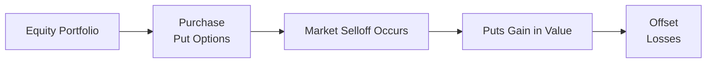
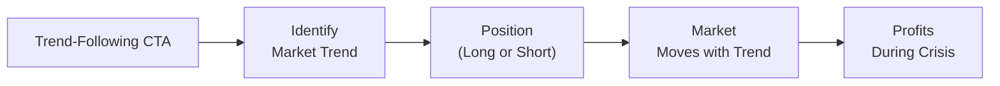

## Introduction

Have you ever watched the markets tumble and thought, “Oh no—here we go again”? You’re definitely not alone. Even the most sophisticated investors can feel a pit in their stomachs when equity markets plunge unexpectedly. This apprehension is precisely why many portfolio managers turn to tail hedge strategies and crisis alpha approaches. In simple conversational terms, these strategies aim to protect (or even profit) when everyone else is trying to minimize damage.

This discussion unpacks the fundamental goals of tail hedge programs, digs into how they’re structured, and explains crisis alpha—the ability of certain nimble strategies to actually benefit during market meltdowns. We’ll explore instruments used to implement tail hedges (like puts and volatility derivatives) and dynamic approaches (like trend-following) that seek positive returns when volatility spikes or liquidity evaporates. We’ll also talk costs: Is it worth consistently paying insurance premiums for a payout that only occurs on rare, but disastrous, occasions? By the end, you’ll hopefully have a solid sense of the trade-offs, practical considerations, and historical context that shape these strategies.

## Understanding Tail Hedge Strategies

### The Basics of Tail Risk

Before we dive into specific instruments, we need to nail down the idea of “tail risk.” Picture the standard bell curve of market returns. Most outcomes cluster around the middle, where returns are normal-ish—modest gains, modest losses. But in the extreme ends (the “tails”) you find the truly spectacular events—huge market runs to the upside or, more concerning for us here, catastrophic selloffs. These “tail” events are rare, but if you’re unprepared, the damage can be severe.

Tail hedges focus on the negative tail, aiming to limit massive drawdowns or even make money if markets plummet. The early 2000s dot-com bust, the 2008 Global Financial Crisis (GFC), and the March 2020 COVID-19-driven meltdown are prime examples where these “low-probability, high-impact” events turned into reality. If you had protective or “hedge-like” positions, your broader portfolio might have fared more gracefully under the pressure.

### Instruments for Tail Hedging

There’s no single “best” way to hedge tail risk. Rather, investors combine a variety of instruments and techniques designed to achieve non-linear payoff profiles during major drawdowns. Let’s highlight the most common tools.

• Options (esp. Put Options): Put options grant the right to sell an asset at a specified price (the strike) regardless of how low the market goes. They cost a premium, kind of like paying an insurance premium on your house. During a market crash, these puts potentially offset the losses on the equity holdings by increasing in value.  
• Volatility Derivatives: Instruments like VIX futures and options allow direct exposure to implied volatility. Historically, volatility often spikes during systemic selloffs—so these instruments can rise in value when everything else tanks.  
• Variance Swaps & Tail Risk Swaps: These swaps target realized variance or sought-after “jump risk.” While somewhat more complex, they can provide pure exposure to market volatility, sometimes capturing outsize gains if actual volatility soars beyond expectations.  
• Structured Products: Banks sometimes package specialized notes with built-in protective options. These can be more esoteric, with embedded fees and specific payoff structures.

Below is a simple Mermaid diagram illustrating a put-option-based tail hedge:

In this schematic, if the market plummets (C), the purchased put options increase in value (D). This gain helps offset the equity losses (E). Outside of crises, the cost (premium) of carrying these options is a drag on the portfolio’s returns.

### Black Swans and the Rationale for Tail Hedging

The concept of a “Black Swan” event was popularized by Nassim Nicholas Taleb (2010). A Black Swan is an unpredictable event with extreme impact—something that standard models generally miss. While it’s notoriously difficult to time these blowups, tail hedges strive to ensure you won’t be caught completely off guard.

There’s a subtle but crucial difference between tail hedging and typical equity insurance. Typical hedges might aim to protect from somewhat “normal” market declines of 10%–20%. By contrast, tail hedges are specifically built for the extraordinary meltdown in the 30%-plus range (the genuine catastrophes). The cost of these programs can be steep, so successful managers often look for ways to manage, reduce, or recoup that cost when markets aren’t in free fall.

## Exploring Crisis Alpha

### What Is Crisis Alpha?

Let’s pivot to the idea of crisis alpha—one of the more intriguing concepts in alternative investments. Crisis alpha refers to the ability of certain strategies or managers to generate positive returns (or at least produce above-average results) precisely when broad asset markets face extreme stress. These strategies can offset losses in an overall portfolio and help preserve capital. As you might guess, not every strategy qualifies as “crisis alpha.” Some managers claim they do well in down markets, but the real question is: “Show me the track record during 2008, March 2020, or other meltdown periods.”

### Common Crisis Alpha Approaches

• Trend-Following Strategies: Often implemented by Commodity Trading Advisors (CTAs), these systematically catch rising or falling trends by going long in upward-trending markets or short in downward-trending markets. Historically, big market dislocations create strong, persistent trends, which trend followers sometimes exploit.  
• Discretionary Global Macro Trades: Skilled macro managers may position for tail events if they see warning signs of credit stress or major shifts in exchange rates, commodities, or interest rate regimes. A nimble manager might detect an impending meltdown and place short bets accordingly.  
• Volatility Breakout Strategies: Some managers systematically buy volatility when short- to medium-term signals spike. If volatility continues surging, these positions can be profitable.

Importantly, crisis alpha is all about exploitation of the crowd dynamics in stressful scenarios. For instance, if most investors are forced to sell, a prepared manager who already holds short positions or volatility exposure stands to profit. The concept was expanded by Kathryn Kaminski (2014), who found that certain systematic trend-following approaches delivered “crisis alpha” especially in equity bear markets.

Here’s a simple schematic for crisis alpha generation via trend-following:

In large drawdowns, if the market’s trend is down, the CTA might be short, generating positive returns when equity markets crash.

## Cost of Carry versus Expected Benefit

### Premiums and Drag on Returns

A huge practical question with tail hedging is affordability. If you constantly buy put options or volatility instruments, you’ll pay an ongoing insurance premium. That’s your “cost of carry.” Over time, this might cut into performance. Some managers try to reduce costs by selling options in calmer periods or employing option-spread strategies that discount the net premium outlay.

The trade-off is straightforward:  
- Pay a known cost up front (like an insurance fee).  
- Potentially realize a large payoff if the meltdown arrives.

But if the meltdown doesn’t happen for years, you keep paying premiums that eat into your returns. Indeed, many tail hedges are “bleeders” in benign markets. If you’re curious about the math behind an option’s cost over time, these are typically summarized by the option’s time decay (theta). The manager’s challenge is structuring these hedges so that the cumulative cost is justifiable relative to the capital protection (or gains) they can deliver in a meltdown.

A stylized formula for the expected benefit from a tail hedge might be something like:


\text{Expected Benefit} = p \times \text{Payoff in Crash} - (1 - p) \times \text{Cost of Carry}


Here, \\( p \\) indicates the probability of a crash scenario that triggers the payoff. If the product of that probability and the potential payoff outstrips the ongoing carrying cost, the strategy can make sense—assuming you have the patience (and risk tolerance) to incur repeated premium expenses along the way. In real life, that “probability of meltdown” is very tricky to pin down.

### Behavioral Realities in Funding Hedges

There’s also a very real psychological dimension. It can be demoralizing to watch the cost of your protective positions drain returns month after month when markets are stable. Investors might be itching to drop the hedges right before a market crisis. Maintaining discipline is essential. One of the most consistent lessons you’ll hear from veteran managers is that timing tail hedges in and out is extremely difficult. So, some simply keep a small, consistent exposure to them, treating them as a strategic part of their portfolio.

## Reliance on Volatility, Liquidity, and Triggers

### Volatility Spikes

Effective tail hedges and crisis alpha strategies often rely on the dynamics of volatility. A major market downturn usually comes with a volatility surge: the CBOE Volatility Index (VIX) soared above 80 in both 2008 and 2020, reflecting enormous fear and rapid price dislocations. Positions that are “long volatility” obviously gain in these environments. But timing is key; if you’re too late, you may face a big jump in option premiums.

### Liquidity Shortages

Systemic crises can also bring liquidity challenges, where typical correlations break down and investors panic-sell even safe assets. Tail hedge positions that rely on liquid exchange-traded options or futures might still be tradable, but more exotic or less liquid instruments could be hard to exit or re-balance at the exact moment of crisis. Meanwhile, certain dynamic strategies (like trend-following) can become “crisis alpha” because forced selling by other market participants magnifies price movements in one direction, adding to the momentum that trend followers ride.

### Not All Macro is Crisis Alpha

Some global macro strategies are set up to capture dislocations, but others can get clobbered by an unexpected meltdown. For instance, a discretionary macro manager might be long emerging market debt in a yield-hungry environment and then loses big if a crisis leads to risk-off sentiment. Similarly, managers who rely on leveraged credit trades can sustain heavy losses during sudden spikes in spreads. So be careful about the assumption that “macro equals meltdown protection.” You want to examine the track record, specifically focusing on major crisis periods.

## Historical Case Studies

### 2008 Global Financial Crisis

The 2008 crisis was a watershed moment for tail hedging. Many hedge funds using equity market shorting, long-volatility structures, or trend-following CTAs ended up with significant gains just as mainstream equity managers took a beating. Some tail-risk funds reported triple-digit percentage returns. However, not everyone fared so well: certain “macro” funds were blindsided by the meltdown. This divergence highlighted the danger of grouping all alternative strategies into one meltdown-proof bucket.

### March 2020 Pandemic Crash

In early 2020, COVID-19 caught many investors by surprise. The S&P 500 fell by over 30% in a matter of weeks. Tail hedge funds that had been consistently maintaining put option structures or long volatility positions made big gains as volatility spiked to near-record levels. On the crisis alpha side, some momentum-based commodity traders also profited from major moves in oil, gold, and global equity indices. Of course, once central banks and governments unleashed massive stimulus, the market rebounded rapidly—leading to potential whiplash for managers that stayed short for too long.

## Implementation Considerations and Manager Selection

### Strategy Structuring

Investors often mix tail hedges with broader portfolio rebalancing policies. For instance, you might allocate 2%–3% of your portfolio to tail-risk strategies and accept that premium cost as “insurance.” Alternatively, you can do partial hedges, layering put spreads (buying a near-the-money put while selling a further out-of-the-money put to defray cost). The risk is that if the meltdown is bigger than expected, the sold put might reduce your net gains.

### Dynamic Overlay

Another approach is a dynamic overlay, where a manager systematically increases protective positions when certain triggers, like volatility or the put-call ratio, exceed a threshold. While it can reduce premium costs during stable periods, the risk is that you might miss the earliest stages of a meltdown or overpay if the triggers happen too late.

### Choosing the Right Manager

• Evaluate Past Crisis Performance: Check how the manager did in 2008, Q1 2020, or other negative equity environments.  
• Strategy Transparency: Are they using exchange-traded derivatives or more opaque over-the-counter swaps?  
• Cost Discipline: How do they manage or mitigate the adverse carry cost in benign environments?  
• Structural Liquidity: In times of stress, will you be able to realize gains if the fund gates redemptions or imposes limits?

## Common Pitfalls and Challenges

• Overpaying for Protection: If volatility is already elevated, paying top dollar for puts might deliver an unattractive risk-reward trade-off.  
• Improper Sizing: Too large a hedge can hamper long-term returns; too small may be ineffective in a crisis.  
• Timing Errors: Implementing or removing hedges too early (or too late) is an ongoing risk.  
• Counterparty Risk: In a crisis, if your derivatives counterparty becomes insolvent, you might lose that hedge or face settlement delays.

## Best Practices

• Strategic Allocation: Decide on a consistent approach or manager for your tail hedge.  
• Diversify Hedge Instruments: Combine different tools (puts, volatility swaps, etc.) so you don’t rely on a single structure.  
• Clear Risk Budgeting: Know in advance how much you’re willing to spend on hedges annually.  
• Stress Testing and Scenario Analysis: Model extreme meltdown scenarios—these can highlight whether your hedge is big enough.  
• Manager Due Diligence: If going for a crisis alpha manager, deeply scrutinize track records and value-add in prior downturns.

## Exam Tips: Putting It All Together

• For the CFA exam, remember that tail hedges and crisis alpha are two distinct but sometimes overlapping ideas. Tail hedges are designed to pay off specifically during extreme drawdowns, while crisis alpha strategies might exploit certain market behaviors for profit amidst distress.  
• You’ll likely see scenario-based questions requiring you to calculate or compare net returns with or without tail hedges, illustrating cost-of-carry trade-offs.  
• Don’t forget the human element. The exam might include behavioral finance angles—like overconfidence in your ability to time a meltdown or the aversion to “wasting” money on insurance.

## References

- Kaminski, K. (2014). “Trend Following and Crisis Alpha.”  
- Taleb, N. N. (2010). “The Black Swan.”  
- “Portfolio Hedging” articles in The Journal of Derivatives.

--------------------------------------------------------------------------------

## Test Your Knowledge: Tail Hedge Strategies and Crisis Alpha



### Which statement best describes tail hedge strategies?

- [ ] They aim to outperform the market in normal conditions.
- [x] They are specialized allocations designed to protect during extreme market events.
- [ ] They primarily invest in high-yield bonds to gain enhanced returns.
- [ ] They limit downside only when volatility is low.

> **Explanation:** Tail hedge strategies focus on non-linear benefits specifically in severe market downturns, often sacrificing performance in benign times for protection in crises.

### Which of the following is generally considered an example of a crisis alpha strategy?

- [ ] Buying large-cap equity index funds.
- [ ] Selling covered calls on stable stocks.
- [x] Systematic trend-following that profits in prolonged downturns.
- [ ] Traditional 60/40 portfolio rebalancing.

> **Explanation:** Trend-following approaches can capture sustained market moves (including sharp downturns), often providing positive returns in crises.

### In the equation Expected Benefit = p × Payoff in Crash – (1 – p) × Cost of Carry, what does p represent?

- [ ] The percentage of the portfolio allocated to the hedge.
- [x] The probability of a crash scenario that triggers the payoff.
- [ ] The size of the payoff in normal market conditions.
- [ ] A multiplier for option delta in the payoff function.

> **Explanation:** p is the probability that a severe market event occurs, determining how often the hedge actually pays off.

### Which of the following correctly identifies a major drawback of consistently holding put options to hedge tail risk?

- [ ] They have unlimited upside potential in bull markets.
- [x] They require ongoing premium payments that can erode returns during calm markets.
- [ ] They are impossible to liquidate during a downturn.
- [ ] Their payoff is linear and not suitable for severe drawdowns.

> **Explanation:** Put options act like insurance; investors pay a premium that reduces returns if markets remain stable and the puts expire worthless.

### Which type of manager may deliver crisis alpha by identifying macroeconomic dislocations and shorting overvalued assets?

- [x] A discretionary global macro fund with a flexible mandate.
- [ ] A classic long-only emerging markets equity fund.
- [ ] A passive bond index ETF.
- [ ] A market-neutral equity fund focused on pair trades.

> **Explanation:** Discretionary macro managers often have wide latitude to make directional bets based on anticipated major economic shifts.

### How do trend-following strategies typically generate crisis alpha?

- [x] By establishing short positions in assets that have started a downward trend.
- [ ] By hoarding cash before every market meltdown.
- [ ] By limiting trading activity to high-frequency intraday arbitrage.
- [ ] Through buying deep out-of-the-money calls and holding them to expiration.

> **Explanation:** Trend-following managers detect and ride downward trends, profiting as others panic-sell in times of crisis.

### Why can high volatility environments sometimes present disadvantages for implementing new tail hedges?

- [ ] New positions in options are free when volatility is elevated.
- [ ] Volatility derivatives usually cannot be purchased during crises.
- [ ] High volatility ensures the market will keep crashing.
- [x] Option premiums become more expensive, increasing the cost of the hedge.

> **Explanation:** When volatility spikes, the cost to buy options rises, making new tail hedge positions more expensive.

### Which statement is accurate regarding the liquidity aspect of tail hedging?

- [x] Liquidity can dry up in crises, potentially increasing transaction costs and complicating new hedges.
- [ ] Liquidity is always abundant in crisis markets, despite higher volatility.
- [ ] Illiquid hedges are preferred because they carry no mark-to-market risk.
- [ ] Liquidity and volatility usually move in the same direction, ensuring easy exits.

> **Explanation:** In systemic selloffs, many market participants withdraw, decreasing liquidity right when hedges might be most needed.

### Which scenario best illustrates “cost of carry” for tail hedges?

- [x] Paying premium expenses each month for put options that may expire worthless if the market remains stable.
- [ ] Distributing annual gains from an outperforming equity manager.
- [ ] Earning interest on cash collateral in a margin account.
- [ ] Collecting dividend payments while owning large-cap stocks.

> **Explanation:** The continuous expense of option premiums or volatility instruments is the quintessential example of cost of carry in a tail hedge program.

### Tail hedge strategies and crisis alpha approaches are most effective when:

- [x] They protect against, or profit from, rare but severe market downturns.
- [ ] They engage in high-leverage currency trades in normal conditions.
- [ ] They reduce portfolio variance in flat, range-bound markets.
- [ ] They align perfectly with standard mean-variance optimization models.

> **Explanation:** Tail hedge and crisis alpha strategies exist primarily to mitigate or exploit extreme systemic risk events, which is distinct from normal market volatility.


