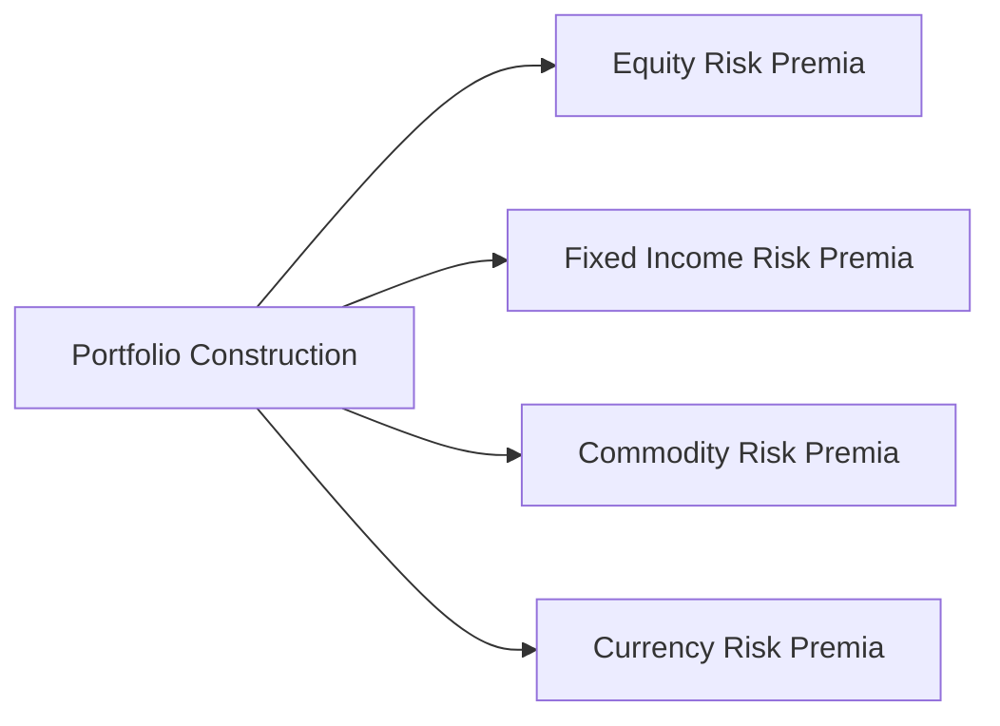

## Introduction

Have you ever heard an investment professional say, “Diversify your portfolio,” and then stop short of explaining how to precisely mix all these different risk premia together? Well, I remember when I first started exploring factor-based investing with a small team of colleagues. We were thrilled to uncover new factors—momentum, value, carry—but it was daunting figuring out how to combine them into one coherent approach. The question was: Do we just split our capital equally, or should we consider something a bit more nuanced, like weighting by risk contribution? This is exactly where the concept of combining risk premia in a balanced portfolio comes in. By carefully selecting factors that complement each other, investors can aim to reduce overall volatility while preserving (or even enhancing) returns. 

In this section, we’ll walk through the fundamentals of balanced portfolio construction with multiple risk premia, and see how correlation matrices, risk budgeting, rebalancing, and factor timing can all help bolster the stability of returns.

## Understanding Risk Premia and Why They Matter

Risk premia, at the highest level, are the returns that investors are compensated with for taking on certain risks. Traditional finance typically highlights the “equity risk premium,” which is the expected extra return from investing in stocks over risk-free securities. But there are many others—credit risk, liquidity risk, momentum in stocks, carry in currencies, value in equities, and so forth. 

Why do risk premia matter? They provide systematic and somewhat persistent sources of return. By blending multiple premia, we hope that when one factor underperforms, another may perform better, thereby improving the overall risk-adjusted return of the portfolio. As we saw in earlier sections of this book (e.g., see discussions on Alternative Risk Premia in 9.2 and Tail Hedge Strategies in 9.7), capturing these systematic return drivers can be a highly effective way to generate alpha-like results—but only if you manage the exposures properly.

## Building a Balanced Multi-Factor Portfolio

A balanced multi-factor—or multi-premia—portfolio is one that spreads its bets, not necessarily by nominal capital allocation, but rather by how much risk each factor contributes. The notion of “balanced” can vary:

• Balanced by nominal capital (simple approach).  
• Balanced by risk contribution (risk budgeting approach).  
• Balanced by expected drawdown or maximum loss constraints.  
• Dynamically balanced via factor timing.  

Below is a simple diagram that might help visualize how different risk premia feed into a single portfolio.



In practice, each of these “nodes” can be broken down into further sub-premia, like momentum equities, carry trades in FX, value in bonds, etc. 

## Role of Correlation and Diversification

One of the biggest reasons for combining multiple risk premia is diversification. Ideally, you seek factors that behave differently across market cycles. For instance, momentum might flourish in trending environments but lose steam when markets abruptly reverse. On the other hand, value exposures may underperform in fast-rising markets but catch up when sentiment normalizes and investors rediscover fundamental valuations.

This interplay is best understood through correlation matrices. Correlations summarize how two sets of returns move together. If momentum has a strong positive correlation with carry, then combining them might not provide as much diversification benefit. But if momentum is negatively correlated (or only weakly correlated) with carry, your portfolio stands to be more resilient.

Here’s a short Python snippet illustrating how you might set up a simple correlation matrix in practice:

```python
import numpy as np

corr_matrix = np.array([
    [1.0,  0.25,  0.10],
    [0.25, 1.0,   -0.05],
    [0.10, -0.05, 1.0 ]
])

print("Correlation Matrix:\n", corr_matrix)
```

Imagine the first row/column is momentum, the second is value, and the third is carry. A correlation of 0.25 suggests a modest positive correlation, 0.10 is quite low, and -0.05 might imply a slight diversifying effect. When crafting your portfolio, you’d prefer factors that do not move in lockstep, thus creating a smoother overall ride.

## Risk Budgeting

Rather than allocating capital “50% to momentum, 25% to value, and 25% to carry,” a more refined method is to allocate based on how much volatility you’re willing to accept from each factor. That’s risk budgeting in a nutshell. You assign a “budget” of volatility or contribution to total risk for each factor. 

Mathematically, if \\(\omega\\) is a vector of factor weights and \\(\Sigma\\) is the covariance matrix of factor returns, then your portfolio variance \\(\sigma_p^2\\) is:


\sigma_p^2 = \omega^T \Sigma \, \omega


Your next objective is to ensure that each factor’s marginal contribution to risk aligns with your preferences. Some managers like to target equal contributions to risk (i.e., each factor contributes an equal slice of total portfolio volatility). Others might tilt the budget if they have a higher conviction in one factor over another.

## Rebalancing and Factor Timing

Allocations that are set once and never touched can drift over time—particularly if market dynamics change. Frequent rebalancing ensures your factor exposure remains aligned with the initial targets. However, rebalancing has frictional costs (transaction fees, bid-ask spreads, taxes) that need to be weighed against the risks of letting allocations drift. 

Beyond standard rebalancing, some investors engage in factor timing. Perhaps you notice that momentum historically has struggled during periods of extreme market volatility, but it tends to shine when markets are trending. You might reduce your momentum exposure in high-volatility regimes and increase it again once signals suggest the trend is back. This approach is known as factor timing and is relatively advanced. In 9.5, we discussed discretionary vs. systematic macro methods—think of factor timing as a systematic approach that decides which risk premia might be more appealing based on macro signals.

Granted, factor timing can be tricky. Overconfidence in macro predictions or crossing signals can lead to large missteps. It’s important to have a robust methodology, including rules for scaling exposures up or down and a disciplined plan for re-entry when conditions change.

## Implementation Challenges and Frictional Costs

On paper, building a multi-premia portfolio might appear straightforward—just hold positions in each factor strategy in proportions you see fit, right? In reality, you’ll face:

• Margin requirements and leverage constraints.  
• Liquidity constraints (some factors trade in less liquid instruments).  
• Cash drag if too many derivatives-based positions require minimal capital upfront but tie up unrelated collateral.  
• Tax implications and cross-border regulations (units 9.11 and 9.16 revolve around global constraints and regulatory complexities).  
• Additional complexity in monitoring multiple factor exposures.

Margin requirements are especially important with derivatives-based factor strategies. If multiple factors simultaneously incur losses, margin calls can force liquidation at precisely the wrong time—especially if you don’t maintain a comfortable capital cushion.

Also, it’s worth noting that frictional costs can undermine the benefits of multi-factor exposure if you trade too frequently. A sense of discipline and cost awareness is essential. In certain markets, keeping a close eye on the bid-ask spread is crucial to preserve returns.

## Monitoring and Detecting Style Drift

It’s one thing to create the perfect multi-factor blueprint. It’s another to ensure the portfolio stays faithful to that blueprint. Over time, managers can alter their approach—intentionally (pursuing new opportunities) or unintentionally (making small tweaks that accumulate). 

This is style drift: a shift away from the declared strategy or factor, as might happen when a “value” manager sneaks more “growth” stocks into the portfolio. For a multi-risk-premia strategy, you might notice your momentum sub-portfolio starts taking on deep-value profiles due to new signals. Or your managed futures sub-portfolio might gradually adopt more contrarian trades if the model’s parameters changed. 

A robust performance monitoring framework is key. By regularly measuring factor exposures and ensuring they match your intended risk budget, you can catch style drift before it leads to unanticipated risk concentrations. Observing the typical patterns or expected returns of each factor can help: if your momentum factor is making profits in non-trending conditions, you might have inadvertently introduced something else into your system.

## Putting It All Together: A Conceptual Example

Let’s consider a simplified example of combining three risk premia: value in equities, carry in currencies, and momentum in commodities. Suppose:

• Value in equities has an expected return of 5% with 8% volatility,  
• Carry in currencies has an expected return of 3% with 6% volatility,  
• Momentum in commodities has an expected return of 4% with 10% volatility.  

You might start by eyeballing a combination that yields a target portfolio volatility of, say, 8%. Then, investigate correlations:

• Correlation between value and carry: 0.30  
• Correlation between value and momentum: 0.10  
• Correlation between carry and momentum: –0.05  

After working through your covariance matrix, you might discover that if you do an equal risk budget approach, your final weighting is something like 35% value, 30% carry, and 35% momentum. That mix might lower the portfolio’s overall volatility from a naive blend, leveraging the fact that momentum partially offsets carry in certain economic conditions. 

In terms of rebalancing, you monitor these positions monthly. If momentum signals weaken, you systematically reduce the momentum portion, possibly boosting carry. You also keep track of real trading impact: any time you reallocate, you pay transaction costs and, if you’re in certain jurisdictions, taxes on realized gains.

This is just a toy example, but it illustrates the approach: study the correlations, define a risk budget, allocate, monitor signals, adjust exposures, and keep a watchful eye for style drift. 

## Common Pitfalls and Best Practices

• Overfitting factor exposures: Make sure you’ve tested strategies out-of-sample to confirm that factor premia are robust long-term market phenomena, not fleeting anomalies.  
• Ignoring correlation changes in stress scenarios: Historical correlations can break down in a crisis. Indeed, many factors become positively correlated when liquidity evaporates. Keep capital aside for margin or unexpected drawdowns.  
• Excessive rebalancing: Churning positions leads to higher frictional costs. A well-defined rebalancing schedule, combined with triggers that shift exposures only when signals are strong, typically works better than constant tinkering.  
• Not setting a performance monitoring routine: If you don’t check for style drift or factor performance anomalies, your balanced portfolio may morph into something unrecognizable over time.  

## Conclusion and Exam Tips

Combining multiple risk premia into a balanced portfolio can be a game-changer, allowing you to tap into potentially uncorrelated sources of return and moderate your overall risk level. From constructing correlation matrices to employing risk budgeting, the entire process demands both quantitative rigor and a certain level of intuition about how market regimes shift. Remember:

• Take a systematic approach to factor exposures—start by measuring correlation structures.  
• Decide on a risk budgeting scheme that ensures no single factor accidentally dominates the portfolio.  
• Keep an eye on transaction costs, margin requirements, and liquidity constraints—they can erode gains if not managed.  
• Monitor allocations consistently and watch for style drift, ensuring your factors remain properly exposed.  
• Consider factor timing carefully, but don’t overreact: you’re aiming to enhance returns, not chase ephemeral signals.

For the exam, be prepared to address scenario-based questions asking how changes in market volatility might prompt you to adjust factor exposures. You may be asked to interpret a correlation matrix and determine the rationale for combining certain factors. Lastly, pay attention to ethical and professional standards: always disclose to clients if you deviate materially from your stated factor approach.

## References

• Ilmanen, A. (2011). “Expected Returns: An Investor’s Guide to Harvesting Market Rewards.”  
• Ang, A. (2014). “Asset Management: A Systematic Approach to Factor Investing.”  
• AQR research papers on multi-factor investing.  

## Test Your Knowledge: Combining Multiple Risk Premia Quiz



### Which statement best describes the primary objective of combining multiple risk premia in a portfolio?

- [x] To achieve diversification benefits and stabilize overall returns.
- [ ] To eliminate all possibility of losses across different market cycles.
- [ ] To increase correlation across asset classes when volatility spikes.
- [ ] To ensure higher leverage in each investment strategy.

> **Explanation:** By mixing various factor exposures, the hope is to create a smoother performance profile and reduce the chance that one poorly performing factor drags down the entire portfolio.

### Which of the following is a key advantage of using a correlation matrix for constructing a multi-factor portfolio?

- [ ] It measures the profitability of each factor.
- [x] It helps in identifying how strongly different factors co-move.
- [ ] It guarantees that all risk premia will outperform market benchmarks.
- [ ] It eliminates transaction costs when blending factors.

> **Explanation:** Correlation matrices are used to see how factors move relative to one another. This information is invaluable when trying to diversify risks and identify complementary exposures.

### What does “risk budgeting” primarily refer to?

- [x] Allocating volatility or risk contributions to specific factors in a portfolio.
- [ ] Voting on which factors have the highest returns in a given quarter.
- [ ] Tracking the total capital used in each asset class.
- [ ] Setting a fixed time frame for rebalancing trades.

> **Explanation:** Risk budgeting is about determining how much of the total portfolio risk each factor is allowed to contribute, rather than focusing on capital percentages alone.

### Why might a manager implement factor timing?

- [x] To adjust factor exposures based on market signals or economic conditions.
- [ ] To permanently remove all risk factors from the portfolio.
- [ ] To raise the correlation among factors in stressful markets.
- [ ] To avoid using any statistical models when allocating to factors.

> **Explanation:** Factor timing involves increasing or reducing exposure to certain risk premia depending on shifts in volatility, macro regimes, or other signals.

### Which statement correctly summarizes the main challenge of frictional costs in multi-factor investing?

- [x] They can erode returns if rebalancing or trading is done too frequently.
- [ ] They guarantee positive alpha in illiquid asset classes.
- [x] They have no effect on leveraged portfolios.
- [ ] They only appear in equity markets but not in currency markets.

> **Explanation:** Transaction fees, bid-ask spreads, and taxes can drag down net performance, so balancing the rebalancing frequency is critical.

### What is “style drift” in a multi-risk-premia context?

- [x] A gradual shift in exposures away from the originally intended factor mix.
- [ ] A short-term spike in correlation among all risk premia.
- [ ] A method of systematically overshooting your target allocations.
- [ ] A special tactic to boost returns after a market correction.

> **Explanation:** Style drift happens when your strategy’s factor profile slowly changes, sometimes unintentionally, leading to unexpected exposures and possible concentration risk.

### Which factor is most likely to struggle in abruptly reversing markets?

- [x] Momentum
- [ ] Carry
- [ ] Value
- [ ] Low-volatility

> **Explanation:** Momentum strategies rely on trends persisting. When markets whip back and forth rapidly, momentum signals often break down.

### Which consideration is most relevant when monitoring margin requirements for a multi-factor strategy?

- [ ] Margin requirements only matter if factors are long-only positions.
- [x] Simultaneous factor drawdowns could lead to forced liquidations if margins are not well-managed.
- [ ] Margin requirements usually remain constant for all types of securities.
- [ ] Margin calls increase correlation across factors over time.

> **Explanation:** If multiple leveraged positions decline simultaneously, margin calls may force sales at inopportune times, undermining the portfolio’s integrity.

### What is an example of a best practice for rebalancing a multi-factor portfolio?

- [x] Setting a systematic yet not overly frequent schedule to minimize transaction costs.
- [ ] Rebalancing daily to adjust to every minor price fluctuation in the market.
- [ ] Allowing large deviations from target weights until the end of the year.
- [ ] Eliminating every premia that underperforms for more than a month.

> **Explanation:** A disciplined rebalancing approach strikes a balance between staying true to target allocations and avoiding excessive costs from frequent trading.

### True or False: In a crisis, correlations among risk premia inevitably remain low, guaranteeing diversification benefits.

- [x] False
- [ ] True

> **Explanation:** During market crises, correlations often spike, sometimes undermining the expected diversification benefits of a multi-premia approach.  


