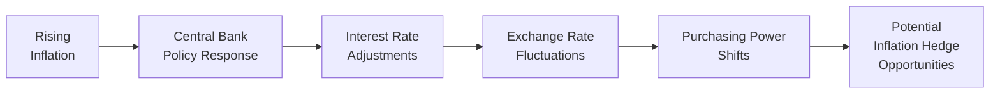

## Introduction and Context

Let’s be honest: inflation can sometimes feel like an unstoppable force, right? One day, you’re grabbing your morning coffee for a couple of bucks, and a few years later, that same cup is nearly double the price. It happens so gradually that many investors don’t notice until it’s too late. Global macro strategies pay very close attention to these inflationary movements—especially how they get transmitted through various currency regimes—and build complex portfolios to guard against those risks. You might hear analysts talking about “break-even inflation,” “inflation targeting,” and “TIPS.” What do all these terms mean, and why are they so important? That’s exactly what we’ll explore in this section.

In global macro investing, the interplay between inflation dynamics and currency regimes can be a huge driver of returns and risk. But beyond that, alternative risk premia strategies—like commodity trend following or real-asset exposures—aim to exploit (or hedge) these inflation swings. In this discussion, we’ll cover how inflation-indexed securities (like US TIPS), currency regimes, and inflation-targeting central banks shape the opportunity set for global macro managers.

## Linking Inflation Risk and Global Macro Strategies

Global macro strategies typically involve scanning worldwide economic indicators—growth rates, central bank policies, and, of course, inflation figures—to position portfolios for upcoming trends. When inflation is expected to rise, global macro funds might:

• Buy inflation-linked bonds, such as TIPS, to benefit from upward movements in the Consumer Price Index (CPI).  
• Go long on certain commodities (think precious metals or energy) to capture the tendency for commodity prices to rise with inflation.  
• Adjust currency exposures, especially if they believe that higher inflation will weaken or strengthen a particular currency.

It’s not just about reading the headlines, though. Managers dive into break-even inflation rates, which compare nominal bond yields (e.g., standard US Treasuries) against inflation-protected bond yields (e.g., TIPS). The difference between these yields is widely viewed as an implied forecast of inflation. If managers spot a gap between actual inflation forecasts and what the market is pricing in, they’ll build trades around that discrepancy.

### Personal Reflection

I still remember the first time I saw TIPS in action around mid-2000s. A colleague of mine was convinced inflation would spike faster than the market expected due to commodity supply constraints. He bought TIPS—and let’s just say that sipping coffee in the break room felt a lot more relaxed each morning while he watched nominal bonds lag behind. It’s a good reminder that sometimes these “boring” inflation hedges can be your best friend.

## TIPS, Break-Even Inflation, and Other Inflation-Linked Bonds

Inflation-linked bonds (ILBs) are fascinating because they essentially promise a real rate of return. The coupon payments (and often the principal) adjust with an official inflation index such as the CPI. For instance, TIPS (Treasury Inflation-Protected Securities) in the United States make regular coupon payments on a principal that’s automatically adjusted for inflation. If the CPI goes up, the value of your TIPS goes up, though you still receive the same “real” coupon rate.

### Break-Even Inflation Calculation

A common formula for break-even inflation (BEI) is:


\text{BEI} = Y_{\text{nominal}} - Y_{\text{real}}


• \\(Y_{\text{nominal}}\\) = yield on a nominal Treasury bond of the same maturity  
• \\(Y_{\text{real}}\\) = yield on an inflation-linked bond (e.g., TIPS) of the same maturity  

If break-even inflation is 3% and you expect actual inflation to be 4%, you might want to buy TIPS, since the market is “underpricing” inflation.

## Currencies and Inflation: Floating, Pegged, and Managed Regimes

Inflation doesn’t exist in a vacuum; a nation’s exchange rate regime heavily influences how inflation pressures flow through to asset prices. In a floating regime, the currency is allowed to fluctuate according to market forces. When inflation picks up, a country’s currency might depreciate (investors demand a higher interest rate, but also fear a decline in purchasing power), which could further amplify inflation if imports get more expensive. Alternatively, in a pegged regime, the government fixes the currency's value to another currency or a basket of currencies. If inflation rises too high, the peg can become very tricky to maintain—just ask folks who traded in Asia during the 1997 currency crisis or followed the dollar peg in some oil-producing nations.

### Floating Exchange Rates

In a purely floating exchange rate, higher domestic inflation often results in:

• Higher nominal interest rates.  
• Potential depreciation of the currency if real interest rates lag behind.  
• Capital outflows if foreign investors believe their holdings will lose purchasing power.

### Pegged Exchange Rates

Pegged regimes might artificially hold the value of the currency stable by using foreign exchange reserves to buy or sell the local currency. Should inflation become uncontrollable, the peg can break under pressure, leading to abrupt devaluations.

### Managed Exchange Rates

These are somewhere between pegged and purely floating. Central banks intervene occasionally, but they do not promise a strict peg. Under inflationary pressure, they might tweak interbank rates or conduct open-market operations to influence currency values. But they have a bit more flexibility than a fully pegged regime.

### Quick Anecdote

We once saw an emerging market with a managed currency regime try to defend its currency from inflationary shocks by aggressively raising interest rates—double digits, in fact. Unfortunately, it only ended up spooking investors more, leading to capital flight and ironically weakening the currency further. It highlighted for me how balancing a currency’s external value against internal inflation is a tough personal balancing act for central banks.

## Central Bank Policies and Inflation Targeting

Central banks often work to keep inflation near a target (like 2%), believing that stable and predictable price levels encourage economic growth. Inflation targeting involves tools like:

• Short-term interest rate adjustments (e.g., the Fed funds rate in the US).  
• Open market operations (buying or selling government bonds to regulate money supply).  
• Communication strategies or forward guidance (the central bank announces its inflation goals to influence market expectations).

### Market Signals for Global Macro

Global macro funds monitor central bank speeches, meeting notes, and inflation reports to predict how these policy levers might shift. For instance, if a central bank hikes rates aggressively, it usually signals higher real yields—making that currency potentially more attractive, at least in the short term. However, if the inflation problem is severe, markets might question whether rates truly offset the inflationary threat. That mismatch can create tactical trading opportunities in:

• Interest rate futures  
• Currency forwards or swaps  
• Options on fixed-income instruments  

## Hyperinflation and Currency Dislocations

Hyperinflation is the extreme scenario where prices escalate at a mind-boggling pace—anything north of 50% per month is often considered “hyper” territory. In such an environment, local currency can become practically worthless, leading to dollarization or a shift to more stable currencies. For global macro players holding positions in emerging or frontier markets, hyperinflation can dramatically erode asset values unless they have appropriate hedges like:

• Short positions in the local currency  
• Real assets denominated in more stable currencies  
• Commodity exposures that might hold real value, such as gold  

Emerging markets might peg their currency to a more stable one, but if inflation soars unexpectedly, cracks in the peg can appear quickly. As a result, global macro funds watch local central bank reserves, external debt levels, and real interest rates to position themselves ahead of any break.

## Real Asset Exposures and Alternative Risk Premia

We often hear folks say, “If inflation rises, buy real assets.” Well, that’s not always the perfect fix, but real assets—like real estate, infrastructure, farmland, timberland, even commodities—can help preserve purchasing power in inflationary climates. In alternative risk premia strategies, we might see:

• Commodity trend-following signals: If commodity prices spike in line with inflation, systematic trend strategies can go long.  
• Real estate factor exposures: Funds that systematically tilt toward real estate or REIT factors to capture rental income that (hopefully) adjusts with inflation.  
• Value vs. growth tilts: Some risk premia strategies shift toward value stocks, which might hold up better against rising inflation if they can pass on higher prices to their customers.

### Example: Commodity Trend Strategy

Imagine a systematic strategy that monitors the 200-day moving averages of energy, metals, and agricultural commodities. As soon as it sees a persistent upward move, it goes long. If that trend is driven by inflationary pressures (like supply-side shocks or excessive money printing), the strategy might lock in gains as commodity prices continue to climb.

## Evaluating Real Returns

At the end of the day, inflation is all about purchasing power. A 10% nominal return might sound great—until you realize inflation was 8% that year. Then your “real” return is only 2%. When constructing a portfolio that includes alternative investments (such as real estate, private equity, or commodities), you have to assess how each asset class performs in real terms.

Let’s do a quick conceptual example. Suppose you have:

• A nominal bond with a 6% yield.  
• A TIPS or inflation-linked bond with a 2% real yield (plus inflation).  
• A commodity basket you expect to appreciate by 7% nominal if inflation is 4%.  

Which is better depends on your inflation forecast. If inflation hits 5%, the nominal bond’s real return is just 1%. Meanwhile, the TIPS or inflation-linked bond returns 2% plus 5% = 7% nominal, or 2% real. The commodity basket, if it’s truly correlated with inflation, might do well—but if the inflation spike is short-lived, commodity returns might backtrack.

## Inflation, Currency, and a Multi-Asset Approach

Global macro strategies don’t just load up on a single instrument. Rather, they blend:

• Inflation-Linked Bonds (e.g., TIPS)  
• Nominal Bonds  
• Equities (including cyclical vs. defensive allocations)  
• Currencies (long/short)  
• Commodities (trend or carry strategies)  

This multi-asset approach can diversify risk while capitalizing on varied inflation regimes. With central banks playing a big role in shaping interest rates and inflation, macro managers tend to pay close attention to each bank’s stated or implied target. In a supportive environment—where inflation is near the target and bond yields are stable—macro funds might rely more on cross-currency trades. In a world where inflation is persistently above target, they might pivot toward real-return assets or short the foreign exchange of countries likely to suffer an inflation-driven meltdown.

## Diagram: Inflation Pass-Through in Different Currency Regimes

Below is a simplified Mermaid diagram illustrating how inflation can affect currency valuation under different regimes:

- In a floating regime, “Exchange Rate Fluctuations” are more pronounced, and purchasing power can shift quickly.  
- In a pegged regime, the central bank’s “Policy Response” might involve currency interventions, which add complexity.  
- In a managed regime, interventions occur, but not as rigidly as under a peg.  

The end effect is that inflation and central bank actions open the door for “Potential Inflation Hedge Opportunities” in TIPS, commodities, or currency trades, depending on the manager’s expectations.

## Common Pitfalls and Best Practices

• Overreacting to Short-Term Inflation Prints: Global macro managers must differentiate one-off spikes (e.g., due to supply disruptions) from sustained inflation trends.  
• Ignoring Currency Dynamics: Inflation hedging can be undone by currency losses if you hold foreign inflation-linked bonds without the appropriate hedges.  
• Relying on Past Correlations: Commodity correlations to inflation can shift, especially in times of geopolitical instability.  
• Underestimating Policy Risk: Central banks might surprise markets with unconventional tools (e.g., negative rates, yield curve control).  

### Example: A Surprise Policy Shift

Imagine you’re holding TIPS because you’re expecting rising inflation, but the Federal Reserve announces a new policy capping Treasury yields at 2%. This “yield curve control” might derail your strategy, as break-even inflation calculations could get distorted. In such times, focusing solely on TIPS might not be enough; you’d also consider currencies, equities, or real assets.

## Putting It All Together

So, let’s say you’re a global macro manager in search of “alpha” (or outperformance) from inflation-driven themes. You might piece together the following:

• A long TIPS position if you believe actual inflation will exceed the market’s implied break-even rate.  
• A short position in a country’s currency if you see strong signs of structural inflation with little policy tightening.  
• A commodity trend overlay that automatically goes long on sectors showing persistent price uptrends tied to inflationary pressures.  

Simultaneously, you’d watch central bank statements for clues about future policy moves. You’d also analyze forward inflation swaps, break-even rates, and real versus nominal yield curves daily—or at least weekly—to see if your thesis is panning out. If not, you’d adjust swiftly, maybe rotating into a different currency or focusing on less inflation-vulnerable assets like certain equities with strong pricing power.

## Conclusion and Final Exam Tips

If there’s one overarching lesson, it’s that understanding inflation—and the regimes that guide currency valuations—gives global macro managers a powerful lens to interpret market signals. But be careful: inflation can quickly become an emotional topic. People get stressed about rising prices, leading to abrupt policy changes and sudden shifts in portfolio flows. To stay ahead, keep your eyes on:

• Break-even inflation signals: Are they stable, or do they show the market is worried?  
• Central bank communications: Any hints that the inflation target will be missed or revised?  
• Currency regime details: Is the currency pegged, or is the central bank frequently intervening?  
• Real returns: Nominal gains don’t matter if inflation or currency devaluation erodes your purchasing power.

For the CFA exam (and specifically for advanced questions in portfolio management), you’ll likely see scenario-based prompts: Maybe you’re given data about a country’s inflation, interest rates, and currency policy, and you must propose a portfolio hedge. Practice translating real macro signals into actionable trades or risk mitigations. Never forget to incorporate a realistic inflation forecast into your expected returns. If you can interpret break-even inflation data, central bank moves, and currency regimes accurately, you’ll be well positioned to handle the toughest exam vignettes. Good luck (and keep an eye on those TIPS spreads)!

## References

• Shiller, R. J. (2003). “The Invention of Inflation-Indexed Bonds.”  
• BIS (Bank for International Settlements) reports on currency regimes.  
• IMF working papers on inflation targeting in emerging markets.  
• U.S. Treasury website for information on TIPS (treasurydirect.gov).  
• Federal Reserve monetary policy statements and meeting minutes (federalreserve.gov).  

## Mastering Inflation-Linked Approaches and Currency Regimes: Practice Questions



### A global macro fund wants to profit if actual inflation exceeds market expectations. Which instrument would they most likely use?  
- [ ] Nominal bonds with a short duration.  
- [ ] Corporate high-yield debt with floating coupons.  
- [x] TIPS or inflation-linked bonds.  
- [ ] Currency forwards in a stable currency.  

> **Explanation:** TIPS (or any inflation-linked bond) offers returns that adjust in line with actual inflation, so if inflation outpaces expectations, TIPS can outperform standard nominal bonds.

### A central bank with a pegged exchange rate is experiencing surging inflation. What is a common risk if they continue to defend the peg?  
- [ ] Rapid currency appreciation.  
- [ ] Permanent deflation due to lower spending.  
- [ ] No change in foreign exchange reserves.  
- [x] A sudden devaluation if reserves run out.  

> **Explanation:** Pegged systems often require the central bank to use foreign exchange reserves to maintain the peg. If inflation is high, the peg can become unsustainable. Eventually, reserves can be depleted, forcing a sharp devaluation.

### In a floating exchange rate system, rising inflation may cause:  
- [ ] A currency to remain perfectly stable.  
- [ ] Reduced nominal interest rates.  
- [x] Possible currency depreciation if real rates do not compensate.  
- [ ] Immediate currency peg establishment.  

> **Explanation:** With rising inflation, markets typically require higher interest rates. If the central bank does not raise real rates sufficiently, the currency often weakens under a free float.

### An investor sees a break-even inflation rate of 2.5% on a 10-year TIPS vs. nominal Treasury bond. If they strongly believe actual inflation will be 3.5%, they might:  
- [x] Go long TIPS.  
- [ ] Sell TIPS short.  
- [ ] Purchase zero-coupon bonds.  
- [ ] Avoid fixed-income entirely.  

> **Explanation:** If actual inflation exceeds the break-even rate, TIPS should outperform nominal bonds. Going long TIPS can generate excess returns.

### Which strategy is most likely to mitigate inflation risk in a multi-asset portfolio?  
- [x] Allocating to commodities or other real assets.  
- [ ] Holding only nominal bonds with long duration.  
- [ ] Concentrating solely on foreign currencies.  
- [ ] Buying growth-oriented equities exclusively.  

> **Explanation:** Commodities and real assets often retain value or even appreciate when inflation rises, providing a hedge against eroding purchasing power.

### A global macro fund that expects persistent inflation might:  
- [ ] Decrease exposure to all forms of fixed income.  
- [ ] Move everything into cash.  
- [x] Combine TIPS, commodity exposures, and currency trades.  
- [ ] Only short equity markets.  

> **Explanation:** A multi-pronged approach (inflation-linked bonds, commodities, and prudent currency positioning) is common in global macro to hedge or profit from anticipated inflation.

### In an environment with managed exchange rates, central banks frequently:  
- [ ] Completely avoid market interventions.  
- [x] Intervene periodically to stabilize the currency.  
- [ ] Peg to a single major currency with no flexibility.  
- [ ] Abandon monetary policy tools.  

> **Explanation:** Managed regimes allow exchange rates to move with market forces, but the central bank intervenes occasionally to avoid excessive volatility or extreme mispricing.

### Hyperinflation in an emerging market often leads to:  
- [ ] A stable currency that gains in value.  
- [ ] Lower nominal interest rates.  
- [x] Currency devaluation and a shift to foreign currency usage.  
- [ ] Increased trust in local assets by international investors.  

> **Explanation:** Hyperinflation severely erodes trust in the local currency, often pushing investors and citizens to seek stable foreign currencies or real assets.

### Which of the following is typically true about inflation targeting?  
- [x] Central banks aim to keep inflation near a specified goal.  
- [ ] It ignores interest rate adjustments.  
- [ ] It guarantees zero inflation.  
- [ ] It disallows communication with market participants.  

> **Explanation:** In an inflation-targeting framework, central banks transparently communicate and employ various monetary tools to keep inflation close to a target rate, like 2%.

### True or False:  
When real interest rates are negative, holding nominal bonds generally provides a positive real return.  
- [ ] True  
- [x] False  

> **Explanation:** Negative real rates imply that inflation is outpacing nominal yields. Therefore, the real return on nominal bonds is often at or below zero in such conditions, not positive.


